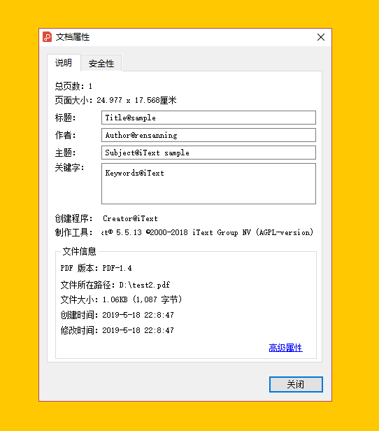

# 办公文档

## Excel
10w行级别数据的Excel导入优化记录：
- https://mp.weixin.qq.com/s/QQ-OFZ8laQHbaIOOpBZNzQ
- http://www.cnblogs.com/keatsCoder/p/13217561.html

### 1.POI
最常用的文档编辑工具，支持操作Excel、word、PPT、PDF等
```xml
<dependency>
    <groupId>org.apache.poi</groupId>
    <artifactId>poi</artifactId>
    <version>4.1.2</version>
</dependency>
<dependency>
    <groupId>org.apache.poi</groupId>
    <artifactId>poi-ooxml</artifactId>
    <version>4.1.2</version>
</dependency>
<dependency>
    <groupId>org.apache.poi</groupId>
    <artifactId>poi-scratchpad</artifactId>
    <version>4.1.2</version>
</dependency>
```

### 2.JXL

```xml
<dependency>
    <groupId>net.sourceforge.jexcelapi</groupId>
    <artifactId>jxl</artifactId>
    <version>2.6.12</version>
</dependency>
```

### 3.easyExcel
- 传统 Excel 框架，如 Apache poi、jxl 都存在内存溢出的问题；
- 传统 excel 开源框架使用复杂、繁琐;
- EasyExcel 底层还是使用了 poi, 但是做了很多优化，如修复了并发情况下的一些 bug, 具体修复细节，可阅读官方文档https://github.com/alibaba/easyexcel；

```xml
<dependency>
    <groupId>com.alibaba</groupId>
    <artifactId>easyexcel</artifactId>
    <version>3.0.5</version>
</dependency>
```

## pdf

### 1.PDF操作的工具
1. PDFBox 是一个流行的、免费的、用 Java 编写的库，它可以用来创建、修改和提取 PDF 内容。PDFBox 提供了许多 API，包括添加文本水印的功能。
2. iText 是一款流行的 Java PDF 库，它可以用来创建、读取、修改和提取 PDF 内容。iText 提供了许多 API，包括添加文本水印的功能。
3. Ghostscript 是一款流行的、免费的、开源的 PDF 处理程序，它可以用来创建、读取、修改和提取 PDF 内容。Ghostscript 中提供了命令行参数来添加水印
4. Free Spire.PDF for Java。Free Spire.PDF for Java 是一款免费的 Java PDF 库，它提供了一个简单易用的 API，用于创建、读取、修改和提取 PDF 内容
5. Aspose.PDF for Java 是一个强大的 PDF 处理库，提供了添加水印的功能

#### 1.1.iText

iText是著名的开源项目，是用于生成PDF文档的一个java类库。通过iText不仅可以生成PDF或rtf的文档，而且可以将XML、Html文件转化为PDF文件。

[http://itextpdf.com/](http://itextpdf.com/)

需要注意的是，IText使用的单位是pt而不是px，一帮情况下要想保持原来px的大小需要将px*3/4

依赖

```xml
<dependency>
    <groupId>com.itextpdf</groupId>
    <artifactId>itextpdf</artifactId>
    <version>5.5.13</version>
</dependency>
<!-- 用于中文展示 -->
<dependency>
    <groupId>com.itextpdf</groupId>
    <artifactId>itext-asian</artifactId>
    <version>5.2.0</version>
</dependency>
<!-- 下面3个是itext的可选依赖。只有在使用部分功能的时候才需要添加 -->
<dependency>
    <groupId>org.bouncycastle</groupId>
    <artifactId>bcprov-jdk15on</artifactId>
    <version>1.49</version>
</dependency>
<dependency>
    <groupId>org.bouncycastle</groupId>
    <artifactId>bcpkix-jdk15on</artifactId>
    <version>1.49</version>
</dependency>
<dependency>
    <groupId>org.apache.santuario</groupId>
    <artifactId>xmlsec</artifactId>
    <version>1.5.1</version>
    <optional>true</optional>
</dependency>
```



#### 1.2.Apache PDFBox

操作比较简单

```xml
<dependency>
    <groupId>org.apache.pdfbox</groupId>
    <artifactId>pdfbox</artifactId>
    <version>2.0.24</version>
</dependency>
```

#### 1.3.Ghostscript
Ghostscript 是一款流行的、免费的、开源的 PDF 处理程序，它可以用来创建、读取、修改和提取 PDF 内容。Ghostscript 中提供了命令行参数来添加水印。

首先需要在本地安装 Ghostscript 程序，执行命令
```shell
gs -dBATCH -dNOPAUSE -sDEVICE=pdfwrite -sOutputFile=output.pdf -c "newpath /Helvetica-Bold findfont 36 scalefont setfont 0.5 setgray 200 200 moveto (Watermark) show showpage" original.pdf
```

- -sDEVICE=pdfwrite 表示输出为 PDF 文件；
- -sOutputFile=output.pdf 表示输出文件名为 output.pdf
- 最后一个参数 original.pdf 则表示原始 PDF 文件的路径；
- 中间的字符串则表示添加的水印内容。

使用 Ghostscript 命令行添加水印时，会直接修改原始 PDF 文件，因此建议先备份原始文件。

#### 1.4.Free Spire.PDF for Java

[JAVA操作PDF文档(Free Spire.PDF插件的用法)](https://www.duidaima.com/Group/Topic/JAVA/9327)

#### 1.5.Aspose.PDF for Java

[Aspose.PDF for Java教程](https://blog.csdn.net/smallsboy/category_12154490.html)

### 2. word转为pdf的方案
1. poi读取doc + itext生成pdf （实现最方便，效果最差，跨平台）
2. jodconverter + openOffice （一般格式实现效果还行，复杂格式容易有错位，跨平台）
3. jacob + msOfficeWord + SaveAsPDFandXPS（完美保持原doc格式，效率最慢，只能在windows环境下进行）

#### 2.1.itext

需要自己导入poi包与itext包，Itext转中文需要额外配置，所以原来的中文一片空白，格式也错位了

#### 2.2.jodconverter+openOffice

使用jodconverter来调用openOffice的服务来转换，openOffice有个各个平台的版本，所以这种方法跟方法1一样都是跨平台的。

jodconverter的下载地址：http://www.artofsolving.com/opensource/jodconverter

首先要安装openOffice，下载地址：http://www.openoffice.org/download/index.html

安装完后要启动openOffice的服务，具体启动方法请自行google，

效果还行，偶尔有错位，支持中文

#### 2.3.msOfficeWord

效果最好的一种方法，但是需要window环境，而且速度是最慢的需要安装msofficeWord以及SaveAsPDFandXPS.exe(word的一个插件，用来把word转化为pdf)

Office版本是2007，因为SaveAsPDFandXPS是微软为office2007及以上版本开发的插件

SaveAsPDFandXPS下载地址：http://www.microsoft.com/zh-cn/download/details.aspx?id=7

jacob 包下载地址：http://sourceforge.net/projects/jacob-project/


## ofd

OFD(Open Fixed-layout Document) ，是由工业和信息化部软件司牵头中国电子技术标准化研究院成立的版式编写组制定的版式文档国家标准，属于中国的一种自主格式，
要打破政府部门和党委机关电子公文格式不统一，以方便地进行电子文档的存储、读取以及编辑。

重点：支持转换为多种类型的文件格式。

站在国家安全可靠层面，提出了国家标准，OFD绝对具有很重大的意义。
主要包括几个层面：
- 第一是安全，原来发放文件需要通过版式再转换，如果完全用国外技术安全不能保证。OFD是完全自主的，又具有航天的背景，可靠性毋庸置疑。
- 第二是带动产业发展，通过基础软硬件平台带动整个产业，激活国民经济。
- 第三是创新，有了民族产业，创新驱动很重要。在基础软硬件上可以找到更多的面，包括阅读的方式、档案、电子发票、电子签章、电子病历等等，可以辐射到很多领域。
   而且站在国家的高度可以把社会的技术人才整合起来，放大价值。
- 第四是节约成本，让人们感受到自主知识产权的力量的同时比国外的产品价格更低，节约了建设和使用成本。

### 1.ofdrw 
源码[https://gitee.com/ofdrw/ofdrw](https://gitee.com/ofdrw/ofdrw)
ofdrw(OFD Reader & Writer)是一个由开源社区推动的 OFD 文件处理库，它旨在提供对 OFD 格式文件的读取和写入功能。
这一开源项目为开发者提供了强大而灵活的工具，使得在应用程序中处理和生成 OFD 文件变得更加容易和高效
1. OFD 文件读取 OFD Reader & Writer 提供了高效的 OFD 文件读取功能， 能够准确解析 OFD 文件的结构和内容，以便进行后续的处理和分析。
2. OFD 文件写入 除了读取，OFD Reader & Writer 还支持 OFD 文件的生成和写入。开发者可以通过这个库创建、编辑并生成符合 OFD 标准的文件。
3. 高度模块化 OFD Reader & Writer 设计为高度模块化，提供了丰富的 API 接口，使得开发者可以根据需要选择性地使用其中的功能，保持了库的轻量性和灵活性。
4. 开放扩展性 这一库注重开放性，支持插件和扩展，使得开发者能够根据自身需求轻松扩展功能，满足不同场景的需求。

### 2.其他

1. HTML5前端预览解决方案：
   - DLTech21/ofd.js . https://github.com/DLTech21/ofd.js
   - xxss0903/LiteOfd . https://github.com/xxss0903/liteofd
2. 开源阅读器
   - XilouReader：chingliu/XilouReader https://gitee.com/chingliu/XilouReader
   - 基于pdfium的ofd/pdf双引擎版式阅读器。 OfdiumEx：roy19831015/OfdiumEx https://github.com/roy19831015/OfdiumEx
   - 【闭源】数科网维公司.数科OFD阅读器 www.ofd.cn