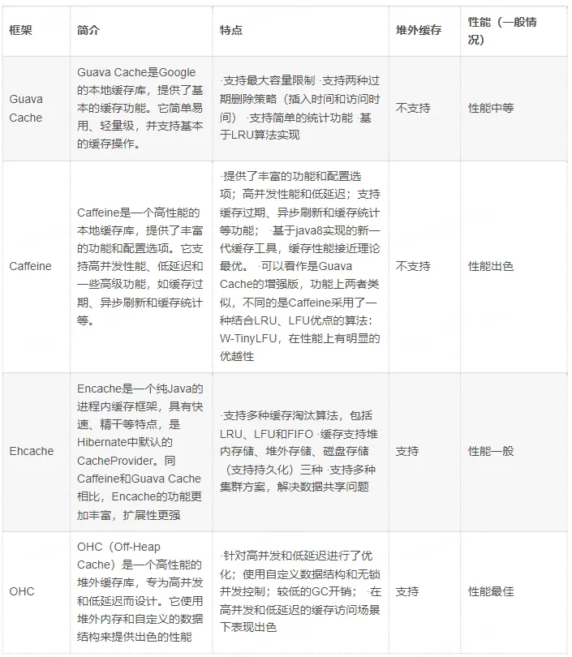
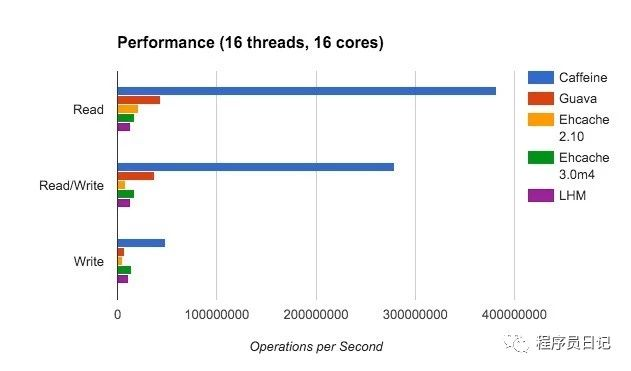
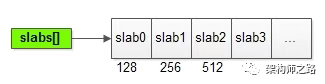
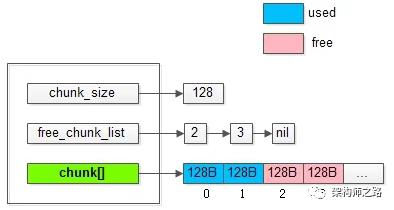
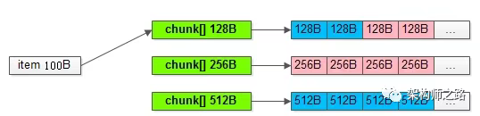
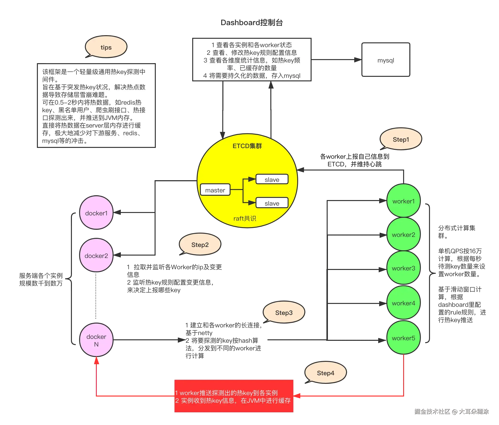
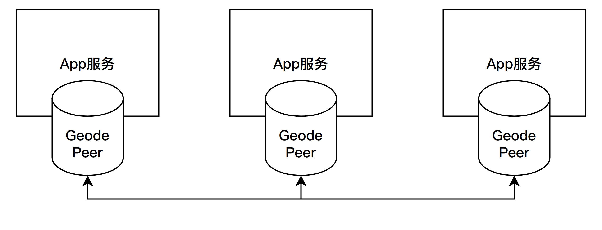
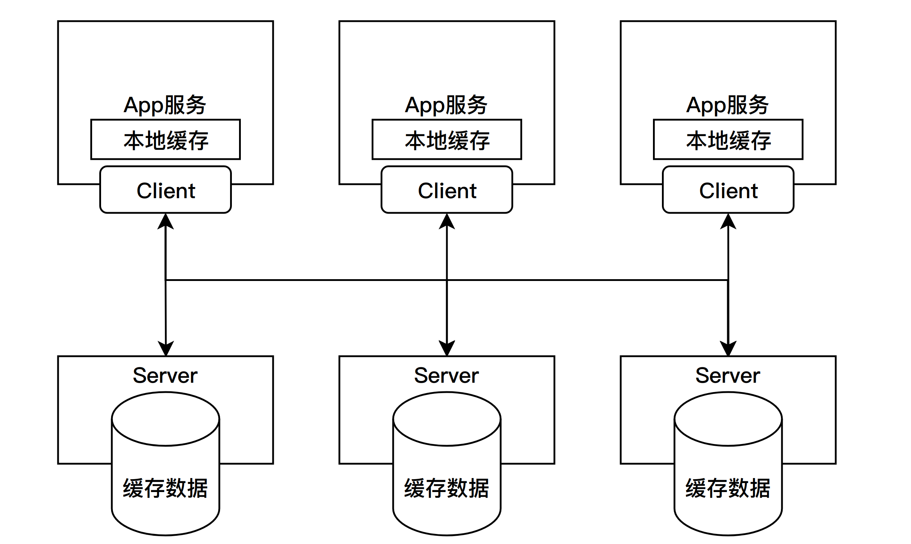

# 缓存

## 缓存技术

缓存技术是提升系统性能的重要手段。具有非常丰富的使用场景和技术。

### 分类

1. 客户端缓存：将数据存储在用户设备（如浏览器、手机 App）中，减少对服务端的请求。例如浏览器本地缓存、App的本地数据库等。
2. 边缘缓存：例如CDN静态文件加速等。
3. 服务端缓存：数据存储在服务端内存或磁盘中，为多个客户端请求提供共享缓存。例如分布式缓存和本地缓存等。

服务端缓存又可以分为：集中式缓存（Redis）、本地缓存（堆内缓存 和 堆外缓存）等。



### 缓存策略

缓存的数据都是临时的，需要采取一定的过期或者刷新策略，保障数据的有效性。

缓存失效策略
1. LRU（最近最少使用）
2. LFU（最少频率使用）
3. FIFO（先进先出）
4. TTL（超时失效）
5. 主动更新。定时、事件等。

### 常见问题

1. 击穿：单个key未命中，导致查询直接打到数据库。
2. 穿透：多个key未命中，导致查询直接打到数据库。
3. 雪崩：同时多个key未命中，导致大量查询直接打到数据库，最终导致数据库宕机。

击穿解决方案：热点数据预热、布隆过滤器防穿透、加锁排队等。

## Caffeine

Spring Boot 2.0 引入了缓存组件 Caffeine 舍弃了大家熟知的 Google Guava 想必 Spring 大佬必有他的理由，各大缓存组件性能 PR 图如下




```xml
<dependency>
    <groupId>org.springframework.boot</groupId>
    <artifactId>spring-boot-starter-cache</artifactId>
</dependency>

<dependency>
    <groupId>com.github.ben-manes.caffeine</groupId>
    <artifactId>caffeine</artifactId>
</dependency>
```


caffeine性能为什么比guava cache好？

1. guava采用的是分段锁，而caffeine更细粒度的锁。
2. guava采用链表记录访问，每次访问都要调整链表顺序。而caffeine内部分为多个区域，新增的缓存项写入 Window Cache ，可以解决稀疏流量的缓存加载问题；
  访问频率高的缓存项写入 Protected Cache，不会被淘汰。通过这个机制，平衡了访问频率和访问时间新鲜程度两个维度因素，能够尽可能地将新鲜的和访问频率高的缓存项保留在缓存中。
3. 采用了一种结合LRU、LFU优点的算法：W-TinyLFU，在性能上有明显的优越性

## ehcache

Ehcache的功能非常强大，提供了in-heap、off-heap、on-disk、cluster四级缓存

Ehcache企业级产品(BigMemory Max / BigMemory Go)实现的BigMemory也是Java堆外内存领域的先驱。

## memcache

官网[https://memcached.org/](https://memcached.org/)

### 1.基础

Memcache是一个高性能、分布式的内存对象缓存系统，由LiveJournal的Brad Fitzpatrick开发，后被许多网站使用以提升网站的访问速度，
尤其对于一些大型的、需要频繁访问数据库的网站，其访问速度提升效果十分显著。

当前memcache使用已经非常少了，但是其内部的缓存管理设计还是非常值得学习的。

基础特性：
1. 核心职能是KV内存管理，value存储最大为1M，它不支持复杂数据结构（哈希、列表、集合、有序集合等）
2. 不支持持久化；
3. 支持key过期；
4. 持续运行很少会出现内存碎片，速度不会随着服务运行时间降低；
5. 使用非阻塞IO复用网络模型，使用监听线程/工作线程的多线程模型；

使用场景：
1. 设计之初是为了实现一个公共的缓存服务，解决分布式缓存的数据一致性问题。
2. 后续实现了内嵌式的缓存组件。


1. memcache是用什么技术实现key过期的？ 懒淘汰(lazy expiration)。没有使用主动探测。
2. memcache为什么能保证运行性能，且很少会出现内存碎片？提前分配内存。
3. memcache为什么要使用非阻塞IO复用网络模型，使用监听线程/工作线程的多线程模型，有什么优缺点？目的是提高吞吐量。多线程能够充分的利用多核，但会带来一些锁冲突。

### 2.内核设计

重要概念:Memcached使用堆外内存，便于内存的管理。
1. chunk：它是将内存分配给用户使用的最小单元。
2. item：用户要存储的数据，包含key和value，最终都存储在chunk里。
3. slab：它会管理一个固定chunk size的若干个chunk，而mc的内存管理，由若干个slab组成。
4. page：是内存分配的 “基础单元”，通过与 slab 类 绑定，将大块内存切割为固定尺寸的 chunk，实现了键值对的高效存储、复用和回收，
  核心解决了内存碎片化问题，保证了 Memcached 作为高性能缓存的快速响应能力。


一个slab数组分别管理128B，256B，512B...的chunk内存单元。

slab内部结构
1. chunk_size：该slab管理的是128B的chunk；
2. free_chunk_list：用于快速找到空闲的chunk；
3. chunk[]：已经预分配好，用于存放用户item数据的实际chunk空间；
4. lru_list。用于LRU过期策略



<p style="color: red">chunk分配策略？</p>

假如用户要存储一个100B的item，是如何找到对应的可用chunk的呢？
会从最接近item大小的slab的chunk[]中，通过free_chunk_list快速找到对应的chunk，如上图所示，与item大小最接近的chunk是128B。


<p style="color: red">为什么不会出现内存碎片呢？</p>

使用chunk提前分配好内存。使用时找到对应的空闲的内存存入即可。

例如：拿到一个128B的chunk，去存储一个100B的item，余下的28B不会再被其他的item所使用。
即：实际上浪费了存储空间，来减少内存碎片，保证访问的速度。

<p style="color: red">key路由策略？</p>
和Java中的hashmap一样使用hash桶实现的。
并发策略使用类似于concurrentHashmap的分段锁。扩容时也是分段迁移数据。

## MapDB

## OHC

OHC 全称为 off-heap-cache，即堆外缓存，是 2015 年针对 Apache Cassandra 开发的缓存框架，后来从 Cassandra 项目中独立出来，成为单独的类库，其项目地址为：

https://github.com/snazy/ohc

其特性如下：
- 数据存储在堆外，只有少量元数据存储堆内，不影响 GC
- 支持为每个缓存项设置过期时间
- 支持配置 LRU、W_TinyLFU RM驱逐策略
- 能够维护大量的缓存条目
- 支持异步加载缓存
- 读写速度在微秒级别

堆内和堆外内存使用，需要根据使用场景选择，数据量越大，越适合堆外内存。
1. 堆外内存，因此可以避免因GC引起的性能下降和停顿。在高并发、高写入操作的场景下，堆外缓存可以提供更稳定的性能。
2. 配合合适的序列化工具，可以降低内存使用量。例如kryo、Protostuff、hessian

性能：堆外缓存需要将数据序列化，而堆内缓存不需要，所以OHC的性能会差很多，所以序列化技术的选择尤为重要。
Guava和OHC的基准性能测试：
```text
Benchmark            (count)   Mode  Cnt   Score   Error  Units
CacheTest.guava_put   100000  thrpt    5  17.795 ± 7.267  ops/s
CacheTest.ohc_put     100000  thrpt    5   3.709 ± 1.293  ops/s
```

## jetCache

- 源码[https://github.com/alibaba/jetcache](https://github.com/alibaba/jetcache)
- [教程](https://blog.csdn.net/xhmico/article/details/125543762)

JetCache 是由阿里巴巴开源的一款基于 Spring 和 Redis 的分布式缓存框架 ，提供了基于注解和 API 的操作方式，支持多种缓存实现（本地、分布式、复合缓存等）。
JetCache 提供了比 Spring Cache 更加强大的注解，可以原生的支持 TTL、两级缓存、分布式自动刷新，还提供了 Cache 接口用于手工缓存操作。 

支持本地缓存和远程缓存，且支持两级缓存
- 远程缓存：RedisCache、TairCache（此部分未在 github 开源）
- 本地缓存：CaffeineCache、LinkedHashMapCache

## Hotkey

- 源码：[https://gitee.com/jd-platform-opensource/hotkey](https://gitee.com/jd-platform-opensource/hotkey)
- 介绍：[京东毫秒级热key探测框架设计与实践，已实战于618大促](https://mp.weixin.qq.com/s/xOzEj5HtCeh_ezHDPHw6Jw)
- 教程：[热点终结者！Hotkey框架：一键解决项目突发危机](https://juejin.cn/post/7427778132609024041)

HotKey框架的主要功能在于能够动态生成热点键（HotKey），并将其缓存，从而显著提升系统的响应速度。

核心：将相关逻辑进行了封装，简化了使用。

组件：客户端、worker(统计流量)、bashboard(管理)、etcd（充当配置中心）

实现原理：


## Apache Geode
官网：[https://geode.apache.org/](https://geode.apache.org/)

- [打造分布式云环境下的高性能数据管理平台](https://mp.weixin.qq.com/s/GEdFQpUF-N1NjdedW0RN0w)
- [7步精通Apache Geode缓存服务器：从部署到性能优化全指南](https://blog.csdn.net/gitblog_01192/article/details/148888186)
- [一文读懂Apache Geode缓存中间件](https://www.cnblogs.com/wjhmrc/p/16749673.html)

### 1.介绍
Apache Geode正是满足我给出的强势缓存定义的一款分布式内存数据库产品。它是商业内存数据网格Geofirm的开源版本，已经在金融支付领域和12306等大型订购网站中经受住了考验。

它的核心定位是：将数据存储在多个节点的内存中，实现跨应用、跨节点的低延迟数据共享与高可用访问，同时支持数据持久化、水平扩展和复杂数据处理。

Geode 的本质是 “内存优先的分布式数据系统”，解决传统数据库（磁盘存储）在高并发、低延迟场景下的性能瓶颈，典型应用场景包括：
1. 高并发读场景（如电商秒杀库存查询、实时推荐数据缓存）； 
2. 分布式应用的内存数据共享（如微服务间无需数据库交互的实时数据互通）； 
3. 流数据处理（如实时计算中的中间状态存储）； 
4. 数据分片与负载均衡（海量数据分散存储在多节点内存，避免单点压力）。

特性
- 低延迟访问:	数据优先存储在内存，读写延迟可达微秒级（远低于磁盘数据库的毫秒级）。
- 水平扩展:	支持动态添加 / 删除节点，数据自动重新分片，集群容量线性增长。
- 高可用性:	通过数据复制（多副本）、故障自动转移，避免单点故障。
- 数据一致性:	支持强一致性（事务）、最终一致性等多种一致性级别，适配不同场景。
- 多模型存储:	支持键值对（Key-Value）、表格（Table）、对象（Object）等存储模型。
- 持久化与备份:	可将内存数据异步 / 同步持久化到磁盘，避免内存断电丢失。
- 事件驱动:	数据变化时（如写入、更新）可触发事件通知，支持实时数据同步。

### 2.架构
1. Locator（定位器）：集群的 “路由中枢”，不存储业务数据，仅负责：
   - 维护集群节点（Server）的元数据（如节点 IP、存储的数据分片）；
   - 接收客户端连接请求，将其路由到 “存储目标数据” 的 Server 节点； 
   - 实现集群节点的自动发现与故障检测，生产中可以部署多个，提升系统高可用性。
2. Server（服务器节点）：集群的 “内存存储节点”，核心职责是：
   - 存储业务数据（以 “Region” 为单位，类似数据库的 “表”）；
   - 处理客户端的读写请求，执行数据分片、复制等逻辑；
   - 支持数据持久化（将内存数据同步到本地磁盘或第三方存储）。
3. Client（客户端）：接入集群的应用节点（如微服务、Java 应用），通过 Geode 客户端 API 访问集群数据，无需感知数据具体存储在哪个 Server。

Geode提供 嵌入式 和 服务式 两种运行方式。
1. 点对点（Peer To Peer）的部署模式没有服务器的概念，所有参与缓存的节点一视同仁，这种部署模式主要用于把缓存嵌入到集群中每个应用节点上。
   
2. 客户端/服务器部署下，Apache Geode作为独立的集群服务存在，这样部署的好处是，客户端只选择性地保留一小部分本地缓存，
   将大部分缓存数据委托给服务集群，节点和节点之间不需要频繁地进行数据分发，也更便于进行扩展
   

### 3.高可用
高可用：核心是数据分片和数据复制
- 按照Region进行hash分片，数据存储在Primary节点，并复制数据到Secondary节点，Primary 故障时自动切换到 Secondary，不影响数据共享。

多级缓存：为进一步降低延迟，Geode 引入 “客户端缓存（Client Cache）”，实现 “本地内存 + 分布式内存” 的多级共享：
1. 客户端本地缓存：客户端会将高频访问的分布式数据缓存到自身内存中（称为 “Local Region”），后续读请求优先访问本地内存，无需每次请求 Server；
2. 缓存同步机制：若分布式内存中的数据被更新，Server 会通过 “事件通知” 机制，主动同步客户端本地缓存（或失效旧缓存），确保本地缓存与分布式缓存一致；

数据一致性：
1. 分布式事务：支持跨 Server 节点的事务（ACID 特性），避免并发写导致的数据不一致（如转账场景中，扣款和加款需同时成功或失败）；
2. 分布式锁：提供全局锁机制，确保同一时间只有一个客户端修改某条数据（如库存扣减时，避免超卖）；
3. 数据备份与恢复：
   - 副本机制（Secondary 节点）：Primary 节点故障时，Secondary 自动升级为 Primary，数据不丢失；
   - 持久化（Persistence）：将内存数据异步 / 同步写入磁盘，集群重启时可从磁盘恢复数据；
4. 事件通知（Event Messaging）：数据更新时，自动通知订阅该数据的客户端或 Server，确保所有节点的数据实时同步（如实时推荐系统中，用户行为更新后，推荐模型需立即获取最新数据）。

### 4.CAP模型
支持多种数据一致性的级别，如强一致性、最终一致性等；这三者之间不是绝对的，是可以根据需求选择。
1. CP模式：
   - 开启同步复制（必须所有节点写入成功），如果某个副本节点故障，写操作会阻塞直到节点恢复或超时，牺牲了可用性（A）。
   - 分布式事务:基于JIT实现的分布式事务，支持跨 Region、跨节点的事务操作（ACID 特性），且支持事务回滚。
   - 读一致性配置：对 Partitioned Region，可配置 read-from-primary-only=true（仅从主分片读取数据）
2. AP模式：异步复制、读副本优先、分区故障自动转移

同步复制模式：Primary 挂了后，集群必须等待 Secondary 数据同步完成才能提供新的写服务，保证一致性（C），但短暂牺牲可用性（A）。
异步复制模式：Primary 挂了后，集群会快速切换到 Secondary，保证可用性（A），但可能会丢失少量未同步的数据（最终一致性）。

### 5.探活与选举
节点之间会进行心跳检测，并且在主节点（Primary）故障时会自动进行主节点选举 / 故障转移，确保集群的高可用。
1. Locator 维护一个集群成员列表（member list），每个节点启动时会向 Locator 注册。 
2. 节点之间互相发送心跳（通过 TCP 长连接）。 
3. 如果某个节点连续多次未收到另一个节点的心跳，会标记该节点为 “疑似失效”。 
4. Locator 收到节点状态变化的通知后，会广播最新的集群成员信息给所有存活节点。

选举过程
1. 检测到故障：存活节点通过心跳检测发现 Primary 失效，并通知 Locator。 
2. 选择新的 Primary：集群会从该分片的 Secondary 副本中，选择一个升级为新的 Primary。 
3. 更新路由表：Locator 更新元数据（哪个节点是新的 Primary），并广播给所有客户端。 
4. 客户端透明切换：客户端下次请求时，Locator 会把它路由到新的 Primary 节点，应用层无需修改代码。

选举原则：Geode 的 选举不是像 ZooKeeper 那样的投票机制，而是基于预定义的规则：
1. 每个分片的 Secondary 副本都记录自己的 “数据版本号”（version number）。
2. 当 Primary 失效时，系统会选择数据最新的 Secondary 作为新的 Primary。
3. 如果多个 Secondary 数据版本相同，则会根据节点 ID 或其他内部策略选择。