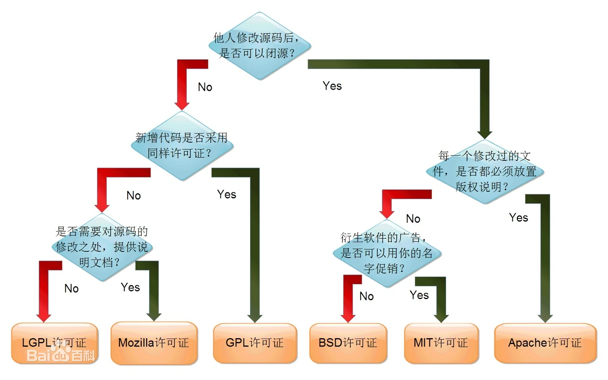

# 开源

学习的方式就是多看优秀的开源项目：
- [国产 gitee GVP](https://gitee.com/gvp/all)
- [GitHub中文排行榜](https://github.com/GrowingGit/GitHub-Chinese-Top-Charts)
- [开源软件分类](https://www.oschina.net/project/tags)
- [Google 开源项目风格指南——中文版](https://zh-google-styleguide.readthedocs.io/en/latest/)

## 开源协议

**学开源，先学开源协议**

百度百科： https://baike.baidu.com/item/开源协议/10642383?fr=aladdin

- GPL: 软件免费，可以向别人收取费用。如果企业对源码进行了修改，也必须将其开源出来。算是比较严格的协议
- BSD: 可以作为商业用途，但是如果软件也开源的话，也必须遵循BSD。对于商业开发的软件，是非常友好的。
- Apache:相比BSD更加宽松，只有只要我们声明使用了Apache协议即可
- MIT: 目前最宽松的协议，只有在协议中保留作者的信息即可

## 软件基金会

### Apache

Apache软件基金会（Apache Software Foundation，简称 ASF）是专门为运作一个开源软件项目的 Apache 的团体提供支持的非盈利性组织，这个开源软件的项目就是 Apache 项目。

官网：[https://www.apache.org/](https://www.apache.org/)

### 【推荐使用】Dromara

Java开源组织，致力于微服务云原生解决方案的组织，是由 Apache ShenYu（前身是Soul网关）的作者创立，
多位 Java 开源作者参与的一个Java开源组织。 在开源中国社区，很多 Java 开源作者都是各自为战，独立运营项目。
Domara 组织的诞生就是为了联合 Java 开源的力量，共建社区，资源共享，共同推行中国Java开源事业的发展。

社区地址： [https://dromara.org/](https://dromara.org/)

很多我们熟悉项目都是Dromara的，比如：
- hutool。小而全的Java工具类库
- jpom。简而轻的低侵入式在线构建、自动部署、日常运维、项目监控软件
- maxKey。业界领先的企业级开源IAM身份管理和身份认证产品
- LiteFlow。轻量，快速，稳定可编排的组件式规则引擎  
- DynamicTp。基于配置中心的轻量级动态线程池，内置监控告警功能
- sms4j。让发送短信变的更简单
- hertzbeat。强大自定义监控能力，无需 Agent 的开源实时监控告警系统。

### 开放原子开源基金会

2020 年 6 月在北京成立，由阿里巴巴、百度、华为、浪潮、360、腾讯、招商银行等多家龙头科技企业联合发起。
开放原子开源基金会本着以开发者为本的开源项目孵化平台、科技公益性服务机构的定位，遵循共建、共治、共享原则，
系统性打造开源开放框架，搭建国际开源社区，提升行业协作效率，赋能千行百业

[https://www.openatom.org/project](https://www.openatom.org/project)

### CNCF

云原生计算基金会[https://www.cncf.io/](https://www.cncf.io/)

[云原生计算基金会（CNCF）毕业的10大开源项目](https://zhuanlan.zhihu.com/p/362727936)

是Linux基金会旗下的非盈利组织，来推动云原生计算的发展，帮助云原生技术开发人员来构建出色的产品。

CNCF的成立与一个重要项目密切相关，那就是Kubernetes。K8s最早是谷歌的内部容器编排项目Borg，为了推进其发展，谷歌决定将其开源，于是跟Linux基金会在2015年一起创办了CNCF。

### OWASP
OWASP (开放 Web 软体安全项目 - Open Web Application Security Project) 是一个开放社群、非营利性组织，
其主要目标是研议协助解决 Web 软体安全之标准、工具与技术文件，长期 致力于协助政府或企业了解并改善网页应用程式与网页服务的安全性。
官网[http://www.owasp.org/](http://www.owasp.org/)

目前 OWASP 有 30 多个进行中的计划，包括最知名的 
- OWASP Top 10 (十大 Web 弱点)。美国联邦贸易委员会 (FTC) 强烈建议所有企业需遵循 OWASP 所发布的十大 Web 弱点防护守则
- WebGoat (代罪羔羊) 练习平台
- 安全 PHP/Java/ASP.Net 等计划，针对不同的软体安全问题在进行讨论与研究。

### 其他

- 【华为】鲲鹏开发者平台[https://www.hikunpeng.com/zh/developer](https://www.hikunpeng.com/zh/developer)
- openEuler:通过社区合作，打造创新平台，构建支持多处理器架构、统一和开放的操作系统openEuler，推动软硬件生态繁荣发展。[https://www.openeuler.org/zh/](https://www.openeuler.org/zh/)
- plume开源社区。致力于简单易用的开源项目的开源组织。[https://gitee.com/plumeorg](https://gitee.com/plumeorg)

## 框架

### 1.数据库相关

我们想要使用数据库的话，必须对数据库进行连接、数据通信（持久化）、数据分片、事务、连接管理等。

#### 1.1.主流数据库

数据库分类如下：
- 关系型数据库：Oracle、MySQL、SQLserver、db2、PostgreSQL、SQLlite等
- 文档型数据库：MongoDB
- 键值型数据库：Redis
- 搜索类数据库：Lucene、Elasticsearch、Solr
- 列式数据库：HBASE、Cassandra

新型的数据库，比如TiDB，OceanBase等，都是兼容MySQL的分布式数据库。

#### 1.2.数据库连接池

Java程序想要连接到数据库，需要使用到的技术也是不同的。
- 关系型数据库：主要使用JNDI或者jdbc进行连接，数据库连接池可以提交效率
  - Jdbc：对于关系型数据库，连接的基础就是jdbc。少量使用jndi。jdbc是JavaEE 企业级规范中的一个，定义了标准接口
  - Dbcp
  - C3p0
  - Druid：阿里巴巴开源，功能非常强
  - Hikair：Spring boot 模式使用的数据库连接池
- 文档型数据库：MongoDB，使用官方提供的连接驱动
- 键值型数据库：Redis，客户端较多，比如jedis、lettuce、Redisson等
  - Jedis：基于socket实现的客户端，采用面向过程的方式，与Redis进行通信。调用的接口与Redis命令十分接近。
  - Redisson：基于jedis实现的高级客户端。采用面向对象的流式方式。实现了很多分布式环境下的高级特性。
  - Lettuce：基于socket实现的客户端。spring-data-Redis基于lettuce实现的RedisTemplate。
- 搜索类数据库：Elasticsearch、Solr，使用官方提供的连接驱动
- 列式数据库：HBASE、Cassandra，使用官方提供的连接驱动

#### 1.3.ORM（持久层框架）
- Hibernate：开放源代码的对象关系映射框架
- DbUtils：只是对JDBC简单封装，不支持事务
- MyBatis&Ibatis：优秀的持久层框架，它支持定制化 SQL、存储过程以及高级映射·
- JPA：Java Persistent API，oracle官方规定的持久层规范，在开发中可能使用到的还有，hibernate就会jpa最好的一个实现方案。
- spring data jpa：spring对jpa的实现方案
- SpringJdbcTemplate：spring 对jdbc的简单封装
- Mybatis-Plus：国产 MyBatis 增强工具，简化开发、提高效率

#### 1.4.数据分片（分库分表）

实现的分案很多：Cobar， MyCAT， TDDL， DRDS， Atlas， DBProxy， sharding-JDBC， Heisenberg， CDS， DDB， OneProxy， Oceanus， Vitess， Kingshard， MaxScale与MySQL Route
- sharding-sphere。分库分表的插件，包括Sharding-JDBC、Sharding-Proxy、Sharding-Sidecar 捐献给Apache，目前由京东维护
- MyCAT：数据库代理，可以实现分库分表

#### 1.5.分布式ID
数据分片后，最先要解决的就是ID的问题。
Snowflake是推特的一个完美解决方案，目前的实现方案如下：
注意：很多分库分表的框架也实现了分布式ID的功能，比如Sharding-JDBC。
- 百度（uid-generator）：[https：//github.com/baidu/uid-generator](https：//github.com/baidu/uid-generator)
- 美团（Leaf）：[https：//github.com/Meituan-Dianping/Leaf](https：//github.com/Meituan-Dianping/Leaf)
- 滴滴（TinyId）：[https：//github.com/didi/tinyid/wiki/tinyid原理介绍](https：//github.com/didi/tinyid/wiki/tinyid原理介绍)

#### 1.6.分布式事务
一般事务的管理，都是orm框架封装实现，由spring进行隐式管理。这里只讲分布式事务。
很多分库分表的框架可以自带了分布式事务的功能，比如Sharding-JDBC。
- Atomikos：基于jta和数据库XA驱动的分布式事务插件，也就是在一个项目中调用多个数据源时可以使用的框架，实现的原理就是2pc
- Seata：阿里实现的分布式事务框架。
- TCC分布式事务：ByteTCC、himly、tcc-transaction

### 3.页面与控制层框架

- Struts2 很久以前流行的框架，漏洞较多，现在很少有新的项目在使用
- jsf 全称java server  face，oracle官方提供的基于事件的框架，有点像Struts2）
- dwr：  用于改善web页面与Java类交互的远程服务器端Ajax开源框架，使用js与Java代码直接交互的一种模式
- fckeditor 百度的开源前端文本编辑框架(有点小问题，需要修改)
- freemarker：文本生成类框架，可用于视图层，也可以用于文本类文件的生成模板。
- tiles2：  jsp布局的框架。目前已经支持jsp、freemarker、volicity、thymeleaf的布局。
- thymeleaf spring boot：支持的页面渲染技术，支持页面模板、表达式、布局等等。

### 4.综合性框架
- spring MVC 现在最流行的，spring 大家族的一员
- spring：  一个开放源代码的设计层面框架，它解决的是业务逻辑层和其他各层的松耦合问题
- spring boot spring提供敏捷开发的微服务框架
- spring cloud spring-boot的高级应用。
- Jfinal 国产orm+web框架，在国内有一定的用户量。

### 5.缓存

- Ehcache 支持分布式缓存缓存框架
- memcache 支持分布式缓存缓存框架（一般推荐使用Ehcache）
- Caffeine 高性能缓存框架，可能是目前性能最高的缓存框架，作为springboot2+默认的缓存。
- J2Cache Java 两级缓存框架，可以让应用支持两级缓存框架 ehcache(Caffeine) + redis 。避免完全使用独立缓存系统所带来的网络IO开销问题
- GrahQL GraphQL 既是一种用于 API 的查询语言也是一个满足你数据查询的运行时

### 6.工作流
- JBPM
- Activiti
- 自研工作流：https://gitee.com/mldong/mldong

### 7.规则引擎
- Ilog JRules
- Jess
- Visual Rules
- URule Pro
- Drools
- EasyRules

### 8.用户权限
- shiro 简单的权限管理框架
- cas 开源的SOA

### 9.运维监控

- siger 系统内存、cup、磁盘监控框架
- Arthas Arthas（阿尔萨斯）是阿里巴巴开源的 Java 监控与诊断工具
- Prometheus 开源的系统监控和报警的工具
- CAT 大众点评的实时监控系统

### 10.日志
- Log4j
- Log4j2
- Logback
- commons-logging
- slf4j

### 11.项目管理

- swagger restFull风格接口管理框架
- Git
- Svn
- ant 项目管理类框架，流程式管理，比较难管理，很古老的东西
- maven 项目管理类框架，声明式管理，是目前Java最流行的管理工具

### 12.数据编码&解码（序列化）
- JSON 包括json-jdk、fastJson、gson、jackson
- XML 包括 DOM、SAX、JDOM、DOM4J、XStream
- 二进制 JAVA-serializable、FST、kryo、hessian
- Tika apache顶级项目，数据类解析。

### 13.网络通信
- WebService 包括axis2、cxf等
- Jersey 专业的restFull风格的接口框架（不推荐使用）
- httpClient 是Apache Jakarta Common 下的子项目，支持 HTTP 协议的客户端编程工具包
- jsoup 是一款Java 的HTML解析器，可直接解析某个URL地址、HTML文本内容。
- nekohtml 功能与jsoup类型。
- okhttp/okio 一个处理网络请求的开源项目，是安卓端最火热的轻量级框架
- webSocket 是HTML5开始提供的一种浏览器与服务器间长连接双向实时通信。包括jdk、spring boot实现、GoEasy、Pushlets、Pushlet等
- 邮件 常见的邮件库是jee自带的接口功能简单，比较好的有Apache email，已经spring 的 JavaMailSender。
- Netty。 基于Java NIO的高性能网络框架

### 14.定时任务

- Quartz OpenSymphony的开源定时任务框架。
- XXL-JOB，国产轻量级分布式任务调度框架，国内用户较多，可商用。
- spring 的定时任务
- JDK 原生定时任务
- saturn 唯评会开源的任务调度框架

### 15.基础工具类框架

#### 15.1.Apache Commons

包含了很多开源的工具，用于解决平时编程经常会遇到的问题，减少重复劳动

- BeanUtils 提供对弈Javabean进行各种操作，克隆对象属性等等
- codec 处理城建的编码方法的工具包，例如 DES，SHA1，MD5，Base6等
- collections java集合操作
- configuration java应用长须的配置管理库
- io io工具的封装
- lang java进本对象方法的工具包，比如StringUtils，ArrayUtils等
- logging java日志统一接口
- net 提供了客户端与服务端的数据校验框架
- fileupload 文件上传下载框架

#### 15.2.应用类

- jfreeChart 开源的报表框架
- excel 创建的框架有 poi， jxl， easyExcel等
- pdf 比较主流的Apache PDFBox、poi、jacob、jodconverter、iText 等工具。 [PDF 添加水印有哪些方案](https://mp.weixin.qq.com/s/TvU0Ny64NvmJL4-GKSaPpA)
- 二维码 包括BarCode4j、SwetakeQRCode、zxing等
- pinyin4j 中文转拼音技术， pinyin4j，国产中文转拼音框架，简单使用还好，对多音字处理的不好
- 图片处理 包括JDK，Thumbnailator ，ImageMagick
- 数学公式&表达式解析 Jep， Fast EL， jeval， 5.ik-expression(国产)， ExpressionJ， 7.expression-analyzer(国产)， BeanShell， Spads(国产)

#### 15.3.其他

- guava 谷歌开源的集合类框架，guava内置了缓存相关的技术
- Disruptor  并发编程框架，性能非常高。是LMAX(一种新型零售金融交易平台)的业务逻辑处理器的核心
- 字节码加强 ASM、Javassist、cglib(基于字节码的动态代理工具类)
- lombok 简化代码开发内容。

#### 15.4.对象转换
- 简单场景推荐：Spring的BeanUtils。
- 复杂场景推荐：MapStruct。教程：https://mp.weixin.qq.com/s/gD21wceOWJvkiFshB8NweA
- 不推荐：Apache commons的BeanUtils。bug较多，使用比较繁琐。

### 16.文件服务器

- fastDFS 分布式的文件管理系统，用于存储较小，数量大的文件。

### 17.测试

- JHM：基准测试，基于注解编写压测规则。
- Jmeter：是一款纯java编写负载功能测试和性能测试开源工具软件
- contiperf：是一个轻量级的测试工具，基于JUnit 4 开发，可用于效率测试等
- junit：最常用的单元测试工具

### 18.消息队列

- ActiveMQ
- kafka
- rabbitMQ
- rocketMQ 阿里巴巴开源项目，贡献给Apache，推荐使用

### 19.RPC服务

其实rpc是个广义定义。很多协议都算是RPC
- dubbo 阿里巴巴开源的RPC框架
- thrift Apache开源跨语言的RPC框架
- gRPC 一个高性能、开源和通用的 RPC 框架，目前提供 C、Java 和 Go 语言版本

### 20.服务发现与注册中心

- zookeeper 开放源码的分布式应用程序协调服务
- curator zookeeper的开源客户端框架，提供分布式锁、主从选举等功能
- Eureka(尤里卡)，consul，Apollo(阿波罗)，nacos

### 21.网关 gateway

主要是私有云方案
- Kong
- Netflix Zuul
- orange

## 国产开源项目

### 国内开源
- 阿里：Alibaba主推的开源项目，部分已经提供了商业化软件。[https://github.com/alibaba](https://github.com/alibaba)
    - Druid：阿里巴巴数据库事业部出品，为监控而生的数据库连接池。
    - Fastjson：JSON parser/generator for Java
    - canal：阿里巴巴mysql数据库binlog的增量订阅&消费组件。
    - Sentinel：轻量级强大的流量控制组件，可实现微服务的可靠性和监控
    - nacos： 一个更易于构建云原生应用的动态服务发现、配置管理和服务管理平台
    - Dubbo：高性能Java RPC框架。目前已经贡献给Apache进行孵化
    - Rocketmq： 目前主流的mq
    - Arthas：Java诊断利器Arthas 
    - P3C：阿里巴巴Java编码指南pmd实现和IDE插件
    - Chat2DB：开源免费的多数据库客户端工具
    - SREWorks：云原生数智运维平台
- 蚂蚁金服。
    - SOFAStack。金融级云原生架构。[https://github.com/sofastack](https://github.com/sofastack)
    - OceanBase。开源分布式数据库。[https://github.com/oceanbase](https://github.com/oceanbase)
    - seata。分布式事务解决方案。[https://github.com/seata](https://github.com/seata)
- 腾讯。侧重移动端。
    - MMKV：mmap实现的kv数据库[https://github.com/Tencent/MMKV](https://github.com/Tencent/MMKV)
    - APIJSON：基于api的orm框架[https://github.com/Tencent/APIJSON](https://github.com/Tencent/APIJSON)
    - 北极星：注册中心，支持多语言、多框架的云原生服务发现和治理中心。
      > - 官网:[https://github.com/polarismesh/polaris](https://github.com/polarismesh/polaris)
      > - 文档:[https://www.bookstack.cn/books/polarismesh-1.11-zh](https://www.bookstack.cn/books/polarismesh-1.11-zh)
    - 蓝鲸智云:是一套用于构建企业研发运营一体化体系的PaaS[https://gitee.com/Tencent-BlueKing](https://gitee.com/Tencent-BlueKing)
    - CodeDog：代码扫描
- 搜狗：[https://github.com/sogou](https://github.com/sogou)
    - Workflow：搜狗公司C++服务器引擎，编程范式
    - SRPC：企业级RPC系统，目前每天承载上百亿的请求量
- 京东：[https://gitee.com/jd-platform-opensource](https://gitee.com/jd-platform-opensource)
  - asyncTool。并发编排工具。
  - hotkey。热数据探测与通知。
  - Jlog。海量日志（秒级GB级）的搜集、传输、存储而设计的全套方案
  - 微服务前端。[https://github.com/micro-zoe](https://github.com/micro-zoe)
  - sql-analysis。SQL分析组件。[https://gitee.com/JD-opensource/sql-analysis](https://gitee.com/JD-opensource/sql-analysis)
- 美团： [https://github.com/Meituan-Dianping](https://github.com/Meituan-Dianping)
  - Leaf。分布式id框架。支持Snowflake、号段模式等方式
  - CAT。是基于 Java 开发的实时应用监控平台，为美团点评提供了全面的实时监控告警服务
- 百度：[https://github.com/baidu](https://github.com/baidu)
  - amis。前端设计器。
  - brpc:[https://github.com/brpc](https://github.com/brpc)
  - Apollo:[https://github.com/ApolloAuto](https://github.com/ApolloAuto)
  - echarts team:[https://github.com/ecomfe](https://github.com/ecomfe)
- anji-plus。安吉佳佳公司开源产品，主要是低代码和大数据。[https://gitee.com/anji-plus](https://gitee.com/anji-plus)
- JVS。Java后端快速框架。[https://gitee.com/software-minister](https://gitee.com/software-minister)

- xxl。【个人开发者】地址：[https://github.com/xuxueli](https://github.com/xuxueli)
  - XXL-JOB。著名的定时任务框架
- RuoYi。【个人开发者】地址：[https://github.com/yangzongzhuan](https://github.com/yangzongzhuan)
  - RuoYi。通用型后台管理系统
- susantyp。【个人开发者】地址：[https://gitee.com/susantyp](https://gitee.com/susantyp)
  - Remote Connection。网页版的Xshell，支持SFTP和FTP两种登录方式
  - easy-jenkins。对vue和jar的部署工具，操作简单，实行一键部署，内部结构采用流水线形式架构。
- freakchick。【个人开发者】[https://github.com/freakchick](https://github.com/freakchick)
  - DBApi。是面向数仓开发人员的低代码工具，只需编写sql，配置好参数，就可以自动生成http接口。帮助程序员快速的开发后端数据接口，尤其适用于BI报表、数据可视化大屏的后端接口开发。
  - kafkaUI-lite。好用的kafka ui界面客户端工具，可以在生产消息、消费消息、管理topic、管理group;可以支持管理多个kafka集群。同时支持zk和redis的操作
- oldratlee。【个人开发者】dubbo核心开发者之一[https://github.com/oldratlee](https://github.com/oldratlee)
  - useful-scripts。平时有用的手动操作做成脚本，以便捷地使用，让开发的日常生活更轻松些
  - software-practice-thoughts。软件实践文集

### 基础工具

- Hutool是一个Java工具包，也只是一个工具包，它帮助我们简化每一行代码，减少每一个方法，让Java语言也可以“甜甜的”。它最初是作者项目中“util”包的一个整理，后来慢慢积累并加入更多非业务相关功能，并广泛学习其它开源项目精髓，经过自己整理修改，最终形成丰富的开源工具集
    [https://gitee.com/loolly/hutool](https://gitee.com/loolly/hutool)
- Xxl-job。一个轻量级分布式任务调度平台，其核心设计目标是开发迅速、学习简单、轻量级、易扩展。现已开放源代码并接入多家公司线上产品线，开箱即用。
    [http://www.xuxueli.com/xxl-job/#/](http://www.xuxueli.com/xxl-job/#/)
- spring-boot-mail。邮件发送服务，文本，附件，模板，队列，多线程，定时任务实现多种功能。    [https://gitee.com/52itstyle/spring-boot-mail](https://gitee.com/52itstyle/spring-boot-mail)
- spring-boot-quartz。基于spring-boot+quartz的CRUD任务管理系统 。    [https://gitee.com/52itstyle/spring-boot-quartz](https://gitee.com/52itstyle/spring-boot-quartz)
- x-patrol。Github leaked patrol为一款github泄露巡航工具。[https://github.com/MiSecurity/x-patrol](https://github.com/MiSecurity/x-patrol)
- 在线打车：[https://github.com/OiPunk/OnlineTaxi](https://github.com/OiPunk/OnlineTaxi)
- Spring-boot-pay。支付服务：支付宝、微信、银联详细代码案例。十分钟让你快速搭建一个支付服务，内附各种教程。
  [https://gitee.com/52itstyle/spring-boot-pay](https://gitee.com/52itstyle/spring-boot-pay)
- spider-flow。平台以流程图的方式定义爬虫,是一个高度灵活可配置的爬虫平台。[https://gitee.com/ssssssss-team/spider-flow](https://gitee.com/ssssssss-team/spider-flow)
- DBAPI。是一个面向数仓开发人员的低代码工具，只需在页面上编写sql，并配置好参数，就可以自动生成http接口
  [https://www.51dbapi.com/](https://www.51dbapi.com)
- 分布式文件系统。集成了Fastdfs而已。项目地址：[https://gitee.com/52itstyle/spring-boot-fastdfs](https://gitee.com/52itstyle/spring-boot-fastdfs)
- minio-upload。使用vue3 elementplus minio springboot 实现大文件的分片上传、断点续传、秒传的功能demo。[https://gitee.com/Gary2016/minio-upload](https://gitee.com/Gary2016/minio-upload)
- Plumelog。无代码入侵的分布式日志系统，基于log4j、log4j2、logback搜集日志，设置链路ID，方便查询关联日志。 [https://gitee.com/plumeorg/plumelog](https://gitee.com/plumeorg/plumelog)
- spring-file-storage。通过简单的方式将文件存储到各种公有云、FTP、本地等操作。[https://gitee.com/XYW1171736840/spring-file-storage](https://gitee.com/XYW1171736840/spring-file-storage)
- db-api。零代码，通过SQL生成http api。[https://gitee.com/freakchicken/db-api](https://gitee.com/freakchicken/db-api)
- TrWebOCR。开源的离线OCR。[https://gitee.com/alisen39/TrWebOCR](https://gitee.com/alisen39/TrWebOCR)
- tianai-captcha。图形验证码。[https://gitee.com/tianai/tianai-captcha](https://gitee.com/tianai/tianai-captcha)
- bruce/flowable。基于flowable和bpmn.js封装的工作流引擎。[https://gitee.com/lwj/flow](https://gitee.com/lwj/flow)

### 脚手架
- 智慧云智能教育平台。基于 SpringBoot + Mybatis + Shiro + mysql + redis构建的智慧云智能教育平台。
  [https://gitee.com/zhuimengshaonian/wisdom-education](https://gitee.com/zhuimengshaonian/wisdom-education)
- Cloud-Platform：[https://gitee.com/geek_qi/cloud-platform](https://gitee.com/geek_qi/cloud-platform)
- SpringBlade 微服务开发平台。[https://gitee.com/smallc/SpringBlade](https://gitee.com/smallc/SpringBlade)

### 后端管理
- Ruoyi：基于SpringBoot2.0的权限管理系统 易读易懂、界面简洁美观。 核心技术采用Spring、MyBatis、Shiro没有任何其它重度依赖。
  [https://gitee.com/y_project/RuoYi](https://gitee.com/y_project/RuoYi)
- SmartAdmin。SmartAdmin由河南·洛阳1024创新实验室团队研发的一套互联网企业级的通用型中后台解决方案！
  [https://gitee.com/lab1024/smart-admin](https://gitee.com/lab1024/smart-admin)
- DataV。前端组件，Vue 大屏数据展示组件库。[http://datav.jiaminghi.com/](http://datav.jiaminghi.com/)

### 商城
- Mall。mall项目是一套电商系统，包括前台商城系统及后台管理系统，基于SpringBoot+MyBatis实现。
  [https://github.com/macrozheng/mall](https://github.com/macrozheng/mall)
- 聚惠星商城。基于 微信小程序 + springboot + vue 技术构建 ，支持单店铺，多店铺入驻的商城平台。项目包含微信小程序，管理后台。基于java后台语言，已功能闭环，且达到商用标准的一套项目体系。
  [https://gitee.com/qiguliuxing/dts-shop](https://gitee.com/qiguliuxing/dts-shop)
- Miaosha 。秒杀系统设计与实现.互联网工程师进阶与分析   [https://github.com/qiurunze123/miaosha](https://github.com/qiurunze123/miaosha)
- spring-boot-seckill 。从0到1构建分布式秒杀系统，脱离案例讲架构都是耍流氓，码云GVP项目。这个是自5月以来最上心的一个项目，尽管只是一个案例，但是从中也学到了不少知识。
  项目地址：[https://gitee.com/52itstyle/spring-boot-seckill](https://gitee.com/52itstyle/spring-boot-seckill)
- 分布式电商项目。[https://github.com/SiGuiyang/spring-cloud-shop](https://github.com/SiGuiyang/spring-cloud-shop)

### OA
- 企业OA。易上手的企业管理快速开发平台，持续研发14年，基于JAVA开发，spring boot框架。
  [https://gitee.com/bestfeng/yimioa.git](https://gitee.com/bestfeng/yimioa.git)
- oasys。oasys是一个OA办公自动化系统，使用Maven进行项目管理，基于springboot框架开发的项目，mysql底层数据库，前端采用freemarker模板引擎，Bootstrap作为前端UI框架，集成了jpa、mybatis等框架。作为初学springboot的同学是一个很不错的项目，如果想在此基础上面进行OA的增强，也是一个不错的方案
  [https://gitee.com/aaluoxiang/oa_system](https://gitee.com/aaluoxiang/oa_system)

### 社区
- Symphony。一款用 Java 实现的现代化社区（论坛/BBS/社交网络/博客）平台。    [https://github.com/b3log/symphony](https://github.com/b3log/symphony)
- 高仿微信
  iOS 版：Github 地址：https://github.com/nacker/LZEasemob3。
  Android 版：Github 地址：[https://github.com/GitLqr/LQRWeChat](https://github.com/GitLqr/LQRWeChat)
- 高仿微博
  iOS 版：Github 地址：https://github.com/sam408130/DSLolita
  Android:Github 地址：[https://github.com/wenmingvs/WeiBo](https://github.com/wenmingvs/WeiBo)
- 轻松阅读 。简单的移动端与pc端的项目
  [https://github.com/Zealon159/light-reading-cloud](https://github.com/Zealon159/light-reading-cloud)
- NiterForum。可以说 NiterForum 提供了一个论坛所能提供的所有功能，功能特性覆盖的非常全面
  Github 地址：[https://github.com/yourkevin/NiterForum](https://github.com/yourkevin/NiterForum)
- 码问社区。Github 地址：[https://github.com/codedrinker/community](https://github.com/codedrinker/community)
- 朋也社区 。采用主流的 Java Web 开发框架（SpringBoot）进行开发。个人觉得朋也社区最大的亮点是在设计层面上支持高度的可定制化。
  Github 地址：[https://github.com/tomoya92/pybbs](https://github.com/tomoya92/pybbs)
- 妖气山视频管理系统。第一款面向大众的java版的视频管理系统。
  [https://gitee.com/javaex/yaoqishan](https://gitee.com/javaex/yaoqishan)
- 讯飞语音。讯飞语音JavaWeb语音合成解决方案。
  项目地址：[https://gitee.com/52itstyle/xufei_msc](https://gitee.com/52itstyle/xufei_msc)
- 小说精品屋。小说精品屋-plus是在小说精品屋的基础上，去除了漫画和弹幕模块，专注于小说，是一个多端（PC、WAP）阅读、功能完善的原创文学CMS系统，由前台门户系统、作家后台管理系统、平台后台管理系统、爬虫管理系统等多个子系统构成，支持会员充值、订阅模式、新闻发布和实时统计报表等功能
  官网：[https://xiongxyang.gitee.io/home/](https://xiongxyang.gitee.io/home/)
- 高仿 youtube
  [https://github.com/aslanyanhaik/youtube-iOS](https://github.com/aslanyanhaik/youtube-iOS)
  [https://github.com/TeamNewPipe/NewPipe](https://github.com/TeamNewPipe/NewPipe)
- 音乐播放器
  [https://github.com/QuintGao/GKAudioPlayerDemo](https://github.com/QuintGao/GKAudioPlayerDemo)
  [https://github.com/aa112901/remusic](https://github.com/aa112901/remusic)
- 高仿Bilibili
  iOS 版：Github 地址：https://github.com/MichaelHuyp/Bilibili_Wuxianda
  Android:Github 地址：https://github.com/HotBitmapGG/bilibili-android-client

### 文档
- Mindoc：MinDoc 是一款针对IT团队开发的简单好用的文档管理系统。开箱即用。
  [https://github.com/lifei6671/mindoc](https://github.com/lifei6671/mindoc)
- wps-view-java。wps在线编辑、预览后台服务
  [https://gitee.com/mose-x/wps-view-java](https://gitee.com/mose-x/wps-view-java)
- 在线文档管理系统。spring-boot-doc是一款针对IT团队开发的简单好用的文档管理系统。
  项目地址：[https://gitee.com/52itstyle/spring-boot-doc](https://gitee.com/52itstyle/spring-boot-doc)
- tamguo。探果网（简称tamguo）是基于java开发的在线题库系统。包括书籍、试题、会员、后台管理等
    [https://gitee.com/smiletocandy/tamguo](https://gitee.com/smiletocandy/tamguo)
- Luckysheet。Luckysheet，一款纯前端类似excel的在线表格，功能强大、配置简单、完全开源。
    [https://github.com/mengshukeji/Luckysheet](https://github.com/mengshukeji/Luckysheet)
- kkFileView。文件文档在线预览解决方案。[https://kkfileview.keking.cn/zh-cn/index.html](https://kkfileview.keking.cn/zh-cn/index.html)

### 网盘
- Nextcloud。NextCloud以它的高安全性和法规遵从性作为它的一个独特的推崇的卖点，可以在浏览器中使用，也可以安装客户端，支持 Win、Mac、Android、iOS、Linux 全平台，且免费开源。
    官网：https://github.com/nextcloud
- ownCloud。ownCloud是一个开源免费专业的私有云存储项目，它能帮你快速在个人电脑或服务器上架设一套专属的私有云文件同步网盘。
    官网：https://github.com/owncloud
- DzzOffice。Dzzoffice是一套开源办公套件，适用于企业、团队搭建自己的，类似Google企业应用套件、微软Office365的企业协同办公平台。
    官网：https://github.com/zyx0814/dzzoffice
- Cloudreve。支持本机、从机、七牛、阿里云 OSS、腾讯云 COS、又拍云、OneDrive (包括世纪互联版) 作为存储端。
    官网：https://github.com/cloudreve/Cloudreve
- kiftd。一款便捷、开源、功能完善的个人&团队&小型团队网盘服务器系统。
    官网：https://github.com/KOHGYLW/kiftd-source
- 蓝眼云盘。蓝眼云盘是蓝眼开源系列代表作品之一，致力于打造精致，优雅，简约的云盘
    官网：https://github.com/eyebluecn/tank
- Seafile。Seafile是一款强大优秀的云同步软件，拥有跨平台文件同步、移动端文件访问、挂载盘、文件共享和权限控制、文件锁定、文件版本管理和资料库镜像、在线编辑和协同编辑、审计日志等功能。
    官网：https://github.com/haiwen/seafile

### 低代码

- smardaten无代码平台，有社区版，没有源码。[https://s3.smardaten.com](https://s3.smardaten.com)

## 开源盈利模式

[全球 22 种开源商业收入模式](https://blog.csdn.net/m0_46163918/article/details/127570388)

国内的情况比较特殊，懂得都懂，所以传统的开源盈利模式在中国是行不通的，尤其是个人开源项目想要盈利更是难上加难。

常见方式如下：
1. 项目中存在一些问题。比如删除了部分代码，然后再让你购买，才发完整的源码。
2. 项目开源一部分，或者给出一个体验版本，如果要获取完整的源码，就要付费
3. 项目使用起来非常复杂，官方文档提供不全。需要付费协助处理

## 开源指南

- 开源指北： [https://gitee.com/gitee-community/opensource-guide](https://gitee.com/gitee-community/opensource-guide)
- 开源治理：[https://gitee.com/OSCYuanChuangHui/2018_lecturer_ppt/tree/master/2019.12.15%20深圳年终盛典/开源治理](https://gitee.com/OSCYuanChuangHui/2018_lecturer_ppt/tree/master/2019.12.15%20深圳年终盛典/开源治理)
- 内源：[https://help.gitee.com/enterprise/inner-source](https://help.gitee.com/enterprise/inner-source)

