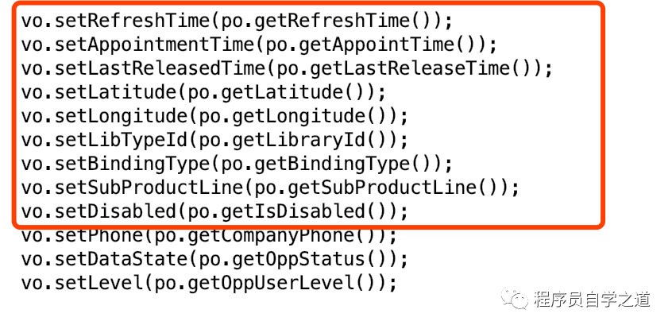

# Apache-commons

## 1.BeanUtils【不推荐】

### 1.1.包结构

Commons BeanUtils一共包括如下5个包：

- org.apache.commons.beanutils – 核心包，定义一组 Utils类和需要用到的接口规范
- org.apache.commons.beanutils.converters – 转换 String 到需要类型的类，实现 Converter 接口
- org.apache.commons.beanutils.locale –beanutils 的 locale 敏感版本
- org.apache.commons.beanutils.locale.converters– converters 的 locale 敏感版本
- org.apache.commons.collections – beanutils 使用到的 Collection 类

其中需要我们特别关注的是这个org.apache.commons.beanutils包，其他包都是起辅助作用的。

### 1.2.核心接口

接下来我们就仔细看一看这个包都有些什么东东：4个接口

- Converter

该接口定义了如下方法：

public java.lang.Object convert(java.lang.Class type, java.lang.Object   value);

只要实现了这个Converter接口并注册到ConvertUtils类即可被我们的BeanUtils包所使用，它的主要目的是提供将给定的Object实例转换为目标类型的算法。

我们可以在beanutils.converters包中找到相当多的已经实现的转换器。

- DynaBean ：该接口定义的是一个动态的JavaBean，它的属性类型、名称和值都是可以动态改变的。
- DynaClass：该接口定义的是针对实现了DynaBean接口的类的java.lang.Class对象， 提供如getName()、newInstance()等方法。
- MutableDynaClass：该接口是对DynaClass的扩展，使得动态bean的属性可以动态增加或删除。

### 1.3.基本应用 

BeanUtils的基础应用分解成：访问JavaBean的属性、设定JavaBean的属性、以及创建和使用DynaBeans。

1.假定我们有如下两个标准的JavaBean
```java
// 地址类
public class Address {
   private String zipCode;
   private String addr;
   private String city;
   private String country;
   public Address() {}
   public Address(String zipCode, String addr,String city, String country) {
	   this .zipCode = zipCode;
	   this .addr = addr;
	   this .city = city;
	   this .country = country;
   }
  //get-set method
}

//顾客类
public class Customer {
   private long id;
   private String name;
   private Address[] addresses;
   public Customer() {
   }
   public Customer( long id, String name, Address[]addresses) {
	   this .id = id;
	   this .name = name;
	   this .addresses = addresses;
   }
  //get-set method
}
```

2 基本的JavaBean和DynaBean操作
```java
public class BeanUtilsUsage {
	public static void main(String[] args) throws Exception {
		demoNormalJavaBeans();
		demoDynaBeans();
	}
	public static void demoNormalJavaBeans() throws Exception {
	   System.out.println(StringUtils.center( " demoNormalJavaBeans " , 40, "=" ));
	   // data setup
	   Address addr1 = new Address( "CA1234" , "xxx" , "Los Angeles" , "USA" );
	   Address addr2 = new Address( "100000" , "xxx" , "Beijing" , "China" );
	   Address[] addrs = new Address[2];
	   addrs[0] = addr1;
	   addrs[1] = addr2;
	   Customer cust = new Customer(123, "John Smith" , addrs);
	   // accessing the city of first address
	   String cityPattern = "addresses[0].city" ;
	   String name =        (String)PropertyUtils.getSimpleProperty(cust, "name" );
	   String city = (String)PropertyUtils.getProperty(cust, cityPattern);
	   Object[] rawOutput1 = new Object[] { "The city of customer " ,name,
			   "'sfirst address is " , city, "." };
	   System.out.println(StringUtils.join(rawOutput1));
	   // setting the zipcode of customer'ssecond address
	   String zipPattern = "addresses[1].zipCode" ;
	   if (PropertyUtils.isWriteable(cust, zipPattern)){
		   System.out.println( "Setting zipcode ..." );
		   PropertyUtils.setProperty(cust,zipPattern, "200000" );
	   }
	   String zip = (String)PropertyUtils.getProperty(cust, zipPattern);
	   Object[] rawOutput2 = new Object[] { "The zipcode of customer " ,name,
			   "'ssecond address is now " , zip, "." };
	   System.out.println(StringUtils.join(rawOutput2));
	   System.out.println();
	}
	public static void demoDynaBeans() throws Exception {
	   System.out.println(StringUtils.center( " demoDynaBeans " , 40, "=" ));
	   // creating a DynaBean
	   DynaProperty[] dynaBeanProperties = new DynaProperty[] {
			   new DynaProperty( "name" , String.class),
			   new DynaProperty( "inPrice" , Double.class), 
			   new DynaProperty( "outPrice" , Double.class),
	   };
	   BasicDynaClass cargoClass = new BasicDynaClass( "Cargo" ,BasicDynaBean.class, dynaBeanProperties);
	   DynaBean cargo =cargoClass.newInstance();
	   // accessing a DynaBean
	   cargo.set( "name" , "Instant Noodles" );
	   cargo.set( "inPrice" ,new Double(21.3));
	   cargo.set( "outPrice" ,new Double(23.8));
	   System.out.println( "name: " + cargo.get( "name" ));
	   System.out.println( "inPrice: " + cargo.get( "inPrice" ));
	   System.out.println( "outPrice: " + cargo.get( "outPrice" ));
	   System.out.println();
	}
}
```
运行结果：
```text
=========demoNormalJavaBeans ==========
The city of customerJohn Smith's first address is Los Angeles.
Setting zipcode ...
The zipcode ofcustomer John Smith's second address is now 200000.
============demoDynaBeans =============
name: InstantNoodles
inPrice: 21.3
outPrice: 23.8
```

### 1.4.版本问题

2017-12出现使用BeanUtils.copyProperties()异常

org.apache.commons.beanutils.ConversionException: No value specified for 'Date'

对于原对象中的null值可能出现ConversionException。该问题出现在v1.8.3以下的版本中 已在1.9.0版本修改该问题

### 1.5.Java通过反射进行bean操作

请查看案例

### 1.6.对比多种对象复制工具

#### 1.6.1.缘起

有一次开发过程中，刚好看到小伙伴在调用 set 方法，将数据库中查询出来的 Po 对象的属性拷贝到 Vo 对象中，类似这样：




可以看出，Po 和 Vo 两个类的字段绝大部分是一样的，我们一个个地调用 set 方法只是做了一些重复的冗长的操作。这种操作非常容易出错，
因为对象的属性太多，有可能会漏掉一两个，而且肉眼很难察觉。

类似这样的操作，我们很容易想到可以通过反射来解决。其实，如此普遍通用的功能，一个 BeanUtils 工具类就可以搞定了。

于是我建议这位小伙伴了解一下 BeanUtils，后来他使用了 Apache BeanUtils.copyProperties 进行属性拷贝，这为程序挖了一个坑！

#### 1.6.2.阿里代码规约

当我们开启阿里代码扫描插件时，如果你使用了 Apache BeanUtils.copyProperties 进行属性拷贝，它会给你一个非常严重的警告。
因为，Apache BeanUtils性能较差，可以使用 Spring BeanUtils 或者 Cglib BeanCopier 来代替。

看到这样的警告，有点让人有点不爽。大名鼎鼎的 Apache 提供的包，居然会存在性能问题，以致于阿里给出了严重的警告。

那么，这个性能问题究竟是有多严重呢？毕竟，在我们的应用场景中，如果只是很微小的性能损耗，但是能带来非常大的便利性，还是可以接受的。

带着这个问题。我们来做一个实验，验证一下。

如果对具体的测试方式没有兴趣，可以跳过直接看结果哦~

#### 1.6.3.性能测试

```java
public interface PropertiesCopier {
	void copyProperties(Object source, Object target) throws Exception;
}

public class CglibBeanCopierPropertiesCopier implements PropertiesCopier {

	@Override
	public void copyProperties(Object source, Object target) throws Exception {
		// 这个地方创建BeanCopier实例的时候是比较效率低的
		BeanCopier copier = BeanCopier.create(source.getClass(), target.getClass(), false);
		copier.copy(source, target, null);
	}

}

public class SpringBeanUtilsPropertiesCopier implements PropertiesCopier {

	@Override
	public void copyProperties(Object source, Object target) throws Exception {
		BeanUtils.copyProperties(target, source);
	}

}

public class CommonsPropertyUtilsPropertiesCopier implements PropertiesCopier {

	@Override
	public void copyProperties(Object source, Object target) throws Exception {
		PropertyUtils.copyProperties(target, source);
	}

}

public class CommonsBeanUtilsPropertiesCopier implements PropertiesCopier {

	@Override
	public void copyProperties(Object source, Object target) throws Exception {
		BeanUtils.copyProperties(target, source);
	}

}


@Data
@NoArgsConstructor
@AllArgsConstructor
@ToString
public class UserPo {
	
	private Integer id;
	
	private String name;
	
	private Date brith;
	
	private String address;
	
	private String email;
	
}


@RunWith(Parameterized.class)
public class Bt {

	@Parameterized.Parameter(0)
	public PropertiesCopier copier;

	// 测试的次数
	private static List<Integer> testTimes = Arrays.asList(100, 1000, 10_000, 100_000, 1_000_000);
	

	// 测试结果以 markdown 表格的形式输出
	private	static	StringBuilder resultBuilder = new StringBuilder
			("实现\t\t\t100\t\t\t1,000\t\t\t10,000\t\t\t100,000\t\t\t1,000,000\r\n");
	
	@Parameterized.Parameters
	public static List<PropertiesCopier[]> data(){
		List<PropertiesCopier[]> params = new ArrayList<>();
		params.add(new PropertiesCopier[]{new CglibBeanCopierPropertiesCopier()});
		params.add(new PropertiesCopier[]{new SpringBeanUtilsPropertiesCopier()});
		params.add(new PropertiesCopier[]{new CommonsPropertyUtilsPropertiesCopier()});
		params.add(new PropertiesCopier[]{new CommonsBeanUtilsPropertiesCopier()});
		return params;
	}

	@Before
	public void setUp() {
		String className = copier.getClass().getSimpleName().replace("PropertiesCopier", "");
		resultBuilder.append(className).append("\t\t\t");
	}
	
	@Test
	public void run() throws Exception {
		UserPo po = new UserPo(1, "张三", new Date(), "北京", "666@qq.com");
		UserVo vo = new UserVo();
		// 预热程序一次
		copier.copyProperties(po, vo);
		for (Integer times : testTimes) {
			long begin = System.nanoTime();
			for (int i = 0; i < times; i++) {
				copier.copyProperties(po, vo);
			}
			long end = System.nanoTime();
			long round = Math.round((end - begin) / 1_000_000D);
			resultBuilder.append(round).append("\t\t\t");
		}
		resultBuilder.append("\r\n");
	}
	
	@AfterClass
	public static void down() {
		System.out.println("测试结果");
		System.out.println(resultBuilder.toString());
	}
}
```
运行结果
```text
关闭日志的测试的结果（开启debug日志后，速度会奇慢无比）
实现					100		1,000	10,000	100,000	1,000,000
CglibBeanCopier			3		11		61		122		174			
SpringBeanUtils			8		16		46		123		616			
CommonsPropertyUtils		11		41		192		1100	4784			
CommonsBeanUtils			16		46		330		1559	8286
```

结果表明，Cglib 的 BeanCopier 的拷贝速度是最快的，即使是百万次的拷贝也只需要 10 毫秒！
相比而言，最差的是 Commons 包的 BeanUtils.copyProperties 方法，
100 次拷贝测试与表现最好的 Cglib 相差 5倍。百万次拷贝更是出现了 47倍的性能差异！（不同的机器，会出现不同的结果）

#### 1.6.4.原因分析

查看源码，我们会发现 CommonsBeanUtils 主要有以下几个耗时的地方：

- 输出了大量的日志调试信息
- 重复的对象类型检查
- 类型转换

具体的性能和源码分析，可以参考这几篇文章：

- 几种copyProperties工具类性能比较：https://www.jianshu.com/p/bcbacab3b89e
- CGLIB中BeanCopier源码实现：https://www.jianshu.com/p/f8b892e08d26
- Java Bean Copy框架性能对比：https://yq.aliyun.com/articles/392185

#### 1.6.5.One more thing

除了性能问题之外，在使用 CommonsBeanUtils 时还有其他的坑需要特别小心！

1、包装类默认值

在进行属性拷贝时，低版本CommonsBeanUtils 为了解决Date为空的问题会导致为目标对象的原始类型的包装类属性赋予初始值，
如 Integer 属性默认赋值为 0，尽管你的来源对象该字段的值为 null。

这个在我们的包装类属性为 null值时有特殊含义的场景，非常容易踩坑！例如搜索条件对象，一般 null
值表示该字段不做限制，而 0 表示该字段的值必须为0。

2、改用其他工具时

当我们看到阿里的提示，或者你看了这篇文章之后，知道了 CommonsBeanUtils 的性能问题，想要改用 Spring 的 BeanUtils 时，要特别小心：

从方法签名上可以看出，这两个工具类的名称相同，方法名也相同，甚至连参数个数、类型、名称都相同。但是参数的位置是相反的。
因此，如果你想更改的时候，千万要记得，将 target 和 source 两个参数也调换过来！

## 2.Codec

commons-codec是Apache开源组织提供的用于摘要运算、编码的包。

在该包中主要分为四类加密：BinaryEncoders、DigestEncoders、LanguageEncoders、NetworkEncoders。

## 3.Collections

Commons Collections，又是一个重量级的东西，为Java标准的Collections API提供了相当好的补充。Collections当然有它存在的道理，能够把常用的数据结构归纳起来，以通用的方式去维护和访问，这应该说是一种进步，
但是用起来似乎不够友好。这个时候我就会想，如果Java比现在做得更好用些，或者有一套第三方的API把我的这些需求抽象出来，实现了，该多好。Commons Collections就是这样一套API。

1. 容器类：如Collection、List、Map等，用于存放对象和进行简单操作的；
2. 操作类：如Collections、Arrays等，用于对容器类的实例进行相对复杂操作如排序等；
3. 辅助类：如Iterator、Comparator等，用于辅助操作类以及外部调用代码实现对容器类的操作，所谓辅助，概括而通俗的来讲，就是这些类提供一种算法，
   你给它一个对象或者一组对象，或者仅仅是按一定的规则调用它，它给你一个运算后的答案，帮助你正确处理容器对象。
   比如Iterator会告诉你容器中下一个对象有没有、是什么，而Comparator将对象大小/先后次序的算法逻辑独立出来。

list包中的方法Commons Collections在java.util.Map的基础上扩展了很多接口和类，比较有代表性的是BidiMap、MultiMap和LazyMap。跟Bag和Buffer类似，Commons Collections也提供了一个MapUtils。

所谓BidiMap，直译就是双向Map，可以通过key找到value，也可以通过value找到key，这在我们日常的代码-名称匹配的时候很方便：
因为我们除了需要通过代码找到名称之外，往往也需要处理用户输入的名称，然后获取其代码。需要注意的是BidiMap当中不光key不能重复，value也不可以。

所谓MultiMap，就是说一个key不在是简单的指向一个对象，而是一组对象，add()和remove()的时候跟普通的Map无异，只是在get()时返回一个Collection，
利用MultiMap，我们就可以很方便的往一个key上放数量不定的对象，也就实现了一对多。

所谓LazyMap，意思就是这个Map中的键/值对一开始并不存在，当被调用到时才创建，这样的解释初听上去是不是有点不可思议？这样的LazyMap有用吗？
我们这样来理解：我们需要一个Map，但是由于创建成员的方法很“重”（比如数据库访问），或者我们只有在调用get()时才知道如何创建，或者Map中出现的可能性很多很多，
我们无法在get()之前添加所有可能出现的键/值对，或者任何其它解释得通的原因，我们觉得没有必要去初始化一个Map而又希望它可以在必要时自动处理数据生成的话，LazyMap就变得很有用了。

Collection包下的方法中首先就是这个TypedCollection，它实际上的作用就是提供一个decorate方法，我们传进去一个Collection和需要的类型甄别信息java.lang.Class，
它给我们创建一个全新的强类型的Collection。我们其实在bag、buffer、list、map、set这些子包中都可以找到分别对应Bag、Buffer、List、Map、Set接口的TypedXxxx版本。

Bag是在org.apache.commons.collections包中定义的接口，它extends java.util.Collection，而它的实现类都被放在下面的bag包中。
之所以有这样一组类型，是因为我们有时候需要在Collection中存放多个相同对象的拷贝，并且需要很方便的取得该对象拷贝的个数。需要注意的一点是它虽然extends
Collection，但是如果真把它完全当作java.util.Collection来用会遇到语义上的问题，详细信息参考Javadoc。

HashBag是Bag接口的一个标准实现。而BagUtils提供一组static的方法让调用者获取经过不同装饰后的Bag实例。

Buffer是定义在org.apache.commons.collections包下面的接口，用于表示按一定顺序除去成员对象的collection如队列等。具体的实现类在org.apache.commons.collections.buffer包下可以找到。

BufferUtils提供很多静态/工具方法装饰现有的Buffer实例，如将其装饰成BlockingBuffer、执行类型检查的TypedBuffer、或者不可改变的UnmodifiableBuffer等等。

最简单直接的Buffer实现类是UnboundedFifoBuffer，提供先进先出的大小可变的队列。而BoundedFifoBuffer则是对其大小进行了限制，是固定大小的先进先出队列。
BlockingBuffer要在多线程的环境中才能体现出它的价值，尤其是当我们需要实现某种流水线时这个BlockingBuffer很有用：每个流水线上的组件从上游的BlockingBuffer获取数据，
处理后放到下一个BlockingBuffer中依次传递。BlockingBuffer的核心特色通俗点说就是如果你向它要东西，而它暂时还没有的话，你可以一直等待直至拿到为止。
PriorityBuffer则提供比一般的先进先出Buffer更强的控制力：我们可以自定义Comparator给它，告诉它怎么判定它的成员的先后顺序，优先级最高的最先走。

Comparator包已经明确定了一个java.util.Comparator接口，只是有很多人并不了解，Commons Collections也只是扩展了这个接口而已。这个java.util.Comparator定义如下核心方法：

Public int compare(Object arg0, Object arg1)

传给它两个对象，它要告诉我们这两个对象哪一个在特定的语义下更“大”，或者两者相等。如果arg0 > arg1，返回大于0的整数；如果arg0 = arg1，返回0；如果arg0 < arg2，返回小于0的整数。

我们看看Commons Collections给我们提供了哪些Comparator的实现类（都在org.apache.commons.collections.comparators包下面）：

- BooleanComparator – 用于排序一组 Boolean 对象，指明先 true 还是先 false
- ComparableComparator – 用于排序实现了 java.lang.Comparable 接口的对象（我们常用的 Java 类如 String 、 Integer、 Date 、 Double 、File 、 Character 等等都实现了 Comparable 接口）；
- ComparatorChain – 定义一组 Comparator 链，链中的 Comparator 对象会被依次执行；
- FixedOrderComparator – 用于定义一个特殊的顺序，对一组对象按照这样的自定义顺序进行排序；
- NullComparator – 让 null 值也可参与比较，可以设定为先 null 或者后 null
- ReverseComparator – 将原有的 Comparator 效果反转；
- TransformingComparator – 将一个 Comparator 装饰为具有 Transformer 效果的 Comparator 。

// 有关 Transformer 的内容会在以后的笔记中讲到。

以上除了ComparatorChain之外，似乎都是实现一些很基本的比较方法，但是当我们用ComparatorChain将一组Comparator串起来之后，就可以实现非常灵活的比较操作。

在Predicate包中Predicate是Commons Collections中定义的一个接口，可以在org.apache.commons.collections包中找到。其中定义的方法签名如下：

Public boolean evaluate(Object object)

它以一个Object对象为参数，处理后返回一个boolean值，检验某个对象是否满足某个条件。其实这个Predicate以及上一篇笔记提到的Comparator还有我们即将看到的Transformer和Closure等都有些类似C/C++中的函数指针，它们都只是提供简单而明确定义的函数功能而已。

跟其他组类似，Commons Collections也提供了一组定义好的Predicate类供我们使用，这些类都放在org.apache.commons.collections.functors包中。
当然，我们也可以自定义Predicate，只要实现这个Predicate接口即可。在Commons Collections中我们也可以很方便使用的一组预定义复合Predicate，
我们提供2个或不定数量个Predicate，然后交给它，它可以帮我们处理额外的逻辑，如AndPredicate处理两个Predicate，只有当两者都返回true它才返回true；AnyPredicate处理多个Predicate，当其中一个满足就返回true，等等。

而我们有时候需要将某个对象转换成另一个对象供另一组方法调用，而这两类对象的类型有可能并不是出于同一个继承体系的，或者说出了很基本的Object之外没有共同的父类，
或者我们根本不关心他们是不是有其他继承关系，甚至就是同一个类的实例只是对我们而言无所谓，我们为了它能够被后续的调用者有意义的识别和处理，在这样的情形，我们就可以利用Transformer。
除了基本的转型Transformer之外，Commons Collections还提供了Transformer链和带条件的Transformer，使得我们很方便的组装出有意义的转型逻辑。

Closure这一组接口和类提供一个操作对象的execute方法，为我们在处理一系列对象时可以将处理逻辑分离出来。理论上讲，使用Transformer也可以达到类似的效果，
只要输出对象和输入对象是同一个对象就好，但是Closure接口定义的execute方法返回void，并且从效果和功能区分上，Closure可以更好的诠释对象处理或执行的意思。
而事实上，ClosureUtils中也提供了一个asClosure方法包装一个现成的Transformer。

最后提到的java.util.Iterator接口定义了标准的Collection遍历方法，但是如果不做改变的使用它，我们得到的是从头到尾一次性的遍历。
假如我们需要循环遍历，假如我们需要遍历某一段，假如我们需要遍历满足某些条件的元素，等等等等，我们就不能完全依赖于这个Iterator的标准实现了。
除非我们宁可在此基础上在调用的代码中多加一些判断，不过这样的话代码就会显得混乱，时间长了就容易变得难以维护。Commons Collections的这一组Iterator为我们带来了便利。

## 4.configuration

## 5.IO

### 5.1.IOUtils

- closeQuietly：关闭一个IO流、socket、或者selector且不抛出异常，通常放在finally块
- toString：转换IO流、 Uri、 byte[]为String
- copy：IO流数据复制，从输入流写到输出流中，最大支持2GB
- toByteArray：从输入流、URI获取byte[]
- write：把字节. 字符等写入输出流
- toInputStream：把字符转换为输入流
- readLines：从输入流中读取多行数据，返回List<String>
- copyLarge：同copy，支持2GB以上数据的复制
- lineIterator：从输入流返回一个迭代器，根据参数要求读取的数据量，全部读取，如果数据不够，则失败

### 5.2.FileUtils

- deleteDirectory：删除文件夹
- readFileToString：以字符形式读取文件内容
- deleteQueitly：删除文件或文件夹且不会抛出异常
- copyFile：复制文件
- writeStringToFile：把字符写到目标文件，如果文件不存在，则创建
- forceMkdir：强制创建文件夹，如果该文件夹父级目录不存在，则创建父级
- write：把字符写到指定文件中
- listFiles：列举某个目录下的文件(根据过滤器)
- copyDirectory：复制文件夹
- forceDelete：强制删除文件

### 5.3.FilenameUtils

- getExtension：返回文件后缀名
- getBaseName：返回文件名，不包含后缀名
- getName：返回文件全名
- concat：按命令行风格组合文件路径(详见方法注释)
- removeExtension：删除后缀名
- normalize：使路径正常化
- wildcardMatch：匹配通配符
- seperatorToUnix：路径分隔符改成unix系统格式的，即/
- getFullPath：获取文件路径，不包括文件名
- isExtension：检查文件后缀名是不是传入参数(List<String>)中的一个

## 6.Lang

### 6.1.org.apache.commons.lang.StringUtils

- isBlank：字符串是否为空 (trim后判断)
- isEmpty：字符串是否为空 (不trim并判断)
- equals：字符串是否相等
- join：合并数组为单一字符串，可传分隔符
- split：分割字符串
- EMPTY：返回空字符串
- trimToNull：trim后为空字符串则转换为null
- replace：替换字符串

### 6.2.org.apache.commons.lang3.StringUtils

- isBlank：字符串是否为空 (trim后判断)
- isEmpty：字符串是否为空 (不trim并判断)
- equals：字符串是否相等
- join：合并数组为单一字符串，可传分隔符
- split：分割字符串
- EMPTY：返回空字符串
- replace：替换字符串
- capitalize：首字符大写

### 6.3.org.apache.commons.lang.ArrayUtils
- contains：是否包含某字符串
- addAll：添加整个数组
- clone：克隆一个数组
- isEmpty：是否空数组
- add：向数组添加元素
- subarray：截取数组
- indexOf：查找某个元素的下标
- isEquals：比较数组是否相等
- toObject：基础类型数据数组转换为对应的Object数组

## 7.common-pool2

- [深入理解Apache Commons Pool2池化技术](https://blog.csdn.net/qq_26664043/article/details/136662810)
- [池技术之common-pool2使用案例](https://www.jianshu.com/p/f403f1782d1c?utm_campaign)

应用的框架：redis和dbcp

为什么其他客户端框架没有应用：因为其他的框架需要更加专业的、性能更强的、策略更精细化对象缓存技术。
但是common-pool2也提供很多设计思想，被其他框架使用。

对象池负载均衡策略：common-pool2 内部以队列的形式维护对象。对象的存取默认采用LIFO，存在以下问题：
- 并发量高的时候，FIFI LIFO对于负载均衡的影响不大。
- 并发量低的时候，FIFI 总数保持与高并发时相同的效果。而LIFO则出现一直使用队尾的情况。
  一旦队尾的对象出现问题，例如连接池的连接，队尾的对象连接到性能较差的节点，导致后面服务的性能一直很差。

所以推荐改为FIFI
```java
GenericObjectPoolConfig poolConfig = new GenericObjectPoolConfig();
poolConfig.setLifo(false);
```