# Java加强

Java加强的手段包括：
1. 编译时注解处理器（JSR269）：通过编写自定义注解处理器，在编译阶段对源代码进行加强。
    - 实现原理：编译时注解处理器通过在编译阶段扫描源代码中的注解，并根据注解的定义进行相应的处理，如生成新的源代码、修改已有的源代码等。
    - 使用场景：编译时注解处理器适用于生成代码、代码检查、自动配置等场景。
    - 开发框架：Java编译器自带的注解处理器、Google的AutoService。
    - 常用框架：Lombok、mapstruct等
2. Java Agent：是一种在运行时修改字节码的机制，在类加载之前对字节码进行修改。
    - 实现原理：Java Agent通过类似于AOP（面向切面编程）的方式，在类加载时通过字节码操作库（如ASM、Byte Buddy）修改字节码，添加或修改方法、字段等。
    - 使用场景：Java Agent适用于需要在运行时对已有的类进行修改或增强的场景，如监控、性能调优、代码注入等。
    - 常用框架：ASM、Byte Buddy、Javassist等。
3. 动态代理：Java的动态代理机制允许在运行时动态地创建代理对象，可以在代理对象的方法调用前后进行一些额外的处理。
    - 实现原理：动态代理是通过反射机制实现的。在运行时，通过实现InvocationHandler接口，并重写其invoke方法，可以在代理对象的方法调用前后进行额外的处理。
    - 使用场景：动态代理适用于AOP、远程方法调用（RPC）等场景，可以在方法调用前后进行日志记录、权限验证等操作。
    - 常用框架：Java Proxy主要基于接口进行代理，而Cglib则可以代理普通的类。 

## 1.插入式注解JSR269

- [Java-JSR-269-插入式注解处理器](https://liuyehcf.github.io/2018/02/02/Java-JSR-269-%E6%8F%92%E5%85%A5%E5%BC%8F%E6%B3%A8%E8%A7%A3%E5%A4%84%E7%90%86%E5%99%A8/)
- [Java JSR-269 插入式注解处理器](https://blog.csdn.net/ME546926/article/details/126270868)
- TreeMaker基础用法：[Java 中的屠龙之术：如何修改语法树？](https://my.oschina.net/u/4030990/blog/3211858)
- 其实就是远程debug [IDEA结合maven进行编译期注解处理器调试](https://blog.csdn.net/duzm200542901104/article/details/126955491)

### 1.1.使用

继承AbstractProcessor，实现process方法即可，但是jdk提供的工具操作字节码非常繁琐，所以可以使用jdk提供的额外的工具包tools.jar内部的treeMarker，正常情况是引入不到的，需要我们单独引入本地

```xml
<!--自定义编译器注解-->
<dependency>
    <groupId>com.google.auto.service</groupId>
    <artifactId>auto-service</artifactId>
    <version>1.0-rc6</version>
</dependency>

<!-- jdk9之后移除了tools.jar。所以在自定义插入式注解时最好使用jdk8 -->
<dependency>
    <groupId>com.sun</groupId>
    <artifactId>tools</artifactId>
    <version>1.8</version>
    <scope>system</scope>
    <systemPath>D:/Program Files/jdk/jdk1.8.0_111/lib/tools.jar</systemPath>
</dependency>
```

### 1.2.基本概念

JCTree 和 TreeMaker 是 tools.jar 对我们提供的工具。

JCTree：是语法树元素的基类，包含一个重要的字段 pos，该字段用于指明当前语法树节点（JCTree）在语法树中的位置。 JCTree 是一个抽象类，重要的几个子类如下
1. JCStatement：声明语法树节点，常见的子类如下
  - JCBlock：语句块语法树节点
  - JCReturn：return 语句语法树节点
  - JCClassDecl：类定义语法树节点
  - JCVariableDecl：字段 / 变量定义语法树节点
2. JCMethodDecl：方法定义语法树节点
3. JCModifiers：访问标志语法树节点 
4. JCExpression：表达式语法树节点，常见的子类如下
  - JCAssign：赋值语句语法树节点
  - JCIdent：标识符语法树节点，可以是变量，类型，关键字等等

TreeMaker：用于创建一系列的语法树节点，用于帮助我们自动将JCTree实例化，并设置pos字段。核心方法如下
- TreeMaker.Modifiers：用于创建访问标志语法树节点（JCModifiers）
- TreeMaker.ClassDef：用于创建类定义语法树节点（JCClassDecl）
- TreeMaker.MethodDef： 用于创建方法定义语法树节点（JCMethodDecl）
- TreeMaker.VarDef 用于创建字段 / 变量定义语法树节点（JCVariableDecl）
- TreeMaker.Ident 用于创建标识符语法树节点。比如使用this super等（JCIdent）
- TreeMaker.Return 用于创建 return 语句（JCReturn）
- TreeMaker.Select 用于创建域访问 / 方法访问（这里的方法访问只是取到名字，方法的调用需要用 TreeMaker.Apply）语法树节点（JCFieldAccess）
- TreeMaker.NewClass 用于创建 new 语句语法树节点（JCNewClass）
- TreeMaker.Apply 用于创建方法调用语法树节点（JCMethodInvocation）
- TreeMaker.Assign 用户创建赋值语句语法树节点（JCAssign）
- TreeMaker.Exec 用于创建可执行语句语法树节点（JCExpressionStatement）
- TreeMaker.Block 用于创建组合语句的语法树节点（JCBlock）


## 1.字节码

实现 JavaAgent 代码插桩的框架主要有 ASM、Javassist 和 Byteman 等。三者对比之下，ASM 在这几个框架里插桩效率是最高的

### 1.1.什么是字节码？

Java之所以可以"一次编译，到处运行"，一是因为JVM针对各种操作系统、平台都进行了定制，二是因为无论在什么平台，都可以编译生成固定格式的字节码（.class文件）供JVM使用。
因此，也可以看出字节码对于Java生态的重要性。之所以被称之为字节码，是因为字节码文件由十六进制值组成，而JVM以两个十六进制值为一组，即以字节为单位进行读取。
在Java中一般是用javac命令编译源代码为字节码文件，一个.java文件从编译到运行的示例如图1所示。

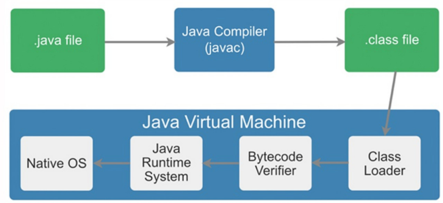

对于开发人员，了解字节码可以更准确、直观地理解Java语言中更深层次的东西，比如通过字节码，可以很直观地看到Volatile关键字如何在字节码上生效。
另外，字节码增强技术在Spring AOP、各种ORM框架、热部署中的应用屡见不鲜，深入理解其原理对于我们来说大有裨益。
除此之外，由于JVM规范的存在，只要最终可以生成符合规范的字节码就可以在JVM上运行，因此这就给了各种运行在JVM上的语言（如Scala、Groovy、Kotlin）一种契机，
可以扩展Java所没有的特性或者实现各种语法糖。理解字节码后再学习这些语言，可以"逆流而上"，从字节码视角看它的设计思路，学习起来也"易如反掌"。

本文重点着眼于字节码增强技术，从字节码开始逐层向上，由JVM字节码操作集合到Java中操作字节码的框架，再到我们熟悉的各类框架原理及应用，也都会一一进行介绍。

### 1.2.字节码结构

java文件通过javac编译后将得到一个.class文件，比如编写一个简单的ByteCodeDemo类，如下图2的左侧部分：

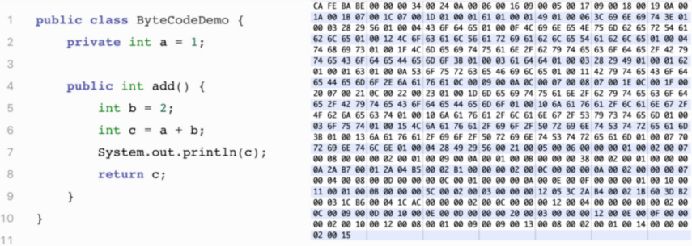

编译后生成ByteCodeDemo.class文件，打开后是一堆十六进制数，按字节为单位进行分割后展示如图2右侧部分所示。上文提及过，JVM对于字节码是有规范要求的，那么看似杂乱的十六进制符合什么结构呢？
JVM规范要求每一个字节码文件都要由十部分按照固定的顺序组成，整体结构如图3所示。接下来我们将一一介绍这十个部分：

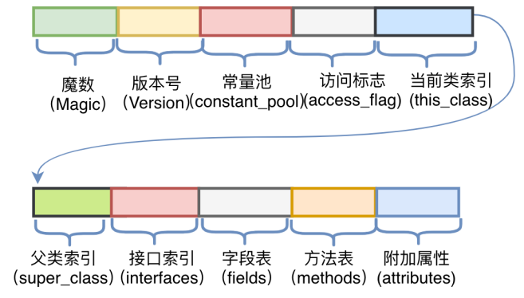

（1） 魔数（Magic Number）

所有的.class文件的前四个字节都是魔数，魔数的固定值为：0xCAFEBABE。魔数放在文件开头，JVM可以根据文件的开头来判断这个文件是否可能是一个.class文件，如果是，才会继续进行之后的操作。

有趣的是，魔数的固定值是Java之父James Gosling制定的，为CafeBabe（咖啡宝贝），而Java的图标为一杯咖啡。

（2） 版本号

版本号为魔数之后的4个字节，前两个字节表示次版本号（Minor Version），后两个字节表示主版本号（Major Version）。上图2中版本号为"00 00 00 34"，
次版本号转化为十进制为0，主版本号转化为十进制为52，在Oracle官网中查询序号52对应的主版本号为1.8，所以编译该文件的Java版本号为1.8.0。

（3） 常量池（Constant Pool）

紧接着主版本号之后的字节为常量池入口。常量池中存储两类常量：字面量与符号引用。字面量为代码中声明为Final的常量值，
符号引用如类和接口的全局限定名、字段的名称和描述符、方法的名称和描述符。常量池整体上分为两部分：常量池计数器以及常量池数据区，如下图4所示。

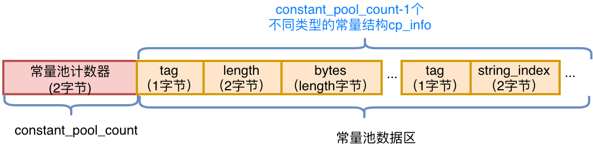

- 常量池计数器（constant_pool_count）：由于常量的数量不固定，所以需要先放置两个字节来表示常量池容量计数值。
  图2中示例代码的字节码前10个字节如下图5所示，将十六进制的24转化为十进制值为36，排除掉下标"0"，也就是说，这个类文件中共有35个常量。

  
- 常量池数据区：数据区是由（constant_pool_count-1）个cp_info结构组成，一个cp_info结构对应一个常量。在字节码中共有14种类型的cp_info（如下图6所示），每种类型的结构都是固定的

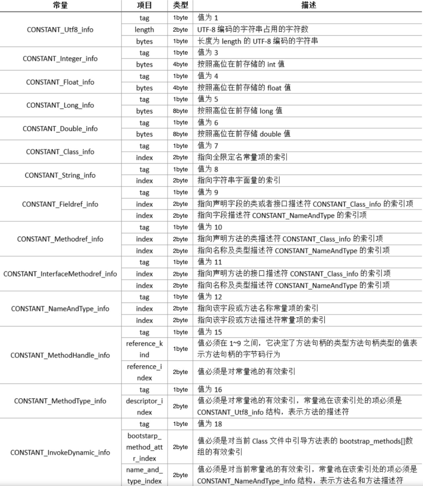

具体以CONSTANT_utf8_info为例，它的结构如下图7左侧所示。首先一个字节"tag"，它的值取自上图6中对应项的Tag，由于它的类型是utf8_info，所以值为"01"。
接下来两个字节标识该字符串的长度Length，然后Length个字节为这个字符串具体的值。从图2中的字节码摘取一个cp_info结构，如下图7右侧所示。将它翻译过来后，其含义为：该常量类型为utf8字符串，长度为一字节，数据为"a"。

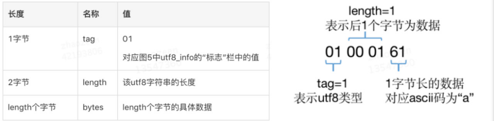

其他类型的cp_info结构在本文不再赘述，整体结构大同小异，都是先通过Tag来标识类型，然后后续n个字节来描述长度和（或）数据。
先知其所以然，以后可以通过javap -verbose ByteCodeDemo命令，查看JVM反编译后的完整常量池，如下图8所示。可以看到反编译结果将每一个cp_info结构的类型和值都很明确地呈现了出来。

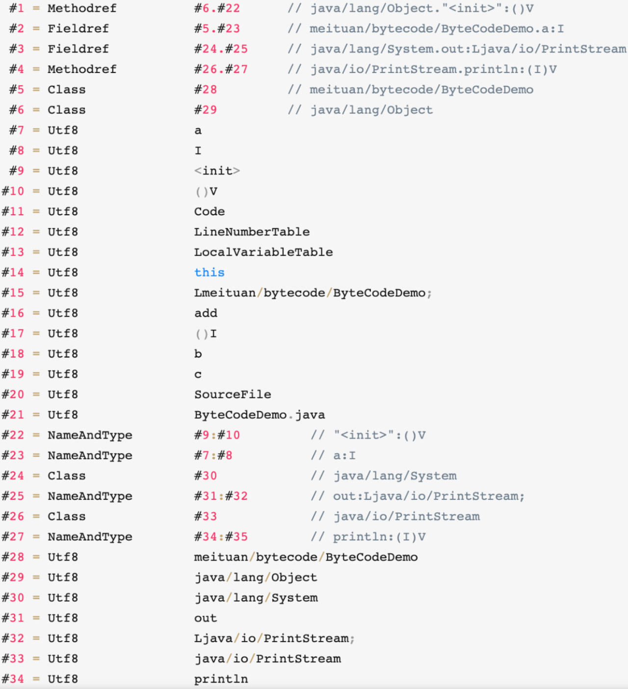

（4） 访问标志

常量池结束之后的两个字节，描述该Class是类还是接口，以及是否被Public、Abstract、Final等修饰符修饰。JVM规范规定了如下图9的访问标志（Access_Flag）。
需要注意的是，JVM并没有穷举所有的访问标志，而是使用按位或操作来进行描述的，比如某个类的修饰符为Public Final，则对应的访问修饰符的值为ACC_PUBLIC | ACC_FINAL，即0x0001 | 0x0010=0x0011。

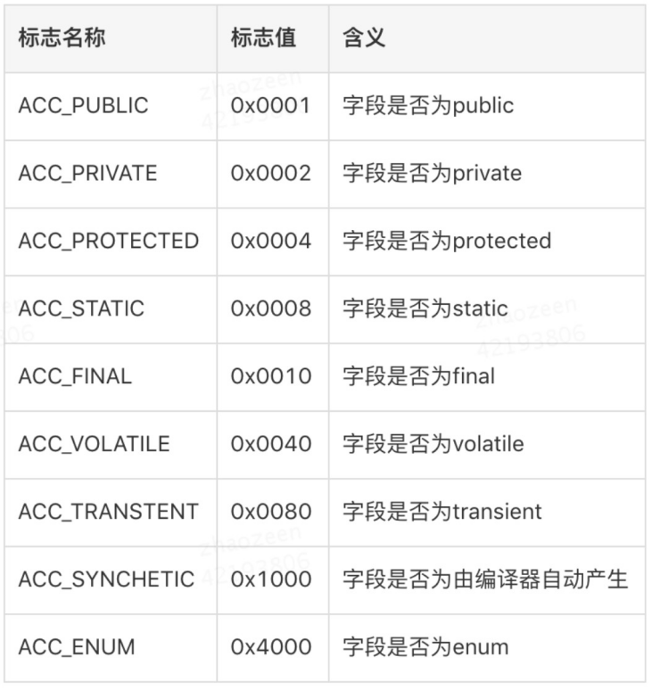

（5） 当前类名

访问标志后的两个字节，描述的是当前类的全限定名。这两个字节保存的值为常量池中的索引值，根据索引值就能在常量池中找到这个类的全限定名。

（6） 父类名称

当前类名后的两个字节，描述父类的全限定名，同上，保存的也是常量池中的索引值。

（7） 接口信息

父类名称后为两字节的接口计数器，描述了该类或父类实现的接口数量。紧接着的n个字节是所有接口名称的字符串常量的索引值。

（8） 字段表

字段表用于描述类和接口中声明的变量，包含类级别的变量以及实例变量，但是不包含方法内部声明的局部变量。字段表也分为两部分，第一部分为两个字节，描述字段个数；第二部分是每个字段的详细信息fields_info。字段表结构如下图所示

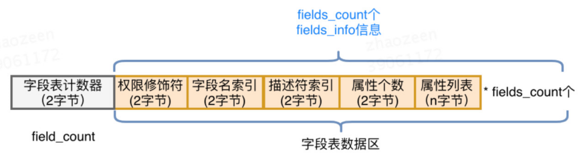

以图2中字节码的字段表为例，如下图11所示。其中字段的访问标志查图9，0002对应为Private。通过索引下标在图8中常量池分别得到字段名为"a"，描述符为"I"（代表int）。
综上，就可以唯一确定出一个类中声明的变量private int a。


（9）方法表

字段表结束后为方法表，方法表也是由两部分组成，第一部分为两个字节描述方法的个数；第二部分为每个方法的详细信息。方法的详细信息较为复杂，包括方法的访问标志、方法名、方法的描述符以及方法的属性，如下图所示：

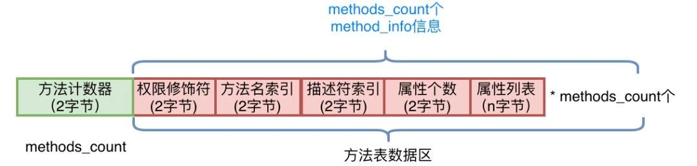

方法的权限修饰符依然可以通过图9的值查询得到，方法名和方法的描述符都是常量池中的索引值，可以通过索引值在常量池中找到。而"方法的属性"这一部分较为复杂，直接借助javap
-verbose将其反编译为人可以读懂的信息进行解读，如图13所示。可以看到属性中包括以下三个部分：

- "Code区"：源代码对应的JVM指令操作码，在进行字节码增强时重点操作的就是"Code区"这一部分。
- "LineNumberTable"：行号表，将Code区的操作码和源代码中的行号对应，Debug时会起到作用（源代码走一行，需要走多少个JVM指令操作码）。
- "LocalVariableTable"：本地变量表，包含This和局部变量，之所以可以在每一个方法内部都可以调用This，是因为JVM将This作为每一个方法的第一个参数隐式进行传入。当然，这是针对非Static方法而言。

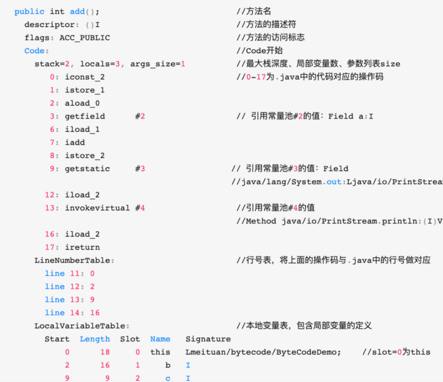

（10）附加属性表

字节码的最后一部分，该项存放了在该文件中类或接口所定义属性的基本信息。

### 1.3.字节码操作集合

在上图13中，Code区的红色编号0～17，就是.java中的方法源代码编译后让JVM真正执行的操作码。为了帮助人们理解，反编译后看到的是十六进制操作码所对应的助记符，
十六进制值操作码与助记符的对应关系，以及每一个操作码的用处可以查看Oracle官方文档进行了解，在需要用到时进行查阅即可。
比如上图中第一个助记符为iconst_2，对应到图2中的字节码为0x05，用处是将int值2压入操作数栈中。以此类推，对0~17的助记符理解后，就是完整的add()方法的实现。

### 1.4.操作数栈和字节

JVM的指令集是基于栈而不是寄存器，基于栈可以具备很好的跨平台性（因为寄存器指令集往往和硬件挂钩），但缺点在于，要完成同样的操作，
基于栈的实现需要更多指令才能完成（因为栈只是一个FILO结构，需要频繁压栈出栈）。另外，由于栈是在内存实现的，而寄存器是在CPU的高速缓存区，相较而言，基于栈的速度要慢很多，这也是为了跨平台性而做出的牺牲。

我们在上文所说的操作码或者操作集合，其实控制的就是这个JVM的操作数栈。为了更直观地感受操作码是如何控制操作数栈的，以及理解常量池、变量表的作用，
将add()方法的对操作数栈的操作制作为GIF，如下图14所示，图中仅截取了常量池中被引用的部分，以指令iconst_2开始到ireturn结束，与图13中Code区0~17的指令一一对应：

### 1.5.查看字节码工具

如果每次查看反编译后的字节码都使用javap命令的话，好非常繁琐。这里推荐一个Idea插件：jclasslib。
使用效果如图15所示，代码编译后在菜单栏"View"中选择"Show Bytecode With jclasslib"，可以很直观地看到当前字节码文件的类信息、常量池、方法区等信息。

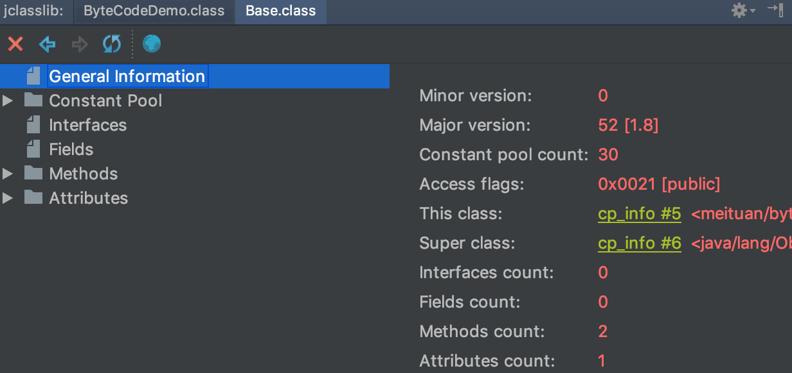

### 1.6.字节码框架

在上文中，着重介绍了字节码的结构，这为我们了解字节码增强技术的实现打下了基础。字节码增强技术就是一类对现有字节码进行修改或者动态生成全新字节码文件的技术。接下来，我们将从最直接操纵字节码的实现方式开始深入进行剖析。

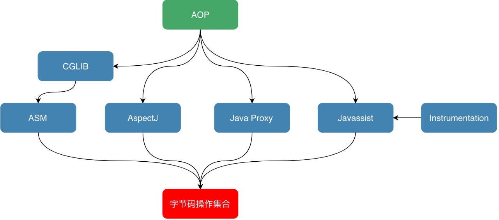

## 2.ASM

对于需要手动操纵字节码的需求，可以使用ASM，它可以直接生成.class字节码文件，也可以在类被加载入JVM之前动态修改类行为（如下图17所示）。
ASM的应用场景有AOP（Cglib就是基于ASM）、热部署、修改其他jar包中的类等。当然，涉及到如此底层的步骤，实现起来也比较麻烦。
接下来，本文将介绍ASM的两种API，并用ASM来实现一个比较粗糙的AOP。但在此之前，为了让大家更快地理解ASM的处理流程，强烈建议读者先对访问者模式进行了解。
简单来说，访问者模式主要用于修改或操作一些数据结构比较稳定的数据，而通过第一章，我们知道字节码文件的结构是由JVM固定的，所以很适合利用访问者模式对字节码文件进行修改。


### 2.1.ASM API

- [https://www.oschina.net/p/asm?hmsr=aladdin1e1](https://www.oschina.net/p/asm?hmsr=aladdin1e1)
- [https://zhuanlan.zhihu.com/p/94498015?utm_source=wechat_timeline](https://zhuanlan.zhihu.com/p/94498015?utm_source=wechat_timeline)

#### 2.1.1.核心API

ASM Core API可以类比解析XML文件中的SAX方式，不需要把这个类的整个结构读取进来，就可以用流式的方法来处理字节码文件。好处是非常节约内存，但是编程难度较大。
然而出于性能考虑，一般情况下编程都使用Core API。在Core API中有以下几个关键类：

- ClassReader：用于读取已经编译好的.class文件。
- ClassWriter：用于重新构建编译后的类，如修改类名、属性以及方法，也可以生成新的类的字节码文件。
- 各种Visitor类：如上所述，CoreAPI根据字节码从上到下依次处理，对于字节码文件中不同的区域有不同的Visitor，
  比如用于访问方法的MethodVisitor、用于访问类变量的FieldVisitor、用于访问注解的AnnotationVisitor等。为了实现AOP，重点要使用的是MethodVisitor。

#### 2.1.2.树形API

ASM Tree API可以类比解析XML文件中的DOM方式，把整个类的结构读取到内存中，缺点是消耗内存多，但是编程比较简单。
TreeApi不同于CoreAPI，TreeAPI通过各种Node类来映射字节码的各个区域，类比DOM节点，就可以很好地理解这种编程方式。

### 2.2.直接利用ASM实现AOP

利用ASM的CoreAPI来增强类。这里不纠结于AOP的专业名词如切片、通知，只实现在方法调用前、后增加逻辑，通俗易懂且方便理解。首先定义需要被增强的Base类：其中只包含一个process()方法，方法内输出一行"process"。增强后，我们期望的是，方法执行前输出"start"，之后输出"end"。

```java
public class Base {
    public void process(){
        System.out.println("process");
    }
}
```

为了利用ASM实现AOP，需要定义两个类：一个是MyClassVisitor类，用于对字节码的Visit以及修改；另一个是Generator类，在这个类中定义ClassReader和ClassWriter，
其中的逻辑是，classReader读取字节码，然后交给MyClassVisitor类处理，处理完成后由ClassWriter写字节码并将旧的字节码替换掉。Generator类较简单，我们先看一下它的实现，如下所示，然后重点解释MyClassVisitor类。

```java
import org.objectweb.asm.ClassReader;
import org.objectweb.asm.ClassVisitor;
import org.objectweb.asm.ClassWriter;

public class Generator {
    public static void main(String[] args) throws Exception {
                //读取
        ClassReader classReader = new ClassReader("meituan/bytecode/asm/Base");
        ClassWriter classWriter = new ClassWriter(ClassWriter.COMPUTE_MAXS);
        //处理
        ClassVisitor classVisitor = new MyClassVisitor(classWriter);
        classReader.accept(classVisitor, ClassReader.SKIP_DEBUG);
        byte[] data = classWriter.toByteArray();
        //输出
        File f = new File("operation-server/target/classes/meituan/bytecode/asm/Base.class");
        FileOutputStream fout = new FileOutputStream(f);
        fout.write(data);
        fout.close();
        System.out.println("now generator cc success!!!!!");
    }
}
```

MyClassVisitor继承自ClassVisitor，用于对字节码的观察。它还包含一个内部类MyMethodVisitor，继承自MethodVisitor用于对类内方法的观察，整体代码如下：

```java
import org.objectweb.asm.ClassVisitor;
import org.objectweb.asm.MethodVisitor;
import org.objectweb.asm.Opcodes;

public class MyClassVisitor extends ClassVisitor implements Opcodes {
    public MyClassVisitor(ClassVisitor cv) {
        super(ASM5, cv);
    }
    @Override
    public void visit(int version, int access, String name, String signature,
                      String superName, String[] interfaces) {
        cv.visit(version, access, name, signature, superName, interfaces);
    }
    @Override
    public MethodVisitor visitMethod(int access, String name, String desc, String signature, String[] exceptions) {
        MethodVisitor mv = cv.visitMethod(access, name, desc, signature,
                exceptions);
        //Base类中有两个方法：无参构造以及process方法，这里不增强构造方法
        if (!name.equals("<init>") && mv != null) {
            mv = new MyMethodVisitor(mv);
        }
        return mv;
    }
    class MyMethodVisitor extends MethodVisitor implements Opcodes {
        public MyMethodVisitor(MethodVisitor mv) {
            super(Opcodes.ASM5, mv);
        }

        @Override
        public void visitCode() {
            super.visitCode();
            mv.visitFieldInsn(GETSTATIC, "java/lang/System", "out", "Ljava/io/PrintStream;");
            mv.visitLdcInsn("start");
            mv.visitMethodInsn(INVOKEVIRTUAL, "java/io/PrintStream", "println", "(Ljava/lang/String;)V", false);
        }
        @Override
        public void visitInsn(int opcode) {
            if ((opcode >= Opcodes.IRETURN && opcode <= Opcodes.RETURN)
                    || opcode == Opcodes.ATHROW) {
                //方法在返回之前，打印"end"
                mv.visitFieldInsn(GETSTATIC, "java/lang/System", "out", "Ljava/io/PrintStream;");
                mv.visitLdcInsn("end");
                mv.visitMethodInsn(INVOKEVIRTUAL, "java/io/PrintStream", "println", "(Ljava/lang/String;)V", false);
            }
            mv.visitInsn(opcode);
        }
    }
}
```

利用这个类就可以实现对字节码的修改。详细解读其中的代码，对字节码做修改的步骤是：

- 首先通过MyClassVisitor类中的visitMethod方法，判断当前字节码读到哪一个方法了。跳过构造方法"<init>"后，将需要被增强的方法交给内部类MyMethodVisitor来进行处理。
- 接下来，进入内部类MyMethodVisitor中的visitCode方法，它会在ASM开始访问某一个方法的Code区时被调用，重写visitCode方法，将AOP中的前置逻辑就放在这里。
- MyMethodVisitor继续读取字节码指令，每当ASM访问到无参数指令时，都会调用MyMethodVisitor中的visitInsn方法。
  我们判断了当前指令是否为无参数的"return"指令，如果是就在它的前面添加一些指令，也就是将AOP的后置逻辑放在该方法中。
- 综上，重写MyMethodVisitor中的两个方法，就可以实现AOP了，而重写方法时就需要用ASM的写法，手动写入或者修改字节码。
  通过调用methodVisitor的visitXXXXInsn()方法就可以实现字节码的插入，XXXX对应相应的操作码助记符类型，比如mv.visitLdcInsn("end")对应的操作码就是ldc "end"，即将字符串"end"压入栈。

完成这两个Visitor类后，运行Generator中的main方法完成对Base类的字节码增强，增强后的结果可以在编译后的Target文件夹中找到Base.class文件进行查看，
可以看到反编译后的代码已经改变了（如图18左侧所示）。然后写一个测试类MyTest，在其中new Base()，并调用base.process()方法，可以看到下图右侧所示的AOP实现效果


### 2.3.ASM工具

利用ASM手写字节码时，需要利用一系列visitXXXXInsn()方法来写对应的助记符，所以需要先将每一行源代码转化为一个个的助记符，然后通过ASM的语法转换为visitXXXXInsn()这种写法。
第一步将源码转化为助记符就已经够麻烦了，不熟悉字节码操作集合的话，需要我们将代码编译后再反编译，才能得到源代码对应的助记符。
第二步利用ASM写字节码时，如何传参也很令人头疼。ASM社区也知道这两个问题，所以提供了工具ASM ByteCode Outline。

安装后，右键选择"Show Bytecode Outline"，在新标签页中选择"ASMified"这个tab，如图19所示，就可以看到这个类中的代码对应的ASM写法了。
图中上下两个红框分别对应AOP中的前置逻辑于后置逻辑，将这两块直接复制到Visitor中的visitMethod()以及visitInsn()方法中，就可以了。


## 3.Javassist

ASM是在指令层次上操作字节码的，阅读上文后，我们的直观感受是在指令层次上操作字节码的框架实现起来比较晦涩。故除此之外，我们再简单介绍另外一类框架：强调源代码层次操作字节码的框架Javassist。

利用Javassist实现字节码增强时，可以无须关注字节码刻板的结构，其优点就在于编程简单。直接使用Java编码的形式，而不需要了解虚拟机指令，就能动态改变类的结构或者动态生成类。
其中最重要的是ClassPool、CtClass、CtMethod、CtField这四个类：

- CtClass（compile-time  class）：编译时类信息，它是一个Class文件在代码中的抽象表现形式，可以通过一个类的全限定名来获取一个CtClass对象，用来表示这个类文件。
- ClassPool：从开发视角来看，ClassPool是一张保存CtClass信息的HashTable，Key为类名，Value为类名对应的CtClass对象。当我们需要对某个类进行修改时，
  就是通过pool.getCtClass("className")方法从pool中获取到相应的CtClass。
- CtMethod、CtField：这两个比较好理解，对应的是类中的方法和属性。

了解这四个类后，我们可以写一个小Demo来展示Javassist简单、快速的特点。我们依然是对Base中的process()方法做增强，在方法调用前后分别输出"start"和"end"，实现代码如下。我们需要做的就是从Pool中获取到相应的CtClass对象和其中的方法，然后执行method.insertBefore和insertAfter方法，参数为要插入的Java代码，再以字符串的形式传入即可，实现起来也极为简单。

```java
import com.meituan.mtrace.agent.javassist.*;

public class JavassistTest {
    public static void main(String[] args) throws NotFoundException, CannotCompileException, IllegalAccessException, InstantiationException, IOException {
        ClassPool cp = ClassPool.getDefault();
        CtClass cc = cp.get("meituan.bytecode.javassist.Base");
        CtMethod m = cc.getDeclaredMethod("process");
        m.insertBefore("{ System.out.println(\"start\"); }");
        m.insertAfter("{ System.out.println(\"end\"); }");
        Class c = cc.toClass();
        cc.writeFile("/Users/zen/projects");
        Base h = (Base)c.newInstance();
        h.process();
    }
}
```

## 4.Cglib

教程：[https://blog.csdn.net/qq_33661044/article/details/79767596](https://blog.csdn.net/qq_33661044/article/details/79767596)

原理：
> https://www.cnblogs.com/cruze/p/3843996.html
> https://www.cnblogs.com/cruze/p/3847968.html
> https://www.cnblogs.com/cruze/p/3862891.html
> https://www.cnblogs.com/cruze/p/3865180.html

### 4.1.介紹

CGLIB(Code Generation Library)是一个开源项目！

是一个强大的，高性能，高质量的Code生成类库，它可以在运行期扩展Java类与实现Java接口。Hibernate支持它来实现PO(Persistent Object 持久化对象)字节码的动态生成。

代理为控制要访问的目标对象提供了一种途径。当访问对象时，它引入了一个间接的层。JDK自从1.3版本开始，就引入了动态代理，并且经常被用来动态地创建代理。
JDK的动态代理用起来非常简单，但它有一个限制，就是使用动态代理的对象必须实现一个或多个接口。如果想代理没有实现接口的继承的类，该怎么办？现在我们可以使用CGLIB包

CGLIB是一个强大的高性能的代码生成包。它广泛的被许多AOP的框架使用，例如Spring AOP和dynaop，为他们提供方法的interception（拦截）。
最流行的OR Mapping工具hibernate也使用CGLIB来代理单端single-ended(多对一和一对一)关联（对集合的延迟抓取，是采用其他机制实现的）。
EasyMock和jMock是通过使用模仿（mock）对象来测试java代码的包。它们都通过使用CGLIB来为那些没有接口的类创建模仿（mock）对象。

CGLIB包的底层是通过使用一个小而快的字节码处理框架ASM，来转换字节码并生成新的类。除了CGLIB包，脚本语言例如Groovy和BeanShell，
也是使用ASM来生成java的字节码。当然不鼓励直接使用ASM，因为它要求你必须对JVM内部结构包括class文件的格式和指令集都很熟悉。

### 4.2.cglib代码包结构编辑

- core (核心代码)
  - EmitUtils
  - ReflectUtils
  - KeyFactory
  - ClassEmitter/CodeEmitter
  - NamingPolicy/DefaultNamingPolicy
  - GeneratorStrategy/DefaultGeneratorStrategy
  - DebuggingClassWriter
  - ClassGenerator/AbstractClassGenerator
- beans (bean操作类)
  - BeanCopier
  - BulkBean
  - BeanMap
  - ImmutableBean
  - BeanGenerator
- reflect
  - FastClass
- proxy
   - MethodInterceptor 
   - Dispatcher
   - LazyLoader 
   - ProxyRefDispatcher
   - NoOp
   - FixedValue 
   - InvocationHandler(提供和jdk proxy的功能)
   - Enhancer
   - CallbackGenerator
   - Callback
   - CallbackFilter
- util
  - StringSwitcher
  - ParallelSorter

### 4.3.实现原理

Cglib是一个强大的、高性能的代码生成包，它广泛被许多AOP框架使用，为他们提供方法的拦截。下图是我网上找到的一张Cglib与一些框架和语言的关系：


对此图总结一下：

- 最底层的是字节码Bytecode，字节码是Java为了保证"一次编译、到处运行"而产生的一种虚拟指令格式，例如iload_0、iconst_1、if_icmpne、dup等
- 位于字节码之上的是ASM，这是一种直接操作字节码的框架，应用ASM需要对Java字节码、Class结构比较熟悉
- 位于ASM之上的是CGLIB、Groovy、BeanShell，后两种并不是Java体系中的内容而是脚本语言，它们通过ASM框架生成字节码变相执行Java代码，
  这说明在JVM中执行程序并不一定非要写Java代码----只要你能生成Java字节码，JVM并不关心字节码的来源，当然通过Java代码生成的JVM字节码是通过编译器直接生成的，算是最"正统"的JVM字节码
- 位于CGLIB、Groovy、BeanShell之上的就是Hibernate、Spring  AOP这些框架了，这一层大家都比较熟悉
- 最上层的是Applications，即具体应用，一般都是一个Web项目或者本地跑一个程序

### 4.4.简单例子

下面演示一下Cglib代码示例----对类做代理。首先定义一个Dao类，里面有一个select()方法和一个update()方法：
```java
public class Dao {
    
    public void update() {
        System.out.println("PeopleDao.update()");
    }
    
    public void select() {
        System.out.println("PeopleDao.select()");
    }
}
```

创建一个Dao代理，实现MethodInterceptor接口，目标是在update()方法与select()方法调用前后输出两句话：

```java
public class DaoProxy implements MethodInterceptor {
    @Override
    public Object intercept(Object object, Method method, Object[] objects, MethodProxy proxy) throws Throwable {
        System.out.println("Before Method Invoke");
        proxy.invokeSuper(object, objects);
        System.out.println("After Method Invoke");
        return object;
    }
}
```
intercept方法的参数名并不是原生的参数名，我做了自己的调整，几个参数的含义为：
- Object表示要进行增强的对象
- Method表示拦截的方法
- Object[]数组表示参数列表，基本数据类型需要传入其包装类型，如int-->Integer、long-Long、double-->Double
- MethodProxy表示对方法的代理，invokeSuper方法表示对被代理对象方法的调用

写一个测试类：
```java
public class CglibTest {
    @Test
    public void testCglib() {
        DaoProxy daoProxy = new DaoProxy();
        
        Enhancer enhancer = new Enhancer();
        enhancer.setSuperclass(Dao.class);
        enhancer.setCallback(daoProxy);
        
        Dao dao = (Dao)enhancer.create();
        dao.update();
        dao.select();
    }
}
```

这是使用Cglib的通用写法，setSuperclass表示设置要代理的类，setCallback表示设置回调即MethodInterceptor的实现类，使用create()方法生成一个代理对象，注意要强转一下，因为返回的是Object。最后看一下运行结果：

```text
Before Method Invoke
PeopleDao.update()
After Method Invoke
Before Method Invoke
PeopleDao.select()
After Method Invoke
```

### 4.5.使用Cglib定义不同的拦截策略

在AOP中我们经常碰到的一种复杂场景是：我们想对类A的B方法使用一种拦截策略、类A的C方法使用另外一种拦截策略。我们先定义一个新的Proxy

```java
public class DaoAnotherProxy implements MethodInterceptor {

    @Override
    public Object intercept(Object object, Method method, Object[] objects, MethodProxy proxy) throws Throwable {
        
        System.out.println("StartTime=[" + System.currentTimeMillis() + "]");
        method.invoke(object, objects);
        System.out.println("EndTime=[" + System.currentTimeMillis() + "]");
        return object;
    }
    
}
```

方法调用前后输出一下开始时间与结束时间。为了实现我们的需求，实现一下CallbackFilter
```java
public class DaoFilter implements CallbackFilter {

    @Override
    public int accept(Method method) {
        if ("select".equals(method.getName())) {
            return 0;
        }
        return 1;
    }
    
}
```


返回的数值表示顺序，结合下面的代码解释，测试代码要修改一下
```java
public class CglibTest {

    @Test
    public void testCglib() {
        DaoProxy daoProxy = new DaoProxy();
        DaoAnotherProxy daoAnotherProxy = new DaoAnotherProxy();
        
        Enhancer enhancer = new Enhancer();
        enhancer.setSuperclass(Dao.class);
        enhancer.setCallbacks(new Callback[]{daoProxy, daoAnotherProxy, NoOp.INSTANCE});
        enhancer.setCallbackFilter(new DaoFilter());
        
        Dao dao = (Dao)enhancer.create();
        dao.update();
        dao.select();
    }
    
}
```

意思是CallbackFilter的accept方法返回的数值表示的是顺序，顺序和setCallbacks里面Proxy的顺序是一致的。再解释清楚一点，Callback数组中有三个callback，那么：

- 方法名为"select"的方法返回的顺序为0，即使用Callback数组中的0位callback，即DaoProxy
- 方法名不为"select"的方法返回的顺序为1，即使用Callback数组中的1位callback，即DaoAnotherProxy

因此，方法的执行结果为：
```text
StartTime=[1491198489261]
PeopleDao.update()
EndTime=[1491198489275]
Before Method Invoke
PeopleDao.select()
After Method Invoke
```

符合我们的预期，因为update()方法不是方法名为"select"的方法，因此返回1，返回1使用DaoAnotherProxy，即打印时间；select()方法是方法名为"select"的方法，因此返回0，返回0使用DaoProxy，即方法调用前后输出两句话。

这里要额外提一下，Callback数组中我特意定义了一个NoOp.INSTANCE，这表示一个空Callback，即如果不想对某个方法进行拦截，可以在DaoFilter中返回2，具体效果可以自己尝试一下。

### 4.6.构造函数不拦截方法

如果Update()方法与select()方法在构造函数中被调用，那么也是会对这两个方法进行相应的拦截的，现在我想要的是构造函数中调用的方法不会被拦截，那么应该如何做？先改一下Dao代码，加一个构造方法Dao()，调用一下update()方法：

```java
public class Dao {
    
    public Dao() {
        update();
    }
    
    public void update() {
        System.out.println("PeopleDao.update()");
    }
    
    public void select() {
        System.out.println("PeopleDao.select()");
    }
}
```

如果想要在构造函数中调用update()方法时，不拦截的话，Enhancer中有一个setInterceptDuringConstruction(boolean interceptDuringConstruction)方法设置为false即可，
默认为true，即构造函数中调用方法也是会拦截的。那么测试方法这么写：

```java
public class CglibTest {

    @Test
    public void testCglib() {
        DaoProxy daoProxy = new DaoProxy();
        DaoAnotherProxy daoAnotherProxy = new DaoAnotherProxy();
        
        Enhancer enhancer = new Enhancer();
        enhancer.setSuperclass(Dao.class);
        enhancer.setCallbacks(new Callback[]{daoProxy, daoAnotherProxy, NoOp.INSTANCE});
        enhancer.setCallbackFilter(new DaoFilter());
        enhancer.setInterceptDuringConstruction(false);
        
        Dao dao = (Dao)enhancer.create();
        dao.update();
        dao.select();
    }
    
}
```

运行结果为：

```text
PeopleDao.update()
StartTime=[1491202022297]
PeopleDao.update()
EndTime=[1491202022311]
Before Method Invoke
PeopleDao.select()
After Method Invoke
```

看到第一次update()方法的调用，即Dao类构造方法中的调用没有拦截，符合预期。

## 5.Java Agent

### 5.1.问题引出

上一章重点介绍了两种不同类型的字节码操作框架，且都利用它们实现了较为粗糙的AOP。其实，为了方便大家理解字节码增强技术，在上文中我们避重就轻将ASM实现AOP的过程分为了两个Main方法：
第一个是利用MyClassVisitor对已编译好的Class文件进行修改，第二个是New对象并调用。这期间并不涉及到JVM运行时对类的重加载，而是在第一个Main方法中，通过ASM对已编译类的字节码进行替换，
在第二个Main方法中，直接使用已替换好的新类信息。另外在Javassist的实现中，我们也只加载了一次Base类，也不涉及到运行时重加载类。

如果我们在一个JVM中，先加载了一个类，然后又对其进行字节码增强并重新加载会发生什么呢？模拟这种情况，只需要我们在上文中Javassist的Demo中main()方法的第一行添加Base b=new Base()，
即在增强前就先让JVM加载Base类，然后在执行到c.toClass()方法时会抛出错误，如下图20所示。跟进c.toClass()方法中，我们会发现它是在最后调用了ClassLoader的Native方法defineClass()时报错。
也就是说，JVM是不允许在运行时动态重载一个类的。


显然，如果只能在类加载前对类进行强化，那字节码增强技术的使用场景就变得很窄了。
我们期望的效果是：在一个持续运行并已经加载了所有类的JVM中，还能利用字节码增强技术对其中的类行为做替换并重新加载。
为了模拟这种情况，我们将Base类做改写，在其中编写main方法，每五秒调用一次process()方法，在process()方法中输出一行"process"。

我们的目的就是，在JVM运行中的时候，将process()方法做替换，在其前后分别打印"start"和"end"。
也就是在运行中时，每五秒打印的内容由"process"变为打印"start process end"。那如何解决JVM不允许运行时重加载类信息的问题呢？为了达到这个目的，我们接下来一一介绍需要借助的Java类库。

```java
import java.lang.management.ManagementFactory;

public class Base {
    public static void main(String[] args) {
        String name = ManagementFactory.getRuntimeMXBean().getName();
        String s = name.split("@")[0];
        //打印当前Pid
        System.out.println("pid:"+s);
        while (true) {
            try {
                Thread.sleep(5000L);
            } catch (Exception e) {
                break;
            }
            process();
        }
    }

    public static void process() {
        System.out.println("process");
    }
}
```

### 5.2.Instrument

Instrument是JVM提供的一个可以修改已加载类的类库，专门为Java语言编写的插桩服务提供支持。
它需要依赖JVMTI的Attach API机制实现，JVMTI这一部分，我们将在下一小节进行介绍。
在JDK 1.6以前，Instrument只能在JVM刚启动开始加载类时生效，而在JDK 1.6之后，Instrument支持了在运行时对类定义的修改。
要使用Instrument的类修改功能，我们需要实现它提供的ClassFileTransformer接口，定义一个类文件转换器。
接口中的transform()方法会在类文件被加载时调用，而在Transform方法里，我们可以利用上文中的ASM或Javassist对传入的字节码进行改写或替换，生成新的字节码数组后返回。

我们定义一个实现了ClassFileTransformer接口的类TestTransformer，依然在其中利用Javassist对Base类中的process()方法进行增强，在前后分别打印"start"和"end"，代码如下：

```java
import java.lang.instrument.ClassFileTransformer;

public class TestTransformer implements ClassFileTransformer {
    @Override
    public byte[] transform(ClassLoader loader, String className, Class<?> classBeingRedefined, ProtectionDomain protectionDomain, byte[] classfileBuffer) {
        System.out.println("Transforming " + className);
        try {
            ClassPool cp = ClassPool.getDefault();
            CtClass cc = cp.get("meituan.bytecode.jvmti.Base");
            CtMethod m = cc.getDeclaredMethod("process");
            m.insertBefore("{ System.out.println(\"start\"); }");
            m.insertAfter("{ System.out.println(\"end\"); }");
            return cc.toBytecode();
        } catch (Exception e) {
            e.printStackTrace();
        }
        return null;
    }
}
```
现在有了Transformer，那么它要如何注入到正在运行的JVM呢？还需要定义一个Agent，借助Agent的能力将Instrument注入到JVM中。
我们将在下一小节介绍Agent，现在要介绍的是Agent中用到的另一个类Instrumentation。
在JDK 1.6之后，Instrumentation可以做启动后的Instrument、本地代码（Native Code）的Instrument，以及动态改变Classpath等等。
我们可以向Instrumentation中添加上文中定义的Transformer，并指定要被重加载的类，代码如下所示。这样，当Agent被Attach到一个JVM中时，就会执行类字节码替换并重载入JVM的操作。

```java
import java.lang.instrument.Instrumentation;

public class TestAgent {
    public static void agentmain(String args, Instrumentation inst) {
        //指定我们自己定义的Transformer，在其中利用Javassist做字节码替换
        inst.addTransformer(new TestTransformer(), true);
        try {
            //重定义类并载入新的字节码
            inst.retransformClasses(Base.class);
            System.out.println("Agent Load Done.");
        } catch (Exception e) {
            System.out.println("agent load failed!");
        }
    }
}
```
### 5.3.JVMTI & Agent & Attach API

上一小节中，我们给出了Agent类的代码，追根溯源需要先介绍JPDA（Java Platform Debugger Architecture）。
如果JVM启动时开启了JPDA，那么类是允许被重新加载的。在这种情况下，已被加载的旧版本类信息可以被卸载，然后重新加载新版本的类。
正如JDPA名称中的Debugger，JDPA其实是一套用于调试Java程序的标准，任何JDK都必须实现该标准。

JPDA定义了一整套完整的体系，它将调试体系分为三部分，并规定了三者之间的通信接口。三部分由低到高分别是Java 虚拟机工具接口（JVMTI），
Java 调试协议（JDWP）以及 Java 调试接口（JDI），三者之间的关系如下图所示。

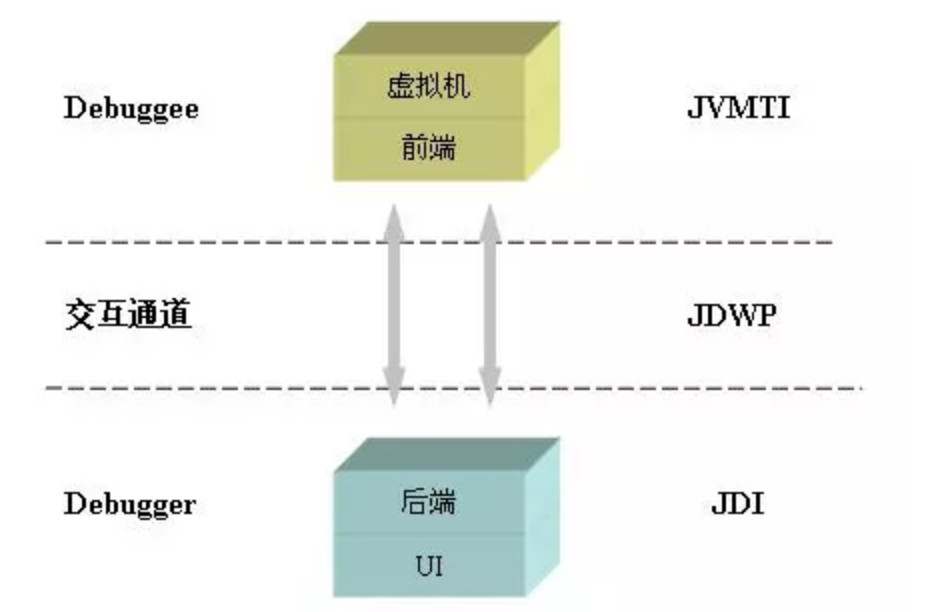

现在回到正题，我们可以借助JVMTI的一部分能力，帮助动态重载类信息。JVM TI（JVM TOOL INTERFACE，JVM工具接口）是JVM提供的一套对JVM进行操作的工具接口。
通过JVMTI可以实现对JVM的多种操作，然后通过接口注册各种事件勾子。在JVM事件触发时，同时触发预定义的勾子，以实现对各个JVM事件的响应，
事件包括类文件加载、异常产生与捕获、线程启动和结束、进入和退出临界区、成员变量修改、GC开始和结束、方法调用进入和退出、临界区竞争与等待、VM启动与退出等等。

而Agent就是JVMTI的一种实现，Agent有两种启动方式，
- 一是随Java进程启动而启动，经常见到的java -agentlib就是这种方式；
- 二是运行时载入，通过Attach API，将模块（jar包）动态地Attach到指定进程id的Java进程内。

Attach API 的作用是提供JVM进程间通信的能力，比如说我们为了让另外一个JVM进程把线上服务的线程Dump出来，会运行jstack或jmap的进程， 并传递pid的参数，告诉它要对哪个进程进行线程Dump，这就是Attach API做的事情。
在下面，我们将通过Attach API的loadAgent()方法，将打包好的Agent jar包动态Attach到目标JVM上。具体实现起来的步骤如下：

- 定义Agent，并在其中实现AgentMain方法，如上一小节中定义的代码块7中的TestAgent类；
- 然后将TestAgent类打成一个包含MANIFEST.MF的jar包，其中MANIFEST.MF文件中将Agent-Class属性指定为TestAgent的全限定名，如下图所示；

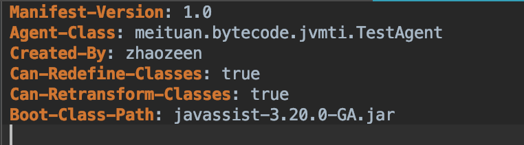

- 最后利用Attach API，将我们打包好的jar包Attach到指定的JVM  pid上，代码如

```java
import com.sun.tools.attach.VirtualMachine;

public class Attacher {
    public static void main(String[] args) throws AttachNotSupportedException, IOException, AgentLoadException, AgentInitializationException {
        // 传入目标 JVM pid
        VirtualMachine vm = VirtualMachine.attach("39333"); 
        vm.loadAgent("/Users/zen/operation_server_jar/operation-server.jar");
    }
}
```

- 由于在MANIFEST.MF中指定了Agent-Class，所以在Attach后，目标JVM在运行时会走到TestAgent类中定义的agentmain()方法，
  而在这个方法中，我们利用Instrumentation，将指定类的字节码通过定义的类转化器TestTransformer做了Base类的字节码替换（通过javassist），并完成了类的重新加载。
  由此，我们达成了"在JVM运行时，改变类的字节码并重新载入类信息"的目的

以下为运行时重新载入类的效果：先运行Base中的main()方法，启动一个JVM，可以在控制台看到每隔五秒输出一次"process"。
接着执行Attacher中的main()方法，并将上一个JVM的pid传入。此时回到上一个main()方法的控制台，
可以看到现在每隔五秒输出"process"前后会分别输出"start"和"end"，也就是说完成了运行时的字节码增强，并重新载入了这个类。

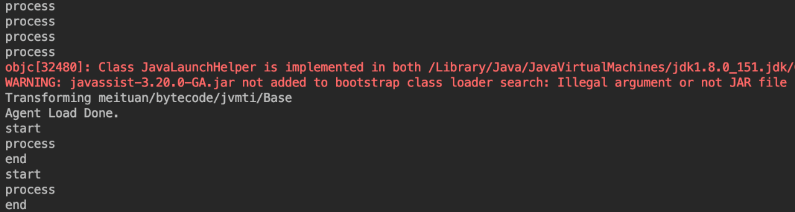

### 5.4.使用场景

至此，字节码增强技术的可使用范围就不再局限于JVM加载类前了。通过上述几个类库，我们可以在运行时对JVM中的类进行修改并重载了。通过这种手段，可以做的事情就变得很多了：

- 热部署：不部署服务而对线上服务做修改，可以做打点、增加日志等操作。
- Mock：测试时候对某些服务做Mock。
- 性能诊断工具：比如bTrace就是利用Instrument，实现无侵入地跟踪一个正在运行的JVM，监控到类和方法级别的状态信息。

## 6.总结

字节码增强技术相当于是一把打开运行时JVM的钥匙，利用它可以动态地对运行中的程序做修改，也可以跟踪JVM运行中程序的状态。
此外，我们平时使用的动态代理、AOP也与字节码增强密切相关，它们实质上还是利用各种手段生成符合规范的字节码文件。
综上所述，掌握字节码增强后可以高效地定位并快速修复一些棘手的问题（如线上性能问题、方法出现不可控的出入参需要紧急加日志等问题），也可以在开发中减少冗余代码，大大提高开发效率
