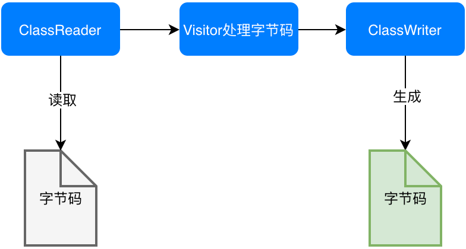
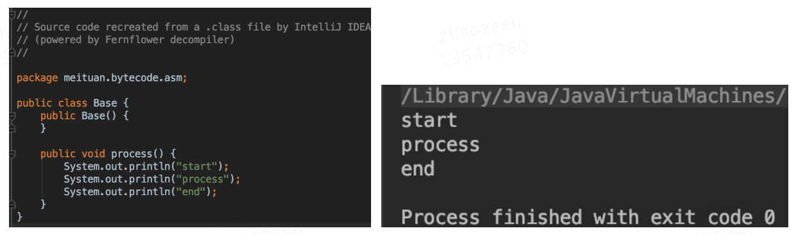
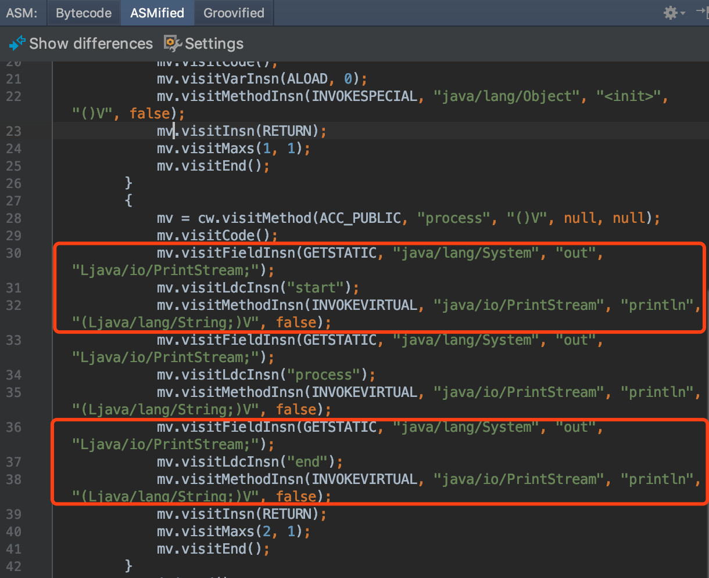
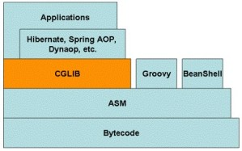
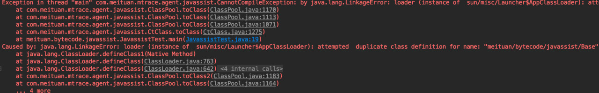

# Java加强

## 2.ASM

对于需要手动操纵字节码的需求，可以使用ASM，它可以直接生成.class字节码文件，也可以在类被加载入JVM之前动态修改类行为（如下图17所示）。
ASM的应用场景有AOP（Cglib就是基于ASM）、热部署、修改其他jar包中的类等。当然，涉及到如此底层的步骤，实现起来也比较麻烦。
接下来，本文将介绍ASM的两种API，并用ASM来实现一个比较粗糙的AOP。但在此之前，为了让大家更快地理解ASM的处理流程，强烈建议读者先对访问者模式进行了解。
简单来说，访问者模式主要用于修改或操作一些数据结构比较稳定的数据，而通过第一章，我们知道字节码文件的结构是由JVM固定的，所以很适合利用访问者模式对字节码文件进行修改。



### 2.1.ASM API

- [https://www.oschina.net/p/asm?hmsr=aladdin1e1](https://www.oschina.net/p/asm?hmsr=aladdin1e1)
- [https://zhuanlan.zhihu.com/p/94498015?utm_source=wechat_timeline](https://zhuanlan.zhihu.com/p/94498015?utm_source=wechat_timeline)

#### 2.1.1.核心API

ASM Core API可以类比解析XML文件中的SAX方式，不需要把这个类的整个结构读取进来，就可以用流式的方法来处理字节码文件。好处是非常节约内存，但是编程难度较大。
然而出于性能考虑，一般情况下编程都使用Core API。在Core API中有以下几个关键类：

- ClassReader：用于读取已经编译好的.class文件。
- ClassWriter：用于重新构建编译后的类，如修改类名、属性以及方法，也可以生成新的类的字节码文件。
- 各种Visitor类：如上所述，CoreAPI根据字节码从上到下依次处理，对于字节码文件中不同的区域有不同的Visitor，
  比如用于访问方法的MethodVisitor、用于访问类变量的FieldVisitor、用于访问注解的AnnotationVisitor等。为了实现AOP，重点要使用的是MethodVisitor。

#### 2.1.2.树形API

ASM Tree API可以类比解析XML文件中的DOM方式，把整个类的结构读取到内存中，缺点是消耗内存多，但是编程比较简单。
TreeApi不同于CoreAPI，TreeAPI通过各种Node类来映射字节码的各个区域，类比DOM节点，就可以很好地理解这种编程方式。

### 2.2.直接利用ASM实现AOP

利用ASM的CoreAPI来增强类。这里不纠结于AOP的专业名词如切片、通知，只实现在方法调用前、后增加逻辑，通俗易懂且方便理解。首先定义需要被增强的Base类：其中只包含一个process()方法，方法内输出一行"process"。增强后，我们期望的是，方法执行前输出"start"，之后输出"end"。

```java
public class Base {
    public void process(){
        System.out.println("process");
    }
}
```

为了利用ASM实现AOP，需要定义两个类：一个是MyClassVisitor类，用于对字节码的Visit以及修改；另一个是Generator类，在这个类中定义ClassReader和ClassWriter，
其中的逻辑是，classReader读取字节码，然后交给MyClassVisitor类处理，处理完成后由ClassWriter写字节码并将旧的字节码替换掉。Generator类较简单，我们先看一下它的实现，如下所示，然后重点解释MyClassVisitor类。

```java
import org.objectweb.asm.ClassReader;
import org.objectweb.asm.ClassVisitor;
import org.objectweb.asm.ClassWriter;

public class Generator {
    public static void main(String[] args) throws Exception {
                //读取
        ClassReader classReader = new ClassReader("meituan/bytecode/asm/Base");
        ClassWriter classWriter = new ClassWriter(ClassWriter.COMPUTE_MAXS);
        //处理
        ClassVisitor classVisitor = new MyClassVisitor(classWriter);
        classReader.accept(classVisitor, ClassReader.SKIP_DEBUG);
        byte[] data = classWriter.toByteArray();
        //输出
        File f = new File("operation-server/target/classes/meituan/bytecode/asm/Base.class");
        FileOutputStream fout = new FileOutputStream(f);
        fout.write(data);
        fout.close();
        System.out.println("now generator cc success!!!!!");
    }
}
```

MyClassVisitor继承自ClassVisitor，用于对字节码的观察。它还包含一个内部类MyMethodVisitor，继承自MethodVisitor用于对类内方法的观察，整体代码如下：

```java
import org.objectweb.asm.ClassVisitor;
import org.objectweb.asm.MethodVisitor;
import org.objectweb.asm.Opcodes;

public class MyClassVisitor extends ClassVisitor implements Opcodes {
    public MyClassVisitor(ClassVisitor cv) {
        super(ASM5, cv);
    }
    @Override
    public void visit(int version, int access, String name, String signature,
                      String superName, String[] interfaces) {
        cv.visit(version, access, name, signature, superName, interfaces);
    }
    @Override
    public MethodVisitor visitMethod(int access, String name, String desc, String signature, String[] exceptions) {
        MethodVisitor mv = cv.visitMethod(access, name, desc, signature,
                exceptions);
        //Base类中有两个方法：无参构造以及process方法，这里不增强构造方法
        if (!name.equals("<init>") && mv != null) {
            mv = new MyMethodVisitor(mv);
        }
        return mv;
    }
    class MyMethodVisitor extends MethodVisitor implements Opcodes {
        public MyMethodVisitor(MethodVisitor mv) {
            super(Opcodes.ASM5, mv);
        }

        @Override
        public void visitCode() {
            super.visitCode();
            mv.visitFieldInsn(GETSTATIC, "java/lang/System", "out", "Ljava/io/PrintStream;");
            mv.visitLdcInsn("start");
            mv.visitMethodInsn(INVOKEVIRTUAL, "java/io/PrintStream", "println", "(Ljava/lang/String;)V", false);
        }
        @Override
        public void visitInsn(int opcode) {
            if ((opcode >= Opcodes.IRETURN && opcode <= Opcodes.RETURN)
                    || opcode == Opcodes.ATHROW) {
                //方法在返回之前，打印"end"
                mv.visitFieldInsn(GETSTATIC, "java/lang/System", "out", "Ljava/io/PrintStream;");
                mv.visitLdcInsn("end");
                mv.visitMethodInsn(INVOKEVIRTUAL, "java/io/PrintStream", "println", "(Ljava/lang/String;)V", false);
            }
            mv.visitInsn(opcode);
        }
    }
}
```

利用这个类就可以实现对字节码的修改。详细解读其中的代码，对字节码做修改的步骤是：

- 首先通过MyClassVisitor类中的visitMethod方法，判断当前字节码读到哪一个方法了。跳过构造方法"<init>"后，将需要被增强的方法交给内部类MyMethodVisitor来进行处理。
- 接下来，进入内部类MyMethodVisitor中的visitCode方法，它会在ASM开始访问某一个方法的Code区时被调用，重写visitCode方法，将AOP中的前置逻辑就放在这里。
- MyMethodVisitor继续读取字节码指令，每当ASM访问到无参数指令时，都会调用MyMethodVisitor中的visitInsn方法。
  我们判断了当前指令是否为无参数的"return"指令，如果是就在它的前面添加一些指令，也就是将AOP的后置逻辑放在该方法中。
- 综上，重写MyMethodVisitor中的两个方法，就可以实现AOP了，而重写方法时就需要用ASM的写法，手动写入或者修改字节码。
  通过调用methodVisitor的visitXXXXInsn()方法就可以实现字节码的插入，XXXX对应相应的操作码助记符类型，比如mv.visitLdcInsn("end")对应的操作码就是ldc "end"，即将字符串"end"压入栈。

完成这两个Visitor类后，运行Generator中的main方法完成对Base类的字节码增强，增强后的结果可以在编译后的Target文件夹中找到Base.class文件进行查看，
可以看到反编译后的代码已经改变了（如图18左侧所示）。然后写一个测试类MyTest，在其中new Base()，并调用base.process()方法，可以看到下图右侧所示的AOP实现效果



### 2.3.ASM工具

利用ASM手写字节码时，需要利用一系列visitXXXXInsn()方法来写对应的助记符，所以需要先将每一行源代码转化为一个个的助记符，然后通过ASM的语法转换为visitXXXXInsn()这种写法。
第一步将源码转化为助记符就已经够麻烦了，不熟悉字节码操作集合的话，需要我们将代码编译后再反编译，才能得到源代码对应的助记符。
第二步利用ASM写字节码时，如何传参也很令人头疼。ASM社区也知道这两个问题，所以提供了工具ASM ByteCode Outline。

安装后，右键选择"Show Bytecode Outline"，在新标签页中选择"ASMified"这个tab，如图19所示，就可以看到这个类中的代码对应的ASM写法了。
图中上下两个红框分别对应AOP中的前置逻辑于后置逻辑，将这两块直接复制到Visitor中的visitMethod()以及visitInsn()方法中，就可以了。



## 3.Javassist

ASM是在指令层次上操作字节码的，阅读上文后，我们的直观感受是在指令层次上操作字节码的框架实现起来比较晦涩。故除此之外，我们再简单介绍另外一类框架：强调源代码层次操作字节码的框架Javassist。

利用Javassist实现字节码增强时，可以无须关注字节码刻板的结构，其优点就在于编程简单。直接使用Java编码的形式，而不需要了解虚拟机指令，就能动态改变类的结构或者动态生成类。
其中最重要的是ClassPool、CtClass、CtMethod、CtField这四个类：

- CtClass（compile-time  class）：编译时类信息，它是一个Class文件在代码中的抽象表现形式，可以通过一个类的全限定名来获取一个CtClass对象，用来表示这个类文件。
- ClassPool：从开发视角来看，ClassPool是一张保存CtClass信息的HashTable，Key为类名，Value为类名对应的CtClass对象。当我们需要对某个类进行修改时，
  就是通过pool.getCtClass("className")方法从pool中获取到相应的CtClass。
- CtMethod、CtField：这两个比较好理解，对应的是类中的方法和属性。

了解这四个类后，我们可以写一个小Demo来展示Javassist简单、快速的特点。我们依然是对Base中的process()方法做增强，在方法调用前后分别输出"start"和"end"，实现代码如下。我们需要做的就是从Pool中获取到相应的CtClass对象和其中的方法，然后执行method.insertBefore和insertAfter方法，参数为要插入的Java代码，再以字符串的形式传入即可，实现起来也极为简单。

```java
import com.meituan.mtrace.agent.javassist.*;

public class JavassistTest {
    public static void main(String[] args) throws NotFoundException, CannotCompileException, IllegalAccessException, InstantiationException, IOException {
        ClassPool cp = ClassPool.getDefault();
        CtClass cc = cp.get("meituan.bytecode.javassist.Base");
        CtMethod m = cc.getDeclaredMethod("process");
        m.insertBefore("{ System.out.println(\"start\"); }");
        m.insertAfter("{ System.out.println(\"end\"); }");
        Class c = cc.toClass();
        cc.writeFile("/Users/zen/projects");
        Base h = (Base)c.newInstance();
        h.process();
    }
}
```

## 4.Cglib

教程：[https://blog.csdn.net/qq_33661044/article/details/79767596](https://blog.csdn.net/qq_33661044/article/details/79767596)

原理：
> https://www.cnblogs.com/cruze/p/3843996.html
> https://www.cnblogs.com/cruze/p/3847968.html
> https://www.cnblogs.com/cruze/p/3862891.html
> https://www.cnblogs.com/cruze/p/3865180.html

### 4.1.介紹

CGLIB(Code Generation Library)是一个开源项目！

是一个强大的，高性能，高质量的Code生成类库，它可以在运行期扩展Java类与实现Java接口。Hibernate支持它来实现PO(Persistent Object 持久化对象)字节码的动态生成。

代理为控制要访问的目标对象提供了一种途径。当访问对象时，它引入了一个间接的层。JDK自从1.3版本开始，就引入了动态代理，并且经常被用来动态地创建代理。
JDK的动态代理用起来非常简单，但它有一个限制，就是使用动态代理的对象必须实现一个或多个接口。如果想代理没有实现接口的继承的类，该怎么办？现在我们可以使用CGLIB包

CGLIB是一个强大的高性能的代码生成包。它广泛的被许多AOP的框架使用，例如Spring AOP和dynaop，为他们提供方法的interception（拦截）。
最流行的OR Mapping工具hibernate也使用CGLIB来代理单端single-ended(多对一和一对一)关联（对集合的延迟抓取，是采用其他机制实现的）。
EasyMock和jMock是通过使用模仿（mock）对象来测试java代码的包。它们都通过使用CGLIB来为那些没有接口的类创建模仿（mock）对象。

CGLIB包的底层是通过使用一个小而快的字节码处理框架ASM，来转换字节码并生成新的类。除了CGLIB包，脚本语言例如Groovy和BeanShell，
也是使用ASM来生成java的字节码。当然不鼓励直接使用ASM，因为它要求你必须对JVM内部结构包括class文件的格式和指令集都很熟悉。

### 4.2.cglib代码包结构编辑

- core (核心代码)
  - EmitUtils
  - ReflectUtils
  - KeyFactory
  - ClassEmitter/CodeEmitter
  - NamingPolicy/DefaultNamingPolicy
  - GeneratorStrategy/DefaultGeneratorStrategy
  - DebuggingClassWriter
  - ClassGenerator/AbstractClassGenerator
- beans (bean操作类)
  - BeanCopier
  - BulkBean
  - BeanMap
  - ImmutableBean
  - BeanGenerator
- reflect
  - FastClass
- proxy
   - MethodInterceptor 
   - Dispatcher
   - LazyLoader 
   - ProxyRefDispatcher
   - NoOp
   - FixedValue 
   - InvocationHandler(提供和jdk proxy的功能)
   - Enhancer
   - CallbackGenerator
   - Callback
   - CallbackFilter
- util
  - StringSwitcher
  - ParallelSorter

### 4.3.实现原理

Cglib是一个强大的、高性能的代码生成包，它广泛被许多AOP框架使用，为他们提供方法的拦截。下图是我网上找到的一张Cglib与一些框架和语言的关系：



对此图总结一下：

- 最底层的是字节码Bytecode，字节码是Java为了保证"一次编译、到处运行"而产生的一种虚拟指令格式，例如iload_0、iconst_1、if_icmpne、dup等
- 位于字节码之上的是ASM，这是一种直接操作字节码的框架，应用ASM需要对Java字节码、Class结构比较熟悉
- 位于ASM之上的是CGLIB、Groovy、BeanShell，后两种并不是Java体系中的内容而是脚本语言，它们通过ASM框架生成字节码变相执行Java代码，
  这说明在JVM中执行程序并不一定非要写Java代码----只要你能生成Java字节码，JVM并不关心字节码的来源，当然通过Java代码生成的JVM字节码是通过编译器直接生成的，算是最"正统"的JVM字节码
- 位于CGLIB、Groovy、BeanShell之上的就是Hibernate、Spring  AOP这些框架了，这一层大家都比较熟悉
- 最上层的是Applications，即具体应用，一般都是一个Web项目或者本地跑一个程序

### 4.4.简单例子

下面演示一下Cglib代码示例----对类做代理。首先定义一个Dao类，里面有一个select()方法和一个update()方法：
```java
public class Dao {
    
    public void update() {
        System.out.println("PeopleDao.update()");
    }
    
    public void select() {
        System.out.println("PeopleDao.select()");
    }
}
```

创建一个Dao代理，实现MethodInterceptor接口，目标是在update()方法与select()方法调用前后输出两句话：

```java
public class DaoProxy implements MethodInterceptor {
    @Override
    public Object intercept(Object object, Method method, Object[] objects, MethodProxy proxy) throws Throwable {
        System.out.println("Before Method Invoke");
        proxy.invokeSuper(object, objects);
        System.out.println("After Method Invoke");
        return object;
    }
}
```
intercept方法的参数名并不是原生的参数名，我做了自己的调整，几个参数的含义为：
- Object表示要进行增强的对象
- Method表示拦截的方法
- Object[]数组表示参数列表，基本数据类型需要传入其包装类型，如int-->Integer、long-Long、double-->Double
- MethodProxy表示对方法的代理，invokeSuper方法表示对被代理对象方法的调用

写一个测试类：
```java
public class CglibTest {
    @Test
    public void testCglib() {
        DaoProxy daoProxy = new DaoProxy();
        
        Enhancer enhancer = new Enhancer();
        enhancer.setSuperclass(Dao.class);
        enhancer.setCallback(daoProxy);
        
        Dao dao = (Dao)enhancer.create();
        dao.update();
        dao.select();
    }
}
```

这是使用Cglib的通用写法，setSuperclass表示设置要代理的类，setCallback表示设置回调即MethodInterceptor的实现类，使用create()方法生成一个代理对象，注意要强转一下，因为返回的是Object。最后看一下运行结果：

```text
Before Method Invoke
PeopleDao.update()
After Method Invoke
Before Method Invoke
PeopleDao.select()
After Method Invoke
```

### 4.5.使用Cglib定义不同的拦截策略

在AOP中我们经常碰到的一种复杂场景是：我们想对类A的B方法使用一种拦截策略、类A的C方法使用另外一种拦截策略。我们先定义一个新的Proxy

```java
public class DaoAnotherProxy implements MethodInterceptor {

    @Override
    public Object intercept(Object object, Method method, Object[] objects, MethodProxy proxy) throws Throwable {
        
        System.out.println("StartTime=[" + System.currentTimeMillis() + "]");
        method.invoke(object, objects);
        System.out.println("EndTime=[" + System.currentTimeMillis() + "]");
        return object;
    }
    
}
```

方法调用前后输出一下开始时间与结束时间。为了实现我们的需求，实现一下CallbackFilter
```java
public class DaoFilter implements CallbackFilter {

    @Override
    public int accept(Method method) {
        if ("select".equals(method.getName())) {
            return 0;
        }
        return 1;
    }
    
}
```


返回的数值表示顺序，结合下面的代码解释，测试代码要修改一下
```java
public class CglibTest {

    @Test
    public void testCglib() {
        DaoProxy daoProxy = new DaoProxy();
        DaoAnotherProxy daoAnotherProxy = new DaoAnotherProxy();
        
        Enhancer enhancer = new Enhancer();
        enhancer.setSuperclass(Dao.class);
        enhancer.setCallbacks(new Callback[]{daoProxy, daoAnotherProxy, NoOp.INSTANCE});
        enhancer.setCallbackFilter(new DaoFilter());
        
        Dao dao = (Dao)enhancer.create();
        dao.update();
        dao.select();
    }
    
}
```

意思是CallbackFilter的accept方法返回的数值表示的是顺序，顺序和setCallbacks里面Proxy的顺序是一致的。再解释清楚一点，Callback数组中有三个callback，那么：

- 方法名为"select"的方法返回的顺序为0，即使用Callback数组中的0位callback，即DaoProxy
- 方法名不为"select"的方法返回的顺序为1，即使用Callback数组中的1位callback，即DaoAnotherProxy

因此，方法的执行结果为：
```text
StartTime=[1491198489261]
PeopleDao.update()
EndTime=[1491198489275]
Before Method Invoke
PeopleDao.select()
After Method Invoke
```

符合我们的预期，因为update()方法不是方法名为"select"的方法，因此返回1，返回1使用DaoAnotherProxy，即打印时间；select()方法是方法名为"select"的方法，因此返回0，返回0使用DaoProxy，即方法调用前后输出两句话。

这里要额外提一下，Callback数组中我特意定义了一个NoOp.INSTANCE，这表示一个空Callback，即如果不想对某个方法进行拦截，可以在DaoFilter中返回2，具体效果可以自己尝试一下。

### 4.6.构造函数不拦截方法

如果Update()方法与select()方法在构造函数中被调用，那么也是会对这两个方法进行相应的拦截的，现在我想要的是构造函数中调用的方法不会被拦截，那么应该如何做？先改一下Dao代码，加一个构造方法Dao()，调用一下update()方法：

```java
public class Dao {
    
    public Dao() {
        update();
    }
    
    public void update() {
        System.out.println("PeopleDao.update()");
    }
    
    public void select() {
        System.out.println("PeopleDao.select()");
    }
}
```

如果想要在构造函数中调用update()方法时，不拦截的话，Enhancer中有一个setInterceptDuringConstruction(boolean interceptDuringConstruction)方法设置为false即可，
默认为true，即构造函数中调用方法也是会拦截的。那么测试方法这么写：

```java
public class CglibTest {

    @Test
    public void testCglib() {
        DaoProxy daoProxy = new DaoProxy();
        DaoAnotherProxy daoAnotherProxy = new DaoAnotherProxy();
        
        Enhancer enhancer = new Enhancer();
        enhancer.setSuperclass(Dao.class);
        enhancer.setCallbacks(new Callback[]{daoProxy, daoAnotherProxy, NoOp.INSTANCE});
        enhancer.setCallbackFilter(new DaoFilter());
        enhancer.setInterceptDuringConstruction(false);
        
        Dao dao = (Dao)enhancer.create();
        dao.update();
        dao.select();
    }
    
}
```

运行结果为：

```text
PeopleDao.update()
StartTime=[1491202022297]
PeopleDao.update()
EndTime=[1491202022311]
Before Method Invoke
PeopleDao.select()
After Method Invoke
```

看到第一次update()方法的调用，即Dao类构造方法中的调用没有拦截，符合预期。

## 最佳实践

### 运行时字节码加强

其实，为了方便大家理解字节码增强技术，在上文中我们避重就轻将ASM实现AOP的过程分为了两个Main方法：
第一个是利用MyClassVisitor对已编译好的Class文件进行修改，第二个是New对象并调用。这期间并不涉及到JVM运行时对类的重加载，而是在第一个Main方法中，通过ASM对已编译类的字节码进行替换，
在第二个Main方法中，直接使用已替换好的新类信息。另外在Javassist的实现中，我们也只加载了一次Base类，也不涉及到运行时重加载类。

如果我们在一个JVM中，先加载了一个类，然后又对其进行字节码增强并重新加载会发生什么呢？模拟这种情况，只需要我们在上文中Javassist的Demo中main()方法的第一行添加Base b=new Base()，
即在增强前就先让JVM加载Base类，然后在执行到c.toClass()方法时会抛出错误，如下图20所示。跟进c.toClass()方法中，我们会发现它是在最后调用了ClassLoader的Native方法defineClass()时报错。
**也就是说，JVM是不允许在运行时动态重载一个类的。**



显然，如果只能在类加载前对类进行强化，那字节码增强技术的使用场景就变得很窄了。
我们期望的效果是：在一个持续运行并已经加载了所有类的JVM中，还能利用字节码增强技术对其中的类行为做替换并重新加载。
为了模拟这种情况，我们将Base类做改写，在其中编写main方法，每五秒调用一次process()方法，在process()方法中输出一行"process"。

我们的目的就是，在JVM运行中的时候，将process()方法做替换，在其前后分别打印"start"和"end"。
也就是在运行中时，每五秒打印的内容由"process"变为打印"start process end"。
那如何解决JVM不允许运行时重加载类信息的问题呢？为了达到这个目的，我们就必须使用Java agent。
利于Instrumentation#retransformClasses 重载class到JVM中

```java
import java.lang.management.ManagementFactory;

public class Base {
    public static void main(String[] args) {
        String name = ManagementFactory.getRuntimeMXBean().getName();
        String s = name.split("@")[0];
        //打印当前Pid
        System.out.println("pid:"+s);
        while (true) {
            try {
                Thread.sleep(5000L);
            } catch (Exception e) {
                break;
            }
            process();
        }
    }

    public static void process() {
        System.out.println("process");
    }
}
```


字节码增强技术相当于是一把打开运行时JVM的钥匙，利用它可以动态地对运行中的程序做修改，也可以跟踪JVM运行中程序的状态。
此外，我们平时使用的动态代理、AOP也与字节码增强密切相关，它们实质上还是利用各种手段生成符合规范的字节码文件。
综上所述，掌握字节码增强后可以高效地定位并快速修复一些棘手的问题（如线上性能问题、方法出现不可控的出入参需要紧急加日志等问题），也可以在开发中减少冗余代码，大大提高开发效率
