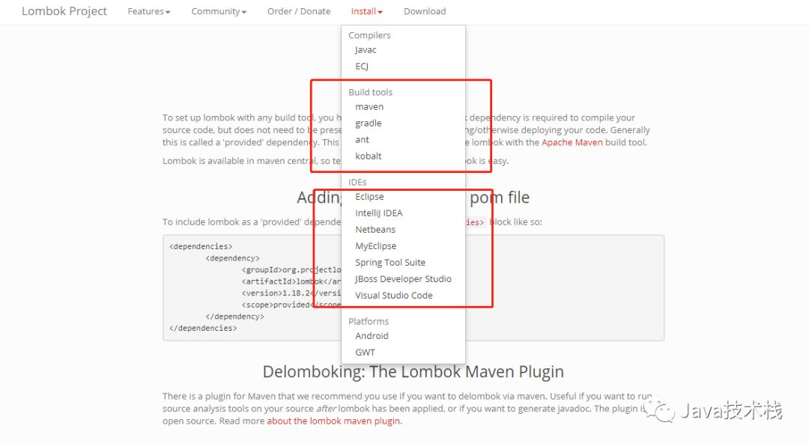
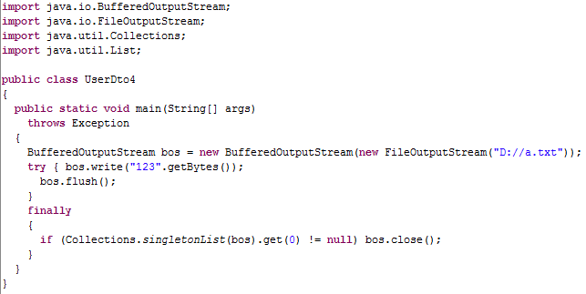

# lombok

在我们 Java 项目里面，有很多 Java Bean 需要为每个属性生成 get/ set
方法，增删改属性都需要维护这些 get/ set 方法甚是麻烦。

今天给大家介绍一款能帮助我们简化这些代码的神器：Lombok！有了这个神器，你的
Java Bean 类的代码量至少可以省一半。

## 1.什么是Lombok？

https://www.projectlombok.org/

打开它的官网，这是它的简介。

Project Lombok is a java library that automatically plugs into your
editor and build tools, spicing up your java.\
Never write another getter or equals method again. Early access to
future java features such as val, and much more.

翻译过来就是说，Lombok项目是一个 Java 库，它能够自动嵌入到你的 IDE
编辑器和编译工具中。有了它，你再也不用写 getter 或者 equals 方法了，还有
val 特性等。

总之，有了这个家伙，可以省掉很多代码的编写，大大减少了工作量和维护的难度。

## 2.使用Lombok

### 2.1.安装插件和配置依赖



如上图所示，Lombok支持所有主流的 IDE 开发工具及编译构建工具。

在 IDEA 中安装 Lombok 插件，这样在使用 Lombok 的时候就不会编译报错。

下面是 Maven 的依赖配置，在用 Maven 打包的时候也能自动生成需要的代码。

```xml
<dependency>
    <groupId>org.projectlombok</groupId>
    <artifactId>lombok</artifactId>
    <version>1.18.10</version>
    <scope>provided</scope>
</dependency>
```

如果你使用了 Spring Boot，可以不用带版本号，在 Spring
Bootspring-boot-dependencies.pom这个配置文件里面定义了 Lombok 依赖。

所以，你只需要继承版本号即可，当然，有必要的话，你也可以自定义版本号。


### 2.2.使用注解简化代码

从 IDEA 中的 Lombok 插件特性可以看到支持的注解。

```java
@Getter and @Setter
@FieldNameConstants
@ToString
@EqualsAndHashCode
@AllArgsConstructor, @RequiredArgsConstructor and @NoArgsConstructor
@Log, @Log4j, @Log4j2, @Slf4j, @XSlf4j, @CommonsLog, @JBossLog, @Flogger
@Data
@Builder
@Singular
@Delegate
@Value
@Accessors
@Wither
@SneakyThrows
from Intellij 14.1 @val
from Intellij 15.0.2 @var
from Intellij 14.1 @var
from Intellij 2016.2 @UtilityClass
Lombok config system
Code inspections
Refactoring actions (lombok and delombok)
```

### 2.3.@ToString

作用于类，覆盖默认的toString()方法，可以通过of属性限定显示某些字段，通过exclude属性排除某些字段。

`@ToString(of = {"name", "birth"}, exclude = {"id"})`

### 2.4.NoArgsConstructor,RequiredArgsConstructor, AllArgsConstructor

作用于类上，用于生成构造函数。有staticName、access等属性。

staticName属性一旦设定，将采用静态方法的方式生成实例，access属性可以限定访问权限。

### 2.5.@Log

作用于类上，生成日志变量。针对不同的日志实现产品，有不同的注解：

### 2.6.@Cleanup

自动关闭资源，针对实现了java.io.Closeable接口的对象有效，如：典型的IO流对象

```java
public static void main(String[] args) throws Exception {
    @Cleanup BufferedOutputStream bos = new BufferedOutputStream(new
    FileOutputStream("D://a.txt"));
    bos.write("123".getBytes());
    bos.flush();
}
```

通过反编译后，发现内容就是我们常见的关闭方式




### 2.7.@Accessors
```java
@Data
//@Accessors(chain = true)// 链式调用--调用set方法
//@Accessors(fluent = true)//  链式调用--调用字段的简单方法(没有get/set方法)
@Accessors(chain = true, prefix = "f")//  使用prefix属性，getter和setter方法会忽视属性名的指定前缀（遵守驼峰命名）
public class UserDto5 {

    private Long fId;

    private String fName;

    private Date fBirth;

    public static void main(String[] args) {
        //@Accessors(chain = true)// 链式调用--调用set方法
        //UserDto5 user = new UserDto5().setId(2L).setName("paty").setBirth(new Date());

        //@Accessors(fluent = true)//  链式调用--调用字段的简单方法
        //UserDto5 user = new UserDto5().id(2L).name("paty").birth(new Date());

        //@Accessors(fluent = true)//  使用prefix属性，getter和setter方法会忽视属性名的指定前缀（遵守驼峰命名）
        UserDto5 user = new UserDto5().setId(2L).setName("paty").setBirth(new Date());

        System.out.println(user);
    }
}
```

### 2.8.@SneakyThrows

可以对受检异常进行捕捉并抛出，可以改写上述的main方法如下

### 2.9.@NonNull

用在属性上，用于字段的非空检查，如果传入到 set
方法中的值为空，则抛出空指针异常，该注解也会生成一个默认的构造方法。

还有很多，这里不再撰述。

## 3.案例

### 3.1.案例一——实体类
```java
@Data // @Data 相当于后面全部注解 @code @Getter @Setter @RequiredArgsConstructor @ToString @EqualsAndHashCode
@AllArgsConstructor// 全部字段的构造数据
@NoArgsConstructor//  没有部字段的构造数据
@Accessors(chain = true)//链式风格
public class UserDto {

	private Long id;

	private String name;
	
	private Date birth; 
	
	public static void main(String[] args) {
		// 全部字段的构造数据
		UserDto u1 = new UserDto(1L, "tom", new Date());
		System.out.println(u1);
		
		// 没有部字段的构造数据
		UserDto u2 = new UserDto();
		System.out.println(u2);
		
		// 链式风格
		u1.setId(2L).setName("paty").setBirth(new Date());
		System.out.println(u1);
	}
	
}
```

### 3.2.案例二——静态构造方法
```java
@Data 
@RequiredArgsConstructor(staticName = "ofName")//静态构造方法
@Accessors(chain = true)//也支持链式调用
public class UserDto2 {

	private Long id;

	@NonNull// 如果静态构造函数中有些字段是必须传入的话，可以使用NonNull进行处理。
	private String name;
	
	private Date birth; 
	
	public static void main(String[] args) {
		UserDto2 user = UserDto2.ofName("张三").setBirth(new Date()).setId(1L);
		System.out.println(user);
	}
	
}
```

### 3.3.案例三——builder模式

```java
@Data
@Builder// builder 模式
public class UserDto3 {

	private Long id;

	private String name;
	
	private Date birth; 
	
	public static void main(String[] args) {
		UserDto3 user = UserDto3.builder()
			.id(1L).name("Tom").birth(new Date())
			.build();
		System.out.println(user);
	}
	
}
```

## 4.常见问题

### 4.1.Generating equals/hashCode implementation but without a call to superclass

[https://blog.csdn.net/qq_15071263/article/details/91660519](https://blog.csdn.net/qq_15071263/article/details/91660519)

当我们给一个继承了父类的子类上使用@Data @ToString @EqualsAndHashCode
注解时，IDE 会警告

Generating equals/hashCode implementation but without a call to
superclass

意思是，该注解在实现 ToString EqualsAndHashCode
方法时，不会考虑父类的属性，通过反编译的源码也是可以看到他是没有对父类的字段进行比较的


## 5.实现原理

### 5.1.实现原理
在使用 javac 编译器时（netbeans，maven，gradle），Lombok 会以 annotation processor 方式运行。 
Javac 会以 SPI 方式加载所有 jar 包中 META-INF/services/javax.annotation.processing.Processor 文件所列举的类，
并以 annotation processor 的方式运行它。对于 Lombok，这个类是 lombok.launch.AnnotationProcessorHider$AnnotationProcessor ，
当它被 javac 加载创建后，会执行 init方法，在这个方法中会启动一个特殊的类加载器 ShadowClassLoader ，
加载同 jar 包下所有以 .SCL.lombok 结尾的类（Lombok 为了对 IDE 隐藏这些类，所以不是通常地以 .class 结尾）。
其中就包含各式各样的 handler 。每个 handler 申明并处理一种注解，比如 @Getter 对应 HandleGetter 。

委派给 handler 时，Lombok Annotation Processor 会提供一个被注解节点的Abstract Syntax Tree (AST)节点对象，
它可能是一个方法、属性或类。在 handler 中 可以对这个 AST 进行修改，之后编译器将从被修改后的 AST 生成字节码。

不同编译器的语法树结构不同，所以需要分别实现。
- Javac Handler
- Eclipse Handler
- lombok-intellij-plugin Handler

### 5.2.自定义Lombok注解

自定义Lombok注解: https://blog.csdn.net/weixin_30896825/article/details/101424667