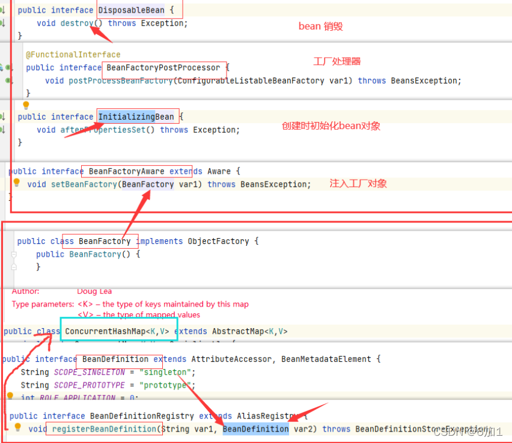

# Spring 设计模式

## 1.简单工厂模式
案例：BeanFactory 根据类型、name等条件进行收件对象

Bean的配置信息==>转化BeanDefinition对象==>注册对象BeanDefinitionRegistry=>BeanFactory



## 2.享元模式
案例：BeanFactory 特指实现类 DefaultSingletonBeanRegistry

在创建一次单例的对象后，便将对象保存起来。

## 3.工厂模式
案例： FactoryBean。 mybatis 的 SqlSessionFactoryBean 实现了 FactoryBean。
```java
//mybatis 入门案例
public void demo(DataSource dataSource) throws IOException {
    // 1.创建 SqlSessionFactoryBean
    SqlSessionFactoryBean bean = new SqlSessionFactoryBean();
    bean.setMapperLocations(new PathMatchingResourcePatternResolver().getResources("classpath*:mapper/*Mapper.xml"));
    bean.setDataSource(dataSource);
    
    // 2. getObject 获得SqlSessionFactory
    SqlSessionFactory sqlSessionFactory = bean.getObject();
    
    // 3.从SqlSessionFactory中获取sqlSessio
    SqlSession sqlSession = sqlSessionFactory.openSession();
    
    // 4.获取mapper接口,执行接口方法
    UserMapper userMapper = sqlSession.getMapper(UserMapper.class);
    
    // 5. userMapper 是mybatis为接口创建了一个代理对象
    List<User> userList = userMapper.findAll();
    
    sqlSession.close();
}
```

## 4.单例模式
案例： spring 默认的bean模式

保证一个类仅有一个实例，并提供一个访问它的全局访问点。

spring中的单例模式完成了后半句话，即提供了全局的访问点BeanFactory。但没有从构造器级别去控制单例，这是因为spring管理的是是任意的java对象。

核心提示点：Spring下默认的bean均为singleton，可以通过singleton="true或者false"  或者 scope="?"来指定。

## 5.代理模式
案例：spring控制事务

在Spring的AOP，使用的Advice（通知）来增强被代理类的功能。Spring实现这一AOP功能的原理就使用代理模式（1、JDK动态代理。2、CGLib字节码生成技术代理）对类进行方法级别的切面增强

即，生成被代理类的代理类，并在代理类的方法前，设置拦截器，通过执行拦截器重的内容增强了代理方法的功能，实现的面向切面编程

## 6.装饰器模式
案例：spring中用到的包装器模式在类名上有两种表现：一种是类名中含有Wrapper，另一种是类名中含有 Decorator。基本上都是动态地给一个对象添加一些额外的职责。

比如在bean实例化后，进行初始化的时候，一系列的Wrapper

## 7.观察者模式  
案例：各类监听器，事件等


## 8.策略模式

spring中在通过反射实例化对象的时候用到Strategy模式

比如： SimpleInstantiationStrategy


## 9.模板方法模式  
案例： RestTemplate 和 JdbcTemplate

JdbcTemplate中的execute方法


## 9.责任链模式
案例：拦截器

## 10.空对象模式
案例：整个IOC过程中，许多地方都使用了默认的对象进行处理

## 11.适配器模式
案例：spring mvc 处理URL时，会根据不同的handler类型，去适配不同的处理器