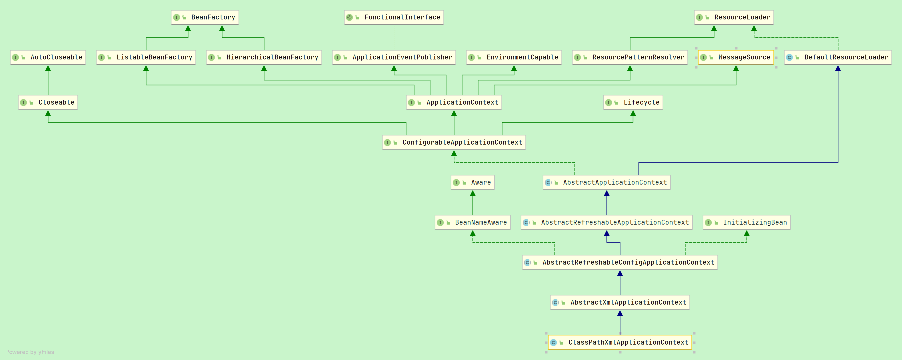
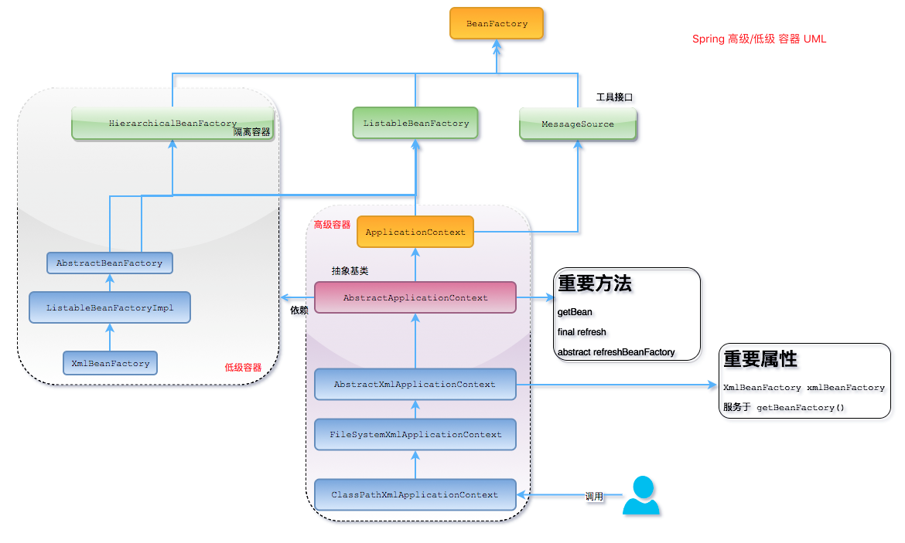
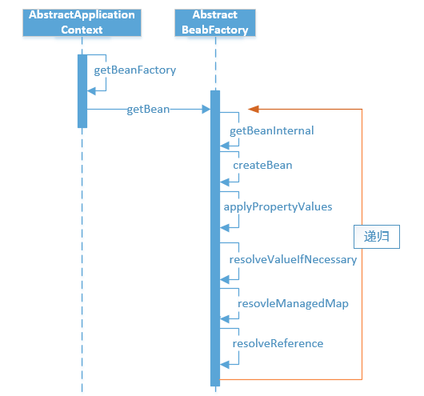

# Spring IOC

## 1.IOC 与 DI
IOC(Inversion of Control) 控制反转，控制权就由应用程序本身转移到了外部容器。即“不用打电话过来，我们会打给你”。    
两种实现： 依赖查找（DL）和依赖注入（DI）。

IOC 和 DI 、DL 的关系（这个 DL，Avalon 和 EJB 就是使用的这种方式实现的 IOC）；
- DL 已经被抛弃，因为他需要用户自己去是使用 API 进行查找资源和组装对象。即有侵入性。
- DI 是 Spring 使用的方式，容器负责组件的装配。
  

注意：Java 使用 DI 方式实现 IOC 的不止 Spring，包括 Google 的 Guice，Dubbo中的SPI。

## 2. IOC容器
### 2.1. IOC支持的功能
- 依赖注入
- 依赖检查
- 自动装配
- 支持集合
- 指定初始化方法和销毁方法
- 支持回调某些方法（但是需要实现 Spring 接口，略有侵入）

其中，最重要的就是依赖注入，从 XML 的配置上说，即 ref 标签。对应 RuntimeBeanReference 对象。   
对于 IOC 来说，最重要的就是容器。容器管理着 Bean 的生命周期，控制着 Bean 的依赖注入。

### 2.2. 核心接口
Spring 作者 Rod Johnson 设计了两个接口用以表示容器。 BeanFactory 和   ApplicationContext

- BeanFactory 粗暴简单，可以理解为就是个 HashMap，Key 是 BeanName，Value 是 Bean 实例。
  提供注册（put），获取（get）这两个功能。我们可以称之为“低级容器”。

- ApplicationContext 是 BeanFactory的子接口，可以称之为“高级容器”。因为他比 BeanFactory 多了更多的功能。
  他继承了多个接口。因此具备了更多的功能。例如加载配置文、支持多种消息（例如 JSP tag 的支持），比 BeanFactory 多了工具级别的支持等待。
  所以你看他的名字，已经不是 BeanFactory 之类的工厂了，而是 “应用上下文”， 代表着整个大容器的所有功能。
  该接口定义了一个 refresh 方法，此方法是所有阅读 Spring 源码的人的最熟悉的方法，用于刷新整个容器，即重新加载/刷新所有的 bean。

当然，除了这两个大接口，还有其他的辅助接口，但是都是在此基础上增加容器功能。

### 2.3. 容器间的关系
为了更直观的展示 “低级容器” 和 “高级容器” 的关系，我这里通过常用的 ClassPathXmlApplicationContext 类，来展示整个容器的层级 UML 关系，如下：


我们核心的UML如下：

- 最上面的 BeanFactory IOC的基础接口。
- 下面的 3 个绿色的，都是功能扩展接口，丰富IOC能力。
- 下面的隶属 ApplicationContext 粉红色的 “高级容器”，依赖着 “低级容器”，这里说的是依赖，不是继承哦，
  他依赖着 “低级容器” 的 getBean 功能。
  而高级容器有更多的功能：支持不同的信息源头，可以访问文件资源，支持应用事件（Observer 模式）。
- 左边灰色区域的是 “低级容器”， 只负载加载 Bean，获取 Bean，容器其他的高级功能是没有的。
  例如上图画的 refresh 刷新 Bean工厂、生命周期、事件、回调等。

### 2.3. 容器启动过程
https://juejin.im/entry/5e47c7a3e51d4527151553f5
https://www.jianshu.com/nb/29052266
https://blog.csdn.net/boling_cavalry/article/details/81045637
https://www.cnblogs.com/caoxb/p/12435197.html#top
https://www.cnblogs.com/xrq730/p/6685528.html

以 ClassPathXmlApplicationContext 为例子。   

这里再用文字来描述这个过程：
1. 用户构造 ClassPathXmlApplicationContext（简称 CPAC）
2. CPAC 加载环境变量，并调用 AbstractApplicationContext#refresh 方法 进行容器初始化，这个方法是模板方法，允许子类重写。
3. refresh 是容器实例化入口。一共分为12个核心步骤。简化为步骤如下
    1. 获得 BeanFactory = DefaultListableBeanFactory，并将xml配置的bean解析为 BeanDefinition（一部分）
    2. 【重要】BeanFactoryPostProcessor 相关功能调用，我们使用 解析 @ImportResource、@Import、@Configuration、@Compont 等相关的配置，向容器注册beanDefinition
    3. 向容器注册BeanPostProcessor
    4. 初始化国际化的工具、容器的事件监听器
    5. 【重要】实例化所有非懒加载的单例bean


### 2.4 getBean的流程

所以，一定要把 “低级容器” 和“高级容器” 的区别弄清楚。不能一叶障目不见泰山。   
好，当我们创建好容器，就会使用 getBean 方法，获取 Bean，而 getBean 的流程如下：


从图中可以看出，getBean 的操作都是在低级容器里操作的。其中有个递归操作，这个是什么意思呢？

假设 ： 当 BeanA 依赖着 BeanB，而这个 BeanA 在加载的时候，其配置的 ref = “BeanB” 在解析的时候只是一个占位符，
被放入了 BeanA 的属性集合中，当调用 getBean 时，需要真正 BeanB 注入到 BeanA 内部时，就需要从容器中获取这个 BeanB，因此产生了递归。

为什么不是在加载的时候，就直接注入呢？    
因为加载的顺序不同，很可能 BeanA 依赖的 BeanB 还没有加载好，也就无法从容器中获取，你不能要求用户把 Bean 的加载顺序排列好，这是不人道的。

所以，Spring 将其分为了 2 个步骤：
1.  加载所有的 Bean 配置成 BeanDefinition 到容器中，如果 Bean 有依赖关系，则使用占位符暂时代替。
2.  在调用 getBean 的时候，进行真正的依赖注入，即如果碰到了属性是ref 的（占位符），
    那么就从容器里获取这个 Bean，然后注入到实例中，这称之为依赖注入。

可以看到，依赖注入实际上，只需要 “低级容器” 就可以实现。这就是 IOC。

所以 ApplicationContext refresh 方法里面的操作不只是 IOC，是高级容器的所有功能（包括 IOC），IOC 的功能在低级容器里就可以实现。

## 3.spring bean的生命周期
### 3.1.spring bean的生命周期
bean的scope中主要是 singleton 和 prototype。他们的生命周期都是一样的。
但是在一个容器的生命周期中singleton只会创建一次，而prototype每次getBean就创建一次，使用结束就被回收。

分为5个阶段： 源码在 AbstractAutowireCapableBeanFactory#doCreateBean
1. 实例化（Instantiation）：根据 beanDefinition 通过反射 实例化 bean
2. 属性赋值（Populate Properties）：采用递归，自动装配依赖的属性，例如 @Autowrite和@Value的属性
3. 初始化（Initialization）：调用bean的一系列初始化方法
    1. 初始化前：每个bean都经过所有 BeanPostProcessor#preProcessBeforeInitialization进行处理。
    2. 其中包括ApplicationContextAwareProcessor，如果bean实例了Aware的相关接口，就会调用一系列Aware方法。
       作用是将对应的对象注入到bean中。例如：BeanNameAware，EnvironmentAware，ResourceLoaderAware，ApplicationContextAware等
    3. 调用初始化方法。包括：InitializingBean#afterPropertiesSet，自定义的init方法
    4. 初始化完成后：每个bean都经过所有BeanPostProcessor#postProcessAfterInitialization进行处理。
4. 就绪使用（Ready for Use）:初始化完成后就可以使用了。
5. 销毁（Destruction）：调用 DisposableBean#destory() 或者 自定义的destroy 方法

### 3.2.延迟加载
使用@Lazy注解： https://blog.csdn.net/Lambert_shikui/article/details/109702570

### 3.3.作用范围
Spring默认创建对象是单例的，在对象的定义中，使用scope表示，可以使用注解@Scope修改
- singleton：单例模，每个scope为singleton的bean都会被定义为一个单例对象，该对象的生命周期是与Spring IOC容器一致的（但在第一次被注入时才会创建）。
- prototype：原型模式，bean在每次被getBean的时候都会创建一个新的对象。
- request：bean被定义为在每个HTTP请求中创建一个单例对象，也就是说在单个请求中都会复用这一个单例对象。
- session：bean被定义为在一个session的生命周期内创建一个单例对象。
- application：bean被定义为在ServletContext的生命周期中复用一个单例对象。
- websocket：bean被定义为在websocket的生命周期中复用一个单例对象。


<p style="color:red">问题：线程安全问题？</p>
- singleton 是线程不安全的，对象有spring管理
- prototype 每次getBean的时候都生产一个新的对象，spring负责实例化后就不由spring管理他的生命周期了。

注意：
- 这就出现一个问题，比如controller类是prototype，我们通过URL访问的时候，spring mvc通过URL获得controller的class，之后getBean获得controller的实例。
  这就造成我们访问的时候每次都是不同的controller的实例。这样controller的实例是线程安全的。
- 但是，如果service类是prototype，在controller初始化的时候（controller是singleton 的），不同的controller中的service是不同的。
  因为controller只初始化一次，getBean一次。所以一个controller中的service是不变的，也就是线程不安全的。

总结：使用prototype
能够实现线程安全，但是使用的时候往往会忽视掉上面的第二点问题。另外，我们真想要使用prototype实现线程安全的话，
需要我们把controller、service、dao，由外往内的逐层设置为prototype，虽然保证了线程安全，但是每次访问都生产很多对象出来，
还不由spring管理对象的生命周期，造成资源消耗。这也是为什么spring默认为单例的了。

[代码案例](https://gitee.com/luckSnow/spring-boot-example/blob/master/lab_001_base_sources/src/main/java/com/zx/sources/_4_scop%E4%BD%9C%E7%94%A8%E8%8C%83%E5%9B%B4/DemoController.java)

## 4. 扩展点
### 4.1 扩展点
> https://mp.weixin.qq.com/s/zv9K5lVGTUpsWb4_fuXC-g
> https://juejin.im/entry/5ba45b0f6fb9a05d0a052a34
> https://mp.weixin.qq.com/s/YfELU1Tpdh5AJu2YjGwCcw

基本思路有两个： 扩展容器初始化 或者 扩展bean创建
1. 扩展容器初始化
-   扩展BeanDefinition: 比如，dubbo，通过扩展xml
> schema，实现namespaceHandler和BeanDefinition的相关接口，实现扩展的
-   扩展BeanFactoryPostProcesser:只要是跟配置的内容相关的，可以修改beanDefinition中的内容。
    Nacos的配置中间就是扩展了这个注入值的。

2. 扩展bean创建
```java
protected Object initializeBean(final String beanName, final Object bean, RootBeanDefinition mbd) {
   // 1. 依次调用 BeanNameAware  BeanClassLoaderAware  BeanFactoryAware, 用量增强bean的能力
   if (bean instanceof Aware) {
      if (bean instanceof BeanNameAware) {
       ((BeanNameAware) bean).setBeanName(beanName);
      }
      if (bean instanceof BeanClassLoaderAware) {
        ((BeanClassLoaderAware) bean).setBeanClassLoader(getBeanClassLoader());
      }
      if (bean instanceof BeanFactoryAware) {
        ((BeanFactoryAware) bean).setBeanFactory(AbstractAutowireCapableBeanFactory.this);
      }
   }
   // 2.调用BeanPostProcessor 的前置初始化方法
   Object wrappedBean = bean;
   if (mbd == null || !mbd.isSynthetic()) {
      wrappedBean = applyBeanPostProcessorsBeforeInitialization(wrappedBean, beanName);
   }
   // 3.调用初始化方法
   // 调用 InitializingBean#afterPropertiesSet方法
   // 调用 xml配置的 init 方法  
   invokeInitMethods(beanName, wrappedBean, mbd);

   // 4.调用BeanPostProcessor 的后置初始化方法
   if (mbd == null || !mbd.isSynthetic()) {
      wrappedBean = applyBeanPostProcessorsAfterInitialization(wrappedBean, beanName);
   }
   return wrappedBean;
}
```

其中2.调用BeanPostProcessor 的前置初始化方法，有一个BeanPostProcessor，实现了bean一系列能力增强
```java
class ApplicationContextAwareProcessor implements BeanPostProcessor {
    private void invokeAwareInterfaces(Object bean) {
        if (bean instanceof EnvironmentAware) {
            ((EnvironmentAware) bean).setEnvironment(this.applicationContext.getEnvironment());
        }
        if (bean instanceof EmbeddedValueResolverAware) {
            ((EmbeddedValueResolverAware) bean).setEmbeddedValueResolver(this.embeddedValueResolver);
        }
        if (bean instanceof ResourceLoaderAware) {
            ((ResourceLoaderAware) bean).setResourceLoader(this.applicationContext);
        }
        if (bean instanceof ApplicationEventPublisherAware) {
            ((ApplicationEventPublisherAware) bean).setApplicationEventPublisher(this.applicationContext);
        }
        if (bean instanceof MessageSourceAware) {
            ((MessageSourceAware) bean).setMessageSource(this.applicationContext);
        }
        if (bean instanceof ApplicationContextAware) {
            ((ApplicationContextAware) bean).setApplicationContext(this.applicationContext);
        }
    }
}
```

3.bean销毁

通过注释我们知道，ConfigurableApplicationContext#close() 是容器关闭的入口
```java
/*
 * @see InitializingBean
 * @see org.springframework.beans.factory.support.RootBeanDefinition#getDestroyMethodName()
 * @see org.springframework.beans.factory.config.ConfigurableBeanFactory#destroySingletons()
 * @see org.springframework.context.ConfigurableApplicationContext#close()
 */
public interface DisposableBean {
	void destroy() throws Exception;
}
```
>
> 容器关闭或重启的时候，会调用DispossableBean接口
>
> 例子：dubbo的 serviceBean 实现了很多接口。

### 扩展点1：ApplicationContextInitializer
在spring容器刷新之前，对spring上下文提前进行配置。

配置生效的方式如下：
1. 在启动类中用 springApplication.addInitializers(new TestApplicationContextInitializer())语句加入
2. 配置文件配置context.initializer.classes=com.example.demo.TestApplicationContextInitializer
3. Spring SPI扩展，在spring.factories中加入org.springframework.context.ApplicationContextInitializer=com.example.demo.TestApplicationContextInitializer

springboot 2.6中默认的初始化器如下：
1. DelegatingApplicationContextInitializer。特殊的初始化器，作用是读取环境属性context.initializer.classes，将配置文件中的初始化器添加到spring容器中。
2. SharedMetadataReaderFactoryContextInitializer。向容器中添加CachingMetadataReaderFactoryPostProcessor实例。
   MetadataReaderFactory的作用：读取注解元数据，缓存其结果，提升应用程序的启动性能。
3. ContextIdApplicationContextInitializer。负责为Spring上下文设置一个唯一的ID。在多个容器存在的场景中，启动区分容器的作用。
4. RestartScopeInitializer。开启开发工具才会有此初始化器，主要作用是处理restart范围，帮助代码修改后容器重启。
5. ConfigurationWarningsApplicationContextInitializer。向容器中添加ConfigurationWarningsPostProcessor实例。用于在应用程序启动时检测潜在的配置问题，并在控制台输出警告信息。帮助开发者识别和修复可能影响应用程序运行的配置错误。
6. RSocketPortInfoApplicationContextInitializer。向容器中添加一个RSocket的ApplicationListener。如果读取到配置文件中有 local.rsocket.server.port，就设置响应端口。
   RSocket是一种基于消息的、双向的、响应式的通信协议，适用于微服务架构中的服务间通信。
7. ServerPortInfoApplicationContextInitializer。用于获取和设置服务器端口信息。
8. ConditionEvaluationReportLoggingListener。向容器中添加ConditionEvaluationReportListener。 用于在条件评估完成后记录报告。
   条件评估是Spring Boot自动配置的一个重要部分，它决定了哪些自动配置类应该被加载到上下文中。
   这个监听器可以帮助开发者了解哪些条件通过了评估，哪些没有，从而更好地理解应用程序的自动配置过程。

### 扩展点2：BeanDefinitionRegistryPostProcessor

BeanDefinition的作用阶段为：解析->注册->初始化->注册

是一种特殊的BeanFactoryPostProcessor。提供了两个扩展节点

- postProcessBeanDefinitionRegistry。BeanDefinition注册阶段开始时触发，这时可以注册自定义的BeanDefinition。
- postProcessBeanFactory。【见BeanFactoryPostProcessor】

### 扩展点3：BeanFactoryPostProcessor
作用是BeanDefinition初始化阶段触发，在bean初始化前修改beanFactory的属性 和 修改BeanDefintion

### 扩展点4：InstantiationAwareBeanPostProcessor

bean的初始化过程：实例化->属性注入->初始化(注入容器)

是一种特殊的BeanPostProcess。作用于bean初始化的各个节点，作用的范围在BeanPostProcess基础上增加到bean实例化和属性注入两个阶段。
- postProcessBeforeInstantiation：实例化bean之前，相当于new这个bean之前
- postProcessAfterInstantiation：实例化bean之后，相当于new这个bean之后
- postProcessPropertyValues：bean已经实例化完成，在属性注入时阶段触发，@Autowired,@Resource等注解原理基于此方法实现
- postProcessBeforeInitialization：初始化bean之前，相当于把bean注入spring上下文之前
- postProcessAfterInitialization：初始化bean之后，相当于把bean注入spring上下文之后

使用场景：对实现了某一类接口的bean在各个生命期间进行收集，或者对某个类型的bean进行统一的设值等等。

### 扩展点5：SmartInstantiationAwareBeanPostProcessor
继承自InstantiationAwareBeanPostProcessor接口，并进一步扩展了其功能。
这个接口主要用于在Spring容器创建beans的过程中进行更精细的控制和更多的干预，特别是在涉及代理和其他高级场景时。
- predictBeanType：该触发点发生在 postProcessBeforeInstantiation 之前，这个方法用于预测Bean的类型，返回第一个预测成功的Class类型，如果不能预测返回null；
当你调用BeanFactory.getType(name)时当通过bean的名字无法得到bean类型信息时就调用该回调方法来决定类型信息。
- determineCandidateConstructors：该触发点发生在 postProcessBeforeInstantiation 之后，用于确定该bean的构造函数，返回的是该bean的所有构造函数列表。
用户可以扩展这个点，来自定义选择相应的构造器来实例化这个bean。
- getEarlyBeanReference：该触发点发生在 postProcessAfterInstantiation 之后，当有循环依赖的场景，当bean实例化好之后，为了防止有循环依赖，会提前暴露回调方法，用于bean实例化的后置处理。
这个方法就是在提前暴露的回调方法中触发。

### 扩展点6：BeanFactoryAware
在bean实例化之后注入属性之前，会判断bean是否实现了BeanFactoryAware接口，如果实现了，就会自动调用setBeanFactory方法将BeanFactory传入bean中。
通过是用来获得BeanFactory，缓存到bean中，用于后面使用。

### 扩展点7：BeanPostProcessor

在spring IOC容器初始化的过程中，其实是看不到bean的动态代理相关的内容。这是因为动态代理只是spring 扩展出来的一种功能，并非IOC过程必备的。
常见的方式就是使用beanPostProcessor进行代理对象的生成。

BeanPostProcessor的使用：*https://www.cnblogs.com/jyyzzjl/p/5417418.html*

有两个扩展点
1. postProcessBeforeInitialization，属性注入之后，初始化之前调用
    - 可以对bean进行处理或修改，比如设置某些属性值，或者根据某些条件替换bean实例等。
    - 如果这个方法返回null，则spring认为这个bean是不需要的，就不会调用后续的所有实例化、初始化方法，也不会在容器中找到这个bean。
2. postProcessAfterInitialization，完成初始化之后调用
    - 可以对已经初始化完成的bean进行处理或检查，比如记录日志、验证bean的状态等。
    - 和postProcessBeforeInitialization方法一样，不能返回null。
    - 注意：这里不能替换bean，因为已经完成初始化了，其他的bean可能已经引用到原始bean，如果进行替换就可能导致异常。

使用场景:
1. BeanPostProcessor的一个常见用途是AOP的实现，比如Spring的AspectJAutoProxyCreator就是一个BeanPostProcessor的实现，
   它用于创建代理对象，以支持基于注解的AOP功能。
2. BeanPostProcessor还可以用于实现一些通用的bean处理逻辑，比如自动装配、依赖检查、日志记录等。
   由于BeanPostProcessor可以处理容器中所有的bean，因此它是一个非常强大的工具，但也需要注意不要过度使用，
   以免增加不必要的复杂性和性能开销。

### 扩展点8：ApplicationContextAwareProcessor
ApplicationContextAwareProcessor 是无访问修饰符的类，所以无法被扩展。
但是该类内部却有6个扩展点可供实现 ，这些类触发的时机在bean实例化之后，初始化完成之前。

作用：主要是将相关的对象注入到bean中。不过这些扩展的接口都可以使用注解替换，实用性不高。

```java
private void invokeAwareInterfaces(Object bean) {
	if (bean instanceof EnvironmentAware) {
		((EnvironmentAware) bean).setEnvironment(this.applicationContext.getEnvironment());
	}
	if (bean instanceof EmbeddedValueResolverAware) {
		((EmbeddedValueResolverAware) bean).setEmbeddedValueResolver(this.embeddedValueResolver);
	}
	if (bean instanceof ResourceLoaderAware) {
		((ResourceLoaderAware) bean).setResourceLoader(this.applicationContext);
	}
	if (bean instanceof ApplicationEventPublisherAware) {
		((ApplicationEventPublisherAware) bean).setApplicationEventPublisher(this.applicationContext);
	}
	if (bean instanceof MessageSourceAware) {
		((MessageSourceAware) bean).setMessageSource(this.applicationContext);
	}
	if (bean instanceof ApplicationContextAware) {
		((ApplicationContextAware) bean).setApplicationContext(this.applicationContext);
	}
}
```

可以看到，该类用于执行各种驱动接口，在bean实例化之后，属性填充之后，通过执行以上红框标出的扩展接口，来获取对应容器的变量。所以这里应该来说是有6个扩展点，这里就放一起来说了
- EnvironmentAware：获得系统内的所有参数。通常用于实现框架、驱动、客户端程序时使用。
- EmbeddedValueResolverAware：手动解析表示式获得配置文件中的内容，使用方式与@Value一样，例如 ` resolver.resolveStringValue("Hello, ${spring.application.name}!"); `
- ResourceLoaderAware：用于获取classpath内所有的资源对象，例如读取静态文件等
- ApplicationEventPublisherAware：调用setApplicationEventPublisher方法向bean中注入ApplicationEventPublisher实例，用于后面发送事件。
- MessageSourceAware：用于获取MessageSource的一个扩展类，MessageSource主要用来做国际化。
- ApplicationContextAware：是开发人员非常熟悉的类，就是spring上下文管理器，用来拿到ApplicationContext。

### 扩展点9：BeanNameAware
触发点在bean的初始化之前，也就是postProcessBeforeInitialization之前，这个类的触发点方法只有一个：setBeanName

作用就是拿到自己在容器的name，方便后续扩展功能。

### 扩展点10：@PostConstruct
- 作用是 bean的初始化阶段，调用@PostConstruct的方法。触发在postProcessBeforeInitialization之后，InitializingBean.afterPropertiesSet之前。
- 注意：这个时候属性还没有注入，所以方法内不能使用spring 的bean。

### 扩展点11：@PreDestroy
与@PostConstruct相似，是应用重启或停止触发，用来回收资源，不能操作spring bean

### 扩展点12：InitializingBean
- 在属性注入后，注入容器前调用
- 使用场景：用户实现此接口，来进行系统启动的时候一些业务指标的初始化工作。

### 扩展点13：DisposableBean
这个扩展点也只有一个方法：destroy()，其触发时机为当此对象销毁时，会自动执行这个方法。
比如说运行applicationContext.registerShutdownHook时，就会触发这个方法，方法中可以操作spring bean。

### 扩展点14：FactoryBean
- 作用：很多bean的实例化过程是非常复杂的，需要设置特定的实例化逻辑。例如Spring自身就提供了70多个FactoryBean的实现。它们隐藏了实例化一些复杂bean的细节，给上层应用带来了便利。
- 使用场景：用户可以扩展这个类，来为要实例化的bean作一个代理，比如为该对象的所有的方法作一个拦截，在调用前后输出一行log，模仿ProxyFactoryBean的功能。
- 实例化的bean默认是延迟加载

### 扩展点15：SmartInitializingSingleton
- 作用是 在spring容器管理的所有单例对象（非懒加载对象）初始化完成之后调用的回调接口。其触发时机为postProcessAfterInitialization之后。
- 使用场景：用户可以扩展此接口在对所有单例对象初始化完毕后，做一些后置的业务处理。

### 扩展点16：ApplicationRunner
- 作用应用启动完成后执行，多个ApplicationRunner，可以利用@Order来进行排序。
- 使用场景：用户扩展此接口，进行启动项目之后一些业务的预处理。

### 扩展点17：CommandLineRunner
作用于ApplicationRunner相同。ApplicationRunner 和 CommandLineRunner 混合一起使用@Order排序

### 扩展点18：ApplicationListener
是spring提供的一个机制，用于自行订阅spring的各类事件，以及自定义的事件。

1. ContextRefreshedEvent: 容器初始化或刷新事件。通常是ConfigurableApplicationContext#refresh()方法触发。
2. ContextStartedEvent: 容器启动完成后发送事件。
3. ContextStoppedEvent: 容器被停止后发送事件。通常是ConfigurableApplicationContext#stop()。通常用于释放资源。
4. ContextClosedEvent：一个已关闭的上下文到达生命周期末端；它不能被刷新或重启
5. RequestHandledEvent:这是一个 web-specific 事件，告诉所有 bean HTTP 请求已经被服务。只能应用于使用DispatcherServlet的Web应用。在使用Spring作为前端的MVC控制器时，当Spring处理用户请求结束后，系统会自动触发该事件
6. spring boot提供了大量事件，作用是应用生命周期内的变化。
    - ApplicationContextInitializedEvent
    - ApplicationEnvironmentPreparedEvent
    - ApplicationFailedEvent
    - ApplicationPreparedEvent
    - ApplicationReadyEvent
    - ApplicationStartedEvent
    - ApplicationStartingEvent
    - EventPublishingRunListener
    - SpringApplicationEvent

## 6.常见面试题
<p style="color:red">问题：为什么spring中的推荐使用构造器注入</p>    
https://www.cnblogs.com/joemsu/p/7688307.html
- 确保属性不可变，属性可以用final修饰
- 确保获得的属性是完全初始化状态的对象
- 避免循环依赖

<p style="color:red">问题：循环依赖</p>   
https://juejin.im/entry/5eab6b5ff265da7bee7c8afd   
https://www.bilibili.com/read/cv5945731   
https://mp.weixin.qq.com/s/vOsMqDiqY-wbLJYRe6tbjg

<p style="color:red">问题：为啥prototype不支持循环依赖？</p>   
原型(Prototype)的场景是不支持循环依赖的，通常会走到AbstractBeanFactory类中下面的判断，抛出异常。
```java
if (isPrototypeCurrentlyInCreation(beanName)) {
    throw new BeanCurrentlyInCreationException(beanName);
}
```
原因很好理解，创建新的A时，发现要注入原型字段B，又创建新的B发现要注入原型字段A...
这就套娃了, 你猜是先StackOverflow还是OutOfMemory？
Spring怕你不好猜，就先抛出了BeanCurrentlyInCreationException

<p style="color:red">问题：构造函数为啥不能循环依赖？</p>   
构造函数方式的注入能保证单例对象的安全性（某种程度上）。
对象都没创建出来呢，三级缓存都找不到的，直接报错


