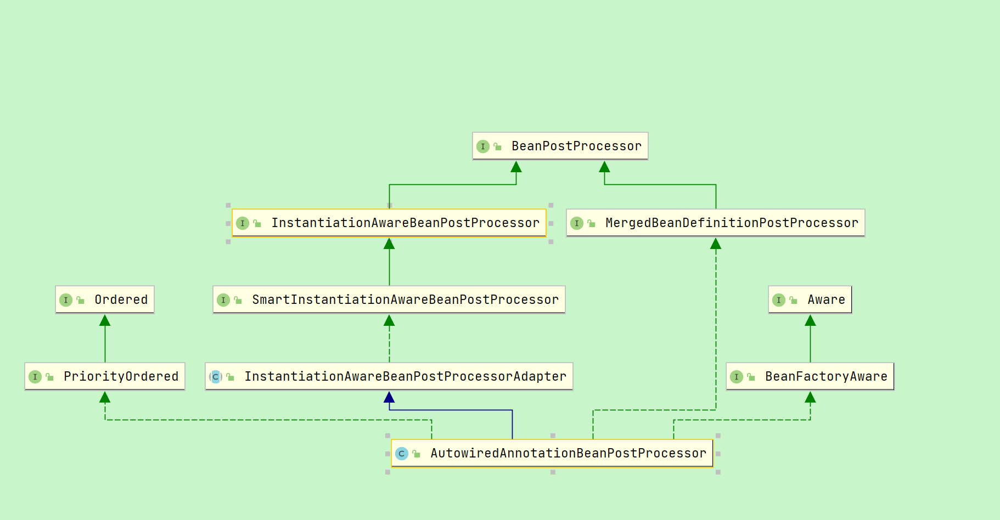

# Spring 自动装配

## 1.介绍

### 1.1 注入
1. 构造函数注入。推荐
2. 属性注入，xml中常用
3. 注解注入，比如Autowirted, Resource
4. 自动装配，三种模式 byType()、byName()、constructor()

### 1.1 自动装配的类型
```java
public interface AutowireCapableBeanFactory extends BeanFactory {
   // 不支持自动装配功能
   int AUTOWIRE_NO = 0;
   
   //从Spring 容器中获取目标对象时，目标对象中的属性会根据名称在整个Spring容器中查找标签的name属性值。如果有相同的，那么获取这个对象
   int AUTOWIRE_BY_NAME = 1;
   
   // 从Spring 容器中获取目标对象时，目标对象中的属性会根据名称在整个Spring容器中查找标签的class属性值。如果有相同的，那么获取这个对象
   int AUTOWIRE_BY_TYPE = 2;
   
   // 使用构造方法完成对象注入，其实也是根据构造方法的参数类型进行对象查找，相当于采用byType的方式
   int AUTOWIRE_CONSTRUCTOR = 3;
   
   // 自动注入，已经被废弃了
   @Deprecated
   int AUTOWIRE_AUTODETECT = 4;
}
```

装配顺序： 
- 如果注入的时候，使用了注解@Resource或Qualefer,这样就通过byName去找
- 没有上面两个注解的话，先byType，遍历所有的所有的spring负责管理的bean的class，找到实现类
- 如果实现类有多个，则使用字段的名称去byName
- 匹配不上的话，则判断实现类是否使用了主键/优先级的注解修饰，注入主要或优先级高的
- 都不行的话就报错了。Spring启动失败

最常用的使用就是 @Autowired

```java
// 可作用于: 构造方法、普通方法、参数、字段、注解上
@Target({ElementType.CONSTRUCTOR, ElementType.METHOD, ElementType.PARAMETER, ElementType.FIELD, ElementType.ANNOTATION_TYPE})
@Retention(RetentionPolicy.RUNTIME)
@Documented
public @interface Autowired {
	/**
	 * 声明这个依赖是否必须，默认为true
	 */
	boolean required() default true;
}
```

## 2.实现原理
1. 在 refresh 中 registerBeanPostProcessors 注册 AutowiredAnnotationBeanPostProcessor（简称为aabpp）
2. 在实例化bean之后，注入bean的属性之前，调用aabpp的postProcessMergedBeanDefinition方法，调用bean信息合并后置处理器，
   这里会找到需要自定配置的属性、方法等，将其封装为元素对象其中包括元数据（InjectionMetaData），方便在属性注入的时候调用对应的功能
3. 注入属性populateBean是，调用后置配置方法（不是后置处理器方法），使用元数据通过反射调用getBean方法进行注入

设计思想： 
- 谁要注入。 AutowiredAnnotationBeanPostProcessor#postProcessMergedBeanDefinition。找到属性
- 怎么注入。 AutowiredAnnotationBeanPostProcessor#findAutowiringMetadata。找到用于注入的工具
- 注入什么。 通过 AutowiredFieldElement或AutowiredMethodElement 找到属性
- 进行注入。 InstantiationAwareBeanPostProcessor#postProcessProperties。通过上面三步的结果进行注入


### 2.1 AutowiredAnnotationBeanPostProcessor
AutowiredAnnotationBeanPostProcessor 继承关系如下



aabpp 实现了 MergedBeanDefinitionPostProcessor 接口
- 作用是：合并Bean的定义信息，通过 MergedBeanDefinitionPostProcessor#postProcessMergedBeanDefinition 修改 BeanDefinition 的基本信息
- 作用于：实例化bean之后，注入bean的属性之前。 applyMergedBeanDefinitionPostProcessors方法中执行
```java
public interface MergedBeanDefinitionPostProcessor extends BeanPostProcessor {
    // 合并Bean的定义信息的后处理方法，该方法是在Bean的实例化之后设置值之前调用。
	void postProcessMergedBeanDefinition(RootBeanDefinition beanDefinition, Class<?> beanType, String beanName);

	default void resetBeanDefinition(String beanName) { }
}
```

### 2.2 初始化流程
AbstractAutowireCapableBeanFactory#doCreateBean
```java
protected Object doCreateBean(String beanName, RootBeanDefinition mbd, @Nullable Object[] args) throws BeanCreationException {
    // 1. 实例化对象
    // 反射生成对象 beanName -> BeanWrapper
    BeanWrapper instanceWrapper = createBeanInstance(beanName, mbd, args);
    // 获得原始对象  BeanWrapper ->  bean
    Object bean = instanceWrapper.getWrappedInstance();
    
    // 2.处理特殊的BeanPostProcessor，比如AutowiredAnnotationBeanPostProcessor，解析@Autowired的属性
    applyMergedBeanDefinitionPostProcessors(mbd, beanType, beanName);
    
    // 3.将创建中的对象，先保存到三级缓存中。判断条件： 单例 && 允许循环引用 && 对象正在创建中
    // 作用1：将单例对象缓存起来，目的是为了解决循环引用的问题（在允许循环引用的前提下，已经正在创建中的单例）
    // 作用2: 调用 getEarlyBeanReference 方法，对需要进行aop的对象生成 代理对象，不需要的还是原始对象。并将其封装为ObjectFactory对象。
    boolean earlySingletonExposure = (mbd.isSingleton() && this.allowCircularReferences && isSingletonCurrentlyInCreation(beanName));
    if(earlySingletonExposure){
        addSingletonFactory(beanName, () -> getEarlyBeanReference(beanName, mbd, bean));
    }
    // exposedObject 表示对外暴露的对象
    Object exposedObject = bean;
    
    // 4.自动装配Bean实例的属性
    populateBean(beanName, mbd, instanceWrapper);
    
    // 5.初始化对象，即调用init()，并且根据需要生成AOP的代理对象（如果在上面第3步的时候已经生成过AOP代理，此步不再生成）
    exposedObject = initializeBean(beanName, exposedObject, mbd);
    return exposedObject;
}
```

### 2.3 合并属性【核心步骤1】
applyMergedBeanDefinitionPostProcessors 合并beanDefinition数据
```java
public class AutowiredAnnotationBeanPostProcessor extends InstantiationAwareBeanPostProcessorAdapter 
        implements MergedBeanDefinitionPostProcessor, PriorityOrdered, BeanFactoryAware {
   @Override
   public void postProcessMergedBeanDefinition(RootBeanDefinition beanDefinition, Class<?> beanType,
           String beanName) {
      // 1.找到需要需要自动注入的属性。注解为 @Autowired、@Value、@Inject（JSR-330 增加的jdk的标准） 
      InjectionMetadata metadata = findAutowiringMetadata(beanName, beanType, null);
      // 2.将 metadata 注册到 beanDefinition 中
      metadata.checkConfigMembers(beanDefinition);
   }
}   
```
1. 找到需要自动装配的元素，该方法会去调用buildAutowiringMetadata()方法构建元数据信息，基本步骤如下：
   1. 通过反射获取目标类中所有的字段，并遍历每一个字段，然后通过findAutowiredAnnotation()方法判断字段是否使用@Autowired和@Value修饰，如果字段被@Autowired和@Value修饰，则返回注解的相关属性信息
   2. 通过反射获取目标类中所有的方法，跟前面处理字段的过程类似
   3. 将每个字段或者方法解析到的元信息保存到List<InjectionMetadata.InjectedElement> elements集合中，字段对应的是AutowiredFieldElement类型，方法对应的则是AutowiredMethodElement类型，等待下一步的自动装配
   4. 将目标类对应的所有自动注入相关的元信息封装成InjectionMetadata，然后返回
```java
private InjectionMetadata findAutowiringMetadata(String beanName, Class<?> clazz, @Nullable PropertyValues pvs) {
   // 缓存key, 在本例中就是bean的名称：userServiceImpl
   String cacheKey = (StringUtils.hasLength(beanName) ? beanName : clazz.getName());
   // 快速检查缓存中是否存在
   InjectionMetadata metadata = this.injectionMetadataCache.get(cacheKey);
   if (InjectionMetadata.needsRefresh(metadata, clazz)) {
   synchronized (this.injectionMetadataCache) {
      // 检查缓存中是否存在
      metadata = this.injectionMetadataCache.get(cacheKey);
      if (InjectionMetadata.needsRefresh(metadata, clazz)) {
         if (metadata != null) {
            metadata.clear(pvs);
         }
         // 获取目标类对应的自动注入相关的元数据信息
         metadata = buildAutowiringMetadata(clazz);
         // 存入缓存
         this.injectionMetadataCache.put(cacheKey, metadata);
         }
      }
   }
   return metadata;
}
// 构建元数据
private InjectionMetadata buildAutowiringMetadata(final Class<?> clazz) {
    List<InjectionMetadata.InjectedElement> elements = new ArrayList<>();
    Class<?> targetClass = clazz;
    do {
        // 存放找到的元数据信息
        final List<InjectionMetadata.InjectedElement> currElements = new ArrayList<>();
 
        // 通过反射获取目标类中所有的字段，并遍历每一个字段，然后通过findAutowiredAnnotation()方法判断字段是否使用@Autowired和@Value修饰，
        // 如果字段被@Autowired和@Value修饰，则返回注解的相关属性信息
        ReflectionUtils.doWithLocalFields(targetClass, field -> {
            // findAutowiredAnnotation(): 判断字段是否使用@Autowired和@Value修饰，并返回相关属性
            AnnotationAttributes ann = findAutowiredAnnotation(field);
            if (ann != null) {
                // 校验@Autowired和@Value修饰注解是否应用在static方法上
                if (Modifier.isStatic(field.getModifiers())) {
                    if (logger.isInfoEnabled()) {
                        logger.info("Autowired annotation is not supported on static fields: " + field);
                    }
                    return;
                }
                // 获取到@Autowired注解的required()的值
                boolean required = determineRequiredStatus(ann);
                // 将该字段封成AutowiredFieldElement对象
                currElements.add(new AutowiredFieldElement(field, required));
            }
        });
 
        // 前面是通过反射获取目标类中所有的字段，这里是通过反射获取目标类中所有的方法
        ReflectionUtils.doWithLocalMethods(targetClass, method -> {
            Method bridgedMethod = BridgeMethodResolver.findBridgedMethod(method);
            if (!BridgeMethodResolver.isVisibilityBridgeMethodPair(method, bridgedMethod)) {
                return;
            }
            AnnotationAttributes ann = findAutowiredAnnotation(bridgedMethod);
            if (ann != null && method.equals(ClassUtils.getMostSpecificMethod(method, clazz))) {
                // 判断是否应用在静态方法上
                if (Modifier.isStatic(method.getModifiers())) {
                    if (logger.isInfoEnabled()) {
                        logger.info("Autowired annotation is not supported on static methods: " + method);
                    }
                    return;
                }
                // 判断方法的参数个数是否为0
                if (method.getParameterCount() == 0) {
                    if (logger.isInfoEnabled()) {
                        logger.info("Autowired annotation should only be used on methods with parameters: " +  method);
                    }
                }
                boolean required = determineRequiredStatus(ann);
                PropertyDescriptor pd = BeanUtils.findPropertyForMethod(bridgedMethod, clazz);
                // 将该字段封成AutowiredMethodElement对象
                currElements.add(new AutowiredMethodElement(method, required, pd));
            }
        });
 
        elements.addAll(0, currElements);
        targetClass = targetClass.getSuperclass();
    }
    // 循环处理父类需要自动装配的元素
    while (targetClass != null && targetClass != Object.class);
    // 将目标类对应的所有自动注入相关的元信息封装成InjectionMetadata，然后合并到Bean定义中
    // 包含所有带有@Autowired注解修饰的一个InjectionMetadata集合. 由两部分组成: 一是我们处理的目标类，二就是上述方法获取到的所以elements集合。
    return new InjectionMetadata(clazz, elements);
}
```
2. InjectionMetadata#checkConfigMembers 保存元数据到 beanDefinition中
```java
public void checkConfigMembers(RootBeanDefinition beanDefinition) {
   Set<InjectedElement> checkedElements = new LinkedHashSet<>(this.injectedElements.size());
   for (InjectedElement element : this.injectedElements) {
      Member member = element.getMember();
      if (!beanDefinition.isExternallyManagedConfigMember(member)) {
         // 将 InjectedElement 元素注入到 beanDefinition.externallyManagedConfigMembers 中
         beanDefinition.registerExternallyManagedConfigMember(member);
         checkedElements.add(element);
         if (logger.isTraceEnabled()) {
            logger.trace("Registered injected element on class [" + this.targetClass.getName() + "]: " + element);
         }
      }
   }
   this.checkedElements = checkedElements;
}
```

### 2.4 注入属性【核心步骤2】
AbstractAutowireCapableBeanFactory#populateBean()给bean注入属性值

调用AutowiredFieldElement或AutowiredMethodElement的inject方法，通过反射，调用容器的getBean()方法找到需要注入的Bean对象，然后注入到目标Bean中；

```java
protected void populateBean(String beanName, RootBeanDefinition mbd, @Nullable BeanWrapper bw) {
   // 去掉校验
   
   // 1. 判断所有需要注入的属性，就是知道每个属性需要那种类型的注入。
   // 并将需要输入的属性name = propertyName, 以及需要注入的对象 = propertyValue。提前保存到 PropertyValues 中，方便后面进行注入     
   PropertyValues pvs = (mbd.hasPropertyValues() ? mbd.getPropertyValues() : null);
   int resolvedAutowireMode = mbd.getResolvedAutowireMode();
   if (resolvedAutowireMode == AUTOWIRE_BY_NAME || resolvedAutowireMode == AUTOWIRE_BY_TYPE) {
      MutablePropertyValues newPvs = new MutablePropertyValues(pvs);
      // by name 注入
      if (resolvedAutowireMode == AUTOWIRE_BY_NAME) {
          autowireByName(beanName, mbd, bw, newPvs);
      }
      // by type 注入
      if (resolvedAutowireMode == AUTOWIRE_BY_TYPE) {
          autowireByType(beanName, mbd, bw, newPvs);
      }
      pvs = newPvs;
   }

   // 判断是否需要 InstantiationAwareBeanPostProcessor 
   boolean hasInstAwareBpps = hasInstantiationAwareBeanPostProcessors();
   boolean needsDepCheck = (mbd.getDependencyCheck() != AbstractBeanDefinition.DEPENDENCY_CHECK_NONE);
   
   PropertyDescriptor[] filteredPds = null;
   if (hasInstAwareBpps) {
      if (pvs == null) {
          pvs = mbd.getPropertyValues();
      }
      for (BeanPostProcessor bp : getBeanPostProcessors()) {
          if (bp instanceof InstantiationAwareBeanPostProcessor) {
              // 2.InstantiationAwareBeanPostProcessor#postProcessProperties 对属性进行注入
              // 调用 InjectionMetadata.inject 方法。将 1 中找到的属性值注入到属性中。
              InstantiationAwareBeanPostProcessor ibp = (InstantiationAwareBeanPostProcessor) bp;
              PropertyValues pvsToUse = ibp.postProcessProperties(pvs, bw.getWrappedInstance(), beanName);
              // 如果没有注入成功，则调用 postProcessPropertyValues 进行注入。（本方法已经标记为过期，后续会被移除）
              if (pvsToUse == null) {
                  if (filteredPds == null) {
                      filteredPds = filterPropertyDescriptorsForDependencyCheck(bw, mbd.allowCaching);
                  }
                  pvsToUse = ibp.postProcessPropertyValues(pvs, filteredPds, bw.getWrappedInstance(), beanName);
                  if (pvsToUse == null) {
                      return;
                  }
              }
              pvs = pvsToUse;
          }
      }
   }
   if (needsDepCheck) {
      if (filteredPds == null) {
          filteredPds = filterPropertyDescriptorsForDependencyCheck(bw, mbd.allowCaching);
      }
      checkDependencies(beanName, mbd, filteredPds, pvs);
   }
   
   if (pvs != null) {
      applyPropertyValues(beanName, mbd, bw, pvs);
   }
}
```