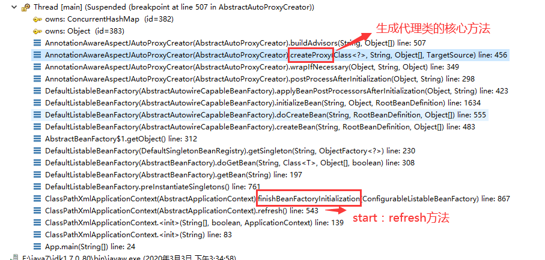
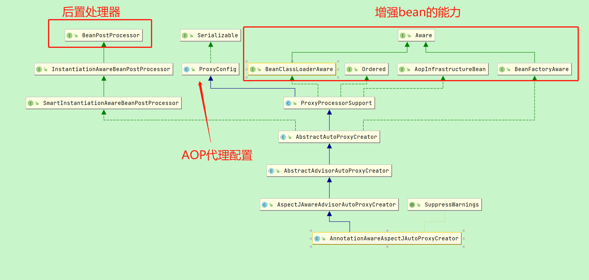
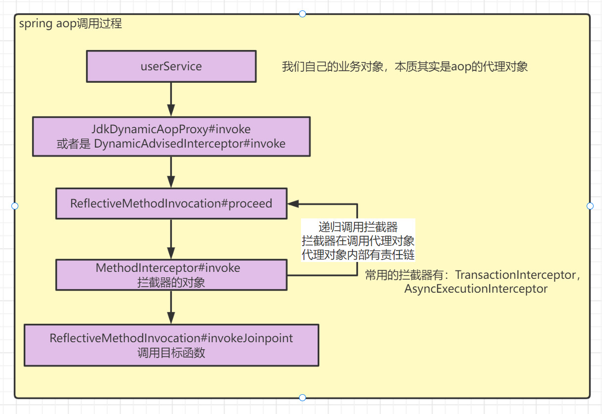

# Spring AOP

Aop原理与动态代理： [https://mp.weixin.qq.com/s/PX7A3pUqQHhxkO3zJBWSJg](https://mp.weixin.qq.com/s/PX7A3pUqQHhxkO3zJBWSJg)

## 1.介绍
AOP是一种设计思想，称为面向切面编程，利用横切技术剖析对象内部，将业务之间共同调用的逻辑提取并封装为一个可复用的模块，这个模块被命名为切面（Aspect），
该模块减少系统中的重复代码，降低模块间的耦合度，可用于日志、权限认证、事务管理等。
SpringAOP思想的实现一般都是基于代理模式 ，在Java中采用JDK动态代理模式，但是JDK动态代理模式只能代理接口而不能代理类。
因此SpringAOP会在CGLIB、JDK动态代理之间进行切换。

### 1.1.专业术语
1. 切面(Aspect)，一个关注点的模块化，这个关注点可能会横切多个对象
2. 连接点(JoinPoint)，当切面 对某个切入点实行切入时，这个切入点就叫做连接点
3. 通知(Advice)，指的是切面对于某个连接点产生的动作，其中一个切片可以包含多个通知
   1. 前置通知：在某个连接点之前执行的通知，但这个通知不能阻断连接点之前的代码的执行
   2. 后置通知：某个连接点退出时执行的通知，不管是正常返回还是异常退出
   3. 环绕通知：包围一个连接点的通知，类似Web Servlet规范中Filter的doFilter()方法，在方法调用前后完成自定义的行为
   4. 返回后通知：在某个连接点正常完成后执行的通知，不包括抛出异常的通知
   5. 异常通知：在方法异常导致退出时执行的通知
4. 切入点(Pointcut)，规定切面可以切目标的哪些位置，这些位置就是切入点
5. 目标对象(Target Object)，要访问的对象
6. 代理对象(Proxy)，目标和切面织在一起形成的新对象。对于客户对象来说，目标对象和代理对象是一样的
7. 织入(Weaving)，动词 指的就是把目标和切面织在一起的动作
编译期
类装载期
运行期

### 1.2.使用场景
1. 日志处理
2. 用户登录
3. 权限（Authentication ）
4. 性能优化（Performance optimization）比如缓存：CacheInterceptor
5. 事务（Transactions ）比如：TransactionInterceptor
6. 记录跟踪　优化　监控等（logging, tracing, profiling and monitoring）
7. 调试（Debugging）：比如： DebugInterceptor
8. 懒加载（Lazy loading）
9. 错误处理（Error handling）
10. 资源池（Resource pooling）
11. 异步（async），比如：AsyncExecutionInterceptor

aspectJ 相关的代理类： AspectJMethodBeforeAdvice、AspectJAroundAdvice、AspectJAfterAdvice、AspectJAfterReturningAdvice、AspectJAfterThrowingAdvice等

### 1.3.动态代理常见方案
[代码案例](https://gitee.com/luckSnow/knowledge/tree/master/learn_code/src/main/java/com/zx/_05_%E4%BB%A3%E7%90%86)

常见的方案有 jdk proxy, cglib, AspectJ。spring中我们使用 jdk proxy 和 cglib。 

jdk proxy：jdk通过实现目标的接口，完成动态代理。生成的新class会加载到jvm中，特点是类名是：class com.sun.proxy.$Proxy0
cglib：动态继承目标类，创建子类的方式，完成动态代理。生成的新class会加载到jvm中，特点是类名是：com.zx.RealSubjectImpl$$EnhancerByCGLIB$$36e2bca2
AspectJ：通过字节码增强的方式，在编译的时候，将增强的代码编译到目标类中，完成动态代理。不会生成新的class。

## 2. 实现原理
在Spring IOC流程中，实例化对象后的初始化对象环节，通过调用BeanPostProcessor#后置处理器，判断该对象需要代理的功能，并将这些功能以 MethdInterceptor 的责任链的方式保存到这个代理对象中。


整体的步骤分为三步
1. 配置aop
2. 创建并注入代理对象
3. 使用代理对象

### 2.1 配置aop
在spring boot项目中采用下面2种方式   
- 方式1：使用 @EnableAspectJAutoProxy(proxyTargetClass = true)    
- 方式2：配置 spring.aop.proxy-target-class=true    

#### 2.1.1. 我们的配置
会被 spring 解析为下面的注解。
```java
@Target(ElementType.TYPE)
@Retention(RetentionPolicy.RUNTIME)
@Documented
@Import(AspectJAutoProxyRegistrar.class)
public @interface EnableAspectJAutoProxy {
    
    // 设置为true，表示代理对象的生成都是通过CGLIB方式
    boolean proxyTargetClass() default false;
    
    // 为了解决一些由于代理引发的切面失效问题，Spring AOP在Spring 4.3.1中引入了AopContext类来将处理类的引用存储在ThreadLocal中，通过AopContext可以快速获取当前类的代理类
    //默认为关闭，如果声明为true，即可使用AopContext获取代理类
    boolean exposeProxy() default false;
}
```

#### 2.1.2. Import 注解导入 AspectJAutoProxyRegistrar    
AspectJAutoProxyRegistrar 是 ImportBeanDefinitionRegistrar 的实现类，用于动态向IOC容器注册BeanDefinition。   
作用：1. 注册后置处理器： AnnotationAwareAspectJAutoProxyCreator；2.配置aop的全局变量   
```java
class AspectJAutoProxyRegistrar implements ImportBeanDefinitionRegistrar {

    @Override
    public void registerBeanDefinitions(AnnotationMetadata importingClassMetadata, BeanDefinitionRegistry registry) {
        // 向ioc容器中注册一个 AnnotationAwareAspectJAutoProxyCreator 后置处理器，它是用来生成代理对象的
        AopConfigUtils.registerAspectJAnnotationAutoProxyCreatorIfNecessary(registry);
        // 处理注解的两个属性
        AnnotationAttributes enableAspectJAutoProxy = AnnotationConfigUtils.attributesFor(importingClassMetadata, EnableAspectJAutoProxy.class);
        if (enableAspectJAutoProxy != null) {
            // 如果proxyTargetClass设置为true，则强制指定AutoProxyCreator使用CGLIB进行代理
            if (enableAspectJAutoProxy.getBoolean("proxyTargetClass")) {
                AopConfigUtils.forceAutoProxyCreatorToUseClassProxying(registry);
            }
            // 如果exposeProxy设置为true，则开启exposeProxy特性
            if (enableAspectJAutoProxy.getBoolean("exposeProxy")) {
                AopConfigUtils.forceAutoProxyCreatorToExposeProxy(registry);
            }
        }
    }
}
```
#### 2.1.3. AnnotationAwareAspectJAutoProxyCreator 是 BeanPostProcessor 的实现类


后置处理方法。AbstractAutoProxyCreator#postProcessAfterInitialization
```java
// 1.后置处理方法
public Object postProcessAfterInitialization(@Nullable Object bean, String beanName) {
    if (bean != null) {
        // 从BeanFactory中找到bean的key
        Object cacheKey = getCacheKey(bean.getClass(), beanName);
        // earlyProxyReferences 保存创建中的代理对象，如果bean跟缓存的对象不一致或者不存在，就开始生成代理对象
        if (this.earlyProxyReferences.remove(cacheKey) != bean) {
            // 生成代理对象
            return wrapIfNecessary(bean, beanName, cacheKey);
        }
    }
    return bean;
}
// 2.判断是否需要生成代理对象
protected Object wrapIfNecessary(Object bean, String beanName, Object cacheKey) {
    // 判断是否需要生成代理对象
    if (StringUtils.hasLength(beanName) && this.targetSourcedBeans.contains(beanName)) {
        return bean;
    }
    if (Boolean.FALSE.equals(this.advisedBeans.get(cacheKey))) {
        return bean;
    }
    if (isInfrastructureClass(bean.getClass()) || shouldSkip(bean.getClass(), beanName)) {
        this.advisedBeans.put(cacheKey, Boolean.FALSE);
        return bean;
    }
    // 判断是否需要生成代理对象
    Object[] specificInterceptors = getAdvicesAndAdvisorsForBean(bean.getClass(), beanName, null);
    if (specificInterceptors != DO_NOT_PROXY) {// DO_NOT_PROXY = null
        this.advisedBeans.put(cacheKey, Boolean.TRUE);
        // 生成代理
        Object proxy = createProxy(bean.getClass(), beanName, specificInterceptors, new SingletonTargetSource(bean));
        this.proxyTypes.put(cacheKey, proxy.getClass());
        return proxy;
    }
    this.advisedBeans.put(cacheKey, Boolean.FALSE);
    return bean;
}
// 3. 为当前bean实例生成代理对象
protected Object createProxy(Class<?> beanClass, String beanName, Object[] specificInterceptors, TargetSource targetSource) {
    if (this.beanFactory instanceof ConfigurableListableBeanFactory) {
        AutoProxyUtils.exposeTargetClass((ConfigurableListableBeanFactory) this.beanFactory, beanName, beanClass);
    }
    // 创建代理工厂
    ProxyFactory proxyFactory = new ProxyFactory();
    proxyFactory.copyFrom(this);

    if (proxyFactory.isProxyTargetClass()) {
        if (Proxy.isProxyClass(beanClass)) {
            for (Class<?> ifc : beanClass.getInterfaces()) {
                proxyFactory.addInterface(ifc);
            }
        }
    } else {
        if (shouldProxyTargetClass(beanClass, beanName)) {
            proxyFactory.setProxyTargetClass(true);
        } else {
            evaluateProxyInterfaces(beanClass, proxyFactory);
        }
    }
    // 所有aop的切面
    Advisor[] advisors = buildAdvisors(beanName, specificInterceptors);
    // 设置代理工厂
    // 1. 设置切面    
    proxyFactory.addAdvisors(advisors);			
    // 2. 设置目标对象
    proxyFactory.setTargetSource(targetSource);
    customizeProxyFactory(proxyFactory);

    proxyFactory.setFrozen(this.freezeProxy);
    if (advisorsPreFiltered()) {
        proxyFactory.setPreFiltered(true);
    }
    // 3.生成代码对象
    return proxyFactory.getProxy(getProxyClassLoader());
}
```   

### 2.2 创建并注入代理对象
#### 2.2.1. 创建对象流程    
AbstractAutowireCapableBeanFactory#doCreateBean。以下是简化的代码。
```java
protected Object doCreateBean(String beanName, RootBeanDefinition mbd, @Nullable Object[] args) throws BeanCreationException {
    // 1. 实例化对象
    // 反射生成对象 beanName -> BeanWrapper
    BeanWrapper instanceWrapper = createBeanInstance(beanName, mbd, args);
    // 获得原始对象  BeanWrapper ->  bean
    Object bean = instanceWrapper.getWrappedInstance();
    
    // 2.处理特殊的BeanPostProcessor，比如AutowiredAnnotationBeanPostProcessor，解析@Autowired的属性
    applyMergedBeanDefinitionPostProcessors(mbd, beanType, beanName);
    
    // 3.将创建中的对象，先保存到三级缓存中。判断条件： 单例 && 允许循环引用 && 对象正在创建中
    // 作用1：将单例对象缓存起来，目的是为了解决循环引用的问题（在允许循环引用的前提下，已经正在创建中的单例）
    // 作用2: 调用 getEarlyBeanReference 方法，对需要进行aop的对象生成 代理对象，不需要的还是原始对象。并将其封装为ObjectFactory对象。
    boolean earlySingletonExposure = (mbd.isSingleton() && this.allowCircularReferences && isSingletonCurrentlyInCreation(beanName));
    if(earlySingletonExposure){
        addSingletonFactory(beanName, () -> getEarlyBeanReference(beanName, mbd, bean));
    }
    // exposedObject 表示对外暴露的对象
    Object exposedObject = bean;
    // 4.自动装配Bean实例的属性
    populateBean(beanName, mbd, instanceWrapper);
    
    // 5.初始化对象，即调用init()，并且根据需要生成AOP的代理对象（如果在上面第3步的时候已经生成过AOP代理，此步不再生成）
    exposedObject = initializeBean(beanName, exposedObject, mbd);
    
    // 如果对象保存在三级缓存的话，在完成对象创建后，对依赖的对象进行处理
    if (earlySingletonExposure) {
        // 获得当前对象，getSingleton 将三级缓存转移到二级缓存中
        Object earlySingletonReference = getSingleton(beanName, false);
        if (earlySingletonReference != null) {
            if (exposedObject == bean) {
                exposedObject = earlySingletonReference;
            } else if (!this.allowRawInjectionDespiteWrapping && hasDependentBean(beanName)) {
                // 如果bean创建的时候，有依赖的对象，这里需要判断所有依赖的对象是否也存在创建了
                String[] dependentBeans = getDependentBeans(beanName);
                Set<String> actualDependentBeans = new LinkedHashSet<>(dependentBeans.length);
                for (String dependentBean : dependentBeans) {
                    if (!removeSingletonIfCreatedForTypeCheckOnly(dependentBean)) {
                        actualDependentBeans.add(dependentBean);
                    }
                }
                // 有依赖没有创建就抛出异常
                if (!actualDependentBeans.isEmpty()){
                    throw new BeanCurrentlyInCreationException(beanName);
                }
            }
        }
    }
    return exposedObject;
}

/**
 * 将刚刚创建的对象放入缓存
 * 这里并不是直接将Bean放入缓存，而是包装成了ObjectFactory对象再放入
 */
protected void addSingletonFactory(String beanName, ObjectFactory<?> singletonFactory) {
    synchronized (this.singletonObjects) {
        if (!this.singletonObjects.containsKey(beanName)) {
            this.singletonFactories.put(beanName, singletonFactory);// 加入三级缓存
            this.earlySingletonObjects.remove(beanName);			// 保护性的从二级缓存删除
            this.registeredSingletons.add(beanName);
        }
    }
}
// 初始化bean
protected Object initializeBean(final String beanName, final Object bean, RootBeanDefinition mbd) {
   // 依次调用 BeanNameAware  BeanClassLoaderAware  BeanFactoryAware 的增强方法
   if (bean instanceof Aware) {
      if (bean instanceof BeanNameAware) {
       ((BeanNameAware) bean).setBeanName(beanName);
      }
      if (bean instanceof BeanClassLoaderAware) {
        ((BeanClassLoaderAware) bean).setBeanClassLoader(getBeanClassLoader());
      }
      if (bean instanceof BeanFactoryAware) {
        ((BeanFactoryAware) bean).setBeanFactory(AbstractAutowireCapableBeanFactory.this);
      }
   }
   // 调用BeanPostProcessor 的前置初始化方法
   Object wrappedBean = bean;
   if (mbd == null || !mbd.isSynthetic()) {
      wrappedBean = applyBeanPostProcessorsBeforeInitialization(wrappedBean, beanName);
   }
   // 调用初始化方法
   // 调用 InitializingBean#afterPropertiesSet方法
   // 调用 xml配置的 init 方法  
   invokeInitMethods(beanName, wrappedBean, mbd);

   // 调用BeanPostProcessor 的后置初始化方法
   if (mbd == null || !mbd.isSynthetic()) {
      wrappedBean = applyBeanPostProcessorsAfterInitialization(wrappedBean, beanName);
   }
   return wrappedBean;
}

// 生成早期代理对象
protected Object getEarlyBeanReference(String beanName, RootBeanDefinition mbd, Object bean) {
   Object exposedObject = bean;
   if (bean != null && !mbd.isSynthetic() && hasInstantiationAwareBeanPostProcessors()) {
      for (BeanPostProcessor bp : getBeanPostProcessors()) {
         // 找到后置处理器中的 SmartInstantiationAwareBeanPostProcessor （也就是 AnnotationAwareAspectJAutoProxyCreator ）
         if (bp instanceof SmartInstantiationAwareBeanPostProcessor) {
            SmartInstantiationAwareBeanPostProcessor ibp = (SmartInstantiationAwareBeanPostProcessor) bp;
            // 其实调用的是AbstractAutoProxyCreator#getEarlyBeanReference方法去创建代理对象
            exposedObject = ibp.getEarlyBeanReference(exposedObject, beanName);
            if (exposedObject == null) {
                return null;
            }
         }
      }
   }
   // 代理对象或者原始对象
   return exposedObject;
}
```
#### 2.2.2. 创建代理对象的位置
我们可以看到在初始化流程中有两次可以创建代理对象。  代码都在上面了  
第一次是：将创建中的对象，先保存到三级缓存中，提前暴露出来。   AbstractAutowireCapableBeanFactory#getEarlyBeanReference
第二次是：initializeBean，调用 AbstractAutoProxyCreator#postProcessAfterInitialization

#### 2.2.3. 创建代理对象
上面说的两次创建代理对象，都是通过 ProxyFactory 创建的。
```java
public Object getProxy(@Nullable ClassLoader classLoader) {
    //1.createAopProxy()判断生成代理的方式: cglib或jdk
    //2.getProxy()生成代理对象
    return createAopProxy().getProxy(classLoader);
}

/**
 * 获取动态代理生成器
 */
protected final synchronized AopProxy createAopProxy() {
    if (!this.active) {
        activate();
    }
    return getAopProxyFactory().createAopProxy(this);
}

public AopProxy createAopProxy(AdvisedSupport config) throws AopConfigException {
    // 如果没有用户接口的话，那就使用CGLIB生成动态代理
    if (config.isOptimize() || config.isProxyTargetClass() || hasNoUserSuppliedProxyInterfaces(config)) {
        Class<?> targetClass = config.getTargetClass();
        if (targetClass == null) {
            throw new AopConfigException("TargetSource cannot determine target class: Either an interface or a target is required for proxy creation.");
        }
        if (targetClass.isInterface() || Proxy.isProxyClass(targetClass)) {
            return new JdkDynamicAopProxy(config);
        }
        return new ObjenesisCglibAopProxy(config);
    } else {
        // 有接口就通过JDK的动态代理
        return new JdkDynamicAopProxy(config);
    }
}
```

#### 2.2.4. 动态代理类
1. JdkDynamicAopProxy，只有JdkDynamicAopProxy一个实现类
```java
public Object getProxy(@Nullable ClassLoader classLoader) {
   Class<?>[] proxiedInterfaces = AopProxyUtils.completeProxiedInterfaces(this.advised, true);
   findDefinedEqualsAndHashCodeMethods(proxiedInterfaces);
   // JDK的动态代理
   return Proxy.newProxyInstance(classLoader, proxiedInterfaces, this);
}
```
2. CglibAopProxy 就是cglib的动态代理类，内置了多个拦截器，用于代理不同类型的方法，比如 Static方法、Equals方法、hash方法等
```java
public Object getProxy(@Nullable ClassLoader classLoader) {
    if (logger.isTraceEnabled()) {
        logger.trace("Creating CGLIB proxy: " + this.advised.getTargetSource());
    }
    try {
        Class<?> rootClass = this.advised.getTargetClass();
        Assert.state(rootClass != null, "Target class must be available for creating a CGLIB proxy");
        Class<?> proxySuperClass = rootClass;
        if (rootClass.getName().contains(ClassUtils.CGLIB_CLASS_SEPARATOR)) {
            proxySuperClass = rootClass.getSuperclass();
            Class<?>[] additionalInterfaces = rootClass.getInterfaces();
            for (Class<?> additionalInterface : additionalInterfaces) {
                this.advised.addInterface(additionalInterface);
            }
        }
        validateClassIfNecessary(proxySuperClass, classLoader);

        // 配置CGLIB增强器
        Enhancer enhancer = createEnhancer();
        if (classLoader != null) {
            enhancer.setClassLoader(classLoader);
            if (classLoader instanceof SmartClassLoader && ((SmartClassLoader) classLoader).isClassReloadable(proxySuperClass)) {
                enhancer.setUseCache(false);
            }
        }
        enhancer.setSuperclass(proxySuperClass);
        enhancer.setInterfaces(AopProxyUtils.completeProxiedInterfaces(this.advised));
        enhancer.setNamingPolicy(SpringNamingPolicy.INSTANCE);
        enhancer.setStrategy(new ClassLoaderAwareGeneratorStrategy(classLoader));

        Callback[] callbacks = getCallbacks(rootClass);
        Class<?>[] types = new Class<?>[callbacks.length];
        for (int x = 0; x < types.length; x++) {
            types[x] = callbacks[x].getClass();
        }
        enhancer.setCallbackFilter(new ProxyCallbackFilter(this.advised.getConfigurationOnlyCopy(), this.fixedInterceptorMap, this.fixedInterceptorOffset));
        enhancer.setCallbackTypes(types);
        // 生成动态代理类和代理类的实例
        return createProxyClassAndInstance(enhancer, callbacks);
    } catch (CodeGenerationException | IllegalArgumentException ex) {
        throw new AopConfigException("Could not generate CGLIB subclass of " + this.advised.getTargetClass() + ": Common causes of this problem include using a final class or a non-visible class", ex);
    } catch (Throwable ex) {
        throw new AopConfigException("Unexpected AOP exception", ex);
    }
}
```
### 2.3 使用代理对象
JdkDynamicAopProxy 和 CglibAopProxy 生成的代理，都是调用 invoke 方法

我们已经把需要代理对象的功能，组合成一个合集（List<MethodInterceptor>），以 责任链模式 依次调用

调用链如下：



### 2.4 自定义aop
自己实现日志记录。虽然我们使用的注解是 Aspect，但是他的实现还是spring aop，并不是AspectJ，主要还是为了方便

1. 定义注解
```java
@Target(ElementType.METHOD)
@Retention(RetentionPolicy.RUNTIME)
@Documented
public @interface LoggerManage {
    public String description();
}
```

2. 使用 @Aspect 注解定义我们的切面
```java
@Aspect
@Component
@Slf4j
public class LoggerAdvice {

    @Before("within(com.zx.web.aop..*) && @annotation(loggerManage)")
    public void addBeforeLogger(JoinPoint joinPoint, LoggerManage loggerManage) {
        log.info("执行 " + loggerManage.description() + " 开始");
        log.info(joinPoint.getSignature().toString());
        log.info(parseParames(joinPoint.getArgs()));
    }

    @AfterReturning("within(com.zx.web.aop..*) && @annotation(loggerManage)")
    public void addAfterReturningLogger(JoinPoint joinPoint, LoggerManage loggerManage) {
        log.info("执行 " + loggerManage.description() + " 结束");
    }

    @AfterThrowing(pointcut = "within(com.zx.web.aop..*) && @annotation(loggerManage)", throwing = "ex")
    public void addAfterThrowingLogger(JoinPoint joinPoint, LoggerManage loggerManage, Exception ex) {
        log.error("执行 " + loggerManage.description() + " 异常", ex);
    }

    private String parseParames(Object[] parames) {
        if (null == parames || parames.length <= 0) {
            return "";
        }
        StringBuffer param = new StringBuffer("传入参数[{}] ");
        for (Object obj : parames) {
            param.append(obj.toString()).append("  ");
        }
        return param.toString();
    }
}
```
3. 使用我们的注解
```java
@RestController
@RequestMapping("aop")
public class AopController {

   @LoggerManage(description = "根据名字查询用户1")
   @RequestMapping("/d1")// http://127.0.0.1:8080/myApp/aop/d1?name=张三
   public Response d1(UserQueryForm form) {
      String name = form.getName();
      return new Response(new User(1L, name, 18));
   }
}    
```


## 3.常见面试题
<p style="color:red">问题：何时使用JDK动态代理，何时使用CGLIB动态代理？</p>  
首先，只有bean用到aop的时候，才会使用到动态代理。所以对于普通的bean，spring只会帮我们实例化成原始的对象。

需要进行动态代理的时候：
1. 目标对象实现了接口的话，默认使用JDK的动态代理
2. 目标对象实现了接口的话，通过配置代理类型，强制使用 CGLib
3. 目标对象没有实现接口，只能使用CGLib
4. 在spring boot中，默认使用CGLib。[https://segmentfault.com/a/1190000041034026](https://segmentfault.com/a/1190000041034026)

默认使用CGLib的原因是： 使用jdk动态代理，无法使用实现类注入属性。
因为JdkProxy实例化的是接口，所以通过类型找不到对象。CGLib 实例化的子类，通过类型可以找到对象。
```java
// 接口
public interface IFun{
    
} 
// 实现类
@Service
public class FunImpl implements IFun {
    
}
// 注入实现类， spring 项目中会因为找不到fun报错了。而spring boot项目中可以找到
@Service
public class Demo {
    @Autowrite
    private FunImpl fun;
}
```

<p style="color:red">问题：多重代理如何实现？</p>
很多时候，我们对同一个方法可能需要多重代理。比如，事务、缓存、监控、日志等。    
jdk proxy 是可以对代理对象进行二次代理，但是这样将导致我们的代理对象变得非常复杂，并且会创建出更多的class文件。    
cglib 的设计是只能被代理一次。这和我们的需求不一致。    
 
所以 spring 是怎么实现的呢？ 责任链模式    
spring 将我们的目标对象 封装为 MethodInvocation 对象(cglib是CglibMethodInvocation, jdk是ReflectiveMethodInvocation)
```java
public class ReflectiveMethodInvocation implements ProxyMethodInvocation, Cloneable {
   // 代理对象 
   protected final Object proxy;
   // 目标原始对象
   protected final Object target;
   // 需要调用的方法
   protected final Method method;
   // 目标类型
   private final Class<?> targetClass;
   // 需要执行的功能责任链，比如事务的 TransactionInterceptor、CacheInterceptor....
   protected final List<?> interceptorsAndDynamicMethodMatchers;
   // 责任链执行的位置，从0开始依次执行
   private int currentInterceptorIndex = -1;

   public Object proceed() throws Throwable {
      // 1. 依次执行责任链中的功能，当没有 interceptor 都执行完之后，我们就通过反射调用目标对象
      if (this.currentInterceptorIndex == this.interceptorsAndDynamicMethodMatchers.size() - 1) {
         return invokeJoinpoint();
      }
      // 2. 找到需要执行的 interceptor
      Object interceptorOrInterceptionAdvice = this.interceptorsAndDynamicMethodMatchers.get(++this.currentInterceptorIndex);
      
      // 3. 调用 interceptor
      if (interceptorOrInterceptionAdvice instanceof InterceptorAndDynamicMethodMatcher) {
         InterceptorAndDynamicMethodMatcher dm = (InterceptorAndDynamicMethodMatcher) interceptorOrInterceptionAdvice;
         Class<?> targetClass = (this.targetClass != null ? this.targetClass : this.method.getDeclaringClass());
         if (dm.methodMatcher.matches(this.method, targetClass, this.arguments)) {
            return dm.interceptor.invoke(this);
         } else {
            return proceed();
         }
      } else {
         // 正常的时候，都调用这个，MethodInterceptor 对象在执行自己的功能后，
         // 都会调用 invocation.proceed(),继续执行责任链的 interceptor
         return ((MethodInterceptor) interceptorOrInterceptionAdvice).invoke(this);
      }
   }
   //通过反射调用目标对象
   protected Object invokeJoinpoint() throws Throwable {
      return AopUtils.invokeJoinpointUsingReflection(this.target, this.method, this.arguments);
   }
}
```
责任链中的 interceptor 执行案例
```java
// 1. 异步调用
public class AsyncExecutionInterceptor extends AsyncExecutionAspectSupport implements MethodInterceptor, Ordered {

   public Object invoke(final MethodInvocation invocation) throws Throwable {
      Class<?> targetClass = (invocation.getThis() != null ? AopUtils.getTargetClass(invocation.getThis()) : null);
      Method specificMethod = ClassUtils.getMostSpecificMethod(invocation.getMethod(), targetClass);
      final Method userDeclaredMethod = BridgeMethodResolver.findBridgedMethod(specificMethod);

      AsyncTaskExecutor executor = determineAsyncExecutor(userDeclaredMethod);
      if (executor == null) {
         throw new IllegalStateException("No executor specified and no default executor set on AsyncExecutionInterceptor either");
      }
      // 创建一个回调函数，里面调用 invocation.proceed()，并把任务提交到线程池  
      Callable<Object> task = () -> {
         try {
            Object result = invocation.proceed();
            if (result instanceof Future) {
               return ((Future<?>) result).get();
            }
         } catch (ExecutionException ex) {
            handleError(ex.getCause(), userDeclaredMethod, invocation.getArguments());
         } catch (Throwable ex) {
            handleError(ex, userDeclaredMethod, invocation.getArguments());
         }
         return null;
      };

      return doSubmit(task, executor, invocation.getMethod().getReturnType());
   }
}
// 2.事务
public class TransactionInterceptor extends TransactionAspectSupport implements MethodInterceptor, Serializable {
   public Object invoke(MethodInvocation invocation) throws Throwable {
      Class<?> targetClass = (invocation.getThis() != null ? AopUtils.getTargetClass(invocation.getThis()) : null);
      // 开启事务后，调用 invocation.proceed()
      return invokeWithinTransaction(invocation.getMethod(), targetClass, invocation::proceed);
   }
}
```

<p style="color:red">问题：动态代理方案的性能对比</p>
实际中，高版本的JDK 动态代理的性能是高于CGLib

> 在aop方面，关于性能，我们其实可以得出一个排序

AspectJ > JDK > CGLib   
AspectJ的缺点是编译时直接改写class文件，没有扩展性   
CGLib 是扩展性最好的


<p style="color:red">问题：aop 实现原理</p>
使用jdk或者cglib的动态代理实现的
1. 在spring IOC启动过程中，有两个地方会创建代理对象。1.创建过程中在保存到三级缓存的时候，提前创建暴露代理对象。2，init阶段，通过 beanPostProcesser#后置处理方法，创建代理对象。
2. 通过 ProxyFactory 创建代理对象，根据配置以及目标类型 判断使用 jdk还是cglib 进行动态代理。 