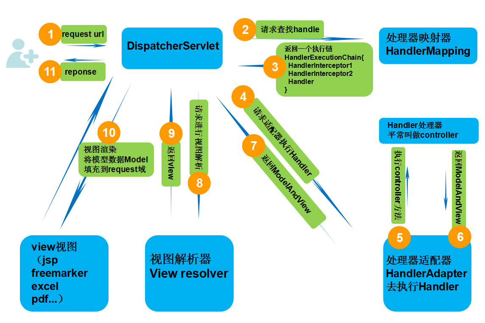
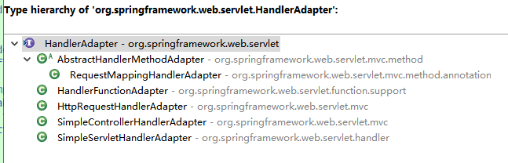
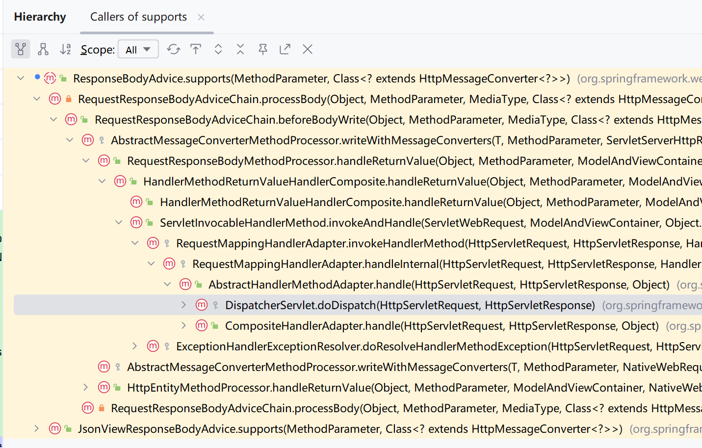

# Spring MVC

- 统一封装处理类：ResponseBodyAdvice
- 参数校验实现原理：
- 自定义异常实现原理：
[https://mp.weixin.qq.com/s/tyYr1Kt0jppcBn5fkJgBqA](https://mp.weixin.qq.com/s/tyYr1Kt0jppcBn5fkJgBqA)

## 1.核心架构

经典MVC设计架构
- M model 模型
- V view 视图
- C controller 控制器

spring mvc 的 核心分为两部分
1. 前端控制器： DispatcherServlet 处理http请求
2. 后端控制器： controller(一般情况下)，处理业务


spring mvc 是 spring framework的一个核心模块，并不是单独的项目。延续了 J2EE 标准，通过一个Servlet暴露接口，
完成对所有请求的收敛，主要的功能如下：
- 处理http请求
- 拦截器
- 视图解析器
- 国际化
- SpEL

## 2.请求处理过程

### 2.1.DispatcherServlet

DispatcherServlet 也称为 前端控制器，在Spring IOC容器初始化过程中，就会实例化一个DispatcherServlet实例到容器中。

作用：作为统一访问点，进行全局的请求控制。DispatcherServlet 收到请求后自己不进行处理，而是委托给其他的解析器进行处理；

### 2.2.请求流程

SpringMVC请求流程详解： https://www.cnblogs.com/leskang/p/6101368.html   
https://blog.csdn.net/u010859650/article/details/81167223




1. 首先用户发送请求->DispatcherServlet   
2. HandlerMapping->HandlerExecutionChain：
    根据请求的URI 从 HandlerMapping中 获得 HandlerExecutionChain对象（包含一个Handler处理器 以及 handler对应的Interceptor拦截器），
3. HandlerExecutionChain->HandlerAdapter：
   根据Handler的类型，适配器会适配成不同的HandlerAdapter（即适配器设计模式的应用，从而很容易支持很多类型的处理器）
4. 调用拦截器的preHandler方法
5. 调用Handler的请求处理方法： HandlerAdapter调用对应handler的方法，过程中会提取Request中的模型数据，填充Handler入参，涉及以下功能：
   - HttpMessageConveter：将请求消息（如 Json、xml 等数据）转换成一个对象，将对象转换为指定的响应信息。
   - 数据转换：对请求消息进行数据转换。如String转换成Integer、Double等。
   - 数据根式化：对请求消息进行数据格式化。如将字符串转换成格式化数字或格式化日期等。
   - 数据验证：验证数据的有效性（长度、格式等），验证结果存储到BindingResult或Error中。
6. Handler处理完请求，返回ModelAndView对象（包含模型数据、逻辑视图名），如果Handler的响应类型是ResponseBody则直接响应请求。
7. 通过ViewResolver将ModelAndView中的逻辑视图名解析为具体的View，通过这种策略模式，很容易更换其他视图技术；
8. 渲染View会根据传进来的Model模型数据进行渲染，此处的Model实际是一个Map数据结构，因此很容易支持其他视图技术；
9. 返回控制权给DispatcherServlet，由DispatcherServlet返回响应给用户，到此一个流程结束。


调用过程中，比较重要的是HandlerAdapter，根据controller的不同的实现方式，会适配到不同的handler处理方式。
因为不同的实现方式，HandlerExecutionChain中保存实际需要调用的对象，也就是handler字段，会被封装成不用的对象。
注解方式都是HandlerMethod。



<span style="color:red">问题：Spring mvc如何统计URL调用耗时？</span>
- 使用动态代理，自定义aop。最合适
- 拦截器，使用request属性或者threadLocal都可以
- 过滤器，很简单的实现，但是调用时间为整个spring MVC的处理时间
- request的监听器很简单的实现，但是调用时间为整个spring MVC和tomcat的处理时间
- 重新实现DispatcherServlet的方法，想监控哪里就监控哪里

## 3.常用操作

### 3.1.接口实现方式

1.实现Controller接口

```java
/**
 * 实现 Controller 接口，springMVC的HandlerAdapter是SimpleControllerHandlerAdapter
 */
@Component("/a")
public class AController implements Controller {

    @Override
    public ModelAndView handleRequest(HttpServletRequest request, HttpServletResponse response) throws Exception {
        System.out.println("aaaa");
        return new ModelAndView("index");
    }
}
```
  
2.实现HttpRequestHandler接口

```java
/**
 * 实现 HttpRequestHandler 接口，springMVC的HandlerAdapter是SimpleControllerHandlerAdapter
 */
@Component("/b")
public class BController implements HttpRequestHandler {

    @Override
    public void handleRequest(HttpServletRequest request, HttpServletResponse response)
            throws ServletException, IOException {
        System.out.println("bbbb");
        response.getWriter().write("bbbb");
    }
}
```

3.继承Servlet

```java
/**
 * 继承HttpServlet，springMVC的HandlerAdapter是 SimpleServletHandlerAdapter。
 * 但是，需要自己注册 SimpleServletHandlerAdapter，否则会报错
 */
@Component("/c")// 需要自己注册
public class CController extends HttpServlet {

   private static final long serialVersionUID = 1L;

   @Override
   protected void service(HttpServletRequest req, HttpServletResponse resp) throws ServletException, IOException {
      System.out.println("cccc");
      resp.getWriter().write("cccc");
   }

   @Bean
   public SimpleServletHandlerAdapter simpleServletHandlerAdapter() {
      return new SimpleServletHandlerAdapter();
   }
}
```

4.使用@RequestMapping注解
   
解析为 HandlerMethod，适配器 RequestMappingHandlerAdapter

```java
@Controller
public class DController {

    @RequestMapping("/d")
    @ResponseBody
    public String d() {
        return "d";
    }
}
```

### 3.2.Valid参数校验

- [使用案例](https://mp.weixin.qq.com/s/pbcp2M3GH65PW2uGR-LXyQ)
- [自定义注解校验规则 与 分组校验](https://juejin.cn/post/7322275119592996927#heading-10)

校验放在哪？Controller层 VS Service层
去网上查阅了一些资料，一般推荐与业务无关的放在Controller层中进行校验，而与业务有关的放在Service层中进行校验。
早在 Java 2009 年就提出了 Bean Validation 规范，并且已经历经 JSR303、JSR349、JSR380 三次标准的置顶，发展到了 2.0 。

Bean Validation 规范的数据校验框架，主要有：Hibernate Validator 和 Apache BVal 而我们在使用spring的时候，也可以使用spring提供的注解。

Spring的校验通常使用Hibernate Validate。
```xml
<dependency>
    <groupId>org.hibernate</groupId>
    <artifactId>hibernate-validator</artifactId>
    <version>6.0.1.Final</version>
</dependency>
注意：它支持el表达式解析，需要配合Tomcat等web容器使用。如果想要单独使用，需要添加这个依赖
<dependency>
    <groupId>org.glassfish</groupId>
    <artifactId>jakarta.el</artifactId>
    <version>3.0.3</version>
</dependency>
```

常用案例：
```java
@Data
public class DataSetSaveVo {
    //唯一标识符为空
    @NotBlank(message = "user uuid is empty")
    
    //用户名称只能是字母和数字
    @Pattern(regexp = "^[a-z0-9]+$", message = "user names can only be alphabetic and numeric")
    @Length(max = 48, message = "user uuid length over 48 byte")
    private String userUuid;

    //数据集名称只能是字母和数字
    @Pattern(regexp = "^[A-Za-z0-9]+$", message = "data set names can only be letters and Numbers")
    
    //文件名称过长
    @Length(max = 48, message = "file name too long")
    
    //文件名称为空
    @NotBlank(message = "file name is empty")
    private String name;

    //数据集描述最多为256字节
    @Length(max = 256, message = "data set description length over 256 byte")
    
    //数据集描述为空
    @NotBlank(message = "data set description is null")
    private String description;
}
```

Controller写法
```java
@PostMapping
public ResponseVO createDataSet(@Valid @RequestBody DataSetSaveVO dataSetVO) {
   return ResponseUtil.success(dataSetService.saveDataSet(dataSetVO));
}
```

### 3.3.统一异常处理

- 1.全局级别的异常处理器，实现HandlerExceptionResolver接口
- 2.在Controller层面使用注解@ExceptionHandler(不推荐，需要在每个controller类中增加异常处理类，非常冗余)
- 3.全局级别的异常处理器，使用注解@ControllerAdvice + @ExceptionHandler （可用定义多个异常处理类，但是处理的异常类型不能重复）


### 3.4.拦截器

我们都知道aop的代表是拦截器。但事实上，spring mvc 的 拦截器 HandlerInterceptor，本质上其实不是正真aop。

DispatcherServlet 中的代码如下
```java
 // 1. 执行拦截器的 前置方法preHandle
 if (!mappedHandler.applyPreHandle(processedRequest, response)) {
     return;
 }
 // 执行controller方法
 mv = ha.handle(processedRequest, response, mappedHandler.getHandler());

 // 2. 将响应结果提交给视图解析器
 applyDefaultViewName(processedRequest, mv);

 // 3. 执行拦截器的 后执法postHandle
 mappedHandler.applyPostHandle(processedRequest, response, mv);
 
// 4. 处理响应结果（转换为json、渲染视图模板、异常处理）
// 包括 执行拦截器的 完成执行方法afterCompletion
processDispatchResult(processedRequest, response, mappedHandler, mv, dispatchException);
```

而拦截器的执行方式为遍历执行所有拦截器的某个方法
```java
boolean applyPreHandle(HttpServletRequest request, HttpServletResponse response) throws Exception {
  HandlerInterceptor[] interceptors = getInterceptors();
  if (!ObjectUtils.isEmpty(interceptors)) {
      for (int i = 0; i < interceptors.length; i++) {
          HandlerInterceptor interceptor = interceptors[i];
          if (!interceptor.preHandle(request, response, this.handler)) {
              triggerAfterCompletion(request, response, null);
              return false;
          }
          this.interceptorIndex = i;
      }
  }
  return true;
}
```

拦截器的使用方式
```java
@Slf4j
public class MyInterceptor implements HandlerInterceptor {

    @Override
    public boolean preHandle(HttpServletRequest request, HttpServletResponse response, Object handler)
            throws Exception {
        log.info(">>interceptor 进入controller之前的处理<<, url={}", request.getRequestURI());
        return true;
    }

    @Override
    public void postHandle(HttpServletRequest request, HttpServletResponse response, Object handler,
            ModelAndView modelAndView) throws Exception {
        log.info(">>interceptor postHandle请求处理之后进行调用，但是在视图被渲染之前（Controller方法调用之后）<<, url={}", request.getRequestURI());
    }

    @Override
    public void afterCompletion(HttpServletRequest request, HttpServletResponse response, Object handler, Exception ex)
            throws Exception {
        response.setHeader("setheader333", "setheader333");
        log.info(">>interceptor 页面渲染之后<<, url={}", request.getRequestURI());
    }
}
```

注意事项：
- postHandle：这是页面的渲染之前，如果controller方法中使用@ResponseBody，则在这里就无法处理response。
  因为response已经调用了flush，接口的数据已经返回到过去了。这里的response状态是commited。
- afterCompletion。只能关闭当前服务的资源，读取参数的数据，无法进行修改。

为什么页面不会出问题，是因为返回页面也是在服务器端处理的，在flush之后，outputStream还没有断开，可以在渲染页面的过程中继续操作。

解决方案：使用RestControllerAdvice
```java
/**
 * 只作用于@ResponseBody修饰过的方法和类
 */
@RestControllerAdvice
public class WebAdvice implements ResponseBodyAdvice<Object> {
    @Override
    public boolean supports(MethodParameter methodParameter, Class converterType) {
        // 只单独处理 ResponseBody的方法
        //boolean flag = methodParameter.hasMethodAnnotation(ResponseBody.class);
        return true;
    }
    @Override
    public Object beforeBodyWrite(Object body, MethodParameter returnType, MediaType selectedContentType,
            Class selectedConverterType, ServerHttpRequest request, ServerHttpResponse response) {
        response.getHeaders().set("setheader111", "setheader111");
        return body;
    }
}
```

原因分析
```java
// DispatcherServlet 调用controller方法的过程中
mv = ha.handle(processedRequest, response, mappedHandler.getHandler());

// 将controller方法返回的数据进行转换
AbstractMessageConverterMethodProcessor#writeWithMessageConverters(ServletServerHttpRequest inputMessage, ServletServerHttpResponse outputMessage)
// 方法中调用write方法
((HttpMessageConverter) converter).write(body, selectedMediaType, outputMessage);


@Override
public final void write(final T t, @Nullable MediaType contentType, HttpOutputMessage outputMessage)
      throws IOException, HttpMessageNotWritableException {

  final HttpHeaders headers = outputMessage.getHeaders();
  addDefaultHeaders(headers, t, contentType);

  if (outputMessage instanceof StreamingHttpOutputMessage) {
      StreamingHttpOutputMessage streamingOutputMessage = (StreamingHttpOutputMessage) outputMessage;
      streamingOutputMessage.setBody(outputStream -> writeInternal(t, new HttpOutputMessage() {
          @Override
          public OutputStream getBody() {
              return outputStream;
          }
          @Override
          public HttpHeaders getHeaders() {
              return headers;
          }
      }));
  }
  else {
      // 我们正常的请求到这里。writeInternal 方法和转换器有关。默认是StringHttpMessageConverter
      writeInternal(t, outputMessage);
      outputMessage.getBody().flush();
  }
}

// StringHttpMessageConverter 中的实现
@Override
protected void writeInternal(String str, HttpOutputMessage outputMessage) throws IOException {
  HttpHeaders headers = outputMessage.getHeaders();
  if (this.writeAcceptCharset && headers.get(HttpHeaders.ACCEPT_CHARSET) == null) {
      headers.setAcceptCharset(getAcceptedCharsets());
  }
  Charset charset = getContentTypeCharset(headers.getContentType());
  // 将结果复制到 OutputStream 中，到这里，我们的接口的数据已经返回过去。后面的操作都不会影响
  StreamUtils.copy(str, charset, outputMessage.getBody());
}


// 上面提到的 代码 outputMessage.getBody().flush();
// 也会将httpServletResponse的状态修改为完成，防止后面有人继续操作OutputStream
```


## RequestBodyAdvice 和 ResponseBodyAdvice

- RequestBodyAdvice：是请求体的拦截器，可以对请求体进行修改或者添加自定义的处理逻辑。
  - supports：用于判断该拦截器是否支持当前请求的方法
  - beforeBodyRead：在体内容被读取之前调用，可以对请求体进行修改。
  - afterBodyRead：在请求体内容被读取之后调用，可以对请求体进行修改。
  - 作用：请求解码、数据解码、日志记录等
  - 注意：这个只作用于请求参数中使用了@RequestBody注解的
- ResponseBodyAdvice：是响应体的拦截器，可以对响应体进行修改或者添加自定义的处理逻辑。 
  - supports：用于判断该拦截器是否支持当前响应的方法
  - beforeBodyWrite：在响应体内容被写入之前用，可以对响应体进行修改。
  - 作用：统一封装结果类型、数据加密等


ResponseBodyAdvice作用位置：
DispatcherServlet调用handle->ServletInvocableHandlerMethod调用controller方法后返回数据，
如果使用了@ResponseBody，则会将数据交给RequestResponseBodyMethodProcessor，在数据转为json之前进行处理。



而RequestBodyAdvice路径相似，是在调用controller之前进行处理


## 核心处理流程

DispatcherServlet中通过adapter调用handle执行controller方法，核心逻辑入口在ServletInvocableHandlerMethod中

```java
// 以下是伪代码
public void invokeAndHandle(ServletWebRequest webRequest, ModelAndViewContainer mavContainer, Object... providedArgs) throws Exception {
    // 1、调用controller，获得返回值。
    Object returnValue = invokeForRequest(webRequest, mavContainer, providedArgs);
    // 2、处理返回值。比如统一数据格式、数据加密、数据格式转换（pojo转json）
    this.returnValueHandlers.handleReturnValue(returnValue, getReturnValueType(returnValue), mavContainer, webRequest);
}

// 1.1.InvocableHandlerMethod
public Object invokeForRequest(NativeWebRequest request, @Nullable ModelAndViewContainer mavContainer,
        Object... providedArgs) throws Exception {
    // 预处理请求参数
    Object[] args = getMethodArgumentValues(request, mavContainer, providedArgs);
    // 通过反射调用controller【没有什么看的】
    return doInvoke(args);
}

// 1.1.1.ModelAttributeMethodProcessor 通过controller方法中的参数，去request中获得数据，并封装为参数
public final Object resolveArgument(MethodParameter parameter, @Nullable ModelAndViewContainer mavContainer,
        NativeWebRequest webRequest, @Nullable WebDataBinderFactory binderFactory) throws Exception {
    String name = ModelFactory.getNameForParameter(parameter);
    ModelAttribute ann = parameter.getParameterAnnotation(ModelAttribute.class);
    // 通过反射，创建参数的对象
    Object attribute  = createAttribute(name, parameter, binderFactory, webRequest);;
    // 创建一个数据绑定器，内部会根据方法中参数的类型创建不同类型的绑定器
    WebDataBinder binder = binderFactory.createBinder(webRequest, attribute, name);
    // 绑定参数，从去request中获得数据，通过反射将数据写入到attribute中
    bindRequestParameters(binder, webRequest);
    // 参数校验，就是使用@Vail相关校验注解
    validateIfApplicable(binder, parameter);
    return attribute;
}
```