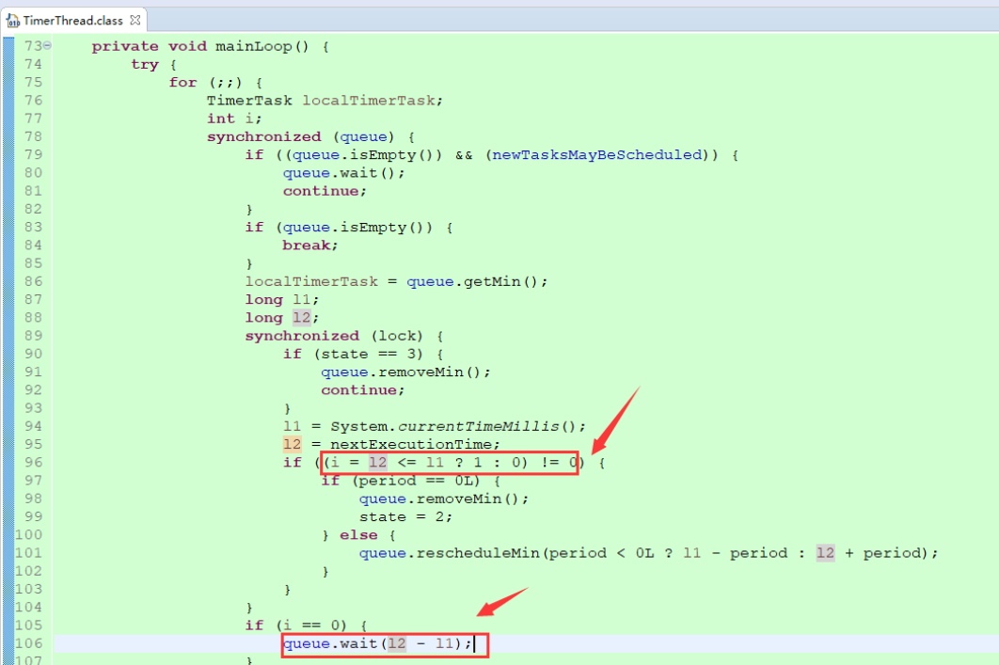

# 定时任务

- [Quartz官网](http://www.quartz-scheduler.org/)
- [Spring 任务](https://www.iteye.com/blog/gong1208-1773177)
- [定时任务方案](https://crossoverjie.top/2019/10/14/algorithm/timer-detail/)
- [分布式定时任务框架选型](https://mp.weixin.qq.com/s/mzK_a5PzDYhOAfWTLfbiwQ)

## 1.任务分类

### 1.1.集中式定时任务

在java中常见的定时任务的实现方案可以实现以下几类：
- Java.util.timer。Java自带的java.util.Timer类，这个类允许你调度一个java.util.TimerTask任务。使用这种方式可以让你的程序按照某一个频度执行，但不能在指定时间运行
- Quartz。这是一个功能比较强大的的调度器，可以让你的程序在指定时间执行，也可以按照某一个频度执行。是目前最主流的方案。
- Spring task。Spring3.0以后自带的task，可以将它看成一个轻量级的Quartz，而且使用起来比Quartz简单许多。

### 1.2.分布式定时任务

上面三种均为单机场景中的方案。如今服务多以集群模式进行部署，一套代码部署二套、三套乃至更多，这就必然导致同一个任务会被执行多次，出现更多问题。所有才有了分布式定时任务的出现。
- 分布式Quartz。Quartz利用了数据库的唯一性，实现的分布式定时任务。确保任务只执行一次。但是提供的功能比较简单。
- xxl-job、Elastic-job、Saturn：这三个都是基于Quartz实现，并将定时任务的执行端分离出去，以RPC的方式进行远程调用，完成任务的执行。

## 2.JDK方案

### 2.1.Timer

实现原理：https://crossoverjie.top/2019/10/14/algorithm/timer-detail/

简单说，timer实例化时使用一个线程启动任务，之后线程wait，这个时候可以提交多TimerTask个需要执行的任务提交到timer中(一个TimerTask实例只能提交一次，实例中维护了任务状态)，

提交任务后，多个任务进行最小堆排序，最近要执行的任务放在堆顶。

提交任务后，开始唤醒（notify）队列，队列获得最近要执行的任务




队列唤醒后，通过比较时间判断是否需要执行，时间不够的话，就wait相应的时间差后重新比较，这一个地放就是同wait实现的时间等待，属于synchronized的monitor的实现方式。

使用timer的优缺点很明显

- 后台调度任务的线程只有一个，所以导致任务是阻塞运行的，一旦其中一个任务执行周期过长将会影响到其他任务。
- Timer 本身没有捕获其他异常（只捕获了 InterruptedException），一旦任务出现异常（比如空指针）将导致后续任务不会被执行

### 2.2.ScheduleExcetorService

看线程池的文档

### 2.3.时间轮

- [https://crossoverjie.top/2019/09/27/algorithm/time%20wheel/](https://crossoverjie.top/2019/09/27/algorithm/time%20wheel/)
- [http://www.360doc.com/content/18/0904/20/41344223_783901490.shtml](http://www.360doc.com/content/18/0904/20/41344223_783901490.shtml)
- [https://www.bbsmax.com/A/q4zVYKgKdK/](https://www.bbsmax.com/A/q4zVYKgKdK/)

Kafka中存在大量的延迟操作，比如延迟生产、延迟拉取以及延迟删除等。Kafka并没有使用JDK自带的Timer或者DelayQueue来实现延迟的功能，而是基于时间轮自定义了一个用于实现延迟功能的定时器（SystemTimer）。
JDK的Timer和DelayQueue插入和删除操作的平均时间复杂度为O(nlog(n))，并不能满足Kafka的高性能要求，而基于时间轮可以将插入和删除操作的时间复杂度都降为O(1)。
时间轮的应用并非Kafka独有，其应用场景还有很多，在Netty、Akka、Quartz、Zookeeper等组件中都存在时间轮的踪影。

Kafka中的时间轮（TimingWheel）是一个存储定时任务的环形队列，底层采用数组实现，数组中的每个元素可以存放一个定时任务列表（TimerTaskList）。
TimerTaskList是一个环形的双向链表，链表中的每一项表示的都是定时任务项（TimerTaskEntry），其中封装了真正的定时任务TimerTask。

## 3.Quartz

### 3.1.Quartz2案例

实现原理与进阶教程： [https://mp.weixin.qq.com/s/db5ii7oSAXqKInQ95QJlaw](https://mp.weixin.qq.com/s/db5ii7oSAXqKInQ95QJlaw)

### 3.2.Quartz1.6旧版本案例

- 代码案例
```java
package com.webyun.datashare.monitor.process;

import java.util.Map;
import java.util.Map.Entry;
import java.util.Set;

import org.quartz.CronTrigger;
import org.quartz.JobDetail;
import org.quartz.Scheduler;
import org.quartz.SchedulerException;
import org.quartz.SchedulerFactory;
import org.quartz.impl.StdSchedulerFactory;

/**
 * @Description: 定时任务管理类，适用于Quartz 1.6和 1.8
 * @ClassName: QuartzManager
 * @author mzm
 * @date 2017-7-26 下午03:15:52
 * @version V2.0
 */
public class QuartzManager {
	
	/**
	 * 定时任务，时间规则
	 字段   		允许值   				允许的特殊字符
	秒   	 		0-59    			, - * /
	分   			0-59    			, - * /
	小时    		0-23    			, - * /
	日期    		1-31    			, - * ? / L W C
	月份    		1-12 或者 JAN-DEC    , - * /
	星期    		1-7 或者 SUN-SAT    	, - * ? / L C #
	年（可选）    	留空, 1970-2099    	, - * / 
	- 区间  
	* 通配符  
	? 你不想设置那个字段
	
	1.下面只例出几个式子
		CRON表达式    				含义 
		"0 0 12 * * ?"    		每天中午十二点触发 
		"0 15 10 ? * *"    		每天早上10：15触发 
		"0 15 10 * * ?"    		每天早上10：15触发 
		"0 15 10 * * ? *"    	每天早上10：15触发 
		"0 15 10 * * ? 2005"    2005年的每天早上10：15触发 
		"0 * 14 * * ?"    		每天从下午2点开始到2点59分每分钟一次触发 
		"0 0/5 14 * * ?"    	每天从下午2点开始到2：55分结束每5分钟一次触发 
		"0 0/5 14,18 * * ?"   	每天的下午2点至2：55和6点至6点55分两个时间段内每5分钟一次触发 
		"0 0-5 14 * * ?"    	每天14:00至14:05每分钟一次触发 
		"0 10,44 14 ? 3 WED"    三月的每周三的14：10和14：44触发 
		"0 15 10 ? * MON-FRI"   每个周一、周二、周三、周四、周五的10：15触发 
	 */
	public static SchedulerFactory gSchedulerFactory = new StdSchedulerFactory();
	
	/**
	 * 定时任务的线程组名称
	 */
	private static final String JOB_GROUP_NAME = "dataShareJobGroupName";
	
	/**
	 * 定时任务的触发器的线程组名称
	 */
	private static final String TRIGGER_GROUP_NAME = "dataShareTriggerGroupName";

	/**
	 * @Description: 添加一个定时任务，使用默认的任务组名，触发器名，触发器组名
	 * @param jobName 任务名
	 * @param cls 任务
	 * @param time 时间设置，参考quartz说明文档
	 * @Title: QuartzManager
	 * @author mzm
	 * @date 2017-7-26 下午03:47:44
	 * @version V2.0
	 */
	@SuppressWarnings("rawtypes")
	public static boolean addJob(String jobName, Class cls, String cron, Map<String, String> params) {
		try {
			Scheduler sched = gSchedulerFactory.getScheduler();
			JobDetail jobDetail = new JobDetail(jobName, JOB_GROUP_NAME, cls);// 任务名，任务组，任务执行类
			//注入参数
			jobDetail.getJobDataMap().putAll(params);
			
			// 触发器
			CronTrigger trigger = new CronTrigger(jobName, TRIGGER_GROUP_NAME);// 触发器名,触发器组
			trigger.setCronExpression(cron);// 触发器时间设定
			sched.scheduleJob(jobDetail, trigger);
			// 启动
			if (!sched.isShutdown()) {
				sched.start();
			}
			return true;
		} catch (Exception e) {
			return false;
		}
	}

	/**
	 * @Description: 添加一个定时任务
	 * @param jobName 任务名
	 * @param jobGroupName 任务组名
	 * @param triggerName 触发器名
	 * @param triggerGroupName 触发器组名
	 * @param jobClass 任务
	 * @param time 时间设置，参考quartz说明文档
	 * @author mzm
	 * @date 2017-7-26 下午03:48:15
	 * @version V2.0
	 */
	@SuppressWarnings("rawtypes")
	public static boolean addJob(String jobName, String jobGroupName, String triggerName, String triggerGroupName,
			Class jobClass, String cron) {
		try {
			Scheduler sched = gSchedulerFactory.getScheduler();
			JobDetail jobDetail = new JobDetail(jobName, jobGroupName, jobClass);// 任务名，任务组，任务执行类
			// 触发器
			CronTrigger trigger = new CronTrigger(triggerName, triggerGroupName);// 触发器名,触发器组
			trigger.setCronExpression(cron);// 触发器时间设定
			sched.scheduleJob(jobDetail, trigger);
			return true;
		} catch (Exception e) {
			return false;
		}
	}

	/**
	 * @Description: 修改一个任务的触发时间(使用默认的任务组名，触发器名，触发器组名)
	 * @param jobName
	 * @param time
	 * @Title: QuartzManager.java
	 * @author mzm
	 * @date 2017-7-26 下午03:49:21
	 * @version V2.0
	 */
	@SuppressWarnings("rawtypes")
	public static boolean modifyJobTime(String jobName, String cron, Map<String, String> params) {
		try {
			Scheduler sched = gSchedulerFactory.getScheduler();
			CronTrigger trigger = (CronTrigger) sched.getTrigger(jobName, TRIGGER_GROUP_NAME);
			if (trigger == null) {
				return false;
			}
			String oldTime = trigger.getCronExpression();
			if (!oldTime.equalsIgnoreCase(cron)) {
				JobDetail jobDetail = sched.getJobDetail(jobName, JOB_GROUP_NAME);
				Class objJobClass = jobDetail.getJobClass();
				removeJob(jobName);
				addJob(jobName, objJobClass, cron, params);
			}
			return true;
		} catch (Exception e) {
			return false;
		}
	}
	
	/**
	 * @Description: 修改一个任务的触发时间
	 * @param triggerName
	 * @param triggerGroupName
	 * @param time
	 * @Title: QuartzManager.java
	 * @author mzm
	 * @date 2017-7-26 下午03:49:37
	 * @version V2.0
	 */
	public static boolean modifyJobTime(String triggerName, String triggerGroupName, String cron) {
		try {
			Scheduler sched = gSchedulerFactory.getScheduler();
			CronTrigger trigger = (CronTrigger) sched.getTrigger(triggerName, triggerGroupName);
			if (trigger == null) {
				return false;
			}
			String oldTime = trigger.getCronExpression();
			if (!oldTime.equalsIgnoreCase(cron)) {
				CronTrigger ct = (CronTrigger) trigger;
				// 修改时间
				ct.setCronExpression(cron);
				// 重启触发器
				sched.resumeTrigger(triggerName, triggerGroupName);
			}
			return true;
		} catch (Exception e) {
			return false;
		}
	}

	/**
	 * @Description: 移除一个任务(使用默认的任务组名，触发器名，触发器组名)
	 * @param jobName
	 * @Title: QuartzManager.java
	 * @author mzm
	 * @date 2017-7-26 下午03:49:51
	 * @version V2.0
	 */
	public static boolean removeJob(String jobName) {
		try {
			Scheduler sched = gSchedulerFactory.getScheduler();
			sched.pauseTrigger(jobName, TRIGGER_GROUP_NAME);// 停止触发器
			sched.unscheduleJob(jobName, TRIGGER_GROUP_NAME);// 移除触发器
			sched.deleteJob(jobName, JOB_GROUP_NAME);// 删除任务
			return true;
		} catch (Exception e) {
			return false;
		}
	}

	/**
	 * @Description: 移除一个任务
	 * 
	 * @param jobName
	 * @param jobGroupName
	 * @param triggerName
	 * @param triggerGroupName
	 * 
	 * @Title: QuartzManager.java
	 * @author mzm
	 * @date 2017-7-26 下午03:50:01
	 * @version V2.0
	 */
	public static boolean removeJob(String jobName, String jobGroupName, String triggerName, String triggerGroupName) {
		try {
			Scheduler sched = gSchedulerFactory.getScheduler();
			sched.pauseTrigger(triggerName, triggerGroupName);// 停止触发器
			sched.unscheduleJob(triggerName, triggerGroupName);// 移除触发器
			sched.deleteJob(jobName, jobGroupName);// 删除任务
			return true;
		} catch (Exception e) {
			return false;
		}
	}

	/**
	 * @Description:启动所有定时任务
	 * @Title: QuartzManager.java
	 * @author mzm
	 * @date 2017-7-26 下午03:50:18
	 * @version V2.0
	 */
	public static boolean startJobs() {
		try {
			Scheduler sched = gSchedulerFactory.getScheduler();
			sched.start();
			return true;
		} catch (Exception e) {
			return false;
		}
	}

	/**
	 * @Description:关闭所有定时任务
	 * @Title: QuartzManager.java
	 * @author mzm
	 * @date 2017-7-26 下午03:50:26
	 * @version V2.0
	 */
	public static boolean shutdownJobs() {
		try {
			Scheduler sched = gSchedulerFactory.getScheduler();
			if (!sched.isShutdown()) {
				sched.shutdown();
			}
			return true;
		} catch (Exception e) {
			return false;
		}
	}
	
	/**
	 * @Title:定时任务是否在运行 
	 * @return
	 * @author: zhangx
	 * @date: 2017年8月1日 下午7:09:56
	 * @version v1.0
	 */
	public static boolean isRun(){
		try {
			Scheduler scheduler = gSchedulerFactory.getScheduler();
			return scheduler.isStarted();
		} catch (SchedulerException e) {
			e.printStackTrace();
			return false;
		}
	}
	
	/**
	 * @Title: 根据触发器的触发时间，计算触发器的时间规则
	 * @return
	 * @author: zhangx
	 * @date: 2017年8月2日 上午10:27:15
	 * @version v1.0
	 */
	public static String getCron(int triggerHour){
		if(triggerHour > 0 && triggerHour <= 12) {//每隔几小时触发一次
			return "0 0 0/" + triggerHour + " * * ?";
		} 
		
		if(triggerHour == 24 ) {//每天00点触发
			return "0 0 0 * * ?";
		}
		
		if(triggerHour > 24 && triggerHour < 48) {//每天指定时间触发
			return "0 0 "+(triggerHour - 24)+" * * ?";
		} 
		
		return "";
	}
}
```


- Test

```java
package com.webyun.datashare.monitor.process;

import java.text.SimpleDateFormat;  
import java.util.Date;
import java.util.HashMap;
import java.util.Map;
import java.util.Set;
import java.util.Map.Entry;

import org.quartz.Job;
import org.quartz.JobExecutionContext;  
import org.quartz.JobExecutionException;

/** 
 * @Description: 任务执行类 
 * @ClassName: QuartzJob 
 * @date 2014-6-26 下午03:37:11 
 * @version V2.0 
 */  
public class QuartzJob implements Job {

    @SuppressWarnings("unchecked")
	@Override  
    public void execute(JobExecutionContext arg0) throws JobExecutionException { 
    	//获得参数
    	Set<Entry<String, String>> entrySet = arg0.getMergedJobDataMap().entrySet();
    	for (Entry<String, String> entry : entrySet) {
			System.out.println(entry.getKey() + "=" + entry.getValue());
		}
    	
    	System.out.println(arg0.getJobDetail().getName());
        System.out.println(new SimpleDateFormat("yyyy-MM-dd HH:mm:ss").format(new Date())+ "★★★★★★★★★★★");    
    }  
    
    
    public static void main(String[] args) {  
    	Map<String, String> params = new HashMap<>();
    	params.put("k1", "v1");
    	params.put("k2", "v2");
        try {  
            String job_name = "动态任务调度2333";  
            
            System.out.println("【系统启动】开始(每天早上10点开启)...");
            QuartzManager.addJob(job_name, QuartzJob.class, "5 0/1 * * * ? ", params);
           
            System.out.println(QuartzManager.isRun());
            Thread.sleep(10000);
            
            System.out.println("【修改时间】开始(每2秒输出一次)...");
            QuartzManager.modifyJobTime(job_name, "0/2 * * * * ?", params);    
            
            Thread.sleep(10000);
            System.out.println("【移除定时】开始...");
            QuartzManager.removeJob(job_name);    
            System.out.println("【移除定时】成功");
              
            System.out.println("【再次添加定时任务】开始(每3秒输出一次)...");
            QuartzManager.addJob(job_name, QuartzJob.class, "0/3 * * * * ?", params);
            
            Thread.sleep(10000);    
            System.out.println("【移除定时】开始...");
            QuartzManager.removeJob(job_name);    
            System.out.println("【移除定时】成功");  
            
            System.out.println(QuartzManager.isRun());
            
            QuartzManager.shutdownJobs();
            
            System.out.println(QuartzManager.isRun());
        } catch (Exception e) {  
            e.printStackTrace();  
        }  
    }  
}  
```

### 3.3.任务并发处理

使用quartz，设置的任务间隔是30秒，但是发现有的情况下，30秒内还没有处理完，此时，一个新的线程被创建，上一个30秒处理的数据又再次被get到并被处理，导致数据被处理两次【在数据库中更新两次或插入两次】。

想要的结果：当一个job再30秒内，还没有执行完毕，下一个线程不会被创建，从而保证在同一个时间点，相同的job不会被处理两次或更多次。

实现：
1. 使用quartz【1.8.6】，任务类由原来实现Job，改为实现StatefulJob，该接口只是扩展了Job接口，执行过程中，使当前任务是有状态的，从而保证任务串行执行。
2. 使用quartz【2.2.2】，在quartz2.0之后，提供了@DisallowConcurrentExecution注解，将这个注解加到job类上既可。
3. 使用MethodInvokingJobDetailFactoryBean生成job，只需要配置属性concurrent=flase 即可保证线程中的任务执行完毕，才会创建新的线程

## 4.Quartz自主管理定时任务

代码案例：[https://gitee.com/zx19890628/spring-boot-example](https://gitee.com/zx19890628/spring-boot-example)

## 5.Spring task


> @Scheduled(cron = "0/2 * * * * ?",fixedDelay=1l,fixedRate=10l)

- cron：指定cron表达式;
- fixedDelay：表示从上一个任务完成开始到下一个任务开始的间隔，单位是毫秒;
- fixedRate：从上一个任务开始到下一个任务开始的间隔，单位是毫秒。

## 6.Spring boot

在我们的项目开发过程中，经常需要定时任务来帮助我们来做一些内容，springboot默认已经帮我们实行了，只需要添加相应的注解就可以实现


### 6.1.参数说明

```text
@Scheduled 参数可以接受两种定时的设置，一种是我们常用的cron="*/6 * * * * ?",一种是 fixedRate = 6000，两种都表示每隔六秒打印一下内容。
	
fixedRate 说明
    @Scheduled(fixedRate = 6000) ：上一次开始执行时间点之后6秒再执行
    @Scheduled(fixedDelay = 6000) ：上一次执行完毕时间点之后6秒再执行
    @Scheduled(initialDelay=1000, fixedRate=6000) ：第一次延迟1秒后执行，之后按fixedRate的规则每6秒执行一次
```

注意：每次执行任务的时候，都是重新创建一个线程，在一个线程中，所有的任务串行执行。一般情况下，这不是我们想要的。 所以需要加入线程池

## 7.Xxl-job

官方文档：[https://www.xuxueli.com/xxl-job/#《分布式任务调度平台XXL-JOB》](https://www.xuxueli.com/xxl-job/#《分布式任务调度平台XXL-JOB》)

源码：

> [https://github.com/xuxueli/xxl-job](https://github.com/xuxueli/xxl-job)
> [http://gitee.com/xuxueli0323/xxl-job](http://gitee.com/xuxueli0323/xxl-job)

代码案例：

> [https://github.com/xuxueli/xxl-job/tree/v2.2.0/xxl-job-executor-samples](https://github.com/xuxueli/xxl-job/tree/v2.2.0/xxl-job-executor-samples)
> 包括springboot、spring、jfinal、nutz等

XXL-JOB是一个轻量级分布式任务调度框架。国产框架，目前版本稳定，国内用户较多，可商用。

## 8.Saturn

源码： [https://github.com/vipshop/Saturn](https://github.com/vipshop/Saturn)

基于ElasticJob 1.X二次开发，提供了管理界面。但是侵入性太强，修改项目打包方式，启动方式等。唯品会的开源项目，懂得都懂，不推荐。

## 9.powerJob

项目地址：https://github.com/KFCFans/PowerJob

官方文档：https://www.yuque.com/powerjob/guidence/ztn4i5

在线试用：https://www.yuque.com/powerjob/guidence/hnbskn

PowerJob是新一代分布式任务调度与计算框架，支持CRON、API、固定频率、固定延迟等调度策略，提供工作流来编排任务解决依赖关系，能让您轻松完成作业的调度与繁杂任务的分布式计算。

## 10.elastic-job

ElasticJob 定位为轻量级无中心化解决方案。对项目有较强的侵入性，通过zookeeper进行集群维护。

[官方文档](https://shardingsphere.apache.org/elasticjob/current/cn/overview/)

## 11.cron表达式

字段 允许值 允许的特殊字符

```text
字段   		允许值   				允许的特殊字符
	秒   	 		0-59    			, - * /
	分   			0-59    			, - * /
	小时    		0-23    			, - * /
	日期    		1-31    			, - * ? / L W C
	月份    		1-12 或者 JAN-DEC    , - * /
	星期    		1-7 或者 SUN-SAT    	, - * ? / L C #
	年（可选）    	留空, 1970-2099    	, - * / 
	- 区间  
	* 通配符  
	? 你不想设置那个字段
	
	1.下面只例出几个式子
		CRON表达式    				含义 
		"0 0 12 * * ?"    		每天中午十二点触发 
		"0 15 10 ? * *"    		每天早上10：15触发 
		"0 15 10 * * ?"    		每天早上10：15触发 
		"0 15 10 * * ? *"    	每天早上10：15触发 
		"0 15 10 * * ? 2005"    2005年的每天早上10：15触发 
		"0 * 14 * * ?"    		每天从下午2点开始到2点59分每分钟一次触发 
		"0 0/5 14 * * ?"    	每天从下午2点开始到2：55分结束每5分钟一次触发 
		"0 0/5 14,18 * * ?"   	每天的下午2点至2：55和6点至6点55分两个时间段内每5分钟一次触发 
		"0 0-5 14 * * ?"    	每天14:00至14:05每分钟一次触发 
		"0 10,44 14 ? 3 WED"    三月的每周三的14：10和14：44触发 
		"0 15 10 ? * MON-FRI"   每个周一、周二、周三、周四、周五的10：15触发 		
```


