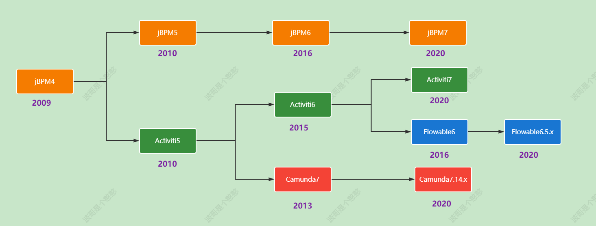

# 工作流&规则引擎

市场上比较有名的开源流程引擎有osworkflow、jbpm、activiti、flowable、camunda。其中：Jbpm4、Activiti、Flowable、camunda四个框架同宗同源，祖先都是Jbpm4。

- 纵观jBPM：从jBPM3到jBPM5以及Activiti5：http://www.infoq.com/cn/articles/rh-jbpm5-activiti5#
- 工作流引擎选择（为何使用activiti而不是jbpm）：http://blog.csdn.net/classfoo/article/details/20645779
- Java工作流引擎：jBPM、Activiti以及SWF：http://blog.csdn.net/liangyixin19800304/article/details/12761573
- 用OSWorkFlow和JBPM开发工作流异同：http://blog.csdn.net/victor16345/article/details/5614676
- JBPM（Java Business Process Management）：JAVA业务流程管理，是一个可扩展、灵活、开源的流程引擎， 它可以运行在独立的服务器上或者嵌入任何Java应用中。

## 工作流

1. JBPM。最早提供工作流的服务。提供了工作流规范，是主流工作流的基础，但是不推荐使用。
2. Activiti
3. Camunda
4. OsWorkFlow
5. flowable
6. zeebe

### 1.JBPM

JBPM由JBoss公司开发，目前最高版本JPBM7，不过从JBPM5开始已经跟之前不是同一个产品了，JBPM5的代码基础不是JBPM4，而是从Drools Flow重新开始，
基于Drools Flow技术在国内市场上用的很少，所有不建议选择jBPM5以后版本，jBPM4诞生的比较早，后来JBPM4创建者Tom Baeyens离开JBoss后，
加入Alfresco后很快推出了新的基于jBPM4的开源工作流系统Activiti，另外JBPM以hibernate作为数据持久化ORM也已不是主流技术，现在时间节点选择流程引擎，JBPM不是最佳选择。

大致流程如下：
1. jBPM3是一个完整的工作流系统实现，面向开发人员，目的在于简化对组织核心流程进行支撑的软件创建，不支持标准。
2. jBPM4引入PVM，使其拥有更强大的扩展性，同时增加BPMS特性，这些特性包括了对BPMN的支持、面向业务人员的Web建模器和简单统计分析功能的加入。
3. jBPM5基于原先的Drools Flow，支持BPMN，通过与Drools的合并支持BAM，通过内容仓库增加对流程可视化的支持。由于放弃了jBPM4的PVM，引擎的可扩展性受到损害，并且不再支持jPDL。

### 2.Activiti
官网:[https://www.activiti.org/](https://www.activiti.org/)

Activiti由Alfresco软件开发，目前最高版本Activiti7。Activiti的版本比较复杂，有Activiti5、Activiti6、Activiti7几个主流版本，选型时让人晕头转向，有必要先了解一下Activiti这几个版本的发展历史。
- Activiti5和Activiti6的核心leader是Tijs Rademakers。
- 由于团队内部分歧，在2017年时Tijs Rademakers离开团队，创建了后来的Flowable
- Activiti6以及Activiti5代码已经交接给了Salaboy团队，Activiti6以及Activiti5的代码官方已经暂停维护了，
- Salaboy团队目前在开发Activiti7框架，activiti7内核使用的还是Activiti6，并没有为引擎注入更多的新特性，只是在Activiti之外的上层封装了一些应用。
  
结论是activiti谨慎选择。

优点：
1. 最大的优点就是免费开源，这也是很多人选择的原因
2. 小项目中应用简单的串行并行流转基本能满足需求。

缺点：
1. 缺少节点实例轨迹数据的持久化，Activity运行时紧紧围绕act_ru_execution这张表来工作，此表也是整个流程引擎的运行核心表，执行时是一个树型表，
   这张表就是节点运行实例的过程，而且使用PARENT_ID_来从一个节点到多个节点的过程，只是仅仅有一个Parent_Id_来维护是不够的，因为我们知道关系有可能这是样的正向生成的树，也有倒生长的树
2. Activity需要经过大量的扩展才能应用起来，直接从官网下载下来的Activity要达到企业级应用还需要一段痛苦的改造之路要走。
   Activity的扩展非常依懒事件监听和AOP切面事件，代码执行到处乱跳，非常的不好维护，可读性也差，一是维护人员的技术门槛非常高，二是越到后面代码越难维护。久而久之会把项目拖跨。
3. Activity最明显的一个地方就是事件机制，简单来说把Activity执行过程理解为一条直线，这条执行直线上你要做很多的AOP拦截，对这个拦截进行事件抛出，然后自己再捕获这个事件进行扩展开发

### 3.flowable
官网：[https://www.flowable.com](https://www.flowable.com)

Flowable基于activiti6衍生出来的版本，flowable目前最新版本是v6.7.2，开发团队是从Activiti分裂出来的， 修复了一众Activiti6的bug，
并在其基础上研发了DMN支持，BPEL支持等等，相对开源版，其商业版的功能会更强大。
以flowable6.4.1版本为分水岭，大力发展其商业版产品，开源版本维护不及时，部分功能已经不再开源版发布，比如表单生成器(表单引擎)、历史数据同步至其他数据源、ES等。

Flowable是一个使用Java编写的轻量级业务流程引擎，使用Apache V2 license协议开源。
2016年10月Activiti工作流引擎的主要开发者离开Alfresco公司并在Activiti分支基础上开启了Flowable开源项目。
基于Activiti v6 beta4 发布的第一个 Flowable release 版本为6.0。
Flowable 项目中包括 BPMN (Business Process Model and Notation)引擎、CMMN (Case Management Model and Notation)引擎、DMN (Decision Model and Notation)引擎、表单引擎(Form Engine)等模块。

### 4.zeebe

Zeebe是一个开源的工作流引擎，专注于高性能和可扩展性。它以分布式和异步的方式执行工作流，支持水平扩展和高吞吐量的处理。
Zeebe使用BPMN 2.0标准来建模工作流，并提供了一套强大的工具和API来管理和监控工作流实例。
它还具有可靠性和容错性，能够处理失败和重试，确保工作流的可靠执行。
Zeebe适用于构建大规模、高性能的工作流应用程序，特别适合于云原生环境和微服务架构。

[zeebe架构及核心](https://www.jianshu.com/p/c0585d070404)

### 5.Camunda

官网：[https://camunda.com/](https://camunda.com/)

Camunda基于Activiti5，所以其保留了PVM，保持每年发布两个小版本的节奏，开源团队也是从activiti中分裂出来的，发展轨迹与flowable相似,
同时也提供了商业版，不过对于一般企业应用，开源版也足够了，功能和性能表现稳定。

### 6.OsWorkFlow

适用场景：对于比较简单的流程，OsWorkFlow会是一个比较好的选择，对于复杂的流程就不推荐了。跨语言比较好，提供多种语言的客户端。

实现原理：OsWorkFlow是一个轻量化的流程引擎，基于状态机机制，数据库表很少。

Osworkflow提供的工作流构成元素有：步骤（step）、条件（conditions）、循环（loops）、分支（spilts）、合并（joins）等， 但不支持会签、跳转、退回、加签等这些操作，需要自己扩展开发，有一定难度。

### 7.Snaker

【2014年最后一次更新】snaker是一个基于Java的轻量级工作流引擎，适用于企业应用中常见的业务流程。本着轻量、简单、灵巧理念设计，定位于简单集成，多环境支持

优点：
1. 只需要9张表，即可开始业务流程的驱动使用，主要针对中小型项目需要增加工作流特性的系统；相比于UFLO2、Activti十几张以上表，上手和使用的难度很低。
   （只需要根据实际的项目环境配置snaker.properties/snaker.xml两个文件即可）
2. 核心代码少，源码只有7000多行，设计、编写非常规范，易懂、易改造。对于学习工作流原理或者二次开发，都很友好；
3. 除了提供的常用功能API，支持拓展支持一些原生SQL语句的查询服务
4. 业务流程实列简单，可以直接把业务数据存在流程实例的变量中（数据以JSON形式保存在流程实例和任务表中的variable 字段中，长度默认varchar(2000)），
   但这样也会增加流程引擎和业务数据的耦合；（建议还是在业务表中增加order_id、task_id 来支持业务流引擎的集成）
5. 对外提供了可扩展的接口，支持流程设计器，节点自定义，属性自定义，表单自定义
6. 剥离了权限角色相关依赖，实际导入系统时需要根据需求自己添加权限相关内容

缺点：
1. 受限于轻量级限制，支持的业务场景不够丰富；
2. 流程设计器不支持IDEA插件
3. 稳定版为2.4版本，目前已停止更新维护

### 8.国产工作流

以上所有所有工作流的特点：都需要和业务系统进行整合，无法形成公共服务，扩展监听很难脱离原有的系统（需要自行编写相应的事件代码）。
不适合如今快速的开发节奏，工作流与业务系统的耦合度高。
- RuoYi-Flowable: 基于RuoYi+Flowable 6.x的工作流管理平台。[https://gitee.com/tony2y/RuoYi-flowable](https://gitee.com/tony2y/RuoYi-flowable)
- bruce/flowable。基于flowable和bpmn.js封装的工作流引擎。[https://gitee.com/lwj/flow](https://gitee.com/lwj/flow)

### 9.设计与实现

- [轻量级工作流引擎的设计与实现](https://segmentfault.com/a/1190000042546266)
- [流程引擎的架构设计](https://segmentfault.com/a/1190000042622913)

## 流程设计器

目前市场上比较主流的流程设计器有bpmn-js、mxGraph、Activiti-Modeler、flowable-modeler、easy-flow、bpmn2-modeler插件等。

### 1.bpmn-js

官网:[https://bpmn.io/](https://bpmn.io/)

bpmn-js 是 BPMN 2.0 渲染工具包和 Web 模型。bpmn-js 正在努力成为 Camunda BPM 的一部分。
bpmn-js 使用 Web 建模工具可以很方便的构建 BPMN 图表，可以把 BPMN 图表嵌入到你的项目中，容易扩展。
bpmn-js是基于原生js开发，支持集成到vue、react等开源框架中。

### 2.mxGraph

mxGraph是一个强大的JavaScript流程图前端库，可以快速创建交互式图表和图表应用程序，国内外著名的ProcessOne和draw.io都是使用该库创建的强大的在线流程图绘制网站. 
由于mxGraph是一个开放的js绘图开发框架，我们可以开发出很炫的样式，或者完全按照项目需求定制

官方网站：[http://jgraph.github.io/mxgraph/](http://jgraph.github.io/mxgraph/)

### 3.Activiti-Modeler
Activiti 开源版本中带了web版流程设计器，在Activiti-explorer项目中有Activiti-Modeler，优点是集成简单，开发工作量小，缺点是界面不美观，用户体验差。

### 4.flowable-modeler
flowable开源版本中带了web版流程设计器，展示风格和功能基本跟Activiti-Modeler一样，优点是集成简单，开发工作量小，缺点是界面不美观，用户体验差。

### 5.snaker
https://snaker.mldong.com/

snaker工作流只用得画图软件，用起来简单，中文界面，可以直接翻译成xml文件和json类型，从而进行解析

## 规则引擎
- Ilog JRules:IBM的商业框架。是最有名的商用BRMS
- Jess :是Clips的java实现，就如JRuby之于Ruby，是AI系的代表；
- Visual Rules （旗正规则引擎）国内商业规则引擎品牌:http://www.flagleader.com
- URule Pro :是一款由上海锐道信息技术有限公司自主研发的纯Java规则引擎，http://www.bstek.com/
    - 提供规则集、决策表、交叉决策表（决策矩阵）、决策树、评分卡、复杂评分卡、规则流等八种类型的业务规则设计工具，
    - 采用业内首创的纯浏览器编辑模式，打开浏览器即可开始复杂规则的设计与测试
- Drools :是最活跃的开源规则引擎，是为Java量身定制的基于Charles  Forgy的RETE算法的规则引擎的实现。 具有了OO接口的RETE,使得商业规则有了更自然的表达。
- EasyRules：简单易上手的规则引擎。https://github.com/j-easy/easy-rules
- LiteFlow。国产开源的轻量，快速，稳定可编排的组件式规则引擎。

## 服务编排

### 1.temporal

- 源码仓库：https://github.com/temporalio/temporal
- 官网文档：https://docs.temporal.io/
- Temporal分布式集群组件和原理：https://docs.temporal.io/clusters
- 工作流引擎Temporal学习笔记：https://code2life.top/2023/01/23/0070-temporal-notes/
- 代码案例： [https://github.com/temporalio/samples-java](https://github.com/temporalio/samples-java)

Temporal 是一个微服务编排平台，使开发人员能够在不牺牲生产力或可靠性的情况下构建可扩展的应用程序。临时服务器以弹性方式执行应用程序逻辑单元工作流，自动处理间歇性故障并重试失败的操作。
Temporal 是一项成熟的技术，是 Uber 的 Cadence 的一个分支。Temporal由 Cadence 的创建者初创公司Temporal Technologies开发。 

- 跨服务、跨时间周期的复杂业务流程
- 业务工作流建模（BPM）
- DevOps工作流
- Saga分布式事务
- BigData数据处理和分析Pipeline
- Serverless函数编排

这些场景看上去互相没有太大关联，但有一个共同点：需要编排（Orchestration）。 Temporal解决的关键痛点，就是分布式系统中的编排问题。

### 2.Airflow

- 官网：[https://airflow.apache.org](https://airflow.apache.org)
- [AirFlow简介](https://www.cnblogs.com/cord/p/9450910.html)
- [airflow 实战总结](https://zhuanlan.zhihu.com/p/43383509)

Airflow更像是一个任务编排工具，不像是一个工作流

是一个可编程，调度和监控的工作流平台，基于有向无环图(DAG)，airflow可以定义一组有依赖的任务，按照依赖依次执行。
airflow提供了丰富的命令行工具用于系统管控，而其web管理界面同样也可以方便的管控调度任务，并且对任务运行状态进行实时监控，方便了系统的运维和管理。

### 3.DolphinScheduler
官网[https://dolphinscheduler.apache.org/zh-cn](https://dolphinscheduler.apache.org/zh-cn)
Apache DolphinScheduler是一个分布式和可扩展的开源工作流、协调平台，具有强大的DAG可视化界面。广泛使用在大数据领域。

### 4.JDEasyFlow
JDEasyFlow是一款通用流程编排组件, 适用于服务编排、工作流、任务审批等场景。它的特点是简单、灵活、易扩展。
