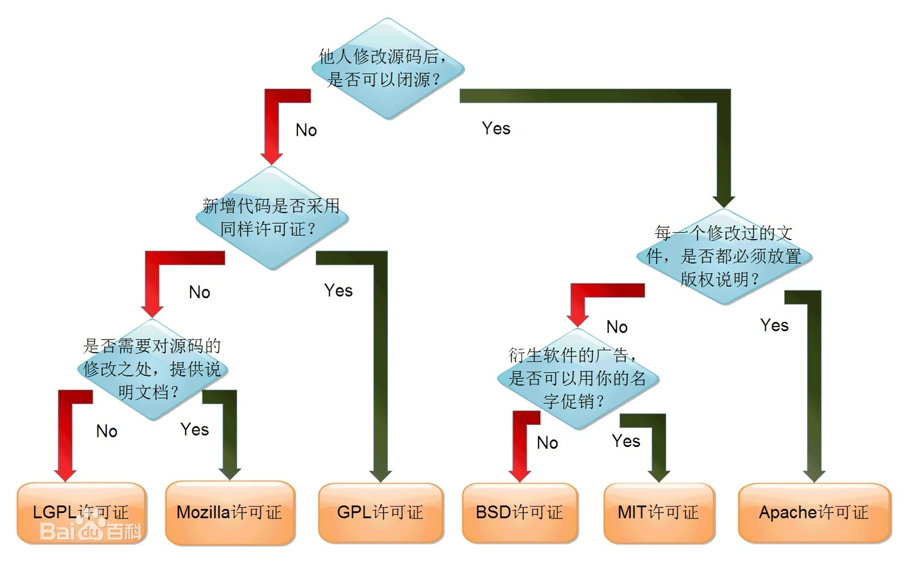

# 开源

学习的方式就是多看优秀的开源项目：
- [gitee GVP](https://gitee.com/gvp/all)

## 开源协议

**学开源，先学开源协议**

百度百科： https://baike.baidu.com/item/开源协议/10642383?fr=aladdin

- GPL: 软件免费，可以向别人收取费用。如果企业对源码进行了修改，也必须将其开源出来。算是比较严格的协议
- BSD: 可以作为商业用途，但是如果软件也开源的话，也必须遵循BSD。对于商业开发的软件，是非常友好的。
- Apache:相比BSD更加宽松，只有只要我们声明使用了Apache协议即可
- MIT: 目前最宽松的协议，只有在协议中保留作者的信息即可

## 中国互联网公司开源项目

**2019-03**

开源技术得到越来越多的重视，微软收购 GitHub、IBM 收购红帽，都表明了开源的价值。 国内公司也越来越多的参与开源，加入开源基金会/贡献开源项目。
但是，它们到底做得如何呢？为此 InfoQ 统计了国内在 GitHub 上较活跃的 7 家一线互联网公司的 50 多个账号的 2800多个项目，为大家呈现一部分答案。

本次参与统计的公司包括百度、阿里、腾讯、华为、美团、360、小米，一共 7 家公司，在最开始的时候，我们选定的是 10 家公司，
它们都是国内互联网的代表型企业， 但由于其他 3 家公司或没有统一管理自己的开源项目，又或是开源项目太少，没有分析的价值，所以我们就删去了。

在搜集这 7 家公司的开源账号的过程中，我们尽量收集了网络上的信息以避免遗漏，不过由于统计口径不一，有些公司只承认在GitHub公司主体账号旗下的项目，
导致团队账号可能难以收集全面。但是我们又认为有必要收集以团队身份出现的公司账号，它们的行为也代表公司的一部分，
公司也应该将这些账号视为公司开源战略的一部分，进行统一治理。

具体如下

## 软件基金会

### Apache

Apache软件基金会（Apache Software Foundation，简称 ASF）是专门为运作一个开源软件项目的 Apache 的团体提供支持的非盈利性组织，这个开源软件的项目就是 Apache 项目。

官网：[https://www.apache.org/](https://www.apache.org/)

### Dromara

Java开源组织，致力于微服务云原生解决方案的组织，是由 Apache ShenYu（前身是Soul网关）的作者创立，
多位 Java 开源作者参与的一个Java开源组织。 在开源中国社区，很多 Java 开源作者都是各自为战，独立运营项目。
Domara 组织的诞生就是为了联合 Java 开源的力量，共建社区，资源共享，共同推行中国Java开源事业的发展。

社区地址： [https://dromara.org/](https://dromara.org/)

很多我们熟悉项目都是Dromara的，比如：hutool、jpom、maxKey等

### 开放原子开源基金会

2020 年 6 月在北京成立，由阿里巴巴、百度、华为、浪潮、360、腾讯、招商银行等多家龙头科技企业联合发起。
开放原子开源基金会本着以开发者为本的开源项目孵化平台、科技公益性服务机构的定位，遵循共建、共治、共享原则，
系统性打造开源开放框架，搭建国际开源社区，提升行业协作效率，赋能千行百业

[https://www.openatom.org/project](https://www.openatom.org/project)

### CNCF

云原生计算基金会[https://www.cncf.io/](https://www.cncf.io/)

[云原生计算基金会（CNCF）毕业的10大开源项目](https://zhuanlan.zhihu.com/p/362727936)

是Linux基金会旗下的非盈利组织，来推动云原生计算的发展，帮助云原生技术开发人员来构建出色的产品。

CNCF的成立与一个重要项目密切相关，那就是Kubernetes。K8s最早是谷歌的内部容器编排项目Borg，为了推进其发展，谷歌决定将其开源，于是跟Linux基金会在2015年一起创办了CNCF。

### 其他

- 【华为】鲲鹏开发者平台[https://www.hikunpeng.com/zh/developer](https://www.hikunpeng.com/zh/developer)
- openEuler:通过社区合作，打造创新平台，构建支持多处理器架构、统一和开放的操作系统openEuler，推动软硬件生态繁荣发展。[https://www.openeuler.org/zh/](https://www.openeuler.org/zh/)
- plume开源社区。致力于简单易用的开源项目的开源组织。[https://gitee.com/plumeorg](https://gitee.com/plumeorg)

## 国产开源项目
### 大厂开源
- 阿里：Alibaba主推的开源项目，部分已经提供了商业化软件
    - Druid：阿里巴巴数据库事业部出品，为监控而生的数据库连接池。
    - Fastjson：JSON parser/generator for Java
    - canal：阿里巴巴mysql数据库binlog的增量订阅&消费组件。
    - Sentinel：轻量级强大的流量控制组件，可实现微服务的可靠性和监控
    - nacos： 一个更易于构建云原生应用的动态服务发现、配置管理和服务管理平台
    - Dubbo：高性能Java RPC框架。目前已经贡献给Apache进行孵化
    - Rocketmq： 目前主流的mq
    - Arthas：Java诊断利器Arthas 
    - P3C：阿里巴巴Java编码指南pmd实现和IDE插件
- 蚂蚁金服。虽然也是阿里系，但是主要关注金融领域。官网：[https://tech.antfin.com/](https://tech.antfin.com/)
    - SOFAStack。金融级云原生架构。[https://www.sofastack.tech/projects/](https://www.sofastack.tech/projects/)
    - OceanBase。开源分布式数据库。
    - seata。分布式事务解决方案。
- 腾讯。侧重移动端。[https://github.com/Tencent](https://github.com/Tencent)
    - MMKV：mmap实现的kv数据库[https://github.com/Tencent/MMKV](https://github.com/Tencent/MMKV)
    - APIJSON：专为 API 而生的 JSON 网络传输协议 以及 基于这套协议实现的 ORM 库[https://github.com/Tencent/APIJSON](https://github.com/Tencent/APIJSON)
    - 北极星：支持多语言、多框架的云原生服务发现和治理中心[https://github.com/polarismesh/polaris](https://github.com/polarismesh/polaris)
- 搜狗：[https://github.com/sogou](https://github.com/sogou)
    - Workflow：搜狗公司C++服务器引擎，编程范式
    - SRPC：企业级RPC系统，目前每天承载上百亿的请求量

### 基础工具

- Hutool是一个Java工具包，也只是一个工具包，它帮助我们简化每一行代码，减少每一个方法，让Java语言也可以“甜甜的”。它最初是作者项目中“util”包的一个整理，后来慢慢积累并加入更多非业务相关功能，并广泛学习其它开源项目精髓，经过自己整理修改，最终形成丰富的开源工具集
    [https://gitee.com/loolly/hutool](https://gitee.com/loolly/hutool)
- Xxl-job。一个轻量级分布式任务调度平台，其核心设计目标是开发迅速、学习简单、轻量级、易扩展。现已开放源代码并接入多家公司线上产品线，开箱即用。
    [http://www.xuxueli.com/xxl-job/#/](http://www.xuxueli.com/xxl-job/#/)
- spring-boot-mail。邮件发送服务，文本，附件，模板，队列，多线程，定时任务实现多种功能。    [https://gitee.com/52itstyle/spring-boot-mail](https://gitee.com/52itstyle/spring-boot-mail)
- spring-boot-quartz。基于spring-boot+quartz的CRUD任务管理系统 。    [https://gitee.com/52itstyle/spring-boot-quartz](https://gitee.com/52itstyle/spring-boot-quartz)
- x-patrol。Github leaked patrol为一款github泄露巡航工具。[https://github.com/MiSecurity/x-patrol](https://github.com/MiSecurity/x-patrol)
- 在线打车：[https://github.com/OiPunk/OnlineTaxi](https://github.com/OiPunk/OnlineTaxi)
- Spring-boot-pay。支付服务：支付宝、微信、银联详细代码案例。十分钟让你快速搭建一个支付服务，内附各种教程。
  [https://gitee.com/52itstyle/spring-boot-pay](https://gitee.com/52itstyle/spring-boot-pay)
- spider-flow。平台以流程图的方式定义爬虫,是一个高度灵活可配置的爬虫平台。[https://gitee.com/ssssssss-team/spider-flow](https://gitee.com/ssssssss-team/spider-flow)
- DBAPI。是一个面向数仓开发人员的低代码工具，只需在页面上编写sql，并配置好参数，就可以自动生成http接口
  [https://www.51dbapi.com/](https://www.51dbapi.com)
- 分布式文件系统。集成了Fastdfs而已。项目地址：[https://gitee.com/52itstyle/spring-boot-fastdfs](https://gitee.com/52itstyle/spring-boot-fastdfs)
- minio-upload。使用vue3 elementplus minio springboot 实现大文件的分片上传、断点续传、秒传的功能demo。[https://gitee.com/Gary2016/minio-upload](https://gitee.com/Gary2016/minio-upload)
- Plumelog。无代码入侵的分布式日志系统，基于log4j、log4j2、logback搜集日志，设置链路ID，方便查询关联日志。 [https://gitee.com/plumeorg/plumelog](https://gitee.com/plumeorg/plumelog)
- spring-file-storage。通过简单的方式将文件存储到各种公有云、FTP、本地等操作。[https://gitee.com/XYW1171736840/spring-file-storage](https://gitee.com/XYW1171736840/spring-file-storage)
- db-api。零代码，通过SQL生成http api。[https://gitee.com/freakchicken/db-api](https://gitee.com/freakchicken/db-api)

### 脚手架
- 智慧云智能教育平台。基于 SpringBoot + Mybatis + Shiro + mysql + redis构建的智慧云智能教育平台。
  [https://gitee.com/zhuimengshaonian/wisdom-education](https://gitee.com/zhuimengshaonian/wisdom-education)
- Cloud-Platform：[https://gitee.com/geek_qi/cloud-platform](https://gitee.com/geek_qi/cloud-platform)
- SpringBlade 微服务开发平台。[https://gitee.com/smallc/SpringBlade](https://gitee.com/smallc/SpringBlade)

### 后端管理
- Ruoyi：基于SpringBoot2.0的权限管理系统 易读易懂、界面简洁美观。 核心技术采用Spring、MyBatis、Shiro没有任何其它重度依赖。
  [https://gitee.com/y_project/RuoYi](https://gitee.com/y_project/RuoYi)
- SmartAdmin。SmartAdmin由河南·洛阳1024创新实验室团队研发的一套互联网企业级的通用型中后台解决方案！
  [https://gitee.com/lab1024/smart-admin](https://gitee.com/lab1024/smart-admin)
- DataV。前端组件，Vue 大屏数据展示组件库。[http://datav.jiaminghi.com/](http://datav.jiaminghi.com/)

### 商城
- Mall。mall项目是一套电商系统，包括前台商城系统及后台管理系统，基于SpringBoot+MyBatis实现。
  [https://github.com/macrozheng/mall](https://github.com/macrozheng/mall)
- 聚惠星商城。基于 微信小程序 + springboot + vue 技术构建 ，支持单店铺，多店铺入驻的商城平台。项目包含微信小程序，管理后台。基于java后台语言，已功能闭环，且达到商用标准的一套项目体系。
  [https://gitee.com/qiguliuxing/dts-shop](https://gitee.com/qiguliuxing/dts-shop)
- Miaosha 。秒杀系统设计与实现.互联网工程师进阶与分析   [https://github.com/qiurunze123/miaosha](https://github.com/qiurunze123/miaosha)
- spring-boot-seckill 。从0到1构建分布式秒杀系统，脱离案例讲架构都是耍流氓，码云GVP项目。这个是自5月以来最上心的一个项目，尽管只是一个案例，但是从中也学到了不少知识。
  项目地址：[https://gitee.com/52itstyle/spring-boot-seckill](https://gitee.com/52itstyle/spring-boot-seckill)
- 分布式电商项目。[https://github.com/SiGuiyang/spring-cloud-shop](https://github.com/SiGuiyang/spring-cloud-shop)

### OA
- 企业OA。易上手的企业管理快速开发平台，持续研发14年，基于JAVA开发，spring boot框架。
  [https://gitee.com/bestfeng/yimioa.git](https://gitee.com/bestfeng/yimioa.git)
- oasys。oasys是一个OA办公自动化系统，使用Maven进行项目管理，基于springboot框架开发的项目，mysql底层数据库，前端采用freemarker模板引擎，Bootstrap作为前端UI框架，集成了jpa、mybatis等框架。作为初学springboot的同学是一个很不错的项目，如果想在此基础上面进行OA的增强，也是一个不错的方案
  [https://gitee.com/aaluoxiang/oa_system](https://gitee.com/aaluoxiang/oa_system)

### 社区
- Symphony。一款用 Java 实现的现代化社区（论坛/BBS/社交网络/博客）平台。    [https://github.com/b3log/symphony](https://github.com/b3log/symphony)
- 高仿微信
  iOS 版：Github 地址：https://github.com/nacker/LZEasemob3。
  Android 版：Github 地址：[https://github.com/GitLqr/LQRWeChat](https://github.com/GitLqr/LQRWeChat)
- 高仿微博
  iOS 版：Github 地址：https://github.com/sam408130/DSLolita
  Android:Github 地址：[https://github.com/wenmingvs/WeiBo](https://github.com/wenmingvs/WeiBo)
- 轻松阅读 。简单的移动端与pc端的项目
  [https://github.com/Zealon159/light-reading-cloud](https://github.com/Zealon159/light-reading-cloud)
- NiterForum。可以说 NiterForum 提供了一个论坛所能提供的所有功能，功能特性覆盖的非常全面
  Github 地址：[https://github.com/yourkevin/NiterForum](https://github.com/yourkevin/NiterForum)
- 码问社区。Github 地址：[https://github.com/codedrinker/community](https://github.com/codedrinker/community)
- 朋也社区 。采用主流的 Java Web 开发框架（SpringBoot）进行开发。个人觉得朋也社区最大的亮点是在设计层面上支持高度的可定制化。
  Github 地址：[https://github.com/tomoya92/pybbs](https://github.com/tomoya92/pybbs)
- 妖气山视频管理系统。第一款面向大众的java版的视频管理系统。
  [https://gitee.com/javaex/yaoqishan](https://gitee.com/javaex/yaoqishan)
- 讯飞语音。讯飞语音JavaWeb语音合成解决方案。
  项目地址：[https://gitee.com/52itstyle/xufei_msc](https://gitee.com/52itstyle/xufei_msc)
- 小说精品屋。小说精品屋-plus是在小说精品屋的基础上，去除了漫画和弹幕模块，专注于小说，是一个多端（PC、WAP）阅读、功能完善的原创文学CMS系统，由前台门户系统、作家后台管理系统、平台后台管理系统、爬虫管理系统等多个子系统构成，支持会员充值、订阅模式、新闻发布和实时统计报表等功能
  官网：[https://xiongxyang.gitee.io/home/](https://xiongxyang.gitee.io/home/)
- 高仿 youtube
  [https://github.com/aslanyanhaik/youtube-iOS](https://github.com/aslanyanhaik/youtube-iOS)
  [https://github.com/TeamNewPipe/NewPipe](https://github.com/TeamNewPipe/NewPipe)
- 音乐播放器
  [https://github.com/QuintGao/GKAudioPlayerDemo](https://github.com/QuintGao/GKAudioPlayerDemo)
  [https://github.com/aa112901/remusic](https://github.com/aa112901/remusic)
- 高仿Bilibili
  iOS 版：Github 地址：https://github.com/MichaelHuyp/Bilibili_Wuxianda
  Android:Github 地址：https://github.com/HotBitmapGG/bilibili-android-client

### 文档
- Mindoc：MinDoc 是一款针对IT团队开发的简单好用的文档管理系统。开箱即用。
  [https://github.com/lifei6671/mindoc](https://github.com/lifei6671/mindoc)
- wps-view-java。wps在线编辑、预览后台服务
  [https://gitee.com/mose-x/wps-view-java](https://gitee.com/mose-x/wps-view-java)
- 在线文档管理系统。spring-boot-doc是一款针对IT团队开发的简单好用的文档管理系统。
  项目地址：[https://gitee.com/52itstyle/spring-boot-doc](https://gitee.com/52itstyle/spring-boot-doc)
- tamguo。探果网（简称tamguo）是基于java开发的在线题库系统。包括书籍、试题、会员、后台管理等
    [https://gitee.com/smiletocandy/tamguo](https://gitee.com/smiletocandy/tamguo)
- Luckysheet。Luckysheet，一款纯前端类似excel的在线表格，功能强大、配置简单、完全开源。
    [https://github.com/mengshukeji/Luckysheet](https://github.com/mengshukeji/Luckysheet)
- kkFileView。文件文档在线预览解决方案。[https://kkfileview.keking.cn/zh-cn/index.html](https://kkfileview.keking.cn/zh-cn/index.html)

### 网盘
- Nextcloud。NextCloud以它的高安全性和法规遵从性作为它的一个独特的推崇的卖点，可以在浏览器中使用，也可以安装客户端，支持 Win、Mac、Android、iOS、Linux 全平台，且免费开源。
    官网：https://github.com/nextcloud
- ownCloud。ownCloud是一个开源免费专业的私有云存储项目，它能帮你快速在个人电脑或服务器上架设一套专属的私有云文件同步网盘。
    官网：https://github.com/owncloud
- DzzOffice。Dzzoffice是一套开源办公套件，适用于企业、团队搭建自己的，类似Google企业应用套件、微软Office365的企业协同办公平台。
    官网：https://github.com/zyx0814/dzzoffice
- Cloudreve。支持本机、从机、七牛、阿里云 OSS、腾讯云 COS、又拍云、OneDrive (包括世纪互联版) 作为存储端。
    官网：https://github.com/cloudreve/Cloudreve
- kiftd。一款便捷、开源、功能完善的个人&团队&小型团队网盘服务器系统。
    官网：https://github.com/KOHGYLW/kiftd-source
- 蓝眼云盘。蓝眼云盘是蓝眼开源系列代表作品之一，致力于打造精致，优雅，简约的云盘
    官网：https://github.com/eyebluecn/tank
- Seafile。Seafile是一款强大优秀的云同步软件，拥有跨平台文件同步、移动端文件访问、挂载盘、文件共享和权限控制、文件锁定、文件版本管理和资料库镜像、在线编辑和协同编辑、审计日志等功能。
    官网：https://github.com/haiwen/seafile

## 开源盈利模式

[全球 22 种开源商业收入模式](https://blog.csdn.net/m0_46163918/article/details/127570388)

国内的情况比较特殊，懂得都懂，所以传统的开源盈利模式在中国是行不通的，尤其是个人开源项目想要盈利更是难上加难。

常见方式如下：
1. 项目中存在一些问题。比如删除了部分代码，然后再让你购买，才发完整的源码。
2. 项目开源一部分，或者给出一个体验版本，如果要获取完整的源码，就要付费
3. 项目使用起来非常复杂，官方文档提供不全。需要付费协助处理

