# 性能测试

## Jmeter

Apache JMeter是一款纯java编写负载功能测试和性能测试开源工具软件。
相比Loadrunner而言，JMeter小巧轻便且免费，逐渐成为了主流的性能测试工具，是每个测试人员都必须要掌握的工具之一。
本文为JMeter性能测试完整入门篇，从Jmeter下载安装到编写一个完整性能测试脚本、最终执行性能测试并分析性能测试结果。
运行环境为Windows 10系统，JDK版本为1.8，JMeter版本为3.3。

### 6.1.Jmeter安装

- [Dubbo Plugin for Apache JMeter](https://github.com/thubbo/jmeter-plugins-for-apache-dubbo/wiki/%E7%94%A8%E6%88%B7%E6%8C%87%E5%8D%97)
- [基于JMeter开展性能测试（插件、监控、分布式压测）](https://mp.weixin.qq.com/s/JwlqgvzqdALhX2ryyrYI1g)

#### 6.1.1.JDK安装

由于Jmeter是基于java开发，首先需要下载安装JDK （目前JMeter只支持到Java 8，尚不支持 Java 9）

#### 6.1.2.JMeter安装

- 官网下载地址：http://jmeter.apache.org/download_jmeter.cgi
- 下载最新JMeter的压缩包
- 下载完成后解压zip包
- 启动JMeter：双击bin下面的jmeter.bat即可

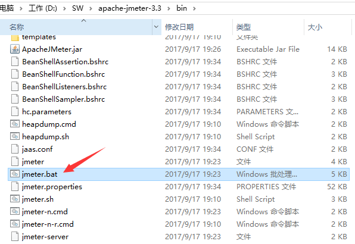

### 6.2.测试实例

我们选取最常见的百度搜索接口

测试案例。[线程组.jmx](file/jmeter/线程组.jmx)

#### 6.2.1.接口地址

http://www.baidu.com/s?ie=utf-8&wd=jmeter性能测试

#### 6.2.2.请求参数

ie：编码方式，默认为utf-8
wd: 搜索词

#### 6.2.3.返回结果

搜索结果，我们可以通过校验结果中是否含有搜索词wd来判断本次请求成功或失败。

### 6.3.JMeter脚本编写

#### 6.3.1.添加线程组

右键点击“测试计划” -> “添加” -> “Threads(Users)” -> “线程组”
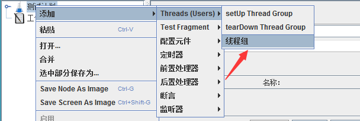

这里可以配置线程组名称，线程数，准备时长（Ramp-Up Period(in
seconds)）循环次数，调度器等参数：
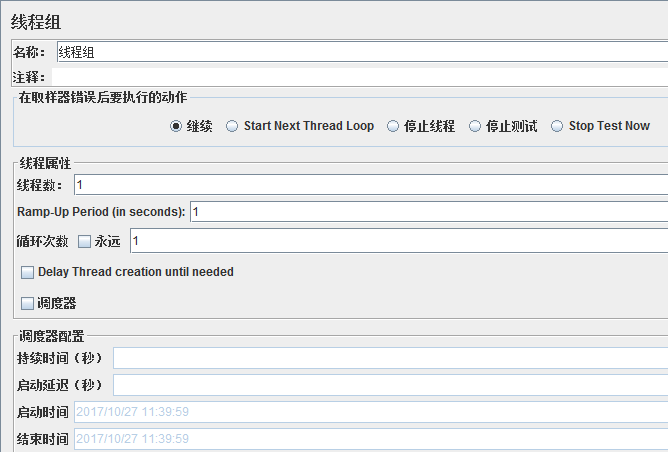

线程组参数详解：
1. 线程数：虚拟用户数。一个虚拟用户占用一个进程或线程。设置多少虚拟用户数在这里也就是设置多少个线程数。
2. Ramp-Up Period(in seconds)准备时长：设置的虚拟用户数需要多长时间全部启动。如果线程数为10，准备时长为2，那么需要2秒钟启动10个线程，也就是每秒钟启动5个线程。
3. 循环次数：每个线程发送请求的次数。如果线程数为10，循环次数为100，那么每个线程发送100次请求。总请求数为10*100=1000
   。如果勾选了“永远”，那么所有线程会一直发送请求，一到选择停止运行脚本。
4. Delay Thread creation until needed：直到需要时延迟线程的创建。
   5.调度器：设置线程组启动的开始时间和结束时间(配置调度器时，需要勾选循环次数为永远)
    - 持续时间（秒）：测试持续时间，会覆盖结束时间
    - 启动延迟（秒）：测试延迟启动时间，会覆盖启动时间
    - 启动时间：测试启动时间，启动延迟会覆盖它。当启动时间已过，手动只需测试时当前时间也会覆盖它。
    - 结束时间：测试结束时间，持续时间会覆盖它。

因为接口调试需要，我们暂时均使用默认设置，待后面真正执行性能测试时再回来配置。

#### 6.3.2.添加HTTP请求

右键点击“线程组” -> “添加” -> “Sampler” -> “HTTP请求”
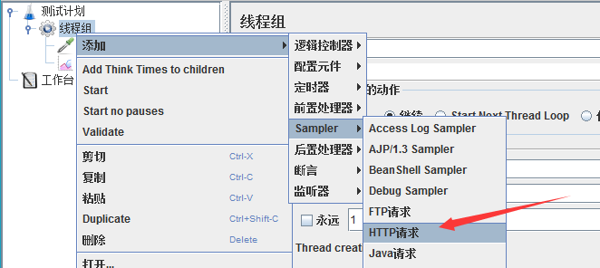

对于我们的接口http://www.baidu.com/s?ie=utf-8&wd=jmeter性能测试，可以参考下图填写：
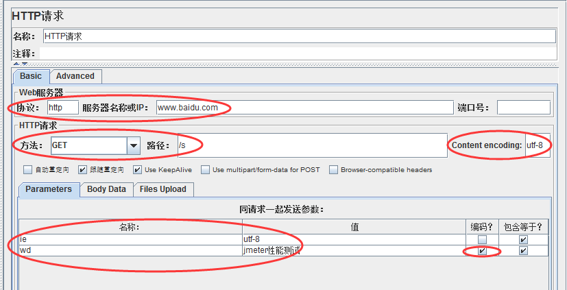

Http请求主要参数详解：

Web服务器
协议：向目标服务器发送HTTP请求协议，可以是HTTP或HTTPS，默认为HTTP
服务器名称或IP ：HTTP请求发送的目标服务器名称或IP
端口号：目标服务器的端口号，默认值为80
2.Http请求
方法：发送HTTP请求的方法，可用方法包括GET、POST、HEAD、PUT、OPTIONS、TRACE、DELETE等。
路径：目标URL路径（URL中去掉服务器地址、端口及参数后剩余部分）
Content encoding ：编码方式，默认为ISO-8859-1编码，这里配置为utf-8

同请求一起发送参数
在请求中发送的URL参数，用户可以将URL中所有参数设置在本表中，表中每行为一个参数（对应URL中的
name=value），注意参数传入中文时需要勾选“编码”

#### 6.3.3.添加察看结果树

右键点击“线程组” -> “添加” -> “监听器” -> “察看结果树”
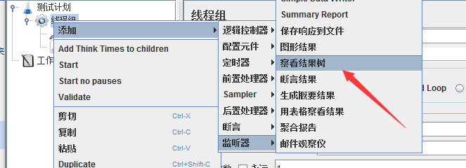

这时，我们运行Http请求，修改响应数据格式为“HTML Source
Formatted”，可以看到本次搜索返回结果页面标题为”jmeter性能测试_百度搜索“。
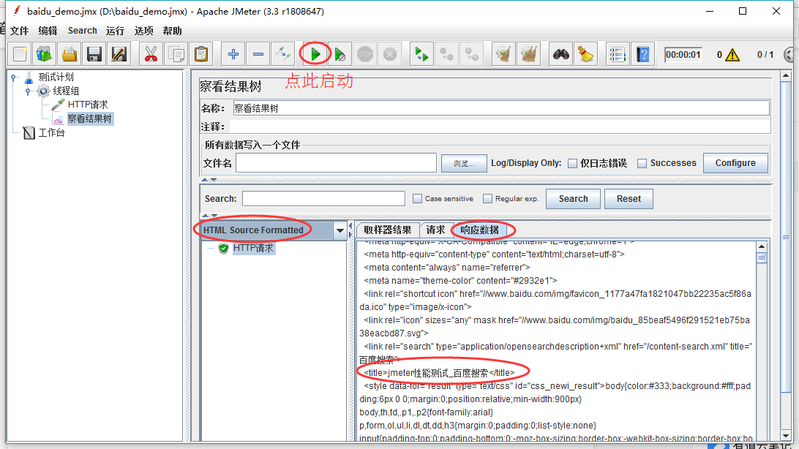


#### 6.3.4.添加用户自定义变量

我们可以添加用户自定义变量用以Http请求参数化，右键点击“线程组” -> “添加” -> “配置元件” -> “用户定义的变量”：
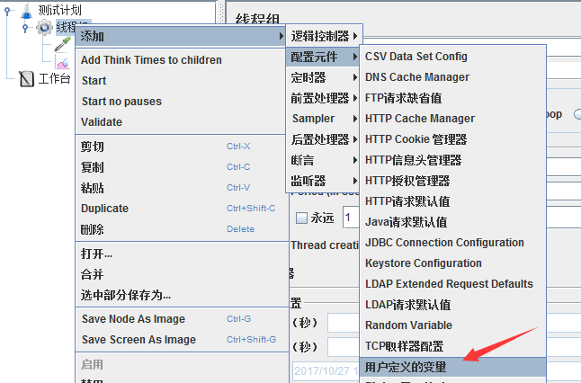

新增一个参数wd，存放搜索词：
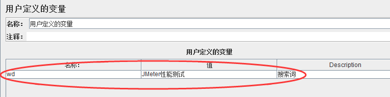

并在Http请求中使用该参数，格式为：${wd}
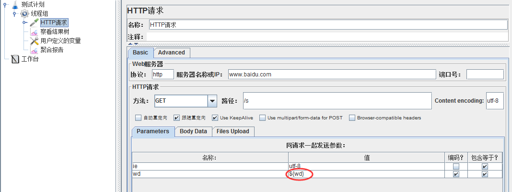


#### 6.3.5.添加断言

右键点击“HTTP请求” -> “添加”-> “断言” -> “响应断言”
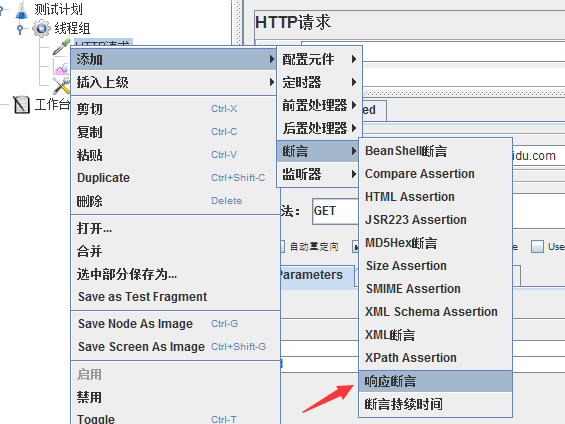

我们校验返回的文本中是否包含搜索词，添加参数${wd}到要测试的模式中：
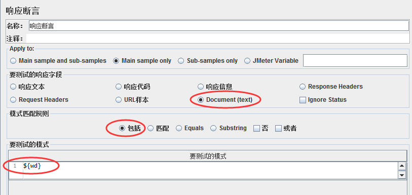


#### 6.3.6.添加断言结果

右键点击“HTTP请求” -> “添加”-> “监听器” -> “断言结果”
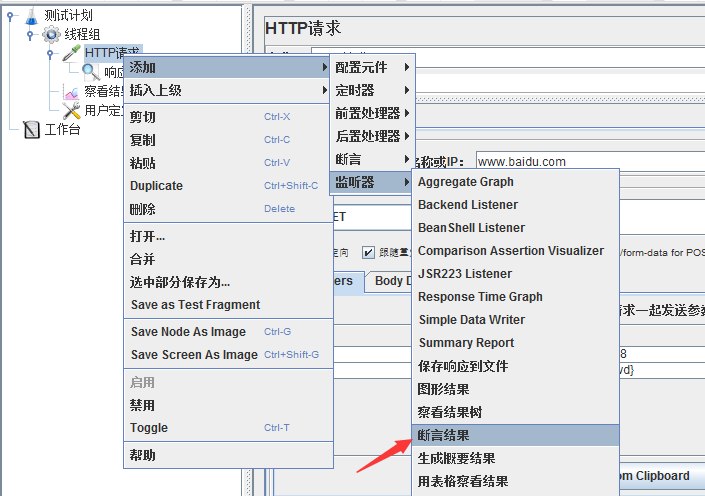


这时，我们再运行一次就可以看到断言结果成功或失败了
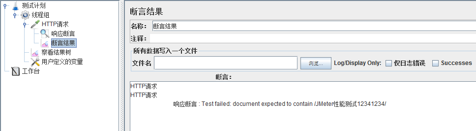


#### 6.3.7.添加聚合报告

右键点击“线程组” -> “添加” -> “监听器” -> “聚合报告”，用以存放性能测试报告
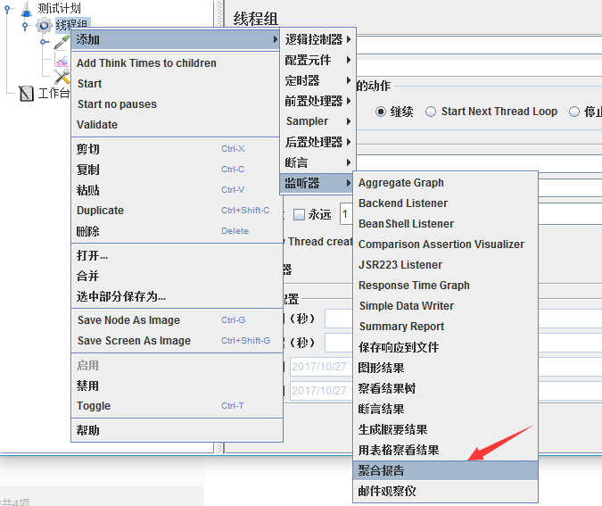

这样，我们就完成了一个完整Http接口的JMeter性能测试脚本编写。

### 6.4.执行性能测试

#### 6.4.1.配置线程组

点击线程组，配置本次性能测试相关参数：线程数，循环次数，持续时间等，这里我们配置并发用户数为10，持续时间为60s
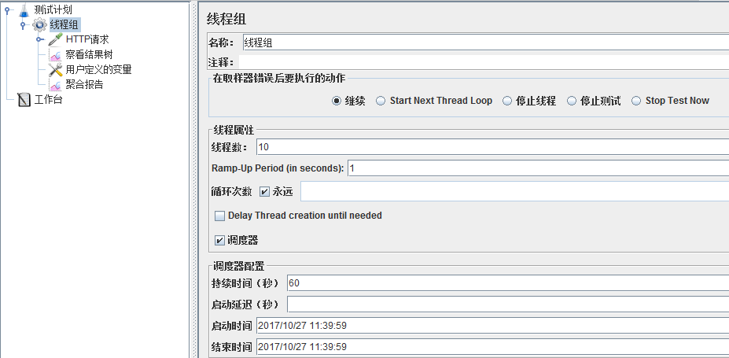

#### 6.4.2.执行测试

点击绿色小箭头按钮即可启动测试，测试之前需要点击小扫把按钮清除之前的调试结果。
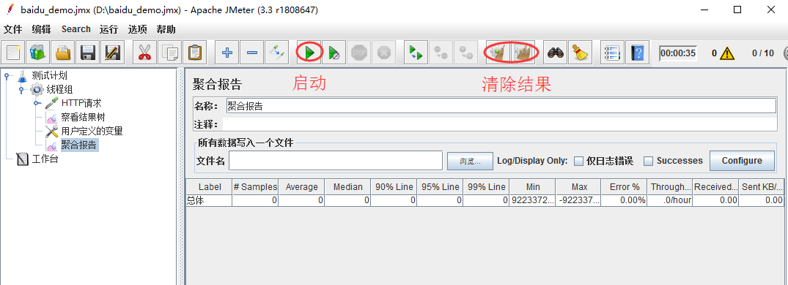

### 6.5.分析测试报告

待性能测试执行完成后，打开聚合报告可以看到：
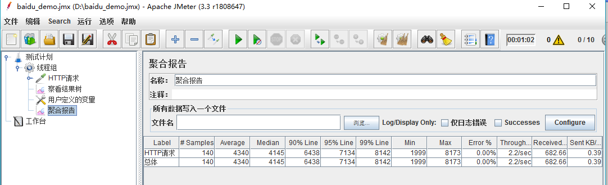


聚合报告参数详解：
1. Label：每个 JMeter 的 element（例如 HTTP Request）都有一个 Name 属性，这里显示的就是 Name 属性的值
2. \#Samples：请求数——表示这次测试中一共发出了多少个请求，如果模拟10个用户，每个用户迭代10次，那么这里显示100
3. Average：平均响应时间——默认情况下是单个 Request 的平均响应时间，当使用了 Transaction Controller 时，
   以Transaction 为单位显示平均响应时间
4. Median：中位数，也就是 50％ 用户的响应时间
5. 90% Line：90％ 用户的响应时间
6. Min：最小响应时间
7. Max：最大响应时间
8. Error%：错误率——错误请求数/请求总数
9. Throughput：吞吐量——默认情况下表示每秒完成的请求数（Request per Second），当使用了 Transaction Controller 时，
   也可以表示类似 LoadRunner的 Transaction per Second 数
10. KB/Sec：每秒从服务器端接收到的数据量，相当于LoadRunner中的Throughput/Sec

一般而言，性能测试中我们需要重点关注的数据有： #Samples 请求数，Average 平均响应时间，Min 最小响应时间，Max 最大响应时间，
Error% 错误率及Throughput 吞吐量。


### 6.6.Linux运行

我们通常是在服务器上运行jmeter进行压测的，jmeter也提供了命令行的执行方式。

PS:前提，我们已经使用界面的方式编辑好了测试计划。

#### 6.6.1.使用说明
```text
--? 打印命令行选项并退出
-h、 --帮助   打印使用信息和退出
-v、 --版本 打印版本信息并退出
-p、 --propfile<argument> 要使用的jmeter属性文件
-q、 --addprop<argument>	其他JMeter属性文件
-t、 --测试文件<argument>	要运行的jmeter测试（.jmx）文件。“-t LAST“将最后加载用过的文件
	表示要运行的jmx文件
-l、 --日志文件<argument>	要将样本记录到的文件
-i、 --jmeterlogconf<argument>	jmeter日志记录配置文件（log4j2.xml）
-j、 --jmeterlogfile<argument>	jmeter运行日志文件（jmeter.log）
-n、 --非GUI	在非gui模式下运行JMeter
-s、 --服务器	运行JMeter服务器
-E、 --proxyScheme<argument>	设置用于代理服务器的代理方案
-H、 --proxyHost<argument>	设置JMeter使用的代理服务器
-P、 --proxyPort<argument>	设置JMeter要使用的代理服务器端口
-N、 --非代理主机<argument>	设置非代理主机列表（例如：*.apache.org | localhost）
-u、 --用户名<argument>	设置JMeter要使用的代理服务器的用户名
-a、 --密码<argument>	为JMeter要使用的代理服务器设置密码
-J、 --jmeterproperty<argument>=<value>	定义其他JMeter属性
******使用命令的方式，修改jmx中的配置

-G、 --全局属性<argument>=<value>	定义全局属性（发送到服务器）例如：-Gport=123或-Gglobal.properties
-D、 --系统属性<argument>=<value>	定义其他系统属性
-S、 --系统属性文件<argument>	其他系统属性文件
-f、 --强制删除结果文件	强制删除现有结果文件和Web报表文件夹开始测试前在场
-L、 --loglevel<argument>=<value>	[category=]level 例如：jorphan=INFO, jmeter.util=DEBUG or com.example.foo=WARN
-r、 --运行远程	启动远程服务器（在远程主机中定义）	指远程将所有agent启动
-R、 --远程启动<argument>	启动这些远程服务器（覆盖远程主机）
-d、 --homedir<argument>	要使用的jmeter主目录
-X、 --远程退出	在测试结束时退出远程服务器（非GUI）
-g、 --reportonly<argument>	仅从测试结果文件生成报表仪表板
	specifies the existing result file 指定已存在的结果文件
-e、 --报告的ndofloadtests	负载测试后生成报表仪表板
-o、 --reportoutputfolder<argument>	保存html报告的路径, 此文件夹必须为空或者不存在
```

#### 6.6.2.案例
案例
```shell
# t 执行本地脚本, l 记录详细日志, e 生成html格式的报告,-o指定报告的目录
jmeter -n -t 测试计划.jmx -l test.jtl -e -o ./report

#1、本地运行脚本并生成测试报告，其中测试报告的后缀名为jtl
jmeter -n -t 脚本路径 -l 测试报告路径

#2、远程运行脚本并生成测试报告，其中测试报告的后缀名为jtl
jmeter -n -t 脚本路径 -r -l 测试报告路径

#3、远程运行脚本并生成测试报告，其中测试报告的后缀名为jtl
jmeter -n -t 脚本路径 -R 负载机IP -l 测试报告路径

#4、本地运行并生成网页版测试报告，其中测试结果路径为空目录
jmeter -n -t 脚本路径 -l 测试报告路径 -e -o 测试结果路径

#5、把jtl格式的测试结果文件转换为html格式
jmeter -g 测试结果路径 -o html报告路径

#6、本地运行脚本并生成测试报告，把线程数和循环次数在命令行配置
jmeter -n -t 脚本路径 -l 测试结果路径 -JthreadNum=50 -JloopNum=10
```

#### 6.6.3.用户自定义变量
借助 -J参数，利用函数助手对话框的 P 函数设置获取命令行属性

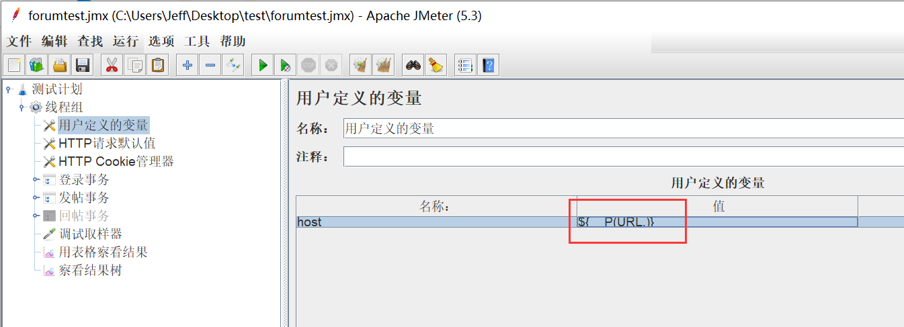

```shell
jmeter -n -t 脚本路径 -l 测试结果路径 -JURL=www.baidu.com?abc=1
```

#### 6.6.4.分布式测试
很多时候，需要多台服务器通知进行压测。并汇总结果

1.首先需要压测的服务器必须都有jmeter,以及相同的测试计划文件。

2.修改配置文件，jmeter.properties。下面三台服务器是运行测试计划的，就是slave。
我们执行启动命令的服务器是master，由于master机器作为调度机本身会有一定的性能消耗所以我们配置远程执行机的时候并没有把master机器配置进去，
只配置了3台执行机。【当然也是可以把master配置进去一起参与测试】

```properties
# 我们配置 remote_hosts 在调度服务器
remote_hosts=192.168.1.10:7899,192.168.1.11:7899,192.168.1.12:7899

# 各自服务的端口
server_port=7899
```

3.上面配置的3台服务器执行命令，进入等待接收命令的状态。
```shell
./jmeter-server
```

4.确认3台slave执行机都启动正确完成后，在启动master机器，执行如下命令开启分布式测试

其中-r会自动找remote_hosts中配置的服务器，当然我们也可以使用参数传入进去

```shell
./jmeter -n -t baidu_requests_results.jmx -r -l baidu_requests_results.jtl
```

### 6.7.最佳实践

Jmeter压测减少资源使用的一些建议，即压测结果会更准确

1. 使用非GUI模式（也就是CLI，Command Line Interface，命令行界面）：jmeter -n -t test.jmx -l result.jtl
2. 少使用Listener， 如果使用-l参数，它们都可以被删除或禁用
3. 在加载测试期间不要使用“查看结果树”或“用表格查看结果”监听器，只能在脚本阶段使用它们来调试脚本
4. 包含控制器在这里没有帮助，因为它将文件中的所有测试元素添加到测试计划中
5. 不要使用功能模式
6. 使用CSV输出而不是XML
7. 只保存你需要的数据
8. 尽可能少地使用断言
9. 如果测试需要大量数据，尤其是需要将其随机化，可以提前准备好测试数据放到数据文件中，从CSV数据集中读取， 这样可以避免在运行时浪费资源
10. 设置内存。修改jmeter.sh 在文件头部增加即可。

```shell
JVM_ARGS="-Xms1G -Xmx5G -XX:MaxPermSize=512m"
```

## AB test

### 1.apache benchmark

是Apache服务器自带的一个web http性能测试工具

Linux安装方式：
```shell
yum -y install httpd-tools
```
安装后命令所在的目录
```shell
# which ab
/usr/bin/ab
Window安装后工具的位置：apache/bin/ab.exe
```

```text
-n  即requests，用于指定压力测试总共的执行次数。
-c  即concurrency，用于指定的并发数。
-t  即timelimit，等待响应的最大时间(单位：秒)。
-b  即windowsize，TCP发送/接收的缓冲大小(单位：字节)。
-p  即postfile，发送POST请求时需要上传的文件，此外还必须设置-T参数。
-u  即putfile，发送PUT请求时需要上传的文件，此外还必须设置-T参数。
-T  即content-type，用于设置Content-Type请求头信息，例如：application/x-www-form-urlencoded，默认值为text/plain。
-v  即verbosity，指定打印帮助信息的冗余级别。
-w  以HTML表格形式打印结果。
-i  使用HEAD请求代替GET请求。
-x  插入字符串作为table标签的属性。
-y  插入字符串作为tr标签的属性。
-z  插入字符串作为td标签的属性。
-C  添加cookie信息，例如："Apache=1234"(可以重复该参数选项以添加多个)。
-H  添加任意的请求头，例如："Accept-Encoding: gzip"，请求头将会添加在现有的多个请求头之后(可以重复该参数选项以添加多个)。
-A  添加一个基本的网络认证信息，用户名和密码之间用英文冒号隔开。
-P  添加一个基本的代理认证信息，用户名和密码之间用英文冒号隔开。
-X  指定使用的和端口号，例如:"126.10.10.3:88"。
-V  打印版本号并退出。
-k  使用HTTP的KeepAlive特性。
-d  不显示百分比。
-S  不显示预估和警告信息。
-g  输出结果信息到gnuplot格式的文件中。
-e  输出结果信息到CSV格式的文件中。
-r  指定接收到错误信息时不退出程序。
-h  显示用法信息，其实就是ab -help。
```

### 2.经常使用的参数

1.同时10个连线，连续点击10000（每个Request执行完成后都会自动断线，然后再重新连线）（疑问：每次等10个都返回结果了，在同时发起10个访问？）

2.同时10个连线，连续点击10000，并且使用Keep-Alive方式连线（当Web Server支持Keep-Alive功能时Apache Benchmark会在同一个连线下连续点击该网页）
注：根据我的使用经验，发现使用-k参数后，系统的QPS就会急剧的下降，不知道是哪些地方设置有问题还是怎么回事儿？

3.将测试中的某些数据输出到output.csv文件中
注：参数-e和-g均会生成一个数据文件，但内部的数据的含义，以及有什么价值，现在还体会不到。

4.参数-r很有必要说下，在我使用ab时发现-n 不超过5000的情况下，-c可以任意设置（小于-n的参数即可）都没有问题，但是当-n的参数设置大于5000，同时-c参数大于200时总是返回如下图的错误：（注：以上数据只是个约数，但通常在这些数字附近就会出现错误）

针对这个问题，网上的解决办法基本一致，但我试了以后还是不能解决我的问题（注：解决办法参见转载的这篇文章）。
最后发现使用参数-r即可解决这个问题，但是如下图中的Failed requests就会有很多。（注：此图只是说明，并不是高并发，大访问量情况下使用-r参数真实结果）


关于Failed requests这个参数即括号中四个参数的解释，可参见网页：http://blog.miniasp.com/post/2009/10/07/Explain-ApacheBench-ab-for-the-Failed-request-field.aspx

5.设定测试时间

此例的含义为：并发访问数为3，持续访问时间为5分钟（300秒）

### 3.案例

压力测试的核心在于：在可靠的数据的前提下进行结果分析。下面结合一次测试的结果来说明每个结果数据所代表的意义。其中相比较更重要的数据项为：
Failed requests、Requests per second和Time per request。
其中Failed Requests的数量太高的话，很有可能代表你的Web Application的稳定度不够，而导致大量请求无法响应；
Request per second代表每秒可以处理的请求数，即代表Web Application的承载量有多少（在不考虑带宽限制的情况下）。

```shell
$ ab -k -c 100 -t 10 http://domain/path
```

其中，参数「c」表示的是并发，参数「t」表示的是整个测试持续的时间。
一个很容易被忽视的参数是「k」，它会增加请求头 Connection:Keep-Alive，相当于开启了HTTP长连接，
这样做一方面可以降低测试服务器动态端口被耗尽的风险，另一方面也有助于给目标服务器更大的压力，测试出更接近极限的结果。

## 其他压测平台

### Siege

官网：http://www.joedog.org/

使用教程https://mp.weixin.qq.com/s/uN27a__K7bg2lbqcrJ7MWQ

常用命令
```shell
#  200个并发对www.google.com发送请求100次
siege -c 200 -r 100 http://www.google.com

# 在urls.txt中列出所有的网址
siege -c 200 -r 100 -f urls.txt

# 随机选取urls.txt中列出所有的网址
siege -c 200 -r 100 -f urls.txt -i

#delay=0，更准确的压力测试，而不是功能测试
siege -c 200 -r 100 -f urls.txt -i -b

#指定http请求头 文档类型
siege -H "Content-Type:application/json" -c 200 -r 100 -f urls.txt -i -b
```

### Vegeta

- 官方地址：https://github.com/tsenart/vegeta
- 使用教程： https://mp.weixin.qq.com/s/EYQdz1fE7-SWiRAST5RGqA

Vegeta 是一个用 Go 语言编写的多功能的 HTTP 负载测试工具，它提供了命令行工具和一个开发库。

### Alex

- 项目地址：https://github.com/ireaderlab/alex
- [alex-压力测试应用](http://www.liuhaihua.cn/archives/333298.html)

Alex 是一个基于 Vegeta Library 和 Boom 封装的压力测试 Web UI，Vegeta 提供稳定的 QPS 压力源，Boom 提供稳定的并发数压力源

### Twitter/iago
Twitter/iago 是一个由 Twitter 开源的压测工具，支持对 HTTP、Thrift 等服务进行压测，其主要问题如下：
- 对每个压测应用都需要创建一个项目；
- 压测结果并不直观；
- 流量重放依赖本地文件；
- 项目依赖于一个较老版本的 Scala，搭建不便；
- 相关文档比较少 。


### Ngrinder

nGrinder 是基于Grinder开源项目，由NHN公司的开发团队进行了重新设计和完善。

nGrinder 是一款非常易用，有简洁友好的用户界面 和 controller-agent分布式结构的强大的压力测试工具，能够执行性能测试和监控目标服务器，并生成结果。

在ngrinder 3.x版本开始，支持多用户并发测试。目前是3.5.x版本。可以通过录制方式，生成jython和groovy语言的脚本。也可以，自己编写，导入进来。

相比jmeter，Ngrinder 更适合进行二次开发。

- 源码：[https://naver.github.io/ngrinder/](https://naver.github.io/ngrinder/)
- [Ngrinder（性能测试工具）-（一）](https://www.cnblogs.com/xingzhifeng/p/16326219.html)
- [Ngrinder（性能测试工具）-（二）](https://www.cnblogs.com/xingzhifeng/p/16326706.html)

### tsung
Tsung是一个开源、多协议、分布式的压力测试工具。它可以用来测试HTTP,WebDAV,SOAP, PostgreSQL, MySQL, LDAP 和Jabber/XMPP的服务器，
并且支持扩展协议。只要硬件足够，它可以在客户机集群上分布运行，模拟上百万用户。国内主要有 华为 和 SNS 网站在用。

主要特性：
1. 高性能
2. 多协议支持并支持扩展协议。
3. 利用OS的IP别名技术，在单机上可以使用多个IP。
4. 服务器监控（CPU, 内存, 网络流量），支持SNMP, Munin 或 Erlang方式。
5. 测试方案使用XML配置，可用不同的session来模拟不同类型的用户。
6. 模拟真实流量，用随机概率模拟用户的思考时间和抵达率。
7. HTML及图表方式报告压测结果。

[安装教程](https://www.jianshu.com/p/fb449fd11e88)

## 数据库压测

查看数据库中的压测文档

## 压测平台

- 阿里云PTS：官网链接：https://www.aliyun.com/product/pts
- 压测宝：云智慧推出的面向真实用户行为与地域分布的全链路云端压力测试平台

全链路压测方案
- [全链路压测的整体架构设计，以及 5 种实现方案！](https://mp.weixin.qq.com/s/6igZL--Q_sTk5JKon0C37w)

京东内部性能测试平台ForceBot，非开源。
- [京东全链路压测军演系统（ForceBot）](https://developer.aliyun.com/ebook/2650)
- [【TiD精彩回顾】┃ 京东链路化压测平台实践](https://mp.weixin.qq.com/s/aaZ4g7t5B9eAj98SvhQvCA)
- [京东全链路压测军演系统(ForceBot)架构解密](https://mp.weixin.qq.com/s/Lyy3DheMsdtdg-sXT91IeQ)
  
- [基于 Jmeter 生态的智能化性能测试平台](https://mp.weixin.qq.com/s/MGpHtn7GpTD3FvaVazdbBg)

- [从0到1构建美团压测工具](https://tech.meituan.com/2016/01/08/loading-test.html)

### RunnerGo

- [RunnerGo：轻量级、全栈式性能测试平台](https://mp.weixin.qq.com/s/DAC0hOCKyZRV0uKZh8oJCg)
- [官网](https://www.runnergo.com)

RunnerGo是基于go语言开发的轻量级性能测试平台。支持接口测试、自动化测试、性能测试3大测试模块，相对于传统的性能测试工具，
它具有运行速度快、资源占用少等特点。并且还是首家支持可实时查看性能测试报告的平台。

RunnerGo是目前开发可用的http接口压测平台。  
