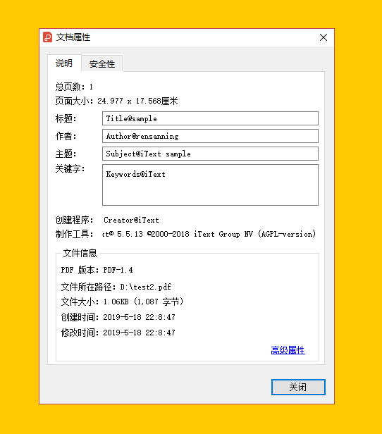

## pdf

### 1.PDF操作的工具
1. PDFBox 是一个流行的、免费的、用 Java 编写的库，它可以用来创建、修改和提取 PDF 内容。PDFBox 提供了许多 API，包括添加文本水印的功能。
2. iText 是一款流行的 Java PDF 库，它可以用来创建、读取、修改和提取 PDF 内容。iText 提供了许多 API，包括添加文本水印的功能。
3. Ghostscript 是一款流行的、免费的、开源的 PDF 处理程序，它可以用来创建、读取、修改和提取 PDF 内容。Ghostscript 中提供了命令行参数来添加水印
4. Free Spire.PDF for Java。Free Spire.PDF for Java 是一款免费的 Java PDF 库，它提供了一个简单易用的 API，用于创建、读取、修改和提取 PDF 内容
5. Aspose.PDF for Java 是一个强大的 PDF 处理库，提供了添加水印的功能

#### 1.1.iText

iText是著名的开源项目，是用于生成PDF文档的一个java类库。通过iText不仅可以生成PDF或rtf的文档，而且可以将XML、Html文件转化为PDF文件。

[http://itextpdf.com/](http://itextpdf.com/)

需要注意的是，IText使用的单位是pt而不是px，一帮情况下要想保持原来px的大小需要将px*3/4

依赖

```xml
<dependency>
    <groupId>com.itextpdf</groupId>
    <artifactId>itextpdf</artifactId>
    <version>5.5.13</version>
</dependency>
<!-- 下面3个是itext的可选依赖。只有在使用部分功能的时候才需要添加 -->
<dependency>
    <groupId>org.bouncycastle</groupId>
    <artifactId>bcprov-jdk15on</artifactId>
    <version>1.49</version>
</dependency>
<dependency>
    <groupId>org.bouncycastle</groupId>
    <artifactId>bcpkix-jdk15on</artifactId>
    <version>1.49</version>
</dependency>
<dependency>
    <groupId>org.apache.santuario</groupId>
    <artifactId>xmlsec</artifactId>
    <version>1.5.1</version>
    <optional>true</optional>
</dependency>
```



#### 1.2.Apache PDFBox

操作比较简单

```xml
<dependency>
    <groupId>org.apache.pdfbox</groupId>
    <artifactId>pdfbox</artifactId>
    <version>2.0.24</version>
</dependency>
```

#### 1.3.Ghostscript
Ghostscript 是一款流行的、免费的、开源的 PDF 处理程序，它可以用来创建、读取、修改和提取 PDF 内容。Ghostscript 中提供了命令行参数来添加水印。

首先需要在本地安装 Ghostscript 程序，执行命令
```shell
gs -dBATCH -dNOPAUSE -sDEVICE=pdfwrite -sOutputFile=output.pdf -c "newpath /Helvetica-Bold findfont 36 scalefont setfont 0.5 setgray 200 200 moveto (Watermark) show showpage" original.pdf
```

- -sDEVICE=pdfwrite 表示输出为 PDF 文件；
- -sOutputFile=output.pdf 表示输出文件名为 output.pdf
- 最后一个参数 original.pdf 则表示原始 PDF 文件的路径；
- 中间的字符串则表示添加的水印内容。

使用 Ghostscript 命令行添加水印时，会直接修改原始 PDF 文件，因此建议先备份原始文件。

#### 1.4.Free Spire.PDF for Java

[JAVA操作PDF文档(Free Spire.PDF插件的用法)](https://www.duidaima.com/Group/Topic/JAVA/9327)

#### 1.5.Aspose.PDF for Java

[Aspose.PDF for Java教程](https://blog.csdn.net/smallsboy/category_12154490.html)

### 2. word转为pdf的方案
1. poi读取doc + itext生成pdf （实现最方便，效果最差，跨平台）
2. jodconverter + openOffice （一般格式实现效果还行，复杂格式容易有错位，跨平台）
3. jacob + msOfficeWord + SaveAsPDFandXPS（完美保持原doc格式，效率最慢，只能在windows环境下进行）

#### 2.1.itext

需要自己导入poi包与itext包，Itext转中文需要额外配置，所以原来的中文一片空白，格式也错位了

#### 2.2.jodconverter+openOffice

使用jodconverter来调用openOffice的服务来转换，openOffice有个各个平台的版本，所以这种方法跟方法1一样都是跨平台的。

jodconverter的下载地址：http://www.artofsolving.com/opensource/jodconverter

首先要安装openOffice，下载地址：http://www.openoffice.org/download/index.html

安装完后要启动openOffice的服务，具体启动方法请自行google，

效果还行，偶尔有错位，支持中文

#### 2.3.msOfficeWord

效果最好的一种方法，但是需要window环境，而且速度是最慢的需要安装msofficeWord以及SaveAsPDFandXPS.exe(word的一个插件，用来把word转化为pdf)

Office版本是2007，因为SaveAsPDFandXPS是微软为office2007及以上版本开发的插件

SaveAsPDFandXPS下载地址：http://www.microsoft.com/zh-cn/download/details.aspx?id=7

jacob 包下载地址：http://sourceforge.net/projects/jacob-project/

