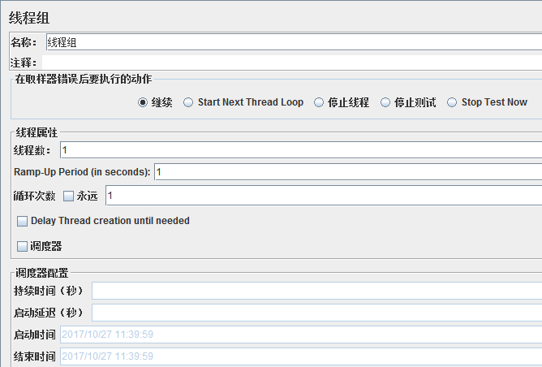
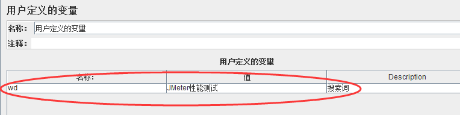
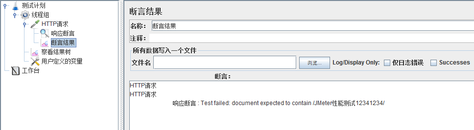
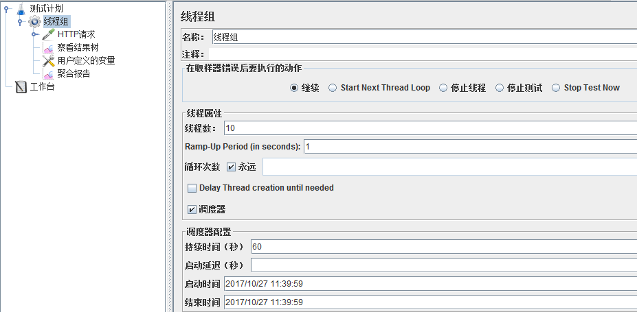

# 测试

## 1.JMH

- [官方案例](https://hg.openjdk.java.net/code-tools/jmh/file/tip/jmh-samples/src/main/java/org/openjdk/jmh/samples/) 
- [JMH 与 8 个测试陷阱](https://www.cnkirito.moe/java-jmh/) 
- [使用JMH进行微基准测试：不要猜，要测试！](http://www.hollischuang.com/archives/1072)
- [使用JMH做Java微基准测试](https://developer.aliyun.commeasurementIterations/article/341539)
- 源码[https://github.com/openjdk/jmh](https://github.com/openjdk/jmh)

### 1.1.介绍

JMH是OpenJDK开发的微基准测试框架。
在日常开发中，我们对一些代码的调用或者工具的使用会存在多种选择方式，在不确定他们性能的时候，我们首先想要做的就是去测量它。大多数时候，我们会简单的采用多次计数的方式来测量，来看这个方法的总耗时。
但是，如果熟悉JVM类加载机制的话，应该知道JVM默认的执行模式是JIT编译与解释混合执行。JVM通过热点代码统计分析，识别高频方法的调用、循环体、公共模块等，基于JIT动态编译技术，会将热点代码转换成机器码，直接交给CPU执行。
也就是说，JVM会不断的进行编译优化，这就使得很难确定重复多少次才能得到一个稳定的测试结果？所以，很多有经验的同学会在测试代码前写一段预热的逻辑。
JMH，全称 Java Microbenchmark Harness (微基准测试框架），是专门用于Java代码微基准测试的一套测试工具API，是由 OpenJDK/Oracle 官方发布的工具。
何谓 Micro Benchmark 呢？简单地说就是在 method 层面上的 benchmark，精度可以精确到微秒级。

Java的基准测试需要注意的几个点：
- 测试前需要预热。
- 防止无用代码进入测试方法中。
- 并发测试。
- 测试结果呈现。

JMH的使用场景：
- 定量分析某个热点函数的优化效果
- 想定量地知道某个函数需要执行多长时间，以及执行时间和输入变量的相关性
- 对比一个函数的多种实现方式

### 1.2.基于注解的使用

#### 1.2.1.@BenchmarkMode

微基准测试类型。JMH 提供了以下几种类型进行支持。可以注释在方法级别，也可以注释在类级别

- Throughput: 	整体吞吐量，例如“1秒内可以执行多少次调用”。
- AverageTime: 	调用的平均时间，例如“每次调用平均耗时xxx毫秒”。
- SampleTime: 	随机取样，最后输出取样结果的分布，例如“99%的调用在xxx毫秒以内，99.99%的调用在xxx毫秒以内”
- SingleShotTime: 以上模式都是默认一次 iteration 是 1s，唯有 SingleShotTime 是只运行一次。往往同时把 warmup 次数设为0，用于测试冷启动时的性能。
- All			：上面全部的类型都来一次

#### 1.2.2.@Warmup

进行基准测试前需要进行预热，iterations = 3就是指预热轮数。
一般我们前几次进行程序测试的时候都会比较慢， 所以要让程序进行几轮预热，保证测试的准确性。其中的参数iterations也就非常好理解了，就是预热轮数。 

为什么需要预热？
因为 JVM 的 JIT 机制的存在，如果某个函数被调用多次之后，JVM 会尝试将其编译成为机器码从而提高执行速度。所以为了让 benchmark 的结果更加接近真实情况就需要进行预热。

```java
@Warmup(iterations = 3)
```

#### 1.2.3.@Measurement

正式度量计算的轮数，其实就是一些基本的测试参数，可以根据具体情况调整。一般比较重的东西可以进行大量的测试，放到服务器上运行。
- iterations 进行测试的轮次
- time 每轮进行的时长
- timeUnit 时长单位

```java
@Measurement(iterations = 10, time = 5, timeUnit = TimeUnit.SECONDS)
```

#### 1.2.4.@Threads

每个进程中的测试线程，这个非常好理解，根据具体情况选择，一般为cpu乘以2
```java
@Threads(Threads.MAX)
```

#### 1.2.5.@Fork

进行 fork 的次数。如果 fork 数是2的话，则 JMH 会 fork 出两个进程来进行测试。

#### 1.2.6.@OutputTimeUnit

基准测试结果的时间类型。一般选择秒、毫秒、微秒。

#### 1.2.7.@Benchmark
方法级注解，表示该方法是需要进行 benchmark 的对象，用法和 JUnit 的 @Test 类似。就是执行的入口

#### 1.2.8.@Param
属性级注解，@Param 可以用来指定某项参数的多种情况。特别适合用来测试一个函数在不同的参数输入的情况下的性能。

```java
@Param({"1000", "10000", "100000"})
private int count;
```

#### 1.2.9.@Setup
方法级注解，这个注解的作用就是我们需要在测试之前进行一些准备工作，比如对一些数据的初始化之类的。

#### 1.2.10.@TearDown
方法级注解，这个注解的作用就是我们需要在测试之后进行一些结束工作，比如关闭线程池，数据库连接等的，主要用于资源的回收等。

#### 1.2.11.@State
当使用@Setup参数的时候，必须在类上加这个参数，不然会提示无法运行。

就比如我上面的例子中，就必须设置state。

State 用于声明某个类是一个“状态”，然后接受一个 Scope 参数用来表示该状态的共享范围。因为很多 benchmark 会需要一些表示状态的类，JMH 允许你把这些类以依赖注入的方式注入到 benchmark 函数里。Scope 主要分为三种。

- Thread: 该状态为每个线程独享。
- Group: 该状态为同一个组里面所有线程共享。
- Benchmark: 该状态在所有线程间共享。

#### 1.2.12.启动方法
在启动方法中，可以直接指定上述说到的一些参数，并且能将测试结果输出到指定文件中，

```java
/**
 * 仅限于IDE中运行
 * 命令行模式 则是 build 然后 java -jar 启动
 *
 * 1. 这是benchmark 启动的入口
 * 2. 这里同时还完成了JMH测试的一些配置工作
 * 3. 默认场景下，JMH会去找寻标注了@Benchmark的方法，可以通过include和exclude两个方法来完成包含以及排除的语义
 */
public static void main(String[] args) throws RunnerException {
    Options opt = new OptionsBuilder()
        // 包含语义
        // 可以用方法名，也可以用XXX.class.getSimpleName()
        .include("Helloworld")
        // 排除语义
        .exclude("Pref")
        // 预热10轮
        .warmupIterations(10)
        // 代表正式计量测试做10轮，
        // 而每次都是先执行完预热再执行正式计量，
        // 内容都是调用标注了@Benchmark的代码。
        .measurementIterations(10)
        //  forks(3)指的是做3轮测试，
        // 因为一次测试无法有效的代表结果，
        // 所以通过3轮测试较为全面的测试，
        // 而每一轮都是先预热，再正式计量。
        .forks(3)
        .output("E:/Benchmark.log")
        .build();
    new Runner(opt).run();
}
```

### 1.3.构建项目

#### 1.3.1.方式1：自己引入依赖

maven依赖

```xml
<dependency>
    <groupId>org.openjdk.jmh</groupId>
    <artifactId>jmh-core</artifactId>
    <version>1.21</version>
</dependency>

<dependency>
    <groupId>org.openjdk.jmh</groupId>
    <artifactId>jmh-generator-annprocess</artifactId>
    <version>1.21</version>
    <scope>provided</scope>
</dependency>
```

maven插件。【作用是在编码的时候，执行基准测试，并生成测试报告。一般不需要胚子】

```xml
<plugin>
    <groupId>org.codehaus.mojo</groupId>
    <artifactId>exec-maven-plugin</artifactId>
    <executions>
        <execution>
            <id>run-benchmarks</id>
            <phase>integration-test</phase>
            <goals>
                <goal>exec</goal>
            </goals>
            <configuration>
                <classpathScope>test</classpathScope>
                <executable>java</executable>
                <arguments>
                    <argument>-classpath</argument>
                    <classpath/>
                    <argument>org.openjdk.jmh.Main</argument>
                    <argument>.*</argument>
                </arguments>
            </configuration>
        </execution>
    </executions>
</plugin>
```

#### 1.3.2.方式2：maven命令生成项目

```shell
mvn archetype:generate \
    -DinteractiveMode=false \
    -DarchetypeGroupId=org.openjdk.jmh \
    -DarchetypeArtifactId=jmh-java-benchmark-archetype \
    -DgroupId=org.sample \
    -DartifactId=test \
    -Dversion=1.0
```

#### 1.3.3.编写性能测试

```java
@State(Scope.Benchmark)
@OutputTimeUnit(TimeUnit.SECONDS)
@Threads(Threads.MAX)
public class LinkedListIterationBenchMark {

    private static final int SIZE = 10000;

    private List<String> list = new LinkedList<>();

    @Setup
    public void setUp() {
        for (int i = 0; i < SIZE; i++) {
            list.add(String.valueOf(i));
        }
    }

    @Benchmark
    @BenchmarkMode(Mode.Throughput)
    public void forIndexIterate() {
        for (int i = 0; i < list.size(); i++) {
            list.get(i);
            System.out.print("");
        }
    }

    @Benchmark
    @BenchmarkMode(Mode.Throughput)
    public void forEachIterate() {
        for (String s : list) {
            System.out.print("");
        }
    }
}
```

#### 1.3.4.执行测试

运行 JMH 基准测试有两种方式，一个是生产jar文件运行，另一个是直接写main函数或者放在单元测试中执行。

```java
public static void main(String[] args) throws RunnerException {
    Options opt = new OptionsBuilder()
            .include(LinkedListIterationBenchMark.class.getSimpleName())
            .forks(1)
            .warmupIterations(2)
            .measurementIterations(2)
            .output("E:/Benchmark.log")
            .build();
    new Runner(opt).run();
}
```

#### 1.3.5.报告结果

```text
# Detecting actual CPU count: 12 detected
# JMH version: 1.21
# VM version: JDK 1.8.0_131, Java HotSpot(TM) 64-Bit Server VM, 25.131-b11
# VM invoker: C:\Program Files\Java\jdk1.8.0_131\jre\bin\java.exe
# VM options: -javaagent:D:\Program Files\JetBrains\IntelliJ IDEA 2018.2.2\lib\idea_rt.jar=65175:D:\Program Files\JetBrains\IntelliJ IDEA 2018.2.2\bin -Dfile.encoding=UTF-8
# Warmup: 2 iterations, 10 s each
# Measurement: 2 iterations, 10 s each
# Timeout: 10 min per iteration
# Threads: 12 threads, will synchronize iterations
# Benchmark mode: Throughput, ops/time
# Benchmark: org.sample.jmh.LinkedListIterationBenchMark.forEachIterate

# Run progress: 0.00% complete, ETA 00:01:20
# Fork: 1 of 1
# Warmup Iteration   1: 1189.267 ops/s
# Warmup Iteration   2: 1197.321 ops/s
Iteration   1: 1193.062 ops/s
Iteration   2: 1191.698 ops/s


Result "org.sample.jmh.LinkedListIterationBenchMark.forEachIterate":
  1192.380 ops/s


# JMH version: 1.21
# VM version: JDK 1.8.0_131, Java HotSpot(TM) 64-Bit Server VM, 25.131-b11
# VM invoker: C:\Program Files\Java\jdk1.8.0_131\jre\bin\java.exe
# VM options: -javaagent:D:\Program Files\JetBrains\IntelliJ IDEA 2018.2.2\lib\idea_rt.jar=65175:D:\Program Files\JetBrains\IntelliJ IDEA 2018.2.2\bin -Dfile.encoding=UTF-8
# Warmup: 2 iterations, 10 s each
# Measurement: 2 iterations, 10 s each
# Timeout: 10 min per iteration
# Threads: 12 threads, will synchronize iterations
# Benchmark mode: Throughput, ops/time
# Benchmark: org.sample.jmh.LinkedListIterationBenchMark.forIndexIterate

# Run progress: 50.00% complete, ETA 00:00:40
# Fork: 1 of 1
# Warmup Iteration   1: 205.676 ops/s
# Warmup Iteration   2: 206.512 ops/s
Iteration   1: 206.542 ops/s
Iteration   2: 207.189 ops/s


Result "org.sample.jmh.LinkedListIterationBenchMark.forIndexIterate":
  206.866 ops/s


# Run complete. Total time: 00:01:21

REMEMBER: The numbers below are just data. To gain reusable insights, you need to follow up on
why the numbers are the way they are. Use profilers (see -prof, -lprof), design factorial
experiments, perform baseline and negative tests that provide experimental control, make sure
the benchmarking environment is safe on JVM/OS/HW level, ask for reviews from the domain experts.
Do not assume the numbers tell you what you want them to tell.

Benchmark                                      Mode  Cnt     Score   Error  Units
LinkedListIterationBenchMark.forEachIterate   thrpt    2  1192.380          ops/s
LinkedListIterationBenchMark.forIndexIterate  thrpt    2   206.866          ops/s
```


## 2.Jmeter

Apache JMeter是一款纯java编写负载功能测试和性能测试开源工具软件。
相比Loadrunner而言，JMeter小巧轻便且免费，逐渐成为了主流的性能测试工具，是每个测试人员都必须要掌握的工具之一。
本文为JMeter性能测试完整入门篇，从Jmeter下载安装到编写一个完整性能测试脚本、最终执行性能测试并分析性能测试结果。
运行环境为Windows 10系统，JDK版本为1.8，JMeter版本为3.3。

### 2.1.Jmeter安装

#### 2.1.1.JDK安装

由于Jmeter是基于java开发，首先需要下载安装JDK （目前JMeter只支持到Java 8，尚不支持 Java 9）

#### 2.1.2.JMeter安装

- 官网下载地址：http://jmeter.apache.org/download_jmeter.cgi
- 下载最新JMeter的压缩包
- 下载完成后解压zip包
- 启动JMeter：双击bin下面的jmeter.bat即可


### 2.2.测试实例

我们选取最常见的百度搜索接口

测试案例。[线程组.jmx](file/jmeter/线程组.jmx)

#### 2.2.1.接口地址

http://www.baidu.com/s?ie=utf-8&wd=jmeter性能测试

#### 2.2.2.请求参数

ie：编码方式，默认为utf-8
wd: 搜索词

#### 2.2.3.返回结果

搜索结果，我们可以通过校验结果中是否含有搜索词wd来判断本次请求成功或失败。

### 2.3.JMeter脚本编写

#### 2.3.1.添加线程组

右键点击“测试计划” -> “添加” -> “Threads(Users)” -> “线程组”


这里可以配置线程组名称，线程数，准备时长（Ramp-Up Period(in
seconds)）循环次数，调度器等参数：


线程组参数详解：
1. 线程数：虚拟用户数。一个虚拟用户占用一个进程或线程。设置多少虚拟用户数在这里也就是设置多少个线程数。
2. Ramp-Up Period(in seconds)准备时长：设置的虚拟用户数需要多长时间全部启动。如果线程数为10，准备时长为2，那么需要2秒钟启动10个线程，也就是每秒钟启动5个线程。
3. 循环次数：每个线程发送请求的次数。如果线程数为10，循环次数为100，那么每个线程发送100次请求。总请求数为10*100=1000
   。如果勾选了“永远”，那么所有线程会一直发送请求，一到选择停止运行脚本。
4. Delay Thread creation until needed：直到需要时延迟线程的创建。
   5.调度器：设置线程组启动的开始时间和结束时间(配置调度器时，需要勾选循环次数为永远)
    - 持续时间（秒）：测试持续时间，会覆盖结束时间
    - 启动延迟（秒）：测试延迟启动时间，会覆盖启动时间
    - 启动时间：测试启动时间，启动延迟会覆盖它。当启动时间已过，手动只需测试时当前时间也会覆盖它。
    - 结束时间：测试结束时间，持续时间会覆盖它。

因为接口调试需要，我们暂时均使用默认设置，待后面真正执行性能测试时再回来配置。

#### 2.3.2.添加HTTP请求

右键点击“线程组” -> “添加” -> “Sampler” -> “HTTP请求”


对于我们的接口http://www.baidu.com/s?ie=utf-8&wd=jmeter性能测试，可以参考下图填写：


Http请求主要参数详解：

Web服务器
协议：向目标服务器发送HTTP请求协议，可以是HTTP或HTTPS，默认为HTTP
服务器名称或IP ：HTTP请求发送的目标服务器名称或IP
端口号：目标服务器的端口号，默认值为80
2.Http请求
方法：发送HTTP请求的方法，可用方法包括GET、POST、HEAD、PUT、OPTIONS、TRACE、DELETE等。
路径：目标URL路径（URL中去掉服务器地址、端口及参数后剩余部分）
Content encoding ：编码方式，默认为ISO-8859-1编码，这里配置为utf-8

同请求一起发送参数
在请求中发送的URL参数，用户可以将URL中所有参数设置在本表中，表中每行为一个参数（对应URL中的
name=value），注意参数传入中文时需要勾选“编码”

#### 2.3.3.添加察看结果树

右键点击“线程组” -> “添加” -> “监听器” -> “察看结果树”


这时，我们运行Http请求，修改响应数据格式为“HTML Source
Formatted”，可以看到本次搜索返回结果页面标题为”jmeter性能测试_百度搜索“。


#### 2.3.4.添加用户自定义变量

我们可以添加用户自定义变量用以Http请求参数化，右键点击“线程组” -> “添加” -> “配置元件” -> “用户定义的变量”：


新增一个参数wd，存放搜索词：


并在Http请求中使用该参数，格式为：${wd}


#### 2.3.5.添加断言

右键点击“HTTP请求” -> “添加”-> “断言” -> “响应断言”


我们校验返回的文本中是否包含搜索词，添加参数${wd}到要测试的模式中：


#### 2.3.6.添加断言结果

右键点击“HTTP请求” -> “添加”-> “监听器” -> “断言结果”


这时，我们再运行一次就可以看到断言结果成功或失败了



#### 2.3.7.添加聚合报告

右键点击“线程组” -> “添加” -> “监听器” -> “聚合报告”，用以存放性能测试报告


这样，我们就完成了一个完整Http接口的JMeter性能测试脚本编写。

### 2.4.执行性能测试

#### 2.4.1.配置线程组

点击线程组，配置本次性能测试相关参数：线程数，循环次数，持续时间等，这里我们配置并发用户数为10，持续时间为60s


#### 2.4.2.执行测试

点击绿色小箭头按钮即可启动测试，测试之前需要点击小扫把按钮清除之前的调试结果。


### 2.5.分析测试报告

待性能测试执行完成后，打开聚合报告可以看到：


聚合报告参数详解：
1. Label：每个 JMeter 的 element（例如 HTTP Request）都有一个 Name 属性，这里显示的就是 Name 属性的值
2. \#Samples：请求数——表示这次测试中一共发出了多少个请求，如果模拟10个用户，每个用户迭代10次，那么这里显示100
3. Average：平均响应时间——默认情况下是单个 Request 的平均响应时间，当使用了 Transaction Controller 时，
   以Transaction 为单位显示平均响应时间
4. Median：中位数，也就是 50％ 用户的响应时间
5. 90% Line：90％ 用户的响应时间
6. Min：最小响应时间
7. Max：最大响应时间
8. Error%：错误率——错误请求数/请求总数
9. Throughput：吞吐量——默认情况下表示每秒完成的请求数（Request per Second），当使用了 Transaction Controller 时，
   也可以表示类似 LoadRunner的 Transaction per Second 数
10. KB/Sec：每秒从服务器端接收到的数据量，相当于LoadRunner中的Throughput/Sec

一般而言，性能测试中我们需要重点关注的数据有： #Samples 请求数，Average 平均响应时间，Min 最小响应时间，Max 最大响应时间，
Error% 错误率及Throughput 吞吐量。


### 2.6.Linux运行

我们通常是在服务器上运行jmeter进行压测的，jmeter也提供了命令行的执行方式。

PS:前提，我们已经使用界面的方式编辑好了测试计划。

#### 2.6.1.使用说明
```text
--? 打印命令行选项并退出
-h、 --帮助   打印使用信息和退出
-v、 --版本 打印版本信息并退出
-p、 --propfile<argument> 要使用的jmeter属性文件
-q、 --addprop<argument>	其他JMeter属性文件
-t、 --测试文件<argument>	要运行的jmeter测试（.jmx）文件。“-t LAST“将最后加载用过的文件
	表示要运行的jmx文件
-l、 --日志文件<argument>	要将样本记录到的文件
-i、 --jmeterlogconf<argument>	jmeter日志记录配置文件（log4j2.xml）
-j、 --jmeterlogfile<argument>	jmeter运行日志文件（jmeter.log）
-n、 --非GUI	在非gui模式下运行JMeter
-s、 --服务器	运行JMeter服务器
-E、 --proxyScheme<argument>	设置用于代理服务器的代理方案
-H、 --proxyHost<argument>	设置JMeter使用的代理服务器
-P、 --proxyPort<argument>	设置JMeter要使用的代理服务器端口
-N、 --非代理主机<argument>	设置非代理主机列表（例如：*.apache.org | localhost）
-u、 --用户名<argument>	设置JMeter要使用的代理服务器的用户名
-a、 --密码<argument>	为JMeter要使用的代理服务器设置密码
-J、 --jmeterproperty<argument>=<value>	定义其他JMeter属性
******使用命令的方式，修改jmx中的配置

-G、 --全局属性<argument>=<value>	定义全局属性（发送到服务器）例如：-Gport=123或-Gglobal.properties
-D、 --系统属性<argument>=<value>	定义其他系统属性
-S、 --系统属性文件<argument>	其他系统属性文件
-f、 --强制删除结果文件	强制删除现有结果文件和Web报表文件夹开始测试前在场
-L、 --loglevel<argument>=<value>	[category=]level 例如：jorphan=INFO, jmeter.util=DEBUG or com.example.foo=WARN
-r、 --运行远程	启动远程服务器（在远程主机中定义）	指远程将所有agent启动
-R、 --远程启动<argument>	启动这些远程服务器（覆盖远程主机）
-d、 --homedir<argument>	要使用的jmeter主目录
-X、 --远程退出	在测试结束时退出远程服务器（非GUI）
-g、 --reportonly<argument>	仅从测试结果文件生成报表仪表板
	specifies the existing result file 指定已存在的结果文件
-e、 --报告的ndofloadtests	负载测试后生成报表仪表板
-o、 --reportoutputfolder<argument>	保存html报告的路径, 此文件夹必须为空或者不存在
```

#### 2.6.2.案例
案例
```shell
# t 执行本地脚本, l 记录详细日志, e 生成html格式的报告,-o指定报告的目录
jmeter -n -t 测试计划.jmx -l test.jtl -e -o ./report

#1、本地运行脚本并生成测试报告，其中测试报告的后缀名为jtl
jmeter -n -t 脚本路径 -l 测试报告路径

#2、远程运行脚本并生成测试报告，其中测试报告的后缀名为jtl
jmeter -n -t 脚本路径 -r -l 测试报告路径

#3、远程运行脚本并生成测试报告，其中测试报告的后缀名为jtl
jmeter -n -t 脚本路径 -R 负载机IP -l 测试报告路径

#4、本地运行并生成网页版测试报告，其中测试结果路径为空目录
jmeter -n -t 脚本路径 -l 测试报告路径 -e -o 测试结果路径

#5、把jtl格式的测试结果文件转换为html格式
jmeter -g 测试结果路径 -o html报告路径

#6、本地运行脚本并生成测试报告，把线程数和循环次数在命令行配置
jmeter -n -t 脚本路径 -l 测试结果路径 -JthreadNum=50 -JloopNum=10
```

#### 2.6.3.用户自定义变量
借助 -J参数，利用函数助手对话框的 P 函数设置获取命令行属性


```shell
jmeter -n -t 脚本路径 -l 测试结果路径 -JURL=www.baidu.com?abc=1
```

#### 2.6.4.分布式测试
很多时候，需要多台服务器通知进行压测。并汇总结果

1.首先需要压测的服务器必须都有jmeter,以及相同的测试计划文件。

2.修改配置文件，jmeter.properties。下面三台服务器是运行测试计划的，就是slave。
我们执行启动命令的服务器是master，由于master机器作为调度机本身会有一定的性能消耗所以我们配置远程执行机的时候并没有把master机器配置进去，
只配置了3台执行机。【当然也是可以把master配置进去一起参与测试】

```properties
# 我们配置 remote_hosts 在调度服务器
remote_hosts=192.168.1.10:7899,192.168.1.11:7899,192.168.1.12:7899

# 各自服务的端口
server_port=7899
```

3.上面配置的3台服务器执行命令，进入等待接收命令的状态。
```shell
./jmeter-server
```

4.确认3台slave执行机都启动正确完成后，在启动master机器，执行如下命令开启分布式测试

其中-r会自动找remote_hosts中配置的服务器，当然我们也可以使用参数传入进去

```shell
./jmeter -n -t baidu_requests_results.jmx -r -l baidu_requests_results.jtl
```

### 2.7.最佳实践

Jmeter压测减少资源使用的一些建议，即压测结果会更准确

1. 使用非GUI模式（也就是CLI，Command Line Interface，命令行界面）：jmeter -n -t test.jmx -l result.jtl
2. 少使用Listener， 如果使用-l参数，它们都可以被删除或禁用
3. 在加载测试期间不要使用“查看结果树”或“用表格查看结果”监听器，只能在脚本阶段使用它们来调试脚本
4. 包含控制器在这里没有帮助，因为它将文件中的所有测试元素添加到测试计划中
5. 不要使用功能模式
6. 使用CSV输出而不是XML
7. 只保存你需要的数据
8. 尽可能少地使用断言
9. 如果测试需要大量数据，尤其是需要将其随机化，可以提前准备好测试数据放到数据文件中，从CSV数据集中读取， 这样可以避免在运行时浪费资源
10. 设置内存。修改jmeter.sh 在文件头部增加即可。

```shell
JVM_ARGS="-Xms1G -Xmx5G -XX:MaxPermSize=512m"
```

## 3.ContiPerf

ContiPerf是一个轻量级的测试工具，基于JUnit 4 开发，可用于效率测试等。
maven坐标
```xml
<dependencies>
	<dependency>
		<groupId>junit</groupId>
		<artifactId>junit</artifactId>
		<version>4.7</version>
		<scope>test</scope>
	</dependency> 
	<dependency>
		<groupId>org.databene</groupId>
		<artifactId>contiperf</artifactId>
		<version>2.1.0</version>
		<scope>test</scope>
	</dependency>
</dependencies>
```

主要的注解说明：
- @Rule注释激活ContiPerf；
- @Test指定测试方法；
- @PerfTest指定调用次数和线程数量；
- @Required指定性能要求（每次执行的最长时间，平均时间，总时间等）。
```text
@PerfTest(invocations = 300)：执行300次，和线程数量无关，默认值为1，表示执行1次；
@PerfTest(threads=30)：并发执行30个线程，默认值为1个线程；
@PerfTest(duration = 20000)：重复地执行测试至少执行20s。
2）Required参数
@Required(throughput = 20)：要求每秒至少执行20个测试；
@Required(average = 50)：要求平均执行时间不超过50ms；
@Required(median = 45)：要求所有执行的50%不超过45ms；
@Required(max = 2000)：要求没有测试超过2s；
@Required(totalTime = 5000)：要求总的执行时间不超过5s；
@Required(percentile90 = 3000)：要求90%的测试不超过3s；
@Required(percentile95 = 5000)：要求95%的测试不超过5s；
@Required(percentile99 = 10000)：要求99%的测试不超过10s;
@Required(percentiles = "66:200,96:500")：要求66%的测试不超过200ms，96%的测试不超过500ms。
```

测试报告


## 4.junit
