# 测试

- IDEA自动生成单测代码插件：squaretest、TestMe[解放双手提高单测覆盖率之Java 自动生成单测代码神器推荐](https://mp.weixin.qq.com/s/H75TBitXLF2SBwELCxHZYQ)
- 京东的整体架构体系（包括介绍、架构、使用、原则等）[一台不容错过的Java单元测试代码 “永动机”](https://mp.weixin.qq.com/s/RW-i-y7q6AQsdD2cSjnWGw)
- 阿里内部各种单测用例：
   - [值得收藏！Java单元测试典型案例集锦](https://mp.weixin.qq.com/s/e1IxnViIT9LEVHW8aOH1dg)
   - [Java编程技巧之单元测试用例简化方法（内含案例）](https://mp.weixin.qq.com/s/HROhxieLa_g394QiYZUpuw)

## 1.基础知识

### 1.1.测试分层

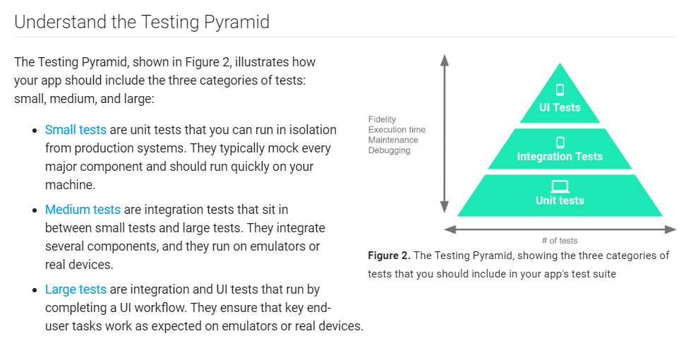

[https://developer.android.com/training/testing/fundamentals](https://developer.android.com/training/testing/fundamentals)

这个是安卓官方对测试金字塔的描述。

- Small tests是单元测试，在local JVM就可以运行。
- Medium tests是集成测试，测试集成的几个模块，运行于真机或模拟器。
- Large tests是UI测试，测试整个UI工作流程，运行于真机或模拟器。

开发写的单元测试和测试写的集成测试区别在哪里？

单元测试测试的测试单元一定是远小于集成测试，主要原因是：单元测试是运行在JVM上，直接去测试某个类或某几个类，
因为没有走整个App正常的启动和调用流程，导致非常多的模块是没有初始化的，为了测试用例不崩溃，必须把需要用到，但没初始化的类或方法mock，
如果测试单元很大，需要mock的东西就非常多，很难保证不出错。而集成测试是运行在真机或模拟器，可以按照App正常的启动和调用流程，
需要mock的东西不多，所以测试单元可以很大。

再者，单元测试是白盒测试。集成测试是黑盒测试。

### 1.2.单元测试

单元测试，是为了测试某一个类的某一个方法能否正常工作

单元测试目的
- 验收。提前发现代码中的bug。以后代码有改动或重构，跑下用例就可以了。
- 帮助开发。开发过程中，可以快速验证自己的代码逻辑，不用一遍遍完整跑起来。提高效率。
- 规范代码。为了让代码可测，会尽量避免些耦合特别多的代码。以及特别大的类和函数。

```java
public class NormalClassA {
  public int testAdd(int a, int b) {
    return a + b;
  }
}
public class NormalClassATest {
  @Test
  public void testAdd() {
    NormalClassA classA = new NormalClassA();
    Assert.assertEquals(5, classA.testAdd(1,4));
  }
}
```

1. setup：   一般是new出你要测试的那个类，以及其他一些前提条件的设置：NormalClassA classA = new NormalClassA();
2. 执行操作：  一般是调用你要测试的那个方法，获得运行结果：classA.testAdd(1,4)
3. 验证结果：  验证得到的结果跟预期中是一样的：Assert.assertEquals(5, classA.testAdd(1,4));

**《单元测试的艺术》一书中的优秀的单元测试特性**

优秀单元测试的特性
一个单元测试应当具有如下特征:口它应该是自动化的，可重复执行;口它应该很容易实现;
- 它应该第二天还有意义;
- 任何人都应该能一键运行它;口它应该运行速度很快;
- 它的结果应该是稳定的(如果运行之间没有进行修改的话，多次运行一个测试应该总是返回同样的结果);
- 它应该能完全控制被测试的单元;
- 它应该是完全隔离的(独立于其他测试的运行);
- 如果它失败了，我们应该很容易发现什么是期待的结果，进而定位问题所在。

### 1.3.工具链

#### 1.3.1.单元测试工具

谷歌推荐的是：junit4 + mockito + robolectric

我们最终选择的工具链：junit4 + mockito + powermock + robolectric

- JUnit：JUnit 是 Java 中最流行的单元测试框架之一，它提供了一组用于编写和运行测试的 API 和注解。JUnit 可以帮助你编写可靠的单元测试，并提供了丰富的断言和测试运行器。
- TestNG：TestNG 是另一个流行的 Java 单元测试框架，它与 JUnit 类似，但提供了更多的特性和灵活性。TestNG 支持测试分组、依赖性管理、参数化测试等功能。
- mock+powermock：mockito功能有点弱，很多功能受限。 powermock可以跟mockito兼容而且功能更强。
  与mockito比，支持修改和mock静态类或对象的私有方法/成员，还支持很多反射方法，非常实用。 powermock目前使用人数非常多，github上的star很高。
- robolectric:可以比较完整的模拟安卓接口。这样case就可以运行在jvm上。目前这个没有其他类似框架，无可替代，而且谷歌官方推荐。
  这套框架运行于JVM，不需要安卓模拟器和手机。

#### 1.3.2.自动生成单测代码

- idea和eclipse支持生成测试类，包括测试的方法等初级操作。
- Squaretest。【idea插件，收费】非常好用、非常智能的单测代码生成工具。官网：[https://squaretest.com/](https://squaretest.com/)
- TestMe。【idea插件】自动生成 Java JUnit 4/5, TestNG 单元测试 自动生成 Mockito mocks 自动生成 测试参数和断言语句 自动生成相关 mock 方法

#### 1.3.3.UI测试
- Selenium。用于Web应用程序测试的工具。Selenium测试直接运行在浏览器中，就像真正的用户在操作一样。


#### 1.3.4.单测高效构造参数和返回值神器

- easy-random。Java高效构造对象的神器。
   - 功能：一两行就可以构造一个非常复杂的对象或者对象列表。
   - 官网：[https://github.com/j-easy/easy-random](https://github.com/j-easy/easy-random)
- java-faker。Java 单元测试生成测试字符串的神器
   - 功能：如果我们想要随机构造人名、地名、天气、学校、颜色、职业，甚至符合某正则表达式的字符串
   - 官网：[https://github.com/DiUS/java-faker](https://github.com/DiUS/java-faker)

#### 1.3.5.单测覆盖率报告
- IDEA支持生成单测覆盖率。
-  [jacoco成单测覆盖率报告](https://mp.weixin.qq.com/s/HBfXdwRjfz8Uyzkb7UiGXg)

#### 1.3.6.性能测试
- JMeter：JMeter 是一个用于性能测试的工具，它可以模拟多种负载类型，并提供了丰富的图表和报告来帮助你分析测试结果。JMeter 可以测试 Web 应用程序、数据库、FTP 服务器等多种系统。
- Apache Bench：Apache Bench 是一个简单但功能强大的命令行工具，用于测试 Web 服务器性能。它可以模拟多个并发用户，并生成详细的测试报告。
- ContiPerf：轻量级的测试工具能轻松地利用的 JUnit 4 的性能测试

### 1.4.如何在android project中运行单元测试

##### 1.4.1.安卓自动化测试有两种：

1. Local tests:运行与JVM上
2. Instrumented tests:运行于手机或模拟器，因为要依赖Android Framework，例如Context等。

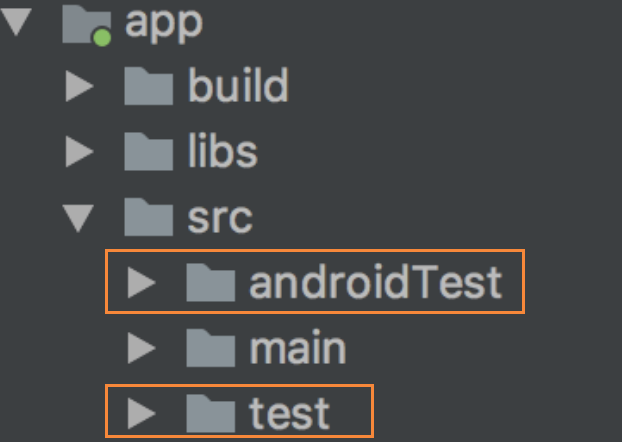


新建模块时会自动生成androidTest和test两个目录。androidTest中的测试用例对应上面提到的 Instrumented tests。
test中的测试用例对应上面提到的Local tests

#### 1.4.2.创建一个测试类

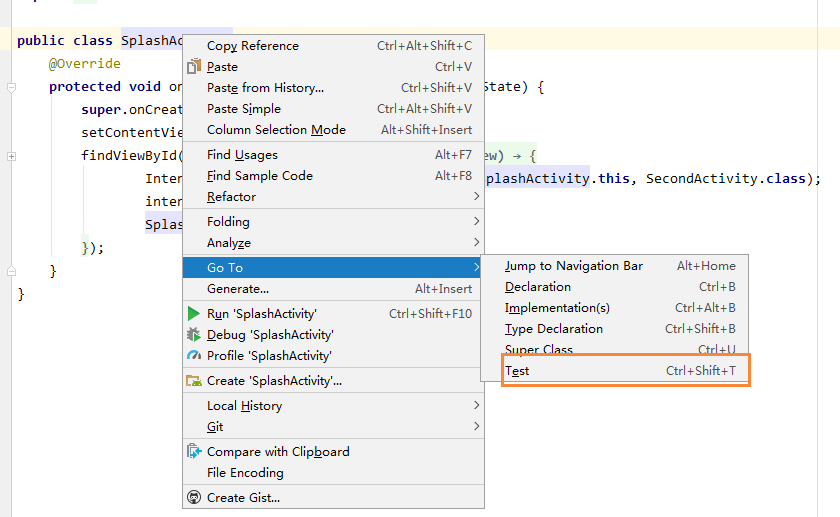

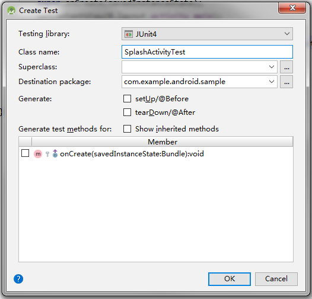

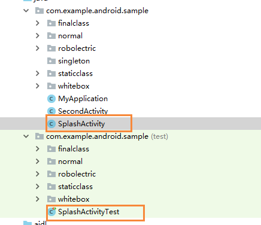

test的同级目录下就会生成测试类文件

#### 1.4.2.如何运行？

##### 1.4.2.1.方法一：通过Android Studio运行

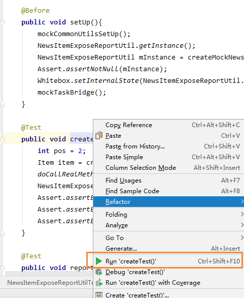

函数内右键，运行单个测试用例

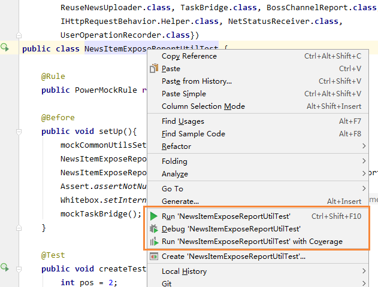

在类名上右键，运行该类的所有测试用例

##### 1.4.2.2.方法二：通过命令行

在Terminal中运行：gradlew testDebug --continue

通过命令行运行后，会生成测试用例的报告，用Android Studio运行不会生成。

报告目录

对应模块的build目录下，build\reports\tests\testDebugUnitTest

以m_news_list模块为例：TencentNews\m_news_list\build\reports\tests\testDebugUnitTest

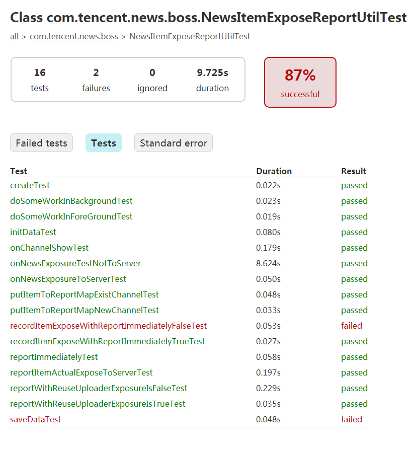

### 1.5.两种函数不同的测试方法

函数有两种：验证返回值和验证函数调用。

#### 1.5.1.有返回值函数

既可以验证返回值，也可以验证函数调用

#### 1.5.2.无返回值

验证函数调用

```java
public class NormalClassA {
  public NormalClassB mClassB = new NormalClassB();
  public int testPlus(int a, int b) {
      return mClassB.testPlus(a, b);
  }
}

public class NormalClassB {
  public int testPlus(int a, int b) {
      return a + b;
  }
}

public class NormalClassATest {
  @Test
  public void testPlusInvokeMock() {
    NormalClassA classA = new NormalClassA();
    classA.mClassB = Mockito.mock(NormalClassB.class);
    //验证返回值
    Assert.assertEquals(6,   classA.testPlus(3,3));
    //验证函数调用，并且参数是3，3
    Mockito.verify(classA.mClassB).testPlus(3, 3);
  }
}
```

### 1.6. 单元测试基本规范

#### 1.6.1.测试用例存放目录

单元测试文件放在对应模块的test目录下

#### 1.6.2.单元测试代码规范

- 测试类的包名：与被测类的包名保持一致
- 测试类命名方式：被测类名+Test。示例：
- 被测类名AppDownload，则测试类名为 AppDownloadTest
- 测试用例命名方式：test+首字母大写的
- 测方法名，如果同一个逻辑要测不同分支，产生多个同类测试用例的情况，用例前缀需保持一致，后面跟“_xxxx_xxxx”，xxxx明确分支意图。格式为大写开头驼峰。。示例：
- 被测方法名sendRequest，则测试用例名称 为testSendRequest，如有多个，则为 testSendRequest_HasLogin_Success, testSendRequest_HasLogin_Fail,…
  用例命名规范参考谷歌代码：
  [https://cs.android.com/android/platform/superproject/+/master:packages/apps/WallpaperPicker2/tests/src/com/android/wallpaper/picker/individual/IndividualPickerActivityTest.java](https://cs.android.com/android/platform/superproject/+/master:packages/apps/WallpaperPicker2/tests/src/com/android/wallpaper/picker/individual/IndividualPickerActivityTest.java)
- 测试类必须有setup()、cleanup()方法，用 于初始化和资源释放。
- 测试用例必须有断言。

#### 1.6.3.单元测试验证标准

通过代码覆盖率判断，代码覆盖率包含：行覆盖，函数覆盖，分支覆盖。

#### 1.6.4.单元测试验证标准

通过代码覆盖率判断，代码覆盖率包含：行覆盖，函数覆盖，分支覆盖。

#### 1.6.5.那些需要做单元测试

非UI的逻辑代码，例如：工具方法、MVP中的P。

#### 1.6.6.代码架构规范

保持UI和逻辑的分析，推荐采用MVP模式，方便单元测试。

## 2.JUnit4

### 2.1.引入依赖

```groovy
dependencies {testCompile 'junit:junit:4.12'}
```

### 2.2.常用注解

- @Test代表一条测试用例。
- @Before修饰的方法，在每个测试方法调用之前，这个方法都会得到调用。所以上面的例子中，testAdd()被运行之前，setup()会被调用一次
- @After对应于@Before，每个测试方法运行结束之后，会运行的方法。比如一个测试文件操作的类，那么在它的测试类中，可能@Before里面需要去打开一个文件，而每个测试方法运行结束之后，都需要去close这个文件。这个时候就可以把文件close的操作放在@After里面，让它自动去执行。
- @BeforeClass，@AfterClass。@BeforeClass的作用是，在跑一个测试类的所有测试方法之前，会执行一次被@BeforeClass修饰的方法，执行完所有测试方法之后，会执行一遍被@AfterClass修饰的方法。这两个方法可以用来setup和release一些公共的资源，需要注意的是，被这两个annotation修饰的方法必须是静态的。

这是比较常用的注解，其他注解可以参考下表：
- @Test             ：表示此方法为测试方法
- @Before           ：在每个测试方法前执行，可做初始化操作
- @After            ：在每个测试方法后执行，可做释放资源操作
- @Ignore           ：忽略的测试方法
- @BeforeClass      ：在类中所有方法前运行。此注解修饰的方法必须是static void
- @AfterClass       ：在类中最后运行。此注解修饰的方法必须是static void
- @RunWith          ：指定该测试类使用某个运行器
- @Parameters       ：指定测试类的测试数据集合
- @Rule             ：重新制定测试类中方法的行为
- @FixMethodOrder   ：指定测试类中方法的执行顺序

### 2.3.执行顺序

- @BeforeClass –>
- @Before –> @Test –> @After //case 1
- @Before –> @Test –> @After //case 2
- @Before –> @Test –> @After //case n
- –> @AfterClass

### 2.4.Assert类

- assertNotEquals     ：断言传入的预期值与实际值是不相等的
- assertArrayEquals   ：断言传入的预期数组与实际数组是相等的
- assertNull          ：断言传入的对象是为空
- assertNotNull       ：断言传入的对象是不为空
- assertTrue          ：断言条件为真
- assertFalse         ：断言条件为假
- assertSame          ：断言两个对象引用同一个对象，相当于“==”
- assertNotSame       ：断言两个对象引用不同的对象，相当于“!=”
- assertThat          ：断言实际值是否满足指定的条件

通过Assert类验证结果是否符合预期

### 2.5.assertThat验证结果

Assert.assertEquals(4, classA.testAdd(1,4));
出错时的提示：junit.framework.AssertionFailedError: Expected :4Actual :5

assertThat(4, equalTo(5));
出错时的提示： java.lang.AssertionError: Expected: <5>but: was <4>Expected :<5> Actual :<4>


assertThat的作用跟Assert类似，提供的方法更多一些，返回错误也更容易读。

匹配器             说明 例子
- is                     ：断言参数等于后面给出的匹配表达式
- not                    ：断言参数不等于后面给出的匹配表达式
- equalTo                ：断言参数相等
- equalToIgnoringCase    ：断言字符串相等忽略大小写
- containsString         ：断言字符串包含某字符串
- startsWith             ：断言字符串以某字符串开始
- endsWith               ：断言字符串以某字符串结束
- nullValue              ：断言参数的值为null
- notNullValue           ：断言参数的值不为null
- greaterThan            ：断言参数大于
- lessThan               ：断言参数小于
- greaterThanOrEqualTo   ：断言参数大于等于
- lessThanOrEqualTo      ：断言参数小于等于
- closeTo                ：断言浮点型数在某一范围内
- allOf                  ：断言符合所有条件，相当于&&
- anyOf                  ：断言符合某一条件，相当于或
- hasKey                 ：断言Map集合含有此键
- hasValue               ：断言Map集合含有此值
- hasItem                ：断言迭代对象含有此元素

## 3.Mockito

### 3.1.为什么要Mock

#### 3.1.1. 解决测试类对其他类的依赖

在实际的单元测试中，我们要测试的类很可能对其他类有依赖，要测试的方法对其他方法或变量有依赖，如果直接运行这个要测试的方法，很大可能会因为某些变量没初始化NP。这样我们就无法顺利的进行测试。如果mock方法模拟一个类，最大的特点是，该类所有的方法都是空，所有变量都是初始值。这样这个类就对其他类几乎没有依赖了。然后只针对你要测试的方法调用doCallRealMethod()真正执行方法的实现。这样依赖就很少了，就比较可控了。再把依赖的方法mock，方法运行了。

```java
public class JudgePresenter extends AbstractJudgePresenter {
    public JudgePresenter(IJudgeContract.IView mView, QuestionInfo mCurrentQuestionInfo) {
        super(mView, mCurrentQuestionInfo);
    }

    @Override
    public void initUIData() {
        mView.setBg();
        updateLiveViewerCount();
    }

    private void updateLiveViewerCount() {
        DataLoader.getLiveViewerBuilder(GlobalLocalData.getInstance().getArticleId())
                .response(new TNResponseCallBack<LiveViewersRet>())
                .build()
                .submit();
    }
}

```

针对initUIData写测试用例：
```java
@Test
public void initUIDataTest() {
  IJudgeContract.IView mockView = Mockito.mock(JudgeDialog.class);
  JudgePresenter presenter = new JudgePresenter(mockView, getFakeQuestionInfo());
  presenter.initUIData();
  Mockito.verify(mockView).setBg();
}
```

直接运行测试用例，会报错，提示网络库某个方法NP了。
这是因为initUIDataTest()调到了updateLiveViewerCount()，该函数中调用到了网络请求库，而网络库模块是需要初始化的，所以有些值为null，导致NP。那只要把网络库初始化一下，不就可以了吗？然后如果尝试去初始话网络库，就会发现，初始化网络库又需要一堆依赖…，这就把问题搞复杂了。回到最初的目的，我们只是想测试initUIDataTest方法，我们只关心setBg()被调用了，至于updateLiveViewerCount方法的执行过程，不属于我们这个测试用例考虑的范畴，
所以这里我们其实只需要mock一下updateLiveViewerCount方法，让他不执行就可以。用PowerMockito来实现，代码如下

PowerMockito.suppress(PowerMockito.method(JudgePresenter.class, "updateLiveViewerCount"));

所以完整的测试代码：

```java
@Test
public void initUIDataTest() {
  IJudgeContract.IView mockView = Mockito.mock(JudgeDialog.class);
  JudgePresenter presenter = new JudgePresenter(mockView, getFakeQuestionInfo());
  PowerMockito.suppress(PowerMockito.method(JudgePresenter.class, "updateLiveViewerCount"));
  presenter.initUIData();
  Mockito.verify(mockView).setBg();
}
```

#### 3.1.2.验证方法的调用

只有对mock的对象或类，才能调用verify方法，验证方法的调用。

举个例子：

```java
@Test
public void initUIDataTest() {
    IJudgeContract.IView mockView = Mockito.mock(JudgeDialog.class);
    JudgePresenter presenter = new JudgePresenter(mockView, getFakeQuestionInfo());
    PowerMockito.suppress(PowerMockito.method(JudgePresenter.class, "updateLiveViewerCount"));
    presenter.initUIData();
    Mockito.verify(mockView).setBg();
}
```

为了验证JudgeDialog中setBg()方法被调用了，需要mock一个JudgeDialog。

### 3.2. Mockito

Mockito是安卓官方推荐的，也是目前使用最广泛的。

#### 3.2.1.用法

```groovy
dependencies {
  testCompile "org.mockito:mockito-core:2.8.9"
}
```

```java
@RunWith(MockitoJUnitRunner.class)
public class NormalClassAMockitoTest {

    @Test
    public void testAPlusInvokeMock() {
        NormalClassA mockClassA = Mockito.mock(NormalClassA.class);
        mockClassA.testPlus(3,3);
        Mockito.verify(mockClassA).testPlus(3, 3);
    }
}
```

这个例子中，mock了NormalClassA用于验证该对象的testPlus()方法是否被调用了。注意类前面的注解*@RunWith*(MockitoJUnitRunner.class)
指明本类中的用例用MockitoJUnitRunner运行。


#### 3.2.2 Mock和Spy的区别

##### 3.2.2.1 Mock方法创建的对象，所有方法都是空方法。非void方法都将返回默认值，比如int方法将返回0，对象方法将返回null等，而void方法将什么都不做。

##### 3.2.2.2 Spy方法创建的对象，跟正常类对象一样，是正常对象的替身。

##### 3.2.2.3 被测试代码：

```java
public class NormalClassB {

    public int testPlus(int a, int b) {
        return a + b;
    }

}
```

##### 3.2.2.4 用Mock方式的代码：

```java
@Test
public void testPlusValueMock() {
    NormalClassA classA = new NormalClassA();
    classA.mClassB = Mockito.mock(NormalClassB.class);
    Assert.assertEquals(0, classA.testPlus(3, 3));
}
```

在这个例子中，Mock了NormalClassB，所以它的testPlus方法就会是空的。调用classA.testPlus(3, 3)后，将会返回int的默认值0，并不会返回6。

##### 3.2.2.5 用Spy方式的代码：

```java
@Test
public void testPlusValueSpy() {
    NormalClassA classA = new NormalClassA();
    classA.mClassB = Mockito.spy(new NormalClassB());
    Assert.assertEquals(6, classA.testPlus(3, 3));
}
```

在这个例子中，Spy了NormalClassB，它的testPlus方法不为空，是具体实现的。调用classA.testPlus(3, 3)后，将会返回6。

好的，让我来帮您整理一下这个Markdown的格式。同样的，我会将标题的层次结构进行调整，将代码块语法应用于代码，并将更改应用于Markdown中。

以下是更改后的Markdown：

#### 3.2.3 Mock和Spy各自适用的场景

##### 3.2.3.1 Mock

Mock适用于类中大多数方法只需要验证是否被调用，而不关心方法内部执行结果的场景。通过让类的所有方法都为空实现，可以减少对其他类的依赖。

如果想要在Mock对象中执行某个函数的具体实现，该怎么办呢？可以使用doCallRealMethod()方法。

```java
@Test
public void testPlusValueMockWithCallRealMethod() {
    NormalClassA classA = new NormalClassA();
    classA.mClassB = Mockito.mock(NormalClassB.class);
    doCallRealMethod().when(classA.mClassB).testPlus(Mockito.anyInt(), Mockito.anyInt());
    Assert.assertEquals(6, classA.testPlus(3, 3));
}
```

##### 3.2.3.2 Spy

Spy与Mock相反，适用于类中大部分函数需要关注具体实现的场景。

如果想要在Spy对象中，某个函数不执行，该怎么办呢？有两种情况：有返回值和无返回值。

###### 3.2.3.3 有返回值的函数

```java
@Test
public void testPlusValueSpyWithDoReturn() {
    NormalClassA classA = new NormalClassA();
    classA.mClassB = Mockito.spy(NormalClassB.class);
    doReturn(0).when(classA.mClassB).testPlus(Mockito.anyInt(), Mockito.anyInt());
    Assert.assertEquals(0, classA.testPlus(3, 3));
}
```

###### 3.2.3.4 无返回值的函数

```java
@Test
public void testPlusValueSpyWithDoThrow() throws Exception {
    NormalClassA classA = new NormalClassA();
    classA.mClassB = Mockito.spy(NormalClassB.class);
    doNothing().when(classA.mClassB).voidMethod(Mockito.anyInt(), Mockito.anyInt());
}
```

这些是Mockito的方法。后面我们将介绍PowerMock，它还提供了其他方法来禁用某个函数的执行。

#### 3.2.4. 打桩方法

在Java中，我们常常需要使用Mockito等框架进行单元测试。在这些框架中，打桩方法是一个非常重要的概念。其中，doCallRealMethod()，doReturn()和doNothing()是我们经常使用的打桩方法。除此之外，还有以下全部打桩方法：

| 方法名 | 方法描述 |
| --- | --- |
| thenReturn(T value) | 设置要返回的值 |
| thenThrow(Throwable… throwables) | 设置要抛出的异常 |
| thenAnswer(Answer<?> answer) | 对结果进行拦截 |
| doReturn(Object toBeReturned) | 提前设置要返回的值 |
| doThrow(Throwable… toBeThrown) | 提前设置要抛出的异常 |
| doAnswer(Answer answer) | 提前对结果进行拦截 |
| doCallRealMethod() | 调用某一个方法的真实实现 |
| doNothing() | 设置void方法什么也不做 |


##### 3.2.5. 验证方法

在Mockito中，Mockito.verify()用于验证方法是否被调用，调用次数等。下面是一些常用的验证方法：

| 方法名 | 方法描述 |
| --- | --- |
| after(long millis) | 在给定的时间后进行验证 |
| timeout(long millis) | 验证方法执行是否超时 |
| atLeast(int minNumberOfInvocations) | 至少进行n次验证 |
| atMost(int maxNumberOfInvocations) | 至多进行n次验证 |
| description(String description) | 验证失败时输出的内容 |
| times(int wantedNumberOfInvocations) | 验证调用方法的次数 |
| never() | 验证交互没有发生,相当于times(0) |
| only() | 验证方法只被调用一次，相当于times(1) |

以下是一个示例代码：

```java
@Test
public void testAPlusInvokeMock() {
    NormalClassA mockClassA = Mockito.mock(NormalClassA.class);
    mockClassA.testPlus(3,3);
    Mockito.verify(mockClassA).testPlus(3, 3);
    Mockito.verify(mockClassA, times(1)).testPlus(3, 3);
    Mockito.verify(mockClassA, atLeast(1)).testPlus(3, 3);
}
```


#### 3.2.6.参数匹配器

```java
@RunWith(MockitoJUnitRunner.class)
public class NormalClassAMockitoTest {
    @Test
    public void testAPlusInvokeMock() {
        NormalClassA mockClassA = Mockito.mock(NormalClassA.class);
        mockClassA.testPlus(3,3);
        Mockito.verify(mockClassA).testPlus(3, 3);
    }
}
```

Mockito.verify(mockClassA).testPlus(3, 3); 这行验证成立条件有2个：
1.  testPlus被调用。
2.  testPlus的参数是3，3。

如果调用 mockClassA.testPlus(3,4); 验证是失败，因为参数不一致。
那么如何忽略具体的参数呢。这就需要用到参数匹配器。

Mockito.verify(mockClassA).testPlus(Mockito.anyInt(),Mockito.anyInt());

这样写，只要参数是整型就能验证成功。

##### 3.2.6.1.需要注意的特殊case

- 一个参数确定，另一个参数是匹配器
- Mockito.verify(mockClassA).testPlus(3 ,Mockito.anyInt());
- 如果这样写，能配置成功吗？
  答案是不能。
  正确写法： Mockito.verify(mockClassA).testPlus(Mockito.eq(3) ,Mockito.anyInt());
- 匹配非基础类型
```java
//如果函数原型是这样：
void putItemToReportMap(String channel, Properties prop, HashMap<String, HashSet<Properties>> map)
//正确的验证方法：
Mockito.verify(mockClassA).putItemToReportMap(Mockito.anyString(), Mockito.any(Properties.class), Mockito.anyMap());
```

| 方法名 | 方法描述 |
| --- | --- |
| anyObject() | 匹配任何对象 |
| any(Class<T> type) | 与anyObject()一样 |
| any() | 与anyObject()一样 |
| anyBoolean() | 匹配任何boolean和非空Boolean |
| anyByte() | 匹配任何byte和非空Byte |
| anyCollection() | 匹配任何非空Collection |
| anyDouble() | 匹配任何double和非空Double |
| anyFloat() | 匹配任何float和非空Float |
| anyInt() | 匹配任何int和非空Integer |
| anyList() | 匹配任何非空List |
| anyLong() | 匹配任何long和非空Long |
| anyMap() | 匹配任何非空Map |
| anyString() | 匹配任何非空String |
| contains(String substring) | 参数包含给定的substring字符串 |
| argThat(ArgumentMatcher<T> matcher) | 创建自定义的参数匹配模式 |

#### 3.2.7.其他方法

以下是Mockito库中一些其他方法的介绍：

| 方法名 | 方法描述 |
| --- | --- |
| reset(T … mocks) | 重置Mock对象 |
| spy(Class<T> classToSpy) | 创建一个真实的对象，并记录该对象的所有方法调用 |
| inOrder(Object… mocks) | 验证执行顺序 |
| @InjectMocks注解 | 自动将模拟对象注入到被测试对象中 |

其中，@InjectMocks注解可以自动将模拟对象注入到被测试对象中，以便进行单元测试。需要注意的是，使用@InjectMocks注解时，被测试对象中的模拟对象必须已经创建并初始化。
另外，在使用@InjectMocks注解时，需要确保正确地配置了依赖关系，以便正确地注入模拟对象。

### 3.3.Mockito局限性

针对上面的代码，可以使用Mockito框架编写单元测试。以下是一个测试`initUIData()`方法，需要验证mView.setBg()、updateLiveViewerCount被调用的示例：

```
public class JudgePresenterTest {

    private IJudgeContract.IView mView = Mockito.mock(IJudgeContract.IView.class);
    private QuestionInfo mCurrentQuestionInfo = Mockito.mock(QuestionInfo.class);
    private JudgePresenter mPresenter = new JudgePresenter(mView, mCurrentQuestionInfo);

    @Test
    public void testInitUIData() {
        mPresenter.initUIData();
        Mockito.verify(mView).setBg();
        Mockito.verify(mPresenter).updateLiveViewerCount();
    }

}
```

在这个测试中，我们首先创建了一个`JudgePresenter`实例，并将其与一个模拟的`IJudgeContract.IView`和`QuestionInfo`对象一起传递给构造函数。
然后，我们调用`initUIData()`方法，并使用`Mockito.verify()`方法验证了`mView.setBg()`和`mPresenter.updateLiveViewerCount()`方法是否被调用。
需要注意的是，由于`updateLiveViewerCount()`方法是私有的，因此我们无法直接调用它。
但是，我们可以通过验证`mPresenter.updateLiveViewerCount()`方法是否被调用来验证该方法是否被正确执行。

需要注意的是，Mockito框架有一些限制，例如无法访问私有方法、mock匿名类、final类、static方法等。

## 4.PowerMock

### 4.1.PowerMock介绍

PowerMock是Mockito的扩展增强版，支持mock private、static、final方法和类，还增加了很多反射方法可以方便修改静态和非静态成员等。功能比Mockito增加很多。

为什么 Mockito 不自己支持 private 方法？

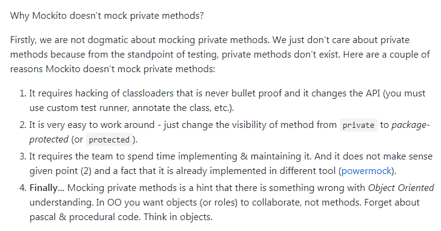

[https://github.com/mockito/mockito/wiki/Mockito-And-Private-Methods](https://github.com/mockito/mockito/wiki/Mockito-And-Private-Methods)

简单点说：
1. 改动较大，不是特别必要。
2. powermock已经实现了。
3. 被测代码不够规范

### 4.2.PowerMock版本

PowerMock是依赖Mockito的，所以使用时要一同引入。 PowerMock跟Mockito的版本必须对应：

[https://github.com/powermock/powermock/wiki/Mockito](https://github.com/powermock/powermock/wiki/Mockito)

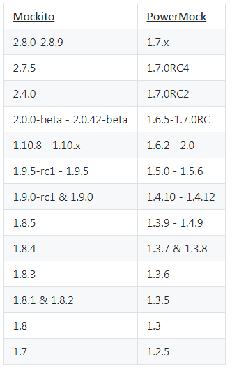


目前我们使用的版本：

```groovy
testCompile 'junit:junit:4.12'
testCompile "org.mockito:mockito-core:2.8.9"
testCompile "org.powermock:powermock-module-junit4:1.7.1"
testCompile "org.powermock:powermock-api-mockito2:1.7.1"//注意，这里要用mockito2，否则报错
testCompile 'org.powermock:powermock-core:1.7.1'
testCompile "org.powermock:powermock-module-junit4-rule:1.7.1"
testCompile "org.powermock:powermock-classloading-xstream:1.7.1"
```

### 4.3.基本使用

```java
@RunWith(PowerMockRunner.class)
@PrepareForTest({NormalClassA.class})
public class NormalClassAPowerMockTest {
  @Test
  public void testPrivateMethod() throws Exception {
    NormalClassA classA = new NormalClassA();
    NormalClassA mockClassA = PowerMockito.spy(classA);
    mockClassA.publicAdd(2, 3);
    PowerMockito.verifyPrivate(mockClassA, times(1)).invoke("privateAdd",
    Mockito.anyInt(), Mockito.anyInt());
  }
}
```

- @RunWith(PowerMockRunner.class)，使用PowerMockRunner，使用这个Runner时，跟Mockito是兼容的，Mockito中的各种方法也是可以正常使用的。
- @PrepareForTest({NormalClassA.class})， PowerMock要mock的类一定要写在这个注解里，切记切记！ 写的时候实在太容易忘了，而且，就算不写也不会报错，只是verify永远成功，所以特别隐蔽，忘记写了也很难发现。
- 通过PowerMockito.verifyPrivate验证私有方法的调用。Mocktio的次数验证times(1)和参数匹配符也都是可以用的。

### 4.4.针对对象的操作

#### 4.4.1.读取对象私有成员

```java
public class ObjectWhiteBoxClass {
    private final List<String> mObjectList = new ArrayList<>();

    public void publicObjectAdd(String str) {
        mObjectList.add(str);
    }

    public List<String> getObjectList() {
        return mObjectList;
    }
}

@Test
public void testGetInternalState() {
    ObjectWhiteBoxClass objectWhiteBoxClass = new ObjectWhiteBoxClass();
    objectWhiteBoxClass.publicObjectAdd("test1str");
    objectWhiteBoxClass.publicObjectAdd("test2str");
    objectWhiteBoxClass.publicObjectAdd("test3str");

    List<String> list = Whitebox.getInternalState(objectWhiteBoxClass, "mObjectList");

    Assert.assertEquals(3, list.size());
    Assert.assertEquals("test3str", list.get(list.size()-1));
}
```

#### 4.4.2.修改对象私有成员

```java
java
Copy code
public class MockPrivateObjectClass {
    private InnerClass innerClass;

    public MockPrivateObjectClass() {

    }

    public int doPlus(int a, int b) {
        return innerClass.plus(a, b);
    }

    public static class InnerClass {
        public int plus(int a, int b) {
            return a + b;
        }
    }
}
```

##### 4.4.2.1.第一种方式：Whitebox.setInternalState

```java
@RunWith(PowerMockRunner.class)
@PrepareForTest({MockPrivateObjectClass.class})
public class MockPrivateObjectClassTest {
    @Test
    public void doPlusTest() {
        MockPrivateObjectClass objectClass = new MockPrivateObjectClass();
        MockPrivateObjectClass.InnerClass mockInnerClass = Mockito.spy(MockPrivateObjectClass.InnerClass.class);
        Whitebox.setInternalState(objectClass, "innerClass", mockInnerClass);

        int ret = objectClass.doPlus(2, 3);
        Assert.assertEquals(5, ret);
        Mockito.verify(mockInnerClass).plus(2, 3);
    }
}
```

##### 4.4.2.2.第二种方式：MemberModifier.field

```java
@RunWith(PowerMockRunner.class)
@PrepareForTest({MockPrivateObjectClass.class})
public class MockPrivateObjectClassTest {

    @Test
    public void doPlusMethod2Test() throws Exception {
        MockPrivateObjectClass objectClass = new MockPrivateObjectClass();
        MockPrivateObjectClass.InnerClass mockInnerClass = Mockito.spy(MockPrivateObjectClass.InnerClass.class);
        MemberModifier.field(MockPrivateObjectClass.class, "innerClass").set(objectClass, mockInnerClass);

        int ret = objectClass.doPlus(2, 3);
        Assert.assertEquals(5, ret);
        Mockito.verify(mockInnerClass).plus(2, 3);
    }
}
```

#### 4.4.3.Verify对象私有方法
```java
public class NormalClassA {
    public int publicAdd(int a, int b) {
        return privateAdd(a, b);
    }

    private int privateAdd(int a, int b) {
        return a + b;
    }
}

@RunWith(PowerMockRunner.class)
@PrepareForTest({NormalClassA.class})
public class NormalClassAPowerMockTest {
    @Test
    public void testPrivateMethod() throws Exception {
        NormalClassA classA = new NormalClassA();
        NormalClassA mockClassA = PowerMockito.spy(classA);

        mockClassA.publicAdd(2, 3);

        PowerMockito.verifyPrivate(mockClassA, times(1)).invoke("privateAdd", Mockito.anyInt(), Mockito.anyInt());
    }
}

```

#### 4.4.4.Invoke对象私有方法

```java
public class ObjectWhiteBoxClass {
    private final List<String> mObjectList = new ArrayList<>();

    private void privateObjectAdd(String str) {
        mObjectList.add(str);
    }

    private void privateObjectRemove(String str) {
        mObjectList.remove(str);
    }

    public List<String> getObjectList() {
        return mObjectList;
    }
}

@Test
public void testInvokeMethod() throws Exception {
    ObjectWhiteBoxClass objectWhiteBoxClass = new ObjectWhiteBoxClass();

    Whitebox.invokeMethod(objectWhiteBoxClass, "privateObjectAdd", "test1");
    Whitebox.invokeMethod(objectWhiteBoxClass, "privateObjectAdd", "test2");

    Assert.assertEquals(2, objectWhiteBoxClass.getObjectList().size());

    Whitebox.invokeMethod(objectWhiteBoxClass, "privateObjectRemove", "test1");

    Assert.assertEquals(1, objectWhiteBoxClass.getObjectList().size());
}
```

#### 4.4.5.修改对象私有函数

```java
public class MockPrivateObjectClass {
    public String stepName;

    public MockPrivateObjectClass() {

    }

    private void setStepName() {
        System.out.print("enter setStepName");
        stepName = "has set name";
    }

    public void testStepName() {
        setStepName();
        System.out.print(stepName);
    }
}

@Test
public void replacePrivateMethodTest() {
    MockPrivateObjectClass objectClass = new MockPrivateObjectClass();

    PowerMockito.replace(PowerMockito.method(MockPrivateObjectClass.class, "setStepName")).with(new InvocationHandler() {
        @Override
        public Object invoke(Object o, Method method, Object[] objects) throws Throwable {
            Whitebox.setInternalState(o, "stepName", "modify step name");
            return null;
        }
    });

    objectClass.testStepName();
}
```

运行结果：

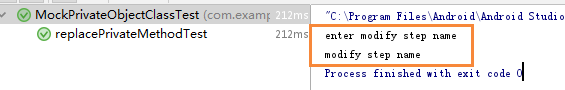


替换了setStepName方法的实现。

##### 4.4.5.1.这在写单测时，特别有用，譬如，将异步执行的代码，替换为同步，可以方便测试。

#### 4.4.6. 调用私有构造方法
```java
public class PrivateConstructorClass {
    private final List<String> mObjectList;

    private PrivateConstructorClass() {
        mObjectList = new ArrayList<>();
    }

    public void add(String str) {
        mObjectList.add(str);
    }

    public List<String> getObjectList() {
        return mObjectList;
    }
}

@Test
public void testInvokePrivateConstructor() throws Exception{
    PrivateConstructorClass object = Whitebox.invokeConstructor(PrivateConstructorClass.class);
    object.add("test1");
    Assert.assertEquals(1, object.getObjectList().size());
}

// 调用了私有的构造函数 PrivateConstructorClass()
```

##### 4.4.6.1.这个对单例等特别有用

#### 4.4.7. mock对象的创建

```java
public class NormalClassA {
    public String getClassBName() {
        NormalClassB b = new NormalClassB();
        return b.getName();
    }
}

public class NormalClassB {
    public String getName(){
        return "NormalClassB";
    }
}

public static class MockNormalClassB extends NormalClassB {
    @Override
    public String getName() {
        return "MockNormalClassB";
    }
}

@Test
public void testClassB() throws Exception {
    NormalClassA classA = new NormalClassA();
    String name = classA.getClassBName();
    System.out.println("before mock:" + name);
    Assert.assertEquals("NormalClassB", name);
    NormalClassB b = new MockNormalClassB();
    NormalClassB mockB = Mockito.spy(b);
    PowerMockito.whenNew(NormalClassB.class).withNoArguments().thenReturn(mockB);
    name = classA.getClassBName();
    System.out.println("after mock:" + name);
    Assert.assertEquals("MockNormalClassB", name);
    Mockito.verify(mockB).getName();
}
```

运行结果：

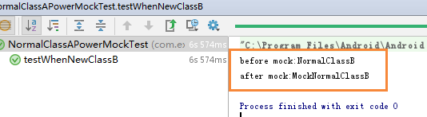

1. new NormalClassB()动作是在函数内部，并没有赋给某个类成员，我们没法访问到NormalClassB对象，也就没法mock，这种情况特别适合用WhenNew方法。
2. 注意：whenNew跟匿名类一起使用时，很可能会有问题，本文最后的总结中有介绍。

#### 4.4.8.跳过某个方法

Mockito中介绍过，通过doReutrn、doNothing，不执行某个函数。

PowerMock中有另一种方式：

```java
public class MockPrivateObjectClass {
    public String stepName;

    private void setStepName() {
        System.out.print("enter setStepName");
        stepName = "has set name";
    }

    public void testStepName() {
        setStepName();
        System.out.print(stepName);
    }
}

@Test
public void skipPrivateMethodTest() {
    MockPrivateObjectClass objectClass = new MockPrivateObjectClass();
    PowerMockito.suppress(PowerMockito.method(MockPrivateObjectClass.class, "setStepName"));
    objectClass.testStepName();
}
```

执行结果

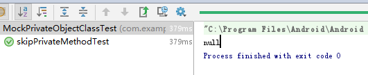


enter setStepName log没有被打印，说明方法被跳过了。

#### 4.4.9.打桩对象私有方法
```java
public class H5JsApiScriptInterface {
    private boolean shouldTriggerForAccount(int account) {
        return !isAccountValid(account) || !isMainAvailable();
    }
}

// 注意：要增加 PrepareForTest
@PrepareForTest({LoginManager.class, H5JsApiScriptInterface.class})
public class H5JsApiScriptInterfaceTest extends MainTNUnitTest {
    // qq connect
    @Test
    public void testShowLoginWithType_1() throws Exception{
        PowerMockito.mockStatic(LoginManager.class);
        H5JsApiScriptInterface mockScriptInterface = PowerMockito.mock(H5JsApiScriptInterface.class);
        Mockito.doCallRealMethod().when(mockScriptInterface).showLoginWithType(Mockito.anyString(), Mockito.anyString());
        // 打桩对象私有方法，mock 对象私有方法
        // 注意：要增加 PrepareForTest
        PowerMockito.when(mockScriptInterface, PowerMockito.method(H5JsApiScriptInterface.class, "shouldTriggerForAccount", int.class)).withArguments(Mockito.anyInt()).thenReturn(true);
        mockScriptInterface.showLoginWithType("qqconnect", "callback");
        PowerMockito.verifyStatic(LoginManager.class, Mockito.times(1));
        LoginManager.triggerLogin(Mockito.eq(LOGIN_FROM_WEB_ONLY_QQCONNECT), Mockito.any(Subscriber.class));
    }
}
```

### 4.5. 针对静态类

#### 4.5.1.访问静态私有成员
```java
public class StaticWhiteBoxClass {
    private final static List<String> mStaticList = new ArrayList<>();

    public static void publicStaticAdd(String str) {
        mStaticList.add(str);
    }

    public static List<String> getStaticList() {
        return mStaticList;
    }
}

@Test
public void testGetInternalState() {
    StaticWhiteBoxClass.publicStaticAdd("test1str");
    StaticWhiteBoxClass.publicStaticAdd("test2str");
    StaticWhiteBoxClass.publicStaticAdd("test3str");

    List<String> list = Whitebox.getInternalState(StaticWhiteBoxClass.class, "mStaticList");

    Assert.assertEquals(3, list.size());
    Assert.assertEquals("test3str", list.get(list.size()-1));
}
```

#### 4.5.2.修改静态私有成员
```java
public class StaticWhiteBoxClass {
    private final static List<String> mStaticList = new ArrayList<>();

    public static void publicStaticAdd(String str) {
        mStaticList.add(str);
    }

    public static List<String> getStaticList() {
        return mStaticList;
    }
}

@Test
public void testSetInternalState() {
    List<String> list = new ArrayList<>();
    list.add("outer1");
    list.add("outer2");
    list.add("outer3");

    Whitebox.setInternalState(StaticWhiteBoxClass.class, "mStaticList", list);

    List<String> objList = StaticWhiteBoxClass.getStaticList();

    Assert.assertEquals(3, objList.size());
    Assert.assertEquals("outer3", list.get(objList.size()-1));
}
```

#### 4.5.3.调用静态私有方法
```java
public class StaticWhiteBoxClass {
    private final static List<String> mStaticList = new ArrayList<>();

    private static void privateStaticAdd(String str) {
        mStaticList.add(str);
    }

    public static List<String> getStaticList() {
        return mStaticList;
    }
}

@Test
public void testInvokeMethod() throws Exception{
    Whitebox.invokeMethod(StaticWhiteBoxClass.class, "privateStaticAdd", "test1");
    Whitebox.invokeMethod(StaticWhiteBoxClass.class, "privateStaticAdd", "test2");

    Assert.assertEquals(2, StaticWhiteBoxClass.getStaticList().size());
}
```

#### 4.5.4.替换静态函数
```java
public class StaticWhiteBoxClass {
    public static void originalMethod(String name) {
        System.out.println("enter originalMethod name:" + name);
    }
}

@Test
public void replacePrivateMethodTest() {
    PowerMockito.replace(PowerMockito.method(StaticWhiteBoxClass.class, "originalMethod")).with(new InvocationHandler() {
        @Override
        public Object invoke(Object o, Method method, Object[] objects) throws Throwable {
            System.out.println("enter modify method param:" + objects[0]);
            return null;
        }
    });

    StaticWhiteBoxClass.originalMethod("test replace");
}
```

运行结果：

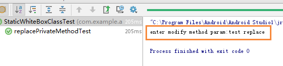

#### 4.5.5.打桩静态Public方法
```java
public class StaticClass {
    public static String ask(){
        return "I'm Static class";
    }
}

@Test
public void should_mock_static_method() {
    final String value = "10";
    mockStatic(StaticClass.class);
    when(StaticClass.ask()).thenReturn(value);
    Assert.assertNotEquals("I'm Static class", StaticClass.ask());
}
```

1. 静态方法mock，一定要调用mockStatic(StaticClass.class);
2. when(StaticClass.ask()).thenReturn(value);PowerMock的这个语句跟Mockito是很像的，基本上Mockito中的的那些打桩方法在PowerMock都有对应的。

#### 4.5.6.打桩静态private方法

这种public或private的都可以用
```java
public class H5JsApiScriptInterface {
    // 静态私有方法
    private static boolean isQQorWxAvailable() {
        return true;
    }
}

@PrepareForTest({LoginManager.class, H5JsApiScriptInterface.class})
public class H5JsApiScriptInterfaceTest extends MainTNUnitTest { // qq and wx
    @Test
    public void testShowLoginWithType_4() throws Exception{
        PowerMockito.mockStatic(LoginManager.class);
        PowerMockito.mockStatic(H5JsApiScriptInterface.class);
        H5JsApiScriptInterface mockScriptInterface = PowerMockito.mock(H5JsApiScriptInterface.class);
        Mockito.doCallRealMethod().when(mockScriptInterface).showLoginWithType(Mockito.anyString(), Mockito.anyString());
        // 打桩静态私有方法，mock静态私有方法，注意增加@PrepareForTest
        PowerMockito.doReturn(false).when(H5JsApiScriptInterface.class, "isQQorWxAvailable");
        mockScriptInterface.showLoginWithType("qqorweixin", "callback");
        PowerMockito.verifyStatic(LoginManager.class, Mockito.times(1));
        LoginManager.triggerLogin(Mockito.eq(LOGIN_FROM_WEB_BOTH_QQ_AND_WX), Mockito.any(Subscriber.class));
    }
}
```

#### 4.5.7.thenCallRealMethod方法
```java
public class StaticClass {
    public static int add(int a, int b) {
        return a + b;
    }
    public static int sum() {
        int ret = 0;
        for (int i = 0; i < 10; i++) {
            ret = add(i, i+1);
        }
        return ret;
    }
}

@Test
public void call_mock_sum_static_method() {
    mockStatic(StaticClass.class);
    // 如果不用 spy，就用 thenCallRealMethod 也可以
    when(StaticClass.sum()).thenCallRealMethod();
    when(StaticClass.add(Mockito.anyInt(),Mockito.anyInt())).thenCallRealMethod();
    int sum = StaticClass.sum();
    Assert.assertEquals(19, sum);
}

```

#### 4.5.8.spy静态方法
```java
public class StaticClass {
    public static int add(int a, int b) {
        return a + b;
    }
    public static int sum() {
        int ret = 0;
        for (int i = 0; i < 10; i++) {
            ret = add(i, i+1);
        }
        return ret;
    }
}

@Test
public void call_spy_sum_static_method() {
    mockStatic(StaticClass.class);
    // mock 的话，函数都是空的切记，如果需要用到函数逻辑，要用 spy
    spy(StaticClass.class);
    int sum = StaticClass.sum();
    Assert.assertEquals(19, sum);
}
```

#### 4.5.9.Verify Public 静态方法
```java
public class StaticClass {
    public static int add(int a, int b) {
        return a + b;
    }
    public static int sum() {
        int ret = 0;
        for (int i = 0; i < 10; i++) {
            ret = add(i, i+1);
        }
        return ret;
    }
}

@Test
public void call_spy_sum_static_method() {
    mockStatic(StaticClass.class);
    // mock 的话，函数都是空的切记，如果需要用到函数逻辑，要用 spy
    spy(StaticClass.class);
    int sum = StaticClass.sum();
    Assert.assertEquals(19, sum);
    verifyStatic(StaticClass.class, Mockito.times(10)); // 验证调用了 10 次
    StaticClass.add(Mockito.anyInt(),Mockito.anyInt()); // 验证的是 add 方法
}
```

#### 4.5.10.Verify Private 静态方法
```java
public class StaticClass {
    public static int dec(int total) {
        int ret = total;
        for (int i = 0; i < 10; i++) {
            ret = sub(ret, i);
        }
        return ret;
    }
    private static int sub(int a, int b) {
        return a - b;
    }
}

@Test
public void call_private_dec_static_method() throws Exception {
    mockStatic(StaticClass.class);
    spy(StaticClass.class);
    int ret = StaticClass.dec(100);
    Assert.assertEquals(55, ret);
    verifyPrivate(StaticClass.class, Mockito.atLeastOnce()).invoke("sub",
            Mockito.anyInt(), Mockito.anyInt());
}
```

#### 4.5.11.跳过静态方法
```java
public class StaticClass {
    public static String mStepName;
    public static void testStepName() {
        setStepName();
    }
    private static void setStepName() {
        System.out.println("enter setStepName");
        mStepName = "setStepName";
    }
}

@Test
public void skipStaticMethodTest() {
    PowerMockito.suppress(PowerMockito.method(StaticClass.class, "setStepName"));
    StaticClass.testStepName();
    System.out.println("step name:" + StaticClass.mStepName);
}
```

运行结果：

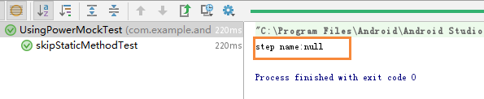

enter setStepName log没有打印，说明已经跳过了。无论函数是否有返回值，都可以用这中方法跳过该函数。

### 4.6.6. Final类
```java
public final class FinalClassA {
    public final String finalMethod() {
        return "finalMethod";
    }
}

@Test
public final void mockPowerFinalClassTest() {
    FinalClassA instance = new FinalClassA();
    FinalClassA mock = PowerMockito.mock(FinalClassA.class);
    Mockito.when(mock.finalMethod()).thenReturn("mock method");
    Assert.assertNotEquals(instance.finalMethod(), mock.finalMethod());
}
```

上里面例子演示了，通过PowerMock可以mock Final类。

### 4.7.总结

上面列出了PowerMoc差不多所有会使用到的场景下的使用范例，通过这些场景范例基本上可以解决我们单元测试中所有的需要mock的情况。

#### 4.7.1.目前能想到的，PowerMock解决不了的是匿名类的场景：
```java
public class NormalClassA {
    public void setAbsCallback() {
        AbsCallback callback = new AbsCallback() {
            @Override
            void call() {
                System.out.println("impl AbsCallback");
            }
        };
        callback.call();
    }
    public static class AbsCallback {
        public AbsCallback() {
        }
        void call(){
            System.out.println("impl default AbsCallback");
        };
    }
    public static class MockAbsCallback extends NormalClassA.AbsCallback {
        @Override
        void call() {
            System.out.println("mock impl AbsCallback");
        }
    }
}
```

如果想mock setAbsCallback函数中的new AbsCallback()，这种匿名类，目前是无法用WhenNew mock的。

还有在匿名类中new 对象A，用whenNew来mock对象A也是不行的。

见这里的例子，同时解释了具体原因
[https://stackoverflow.com/questions/7523389/how-do-i-use-powermockito-to-mock-the-construction-of-new-objects-when-testing-a](https://stackoverflow.com/questions/7523389/how-do-i-use-powermockito-to-mock-the-construction-of-new-objects-when-testing-a)

## 5.JMH

- [官方案例](https://hg.openjdk.java.net/code-tools/jmh/file/tip/jmh-samples/src/main/java/org/openjdk/jmh/samples/) 
- [JMH 与 8 个测试陷阱](https://www.cnkirito.moe/java-jmh/) 
- [使用JMH进行微基准测试：不要猜，要测试！](http://www.hollischuang.com/archives/1072)
- [使用JMH做Java微基准测试](https://developer.aliyun.commeasurementIterations/article/341539)
- 源码[https://github.com/openjdk/jmh](https://github.com/openjdk/jmh)

### 5.1.介绍

JMH是OpenJDK开发的微基准测试框架。
在日常开发中，我们对一些代码的调用或者工具的使用会存在多种选择方式，在不确定他们性能的时候，我们首先想要做的就是去测量它。大多数时候，我们会简单的采用多次计数的方式来测量，来看这个方法的总耗时。
但是，如果熟悉JVM类加载机制的话，应该知道JVM默认的执行模式是JIT编译与解释混合执行。JVM通过热点代码统计分析，识别高频方法的调用、循环体、公共模块等，基于JIT动态编译技术，会将热点代码转换成机器码，直接交给CPU执行。
也就是说，JVM会不断的进行编译优化，这就使得很难确定重复多少次才能得到一个稳定的测试结果？所以，很多有经验的同学会在测试代码前写一段预热的逻辑。
JMH，全称 Java Microbenchmark Harness (微基准测试框架），是专门用于Java代码微基准测试的一套测试工具API，是由 OpenJDK/Oracle 官方发布的工具。
何谓 Micro Benchmark 呢？简单地说就是在 method 层面上的 benchmark，精度可以精确到微秒级。

Java的基准测试需要注意的几个点：
- 测试前需要预热。
- 防止无用代码进入测试方法中。
- 并发测试。
- 测试结果呈现。

JMH的使用场景：
- 定量分析某个热点函数的优化效果
- 想定量地知道某个函数需要执行多长时间，以及执行时间和输入变量的相关性
- 对比一个函数的多种实现方式

### 5.2.基于注解的使用

#### 5.2.1.@BenchmarkMode

微基准测试类型。JMH 提供了以下几种类型进行支持。可以注释在方法级别，也可以注释在类级别

- Throughput: 	整体吞吐量，例如“1秒内可以执行多少次调用”。
- AverageTime: 	调用的平均时间，例如“每次调用平均耗时xxx毫秒”。
- SampleTime: 	随机取样，最后输出取样结果的分布，例如“99%的调用在xxx毫秒以内，99.99%的调用在xxx毫秒以内”
- SingleShotTime: 以上模式都是默认一次 iteration 是 1s，唯有 SingleShotTime 是只运行一次。往往同时把 warmup 次数设为0，用于测试冷启动时的性能。
- All			：上面全部的类型都来一次

#### 5.2.2.@Warmup

进行基准测试前需要进行预热，iterations = 3就是指预热轮数。
一般我们前几次进行程序测试的时候都会比较慢， 所以要让程序进行几轮预热，保证测试的准确性。其中的参数iterations也就非常好理解了，就是预热轮数。 

为什么需要预热？
因为 JVM 的 JIT 机制的存在，如果某个函数被调用多次之后，JVM 会尝试将其编译成为机器码从而提高执行速度。所以为了让 benchmark 的结果更加接近真实情况就需要进行预热。

```java
@Warmup(iterations = 3)
```

#### 5.2.3.@Measurement

正式度量计算的轮数，其实就是一些基本的测试参数，可以根据具体情况调整。一般比较重的东西可以进行大量的测试，放到服务器上运行。
- iterations 进行测试的轮次
- time 每轮进行的时长
- timeUnit 时长单位

```java
@Measurement(iterations = 10, time = 5, timeUnit = TimeUnit.SECONDS)
```

#### 5.2.4.@Threads

每个进程中的测试线程，这个非常好理解，根据具体情况选择，一般为cpu乘以2
```java
@Threads(Threads.MAX)
```

#### 5.2.5.@Fork

进行 fork 的次数。如果 fork 数是2的话，则 JMH 会 fork 出两个进程来进行测试。

#### 5.2.6.@OutputTimeUnit

基准测试结果的时间类型。一般选择秒、毫秒、微秒。

#### 5.2.7.@Benchmark
方法级注解，表示该方法是需要进行 benchmark 的对象，用法和 JUnit 的 @Test 类似。就是执行的入口

#### 5.2.8.@Param
属性级注解，@Param 可以用来指定某项参数的多种情况。特别适合用来测试一个函数在不同的参数输入的情况下的性能。

```java
@Param({"1000", "10000", "100000"})
private int count;
```

#### 5.2.9.@Setup
方法级注解，这个注解的作用就是我们需要在测试之前进行一些准备工作，比如对一些数据的初始化之类的。

#### 5.2.10.@TearDown
方法级注解，这个注解的作用就是我们需要在测试之后进行一些结束工作，比如关闭线程池，数据库连接等的，主要用于资源的回收等。

#### 5.2.11.@State
当使用@Setup参数的时候，必须在类上加这个参数，不然会提示无法运行。

就比如我上面的例子中，就必须设置state。

State 用于声明某个类是一个“状态”，然后接受一个 Scope 参数用来表示该状态的共享范围。因为很多 benchmark 会需要一些表示状态的类，JMH 允许你把这些类以依赖注入的方式注入到 benchmark 函数里。Scope 主要分为三种。

- Thread: 该状态为每个线程独享。
- Group: 该状态为同一个组里面所有线程共享。
- Benchmark: 该状态在所有线程间共享。

#### 5.2.12.启动方法
在启动方法中，可以直接指定上述说到的一些参数，并且能将测试结果输出到指定文件中，

```java
/**
 * 仅限于IDE中运行
 * 命令行模式 则是 build 然后 java -jar 启动
 *
 * 1. 这是benchmark 启动的入口
 * 2. 这里同时还完成了JMH测试的一些配置工作
 * 3. 默认场景下，JMH会去找寻标注了@Benchmark的方法，可以通过include和exclude两个方法来完成包含以及排除的语义
 */
public static void main(String[] args) throws RunnerException {
    Options opt = new OptionsBuilder()
        // 包含语义
        // 可以用方法名，也可以用XXX.class.getSimpleName()
        .include("Helloworld")
        // 排除语义
        .exclude("Pref")
        // 预热10轮
        .warmupIterations(10)
        // 代表正式计量测试做10轮，
        // 而每次都是先执行完预热再执行正式计量，
        // 内容都是调用标注了@Benchmark的代码。
        .measurementIterations(10)
        //  forks(3)指的是做3轮测试，
        // 因为一次测试无法有效的代表结果，
        // 所以通过3轮测试较为全面的测试，
        // 而每一轮都是先预热，再正式计量。
        .forks(3)
        .output("E:/Benchmark.log")
        .build();
    new Runner(opt).run();
}
```

### 5.3.构建项目

#### 5.3.1.方式1：自己引入依赖

maven依赖

```xml
<dependency>
    <groupId>org.openjdk.jmh</groupId>
    <artifactId>jmh-core</artifactId>
    <version>1.21</version>
</dependency>

<dependency>
    <groupId>org.openjdk.jmh</groupId>
    <artifactId>jmh-generator-annprocess</artifactId>
    <version>1.21</version>
    <scope>provided</scope>
</dependency>
```

maven插件。【作用是在编码的时候，执行基准测试，并生成测试报告。一般不需要胚子】

```xml
<plugin>
    <groupId>org.codehaus.mojo</groupId>
    <artifactId>exec-maven-plugin</artifactId>
    <executions>
        <execution>
            <id>run-benchmarks</id>
            <phase>integration-test</phase>
            <goals>
                <goal>exec</goal>
            </goals>
            <configuration>
                <classpathScope>test</classpathScope>
                <executable>java</executable>
                <arguments>
                    <argument>-classpath</argument>
                    <classpath/>
                    <argument>org.openjdk.jmh.Main</argument>
                    <argument>.*</argument>
                </arguments>
            </configuration>
        </execution>
    </executions>
</plugin>
```

#### 5.3.2.方式2：maven命令生成项目

```shell
mvn archetype:generate \
    -DinteractiveMode=false \
    -DarchetypeGroupId=org.openjdk.jmh \
    -DarchetypeArtifactId=jmh-java-benchmark-archetype \
    -DgroupId=org.sample \
    -DartifactId=test \
    -Dversion=1.0
```

#### 5.3.3.编写性能测试

```java
@State(Scope.Benchmark)
@OutputTimeUnit(TimeUnit.SECONDS)
@Threads(Threads.MAX)
public class LinkedListIterationBenchMark {

    private static final int SIZE = 10000;

    private List<String> list = new LinkedList<>();

    @Setup
    public void setUp() {
        for (int i = 0; i < SIZE; i++) {
            list.add(String.valueOf(i));
        }
    }

    @Benchmark
    @BenchmarkMode(Mode.Throughput)
    public void forIndexIterate() {
        for (int i = 0; i < list.size(); i++) {
            list.get(i);
            System.out.print("");
        }
    }

    @Benchmark
    @BenchmarkMode(Mode.Throughput)
    public void forEachIterate() {
        for (String s : list) {
            System.out.print("");
        }
    }
}
```

#### 5.3.4.执行测试

运行 JMH 基准测试有两种方式，一个是生产jar文件运行，另一个是直接写main函数或者放在单元测试中执行。

```java
public static void main(String[] args) throws RunnerException {
    Options opt = new OptionsBuilder()
            .include(LinkedListIterationBenchMark.class.getSimpleName())
            .forks(1)
            .warmupIterations(2)
            .measurementIterations(2)
            .output("E:/Benchmark.log")
            .build();
    new Runner(opt).run();
}
```

#### 5.3.5.报告结果

```text
# Detecting actual CPU count: 12 detected
# JMH version: 1.21
# VM version: JDK 1.8.0_131, Java HotSpot(TM) 64-Bit Server VM, 25.131-b11
# VM invoker: C:\Program Files\Java\jdk1.8.0_131\jre\bin\java.exe
# VM options: -javaagent:D:\Program Files\JetBrains\IntelliJ IDEA 2018.2.2\lib\idea_rt.jar=65175:D:\Program Files\JetBrains\IntelliJ IDEA 2018.2.2\bin -Dfile.encoding=UTF-8
# Warmup: 2 iterations, 10 s each
# Measurement: 2 iterations, 10 s each
# Timeout: 10 min per iteration
# Threads: 12 threads, will synchronize iterations
# Benchmark mode: Throughput, ops/time
# Benchmark: org.sample.jmh.LinkedListIterationBenchMark.forEachIterate

# Run progress: 0.00% complete, ETA 00:01:20
# Fork: 1 of 1
# Warmup Iteration   1: 1189.267 ops/s
# Warmup Iteration   2: 1197.321 ops/s
Iteration   1: 1193.062 ops/s
Iteration   2: 1191.698 ops/s


Result "org.sample.jmh.LinkedListIterationBenchMark.forEachIterate":
  1192.380 ops/s


# JMH version: 1.21
# VM version: JDK 1.8.0_131, Java HotSpot(TM) 64-Bit Server VM, 25.131-b11
# VM invoker: C:\Program Files\Java\jdk1.8.0_131\jre\bin\java.exe
# VM options: -javaagent:D:\Program Files\JetBrains\IntelliJ IDEA 2018.2.2\lib\idea_rt.jar=65175:D:\Program Files\JetBrains\IntelliJ IDEA 2018.2.2\bin -Dfile.encoding=UTF-8
# Warmup: 2 iterations, 10 s each
# Measurement: 2 iterations, 10 s each
# Timeout: 10 min per iteration
# Threads: 12 threads, will synchronize iterations
# Benchmark mode: Throughput, ops/time
# Benchmark: org.sample.jmh.LinkedListIterationBenchMark.forIndexIterate

# Run progress: 50.00% complete, ETA 00:00:40
# Fork: 1 of 1
# Warmup Iteration   1: 205.676 ops/s
# Warmup Iteration   2: 206.512 ops/s
Iteration   1: 206.542 ops/s
Iteration   2: 207.189 ops/s


Result "org.sample.jmh.LinkedListIterationBenchMark.forIndexIterate":
  206.866 ops/s


# Run complete. Total time: 00:01:21

REMEMBER: The numbers below are just data. To gain reusable insights, you need to follow up on
why the numbers are the way they are. Use profilers (see -prof, -lprof), design factorial
experiments, perform baseline and negative tests that provide experimental control, make sure
the benchmarking environment is safe on JVM/OS/HW level, ask for reviews from the domain experts.
Do not assume the numbers tell you what you want them to tell.

Benchmark                                      Mode  Cnt     Score   Error  Units
LinkedListIterationBenchMark.forEachIterate   thrpt    2  1192.380          ops/s
LinkedListIterationBenchMark.forIndexIterate  thrpt    2   206.866          ops/s
```

## 6.Jmeter

Apache JMeter是一款纯java编写负载功能测试和性能测试开源工具软件。
相比Loadrunner而言，JMeter小巧轻便且免费，逐渐成为了主流的性能测试工具，是每个测试人员都必须要掌握的工具之一。
本文为JMeter性能测试完整入门篇，从Jmeter下载安装到编写一个完整性能测试脚本、最终执行性能测试并分析性能测试结果。
运行环境为Windows 10系统，JDK版本为1.8，JMeter版本为3.3。

### 6.1.Jmeter安装

#### 6.1.1.JDK安装

由于Jmeter是基于java开发，首先需要下载安装JDK （目前JMeter只支持到Java 8，尚不支持 Java 9）

#### 6.1.2.JMeter安装

- 官网下载地址：http://jmeter.apache.org/download_jmeter.cgi
- 下载最新JMeter的压缩包
- 下载完成后解压zip包
- 启动JMeter：双击bin下面的jmeter.bat即可


### 6.2.测试实例

我们选取最常见的百度搜索接口

测试案例。[线程组.jmx](file/jmeter/线程组.jmx)

#### 6.2.1.接口地址

http://www.baidu.com/s?ie=utf-8&wd=jmeter性能测试

#### 6.2.2.请求参数

ie：编码方式，默认为utf-8
wd: 搜索词

#### 6.2.3.返回结果

搜索结果，我们可以通过校验结果中是否含有搜索词wd来判断本次请求成功或失败。

### 6.3.JMeter脚本编写

#### 6.3.1.添加线程组

右键点击“测试计划” -> “添加” -> “Threads(Users)” -> “线程组”


这里可以配置线程组名称，线程数，准备时长（Ramp-Up Period(in
seconds)）循环次数，调度器等参数：


线程组参数详解：
1. 线程数：虚拟用户数。一个虚拟用户占用一个进程或线程。设置多少虚拟用户数在这里也就是设置多少个线程数。
2. Ramp-Up Period(in seconds)准备时长：设置的虚拟用户数需要多长时间全部启动。如果线程数为10，准备时长为2，那么需要2秒钟启动10个线程，也就是每秒钟启动5个线程。
3. 循环次数：每个线程发送请求的次数。如果线程数为10，循环次数为100，那么每个线程发送100次请求。总请求数为10*100=1000
   。如果勾选了“永远”，那么所有线程会一直发送请求，一到选择停止运行脚本。
4. Delay Thread creation until needed：直到需要时延迟线程的创建。
   5.调度器：设置线程组启动的开始时间和结束时间(配置调度器时，需要勾选循环次数为永远)
    - 持续时间（秒）：测试持续时间，会覆盖结束时间
    - 启动延迟（秒）：测试延迟启动时间，会覆盖启动时间
    - 启动时间：测试启动时间，启动延迟会覆盖它。当启动时间已过，手动只需测试时当前时间也会覆盖它。
    - 结束时间：测试结束时间，持续时间会覆盖它。

因为接口调试需要，我们暂时均使用默认设置，待后面真正执行性能测试时再回来配置。

#### 6.3.2.添加HTTP请求

右键点击“线程组” -> “添加” -> “Sampler” -> “HTTP请求”
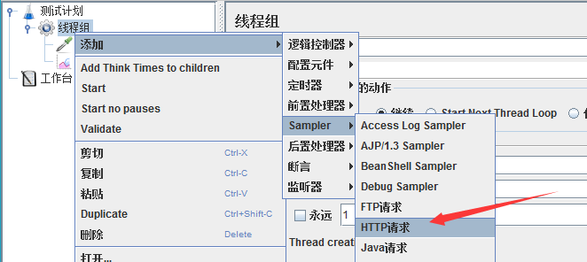

对于我们的接口http://www.baidu.com/s?ie=utf-8&wd=jmeter性能测试，可以参考下图填写：
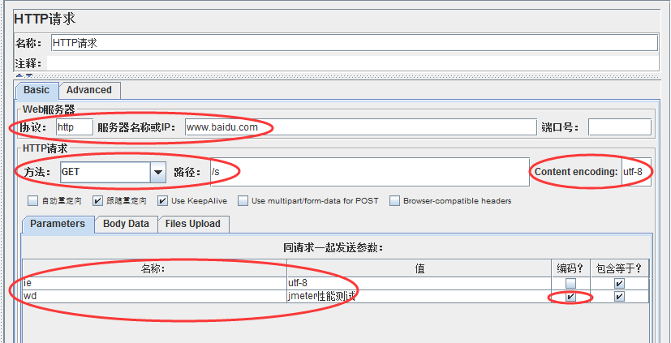

Http请求主要参数详解：

Web服务器
协议：向目标服务器发送HTTP请求协议，可以是HTTP或HTTPS，默认为HTTP
服务器名称或IP ：HTTP请求发送的目标服务器名称或IP
端口号：目标服务器的端口号，默认值为80
2.Http请求
方法：发送HTTP请求的方法，可用方法包括GET、POST、HEAD、PUT、OPTIONS、TRACE、DELETE等。
路径：目标URL路径（URL中去掉服务器地址、端口及参数后剩余部分）
Content encoding ：编码方式，默认为ISO-8859-1编码，这里配置为utf-8

同请求一起发送参数
在请求中发送的URL参数，用户可以将URL中所有参数设置在本表中，表中每行为一个参数（对应URL中的
name=value），注意参数传入中文时需要勾选“编码”

#### 6.3.3.添加察看结果树

右键点击“线程组” -> “添加” -> “监听器” -> “察看结果树”


这时，我们运行Http请求，修改响应数据格式为“HTML Source
Formatted”，可以看到本次搜索返回结果页面标题为”jmeter性能测试_百度搜索“。


#### 6.3.4.添加用户自定义变量

我们可以添加用户自定义变量用以Http请求参数化，右键点击“线程组” -> “添加” -> “配置元件” -> “用户定义的变量”：


新增一个参数wd，存放搜索词：


并在Http请求中使用该参数，格式为：${wd}


#### 6.3.5.添加断言

右键点击“HTTP请求” -> “添加”-> “断言” -> “响应断言”


我们校验返回的文本中是否包含搜索词，添加参数${wd}到要测试的模式中：
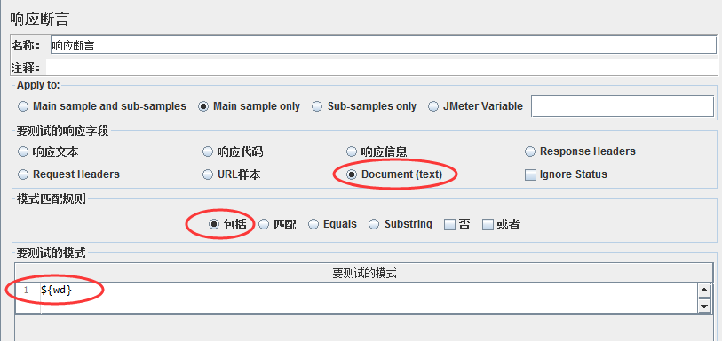


#### 6.3.6.添加断言结果

右键点击“HTTP请求” -> “添加”-> “监听器” -> “断言结果”


这时，我们再运行一次就可以看到断言结果成功或失败了


#### 6.3.7.添加聚合报告

右键点击“线程组” -> “添加” -> “监听器” -> “聚合报告”，用以存放性能测试报告


这样，我们就完成了一个完整Http接口的JMeter性能测试脚本编写。

### 6.4.执行性能测试

#### 6.4.1.配置线程组

点击线程组，配置本次性能测试相关参数：线程数，循环次数，持续时间等，这里我们配置并发用户数为10，持续时间为60s


#### 6.4.2.执行测试

点击绿色小箭头按钮即可启动测试，测试之前需要点击小扫把按钮清除之前的调试结果。


### 6.5.分析测试报告

待性能测试执行完成后，打开聚合报告可以看到：


聚合报告参数详解：
1. Label：每个 JMeter 的 element（例如 HTTP Request）都有一个 Name 属性，这里显示的就是 Name 属性的值
2. \#Samples：请求数——表示这次测试中一共发出了多少个请求，如果模拟10个用户，每个用户迭代10次，那么这里显示100
3. Average：平均响应时间——默认情况下是单个 Request 的平均响应时间，当使用了 Transaction Controller 时，
   以Transaction 为单位显示平均响应时间
4. Median：中位数，也就是 50％ 用户的响应时间
5. 90% Line：90％ 用户的响应时间
6. Min：最小响应时间
7. Max：最大响应时间
8. Error%：错误率——错误请求数/请求总数
9. Throughput：吞吐量——默认情况下表示每秒完成的请求数（Request per Second），当使用了 Transaction Controller 时，
   也可以表示类似 LoadRunner的 Transaction per Second 数
10. KB/Sec：每秒从服务器端接收到的数据量，相当于LoadRunner中的Throughput/Sec

一般而言，性能测试中我们需要重点关注的数据有： #Samples 请求数，Average 平均响应时间，Min 最小响应时间，Max 最大响应时间，
Error% 错误率及Throughput 吞吐量。


### 6.6.Linux运行

我们通常是在服务器上运行jmeter进行压测的，jmeter也提供了命令行的执行方式。

PS:前提，我们已经使用界面的方式编辑好了测试计划。

#### 6.6.1.使用说明
```text
--? 打印命令行选项并退出
-h、 --帮助   打印使用信息和退出
-v、 --版本 打印版本信息并退出
-p、 --propfile<argument> 要使用的jmeter属性文件
-q、 --addprop<argument>	其他JMeter属性文件
-t、 --测试文件<argument>	要运行的jmeter测试（.jmx）文件。“-t LAST“将最后加载用过的文件
	表示要运行的jmx文件
-l、 --日志文件<argument>	要将样本记录到的文件
-i、 --jmeterlogconf<argument>	jmeter日志记录配置文件（log4j2.xml）
-j、 --jmeterlogfile<argument>	jmeter运行日志文件（jmeter.log）
-n、 --非GUI	在非gui模式下运行JMeter
-s、 --服务器	运行JMeter服务器
-E、 --proxyScheme<argument>	设置用于代理服务器的代理方案
-H、 --proxyHost<argument>	设置JMeter使用的代理服务器
-P、 --proxyPort<argument>	设置JMeter要使用的代理服务器端口
-N、 --非代理主机<argument>	设置非代理主机列表（例如：*.apache.org | localhost）
-u、 --用户名<argument>	设置JMeter要使用的代理服务器的用户名
-a、 --密码<argument>	为JMeter要使用的代理服务器设置密码
-J、 --jmeterproperty<argument>=<value>	定义其他JMeter属性
******使用命令的方式，修改jmx中的配置

-G、 --全局属性<argument>=<value>	定义全局属性（发送到服务器）例如：-Gport=123或-Gglobal.properties
-D、 --系统属性<argument>=<value>	定义其他系统属性
-S、 --系统属性文件<argument>	其他系统属性文件
-f、 --强制删除结果文件	强制删除现有结果文件和Web报表文件夹开始测试前在场
-L、 --loglevel<argument>=<value>	[category=]level 例如：jorphan=INFO, jmeter.util=DEBUG or com.example.foo=WARN
-r、 --运行远程	启动远程服务器（在远程主机中定义）	指远程将所有agent启动
-R、 --远程启动<argument>	启动这些远程服务器（覆盖远程主机）
-d、 --homedir<argument>	要使用的jmeter主目录
-X、 --远程退出	在测试结束时退出远程服务器（非GUI）
-g、 --reportonly<argument>	仅从测试结果文件生成报表仪表板
	specifies the existing result file 指定已存在的结果文件
-e、 --报告的ndofloadtests	负载测试后生成报表仪表板
-o、 --reportoutputfolder<argument>	保存html报告的路径, 此文件夹必须为空或者不存在
```

#### 6.6.2.案例
案例
```shell
# t 执行本地脚本, l 记录详细日志, e 生成html格式的报告,-o指定报告的目录
jmeter -n -t 测试计划.jmx -l test.jtl -e -o ./report

#1、本地运行脚本并生成测试报告，其中测试报告的后缀名为jtl
jmeter -n -t 脚本路径 -l 测试报告路径

#2、远程运行脚本并生成测试报告，其中测试报告的后缀名为jtl
jmeter -n -t 脚本路径 -r -l 测试报告路径

#3、远程运行脚本并生成测试报告，其中测试报告的后缀名为jtl
jmeter -n -t 脚本路径 -R 负载机IP -l 测试报告路径

#4、本地运行并生成网页版测试报告，其中测试结果路径为空目录
jmeter -n -t 脚本路径 -l 测试报告路径 -e -o 测试结果路径

#5、把jtl格式的测试结果文件转换为html格式
jmeter -g 测试结果路径 -o html报告路径

#6、本地运行脚本并生成测试报告，把线程数和循环次数在命令行配置
jmeter -n -t 脚本路径 -l 测试结果路径 -JthreadNum=50 -JloopNum=10
```

#### 6.6.3.用户自定义变量
借助 -J参数，利用函数助手对话框的 P 函数设置获取命令行属性


```shell
jmeter -n -t 脚本路径 -l 测试结果路径 -JURL=www.baidu.com?abc=1
```

#### 6.6.4.分布式测试
很多时候，需要多台服务器通知进行压测。并汇总结果

1.首先需要压测的服务器必须都有jmeter,以及相同的测试计划文件。

2.修改配置文件，jmeter.properties。下面三台服务器是运行测试计划的，就是slave。
我们执行启动命令的服务器是master，由于master机器作为调度机本身会有一定的性能消耗所以我们配置远程执行机的时候并没有把master机器配置进去，
只配置了3台执行机。【当然也是可以把master配置进去一起参与测试】

```properties
# 我们配置 remote_hosts 在调度服务器
remote_hosts=192.168.1.10:7899,192.168.1.11:7899,192.168.1.12:7899

# 各自服务的端口
server_port=7899
```

3.上面配置的3台服务器执行命令，进入等待接收命令的状态。
```shell
./jmeter-server
```

4.确认3台slave执行机都启动正确完成后，在启动master机器，执行如下命令开启分布式测试

其中-r会自动找remote_hosts中配置的服务器，当然我们也可以使用参数传入进去

```shell
./jmeter -n -t baidu_requests_results.jmx -r -l baidu_requests_results.jtl
```

### 6.7.最佳实践

Jmeter压测减少资源使用的一些建议，即压测结果会更准确

1. 使用非GUI模式（也就是CLI，Command Line Interface，命令行界面）：jmeter -n -t test.jmx -l result.jtl
2. 少使用Listener， 如果使用-l参数，它们都可以被删除或禁用
3. 在加载测试期间不要使用“查看结果树”或“用表格查看结果”监听器，只能在脚本阶段使用它们来调试脚本
4. 包含控制器在这里没有帮助，因为它将文件中的所有测试元素添加到测试计划中
5. 不要使用功能模式
6. 使用CSV输出而不是XML
7. 只保存你需要的数据
8. 尽可能少地使用断言
9. 如果测试需要大量数据，尤其是需要将其随机化，可以提前准备好测试数据放到数据文件中，从CSV数据集中读取， 这样可以避免在运行时浪费资源
10. 设置内存。修改jmeter.sh 在文件头部增加即可。

```shell
JVM_ARGS="-Xms1G -Xmx5G -XX:MaxPermSize=512m"
```

## 7.ContiPerf

ContiPerf是一个轻量级的测试工具，基于JUnit 4 开发，可用于效率测试等。
maven坐标
```xml
<dependencies>
	<dependency>
		<groupId>junit</groupId>
		<artifactId>junit</artifactId>
		<version>4.7</version>
		<scope>test</scope>
	</dependency> 
	<dependency>
		<groupId>org.databene</groupId>
		<artifactId>contiperf</artifactId>
		<version>2.1.0</version>
		<scope>test</scope>
	</dependency>
</dependencies>
```

主要的注解说明：
- @Rule注释激活ContiPerf；
- @Test指定测试方法；
- @PerfTest指定调用次数和线程数量；
- @Required指定性能要求（每次执行的最长时间，平均时间，总时间等）。
```text
@PerfTest(invocations = 300)：执行300次，和线程数量无关，默认值为1，表示执行1次；
@PerfTest(threads=30)：并发执行30个线程，默认值为1个线程；
@PerfTest(duration = 20000)：重复地执行测试至少执行20s。
2）Required参数
@Required(throughput = 20)：要求每秒至少执行20个测试；
@Required(average = 50)：要求平均执行时间不超过50ms；
@Required(median = 45)：要求所有执行的50%不超过45ms；
@Required(max = 2000)：要求没有测试超过2s；
@Required(totalTime = 5000)：要求总的执行时间不超过5s；
@Required(percentile90 = 3000)：要求90%的测试不超过3s；
@Required(percentile95 = 5000)：要求95%的测试不超过5s；
@Required(percentile99 = 10000)：要求99%的测试不超过10s;
@Required(percentiles = "66:200,96:500")：要求66%的测试不超过200ms，96%的测试不超过500ms。
```

测试报告


