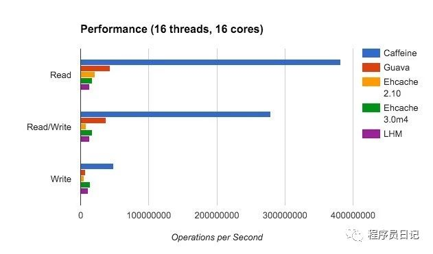

# 缓存

## 1. Caffeine

Spring Boot 2.0 引入了缓存组件 Caffeine 舍弃了大家熟知的 Google Guava 想必 Spring 大佬必有他的理由，各大缓存组件性能 PR 图如下




```xml
<dependency>
    <groupId>org.springframework.boot</groupId>
    <artifactId>spring-boot-starter-cache</artifactId>
</dependency>

<dependency>
    <groupId>com.github.ben-manes.caffeine</groupId>
    <artifactId>caffeine</artifactId>
</dependency>
```

## 2.ehcache

本地化缓存使用方案，比较灵活，如今分布式环境中使用的场景较少