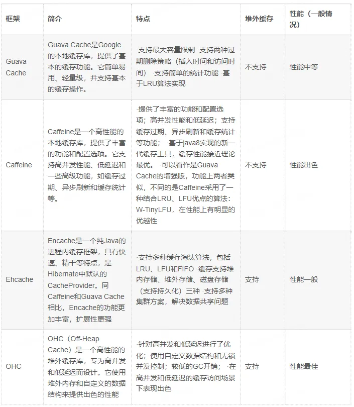
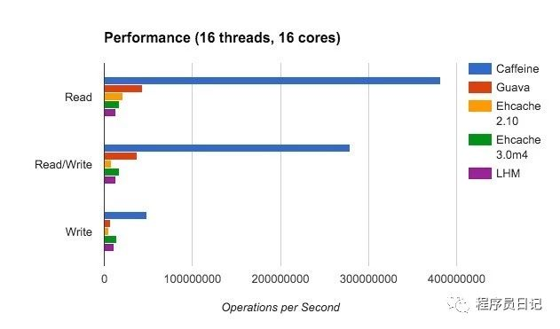

# 缓存



## 1. Caffeine

Spring Boot 2.0 引入了缓存组件 Caffeine 舍弃了大家熟知的 Google Guava 想必 Spring 大佬必有他的理由，各大缓存组件性能 PR 图如下




```xml
<dependency>
    <groupId>org.springframework.boot</groupId>
    <artifactId>spring-boot-starter-cache</artifactId>
</dependency>

<dependency>
    <groupId>com.github.ben-manes.caffeine</groupId>
    <artifactId>caffeine</artifactId>
</dependency>
```

## 2.ehcache

Ehcache的功能非常强大，提供了in-heap、off-heap、on-disk、cluster四级缓存

Ehcache企业级产品(BigMemory Max / BigMemory Go)实现的BigMemory也是Java堆外内存领域的先驱。


## 3.OHC


## 总结

堆内和堆外内存使用，需要根据使用场景选择，数据量越大，越适合堆外内存。
1. 堆外内存，因此可以避免因GC引起的性能下降和停顿。在高并发、高写入操作的场景下，堆外缓存可以提供更稳定的性能。
2. 配合合适的序列化工具，可以降低内存使用量。例如kryo、Protostuff、hession

性能：堆外缓存需要将数据序列化，而堆内缓存不需要，所以OHC的性能会差很多，所以序列化技术的选择尤为重要。
Guava和OHC的基准性能测试：
```text
Benchmark            (count)   Mode  Cnt   Score   Error  Units
CacheTest.guava_put   100000  thrpt    5  17.795 ± 7.267  ops/s
CacheTest.ohc_put     100000  thrpt    5   3.709 ± 1.293  ops/s
```

