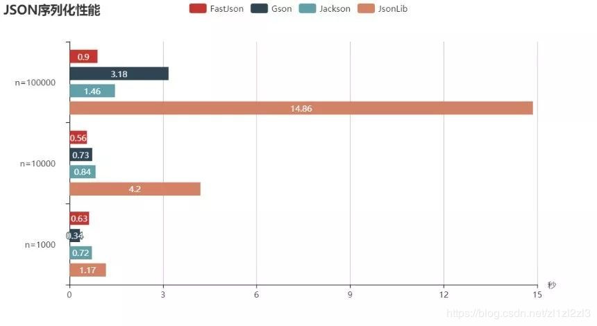
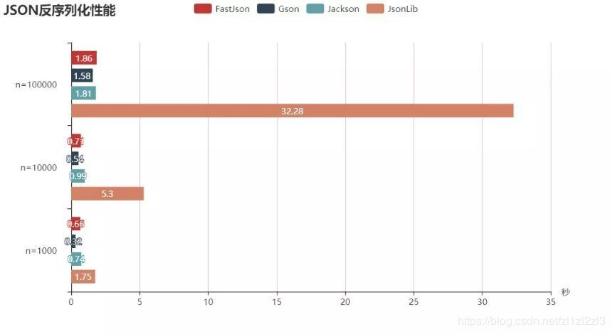

# 编码&序列化

序列化技术是将数据结构或对象状态转换为可以存储或传输的格式的过程，其逆过程称为反序列化

## JSON

### 1.简单介绍

选择一个合适的JSON库要从多个方面进行考虑：
- 字符串解析成JSON性能
- 字符串解析成JavaBean性能
- JavaBean构造JSON性能
- 集合构造JSON性能
- 易用性

### 2.常用库

#### 2.1.Gson

项目地址：https://github.com/google/gson

Gson是目前功能最全的Json解析神器，Gson当初是为因应Google公司内部需求而由Google自行研发而来，但自从在2008年五月公开发布第一版后已被许多公司或用户应用。
Gson的应用主要为toJson与fromJson两个转换函数，无依赖，不需要例外额外的jar，能够直接跑在JDK上。
在使用这种对象转换之前，需先创建好对象的类型以及其成员才能成功的将JSON字符串成功转换成相对应的对象。
类里面只要有get和set方法，Gson完全可以实现复杂类型的json到bean或bean到json的转换，是JSON解析的神器。

在Java中的简单使用方法：
```java
//1.创建对象
Gson gson = new Gson();

//2.向GSON中存数据
String str = gson.toJson(list);

//3.响应结果
response.getWriter().print(str);

//这是str的值：
"[{"id":5,"name":"纽约"},{"id":6,"name":"华盛顿"},{"id":7,"name":"洛杉矶"}]"
```

#### 2.2.FastJson

项目地址：https://github.com/alibaba/fastjson

JSON协议使用方便，越来越流行,JSON的处理器有很多,这里我介绍一下FastJson,FastJson是阿里的开源框架,被不少企业使用,是一个极其优秀的Json框架。

Fastjson是一个Java语言编写的高性能的JSON处理器,由阿里巴巴公司开发。无依赖，不需要例外额外的jar，能够直接跑在JDK上。
FastJson在复杂类型的Bean转换Json上会出现一些问题，可能会出现引用的类型，导致Json转换出错，需要制定引用。
FastJson采用独创的算法，将parse的速度提升到极致，超过所有json库。

特点:（缺点-漏洞太多了）
- FastJson数度快,无论序列化和反序列化,都是当之无愧的fast
- 功能强大(支持普通JDK类包括任意Java Bean Class、Collection、Map、Date或enum)
- 零依赖(没有依赖其它任何类库)

#### 2.3.Jackson

项目地址：https://github.com/FasterXML/jackson

Jackson是当前用的比较广泛的，用来序列化和反序列化json的Java开源框架。Jackson社区相对比较活跃，更新速度也比较快，
从Github中的统计来看，Jackson是最流行的json解析器之一，Spring MVC的默认json解析器便是Jackson。

Jackson优点很多：
- Jackson 所依赖的jar包较少，简单易用。
- 与其他 Java 的 json 的框架 Gson 等相比，Jackson 解析大的 json 文件速度比较快。
- Jackson 运行时占用内存比较低，性能比较好
- Jackson 有灵活的 API，可以很容易进行扩展和定制。

目前最新版本是2.9.4，Jackson 的核心模块由三部分组成：

- jackson-core 核心包，提供基于”流模式”解析的相关 API，它包括 JsonPaser 和
- JsonGenerator。Jackson 内部实现正是通过高性能的流模式 API 的
- JsonGenerator 和 JsonParser 来生成和解析 json。
- jackson-annotations 注解包，提供标准注解功能；
- jackson-databind 数据绑定包，提供基于”对象绑定” 解析的相关 API（ObjectMapper ）和”树模型” 解析的相关 API（JsonNode）；
  基于”对象绑定” 解析的 API 和”树模型”解析的 API 依赖基于”流模式”解析的 API。

#### 2.4.Json-lib

项目地址：http://json-lib.sourceforge.net/index.html

json-lib最开始的也是应用最广泛的json解析工具，json-lib 不好的地方确实是依赖于很多第三方包，对于复杂类型的转换，json-lib对于json转换成bean还有缺陷，
比如一个类里面会出现另一个类的list或者map集合，json-lib从json到bean的转换就会出现问题。json-lib在功能和性能上面都不能满足现在互联网化的需求。

JSON.JAR包虽然可以单独是用，但是在web项目中，尤其是在使用框架的时候，会涉及到类的映射， 这有时候回到JSON的使用产出影响，所以必须导入beanutil包，logging，

并且在一些框架中，大多使用基本数据类型的封装类，为了提高JSON的安全性，建议添加lang包， 此外，collections,以及ezmorph，也建议一同使用

### 3.性能测试



从上面的测试结果可以看出，序列化次数比较小的时候，Gson性能最好，当不断增加的时候到了100000，Gson明细弱于Jackson和FastJson，
这时候FastJson性能是真的牛，另外还可以看到不管数量少还是多，Jackson一直表现优异。而那个Json-lib简直就是来搞笑的。



反序列化的时候，Gson、Jackson和FastJson区别不大，性能都很优异，而那个Json-lib还是来继续搞笑的。

## XML

XML全称为Extensible Markup Language，意思是可扩展的标记语言。XML语法上和HTML比较相似，但HTML中的元素是固定的，而XML的标签是可以由用户自定义的。
W3C在1998年2月发布1.0版本，2004年2月又发布1.1版本，但因为1.1版本不能向下兼容1.0版本，所以1.1没有人用。同时，在2004年2月W3C又发布了1.0版本的第三版。

1. XML是指可扩展标记语言（Extensible Markup Language），用户自定义的标签.相对于HTML来讲的。
2. XML被设计的宗旨是表示数据。HTML是用来显示数据的。目前经常使用的XML版本是1.0
3. XML除了表示数据外。在实际的企业开发中，主要用XML作为程序的配置文件。


### 1.解析

解析器的概念：解析器就是读取xml的一系列类。xml常用的四种解析技术：DOM、SAX、JDOM、DOM4J

- DOM（Document Object Model）:文档对象模型分析方式。以层次结构（类似于树型）来组织节点和信息片段，映射XML文档的结构，允许获取和操作文档的任意部分。是W3C的官方标准。非常适合XML的CRUD操作，适用于操作较小文件大小的XML文件
  - 优点：
    1. jdk最早支持的解析方式，无需第三方依赖，通过jdk的w3c包下的api即可实现操作。
    2. 允许应用程序对数据和结构做出更改。
    3. 访问是双向的，可以在任何时候在树中上下导航，获取和操作任意部分的数据。
  - 缺点：
    1. 通常需要加载整个XML文档来构造层次结构，消耗资源大，大型xml解析可能导致OOM。
- SAX（Simple API for XML）非常不好用，用着蛋疼。流模型中的推模型分析方式。通过事件驱动，每发现一个节点就引发一个事件，通过回调方法完成解析工作，解析XML文档的逻辑需要应用程序完成。 适用于查询XML文件，对文件的大小没有过多的限制。
  - 优点：
    1. 采用事件驱动模式一段一段的来解析数据，占用内存小。
    2. 只在读取数据时检查数据，不需要保存在内存中。
    3. 可以在某个条件得到满足时停止解析，不必解析整个文档。
    4. 效率和性能较高，能解析大于系统内存的文档。
  - 缺点：
    1. 需要应用程序自己负责TAG的处理逻辑（例如维护父/子关系等），使用麻烦。
    2. 单向导航，很难同时访问同一文档的不同部分数据，不支持XPath。
- JDOM（Java-based Document Object Model） Java特定的文档对象模型。自身不包含解析器，使用SAX。
  - 优点：
    1. 使用具体类而不是接口，简化了DOM的API。
    2. 大量使用了Java集合类，方便了Java开发人员。
  - 缺点：
    1. 没有较好的灵活性。
    2. 性能较差。
- DOM4J（Document Object Model for Java） 简单易用，采用Java集合框架，并完全支持DOM、SAX和JAXP。
  - 优点：
    1. 大量使用了Java集合类，方便Java开发人员，同时提供一些提高性能的替代方法。
    2. 支持XPath。
    3. 有很好的性能。
  - 缺点：
    1. 大量使用了接口，API较为复杂。
    2. 不支持与 DOM 中相应遍历包
- JAXP :是JDK提供的解析XML的相关接口和类。
  - JAXP(Java API for XMLProcessing，意为XML处理的Java API)是Java XML程序设计的应用程序接口之一，它提供解析和验证XML文档的能力。
  - JAXP是在Java社区进程下开发的，包括JSR 5 (JAXP 1.0)和 JSR 63 (JAXP 1.1和1.2)两个规范。
- XStream:XStream可以把JavaBean对象转换成XML！通常服务器向客户端响应的数据都是来自数据库的一组对象，而我们不能直接把对象响应给响应端，所以我们需要把对象转换成XML再响应给客户端，这时就需要使用XStream组合了。

### 2.对比
- DOM和SAX 对比
  1. DOM 内存占用较高. SAX在解析过程中,遇到事件会触发一段我们定义的代码. 代码运行完,那么解析过程也完成.内存占用非常小.
  2. 因为DOM 会把所有对象放到内存中.我们可以对内存中的对象进行增删改查等等一系列操作. 而sax只能做查询.
- DOM4j解析：DOM4J是针对Java开发人员专门提供的XML文档解析规范，它不同与DOM，但与DOM相似。DOM4J针对Java开发人员而设计，所以对于Java开发人员来说，
  使用DOM4J要比使用DOM更加方便。在DOM4J中，也有Node、Document、Element等接口，结构上与DOM中的接口比较相似。但它们是不同的类


## Kryo

概述：Kryo是一个快速、高效的Java序列化框架，用于将对象转换为字节流以便存储或传输，并能够将字节流反序列化为原始对象。

特点：
- 高性能：采用二进制格式进行序列化，相比Java自带的序列化机制，可以显著降低序列化和反序列化的时间开销。
- 小尺寸：生成的序列化结果通常比Java自带的序列化结果更小，减少了网络传输的负载。
- 可扩展性：支持自定义序列化器和注册机制，便于处理复杂对象和版本兼容性问题。
- 易于使用：提供简单易用的API，几行代码即可完成序列化和反序列化操作。

注意：Kryo是一个专门为Java设计的序列化框架，不支持与其他编程语言进行互操作，且对类版本兼容性要求较高。

```xml
<dependency>
    <groupId>com.esotericsoftware</groupId>
    <artifactId>kryo-shaded</artifactId>
    <version>4.0.1</version>
</dependency>
```

## FST（Fast Serialization Tool）

概述：FST是对Java序列化的替换实现，旨在解决Java序列化性能不足和体积过大的问题。

特点：
- 高性能：相比JDK提供的序列化，FST的性能提升了10倍，体积也减少了3-4倍多。
- 支持堆外Maps：支持堆外Maps的持久化。
- 兼容性：提供了对旧有Java序列化数据的兼容性支持。

```xml
<dependency>
    <groupId>de.ruedigermoeller</groupId>
    <artifactId>fst</artifactId>
    <version>1.58</version>
</dependency>
```

## Hession

概述：Hession是一个基于Java的远程通信和序列化框架，它结合了RMI（远程方法调用）和HTTP协议，以及自定义的序列化机制。
然而，需要注意的是，Hession在近年来的应用相对较少，且可能不是最主流的序列化技术选择。

特点（基于一般理解）：
- 远程通信：支持跨网络的远程方法调用。
- 自定义序列化：提供了自定义的序列化机制，可能具有较好的性能和灵活性。

```xml
<dependency>
    <groupId>com.caucho</groupId>
    <artifactId>hessian</artifactId>
    <version>4.0.38</version>
</dependency>
```

## Protobuf

[protobuf技术文档](https://protobuf.dev/programming-guides/proto3/)

概述：Protocol Buffers（简称protobuf）是由Google开发的一种轻量级、高效的数据序列化格式。它被设计用于高效地在不同平台和语言之间进行数据通信和存储。

特点：
- 简单高效：使用二进制编码，相比于文本格式（如XML和JSON），编码大小更小，解析速度更快。
- 语言无关：定义文件使用Protocol Buffer Language编写，与特定编程语言无关，可以生成针对不同编程语言的代码。
- 可扩展性：支持向后兼容和向前兼容的数据格式演化，可以灵活添加新的字段而不破坏现有解析代码。
- 自动代码生成：提供代码生成器，可自动为不同编程语言生成序列化和反序列化的代码。
- 支持多种数据类型：包括基本数据类型和复杂数据类型（如嵌套消息、枚举等）。

## Protostuff

Protobuf是由Google开发的一种数据序列化格式，用于结构化数据的存储和交换，常用语跨语言的数据序列化工具。
而 Protostuff 是基于 Protobuf，主要面向Java环，提供更简便的API，同时保持与Protobuf的兼容性。

不同于Protobuf使用.proto文件定义消息结构，再通过编译器生成相关的代码。
Protostuff 通过使用Java的反射机制，动态地处理POJO（Plain Old Java Object），无需预先定义IDL。

适用场景
- Protobuf：
  - 更适合需要高性能数据序列化和跨语言兼容性的大规模分布式系统。
  - 对于需要频繁进行数据结构演进的项目，Protobuf的IDL提供了更多的控制和版本演进的支持。
- Protostuff：
  - 更适合主要在Java环境中运行，且希望更直观、灵活地处理POJO的小型服务。
  - 在处理简单数据结构时，Protostuff的动态特性和对Java开发者的直觉支持可以提高开发效率和代码简洁性。

```xml
<dependency>
    <groupId>io.protostuff</groupId>
    <artifactId>protostuff-core</artifactId>
    <version>1.6.0</version>
</dependency>
<dependency>
    <groupId>io.protostuff</groupId>
    <artifactId>protostuff-runtime</artifactId>
    <version>1.6.0</version>
</dependency>
```

## FlatBuffers

概述：FlatBuffers是一个开源的、跨平台的序列化工具库，由Google专门为游戏开发或其他性能敏感的应用程序需求而创建。

特点：
- 高效访问：对序列化数据的访问不需要打包和拆包，可以直接在内存中访问，减少了解析开销。
- 跨平台：支持多种编程语言和平台。
- 空间效率：通过共享数据块和减少指针使用来优化存储空间。


https://cloud.tencent.com/developer/article/1199066
