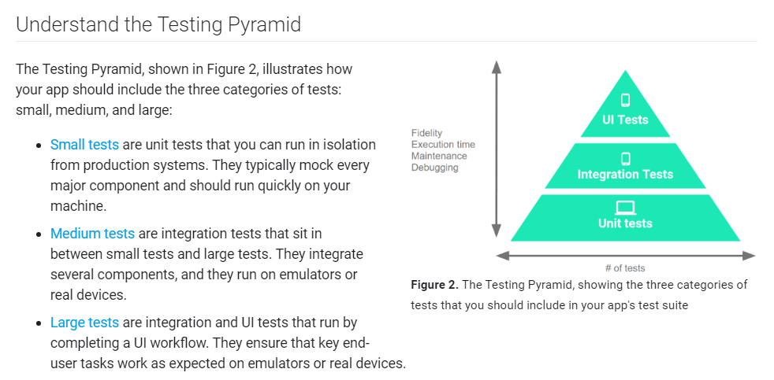
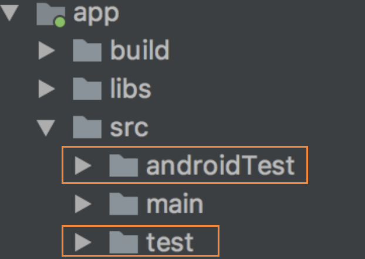
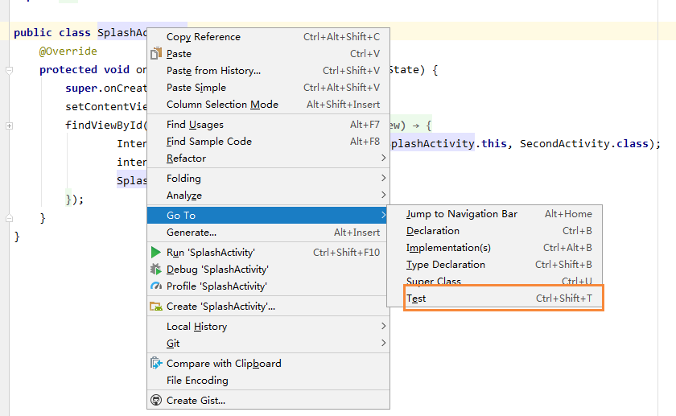
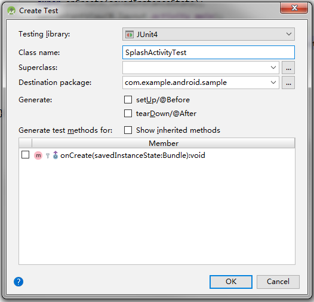
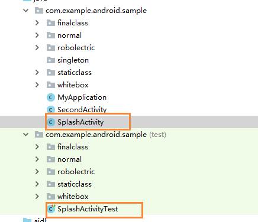
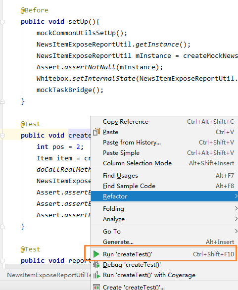
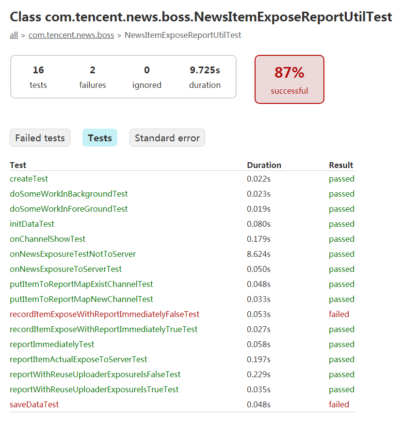
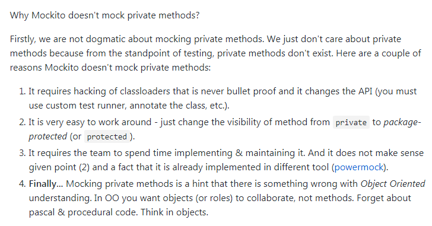
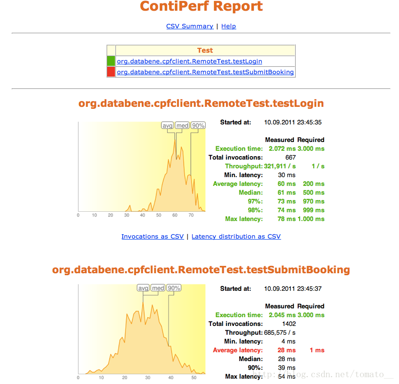

# 自动化测试

- IDEA自动生成单测代码插件：squaretest、TestMe[解放双手提高单测覆盖率之Java 自动生成单测代码神器推荐](https://mp.weixin.qq.com/s/H75TBitXLF2SBwELCxHZYQ)
- 京东的整体架构体系（包括介绍、架构、使用、原则等）[一台不容错过的Java单元测试代码 “永动机”](https://mp.weixin.qq.com/s/RW-i-y7q6AQsdD2cSjnWGw)
- 阿里内部各种单测用例：
   - [值得收藏！Java单元测试典型案例集锦](https://mp.weixin.qq.com/s/e1IxnViIT9LEVHW8aOH1dg)
   - [Java编程技巧之单元测试用例简化方法（内含案例）](https://mp.weixin.qq.com/s/HROhxieLa_g394QiYZUpuw)

## 1.基础知识

### 1.1.测试分层



[https://developer.android.com/training/testing/fundamentals](https://developer.android.com/training/testing/fundamentals)

这个是安卓官方对测试金字塔的描述。

- Small tests是单元测试，在local JVM就可以运行。
- Medium tests是集成测试，测试集成的几个模块，运行于真机或模拟器。
- Large tests是UI测试，测试整个UI工作流程，运行于真机或模拟器。

开发写的单元测试和测试写的集成测试区别在哪里？

单元测试测试的测试单元一定是远小于集成测试，主要原因是：单元测试是运行在JVM上，直接去测试某个类或某几个类，
因为没有走整个App正常的启动和调用流程，导致非常多的模块是没有初始化的，为了测试用例不崩溃，必须把需要用到，但没初始化的类或方法mock，
如果测试单元很大，需要mock的东西就非常多，很难保证不出错。而集成测试是运行在真机或模拟器，可以按照App正常的启动和调用流程，
需要mock的东西不多，所以测试单元可以很大。

再者，单元测试是白盒测试。集成测试是黑盒测试。

### 1.2.单元测试

单元测试，是为了测试某一个类的某一个方法能否正常工作

单元测试目的
- 验收。提前发现代码中的bug。以后代码有改动或重构，跑下用例就可以了。
- 帮助开发。开发过程中，可以快速验证自己的代码逻辑，不用一遍遍完整跑起来。提高效率。
- 规范代码。为了让代码可测，会尽量避免些耦合特别多的代码。以及特别大的类和函数。

```java
public class NormalClassA {
  public int testAdd(int a, int b) {
    return a + b;
  }
}
public class NormalClassATest {
  @Test
  public void testAdd() {
    NormalClassA classA = new NormalClassA();
    Assert.assertEquals(5, classA.testAdd(1,4));
  }
}
```

1. setup：   一般是new出你要测试的那个类，以及其他一些前提条件的设置：NormalClassA classA = new NormalClassA();
2. 执行操作：  一般是调用你要测试的那个方法，获得运行结果：classA.testAdd(1,4)
3. 验证结果：  验证得到的结果跟预期中是一样的：Assert.assertEquals(5, classA.testAdd(1,4));

**《单元测试的艺术》一书中的优秀的单元测试特性**

优秀单元测试的特性
一个单元测试应当具有如下特征:口它应该是自动化的，可重复执行;口它应该很容易实现;
- 它应该第二天还有意义;
- 任何人都应该能一键运行它;口它应该运行速度很快;
- 它的结果应该是稳定的(如果运行之间没有进行修改的话，多次运行一个测试应该总是返回同样的结果);
- 它应该能完全控制被测试的单元;
- 它应该是完全隔离的(独立于其他测试的运行);
- 如果它失败了，我们应该很容易发现什么是期待的结果，进而定位问题所在。

### 1.3.工具链

#### 1.3.1.单元测试工具

谷歌推荐的是：junit4 + mockito + robolectric

我们最终选择的工具链：junit4 + mockito + powermock + robolectric

- JUnit：JUnit 是 Java 中最流行的单元测试框架之一，它提供了一组用于编写和运行测试的 API 和注解。JUnit 可以帮助你编写可靠的单元测试，并提供了丰富的断言和测试运行器。
- TestNG：TestNG 是另一个流行的 Java 单元测试框架，它与 JUnit 类似，但提供了更多的特性和灵活性。TestNG 支持测试分组、依赖性管理、参数化测试等功能。
- mock+powermock：mockito功能有点弱，很多功能受限。 powermock可以跟mockito兼容而且功能更强。
  与mockito比，支持修改和mock静态类或对象的私有方法/成员，还支持很多反射方法，非常实用。 powermock目前使用人数非常多，github上的star很高。
- robolectric:可以比较完整的模拟安卓接口。这样case就可以运行在jvm上。目前这个没有其他类似框架，无可替代，而且谷歌官方推荐。
  这套框架运行于JVM，不需要安卓模拟器和手机。

#### 1.3.2.自动生成单测代码

- idea和eclipse支持生成测试类，包括测试的方法等初级操作。
- Squaretest。【idea插件，收费】非常好用、非常智能的单测代码生成工具。官网：[https://squaretest.com/](https://squaretest.com/)
- TestMe。【idea插件】自动生成 Java JUnit 4/5, TestNG 单元测试 自动生成 Mockito mocks 自动生成 测试参数和断言语句 自动生成相关 mock 方法

#### 1.3.3.UI测试
- Selenium。用于Web应用程序测试的工具。Selenium测试直接运行在浏览器中，就像真正的用户在操作一样。


#### 1.3.4.单测高效构造参数和返回值神器

- easy-random。Java高效构造对象的神器。
   - 功能：一两行就可以构造一个非常复杂的对象或者对象列表。
   - 官网：[https://github.com/j-easy/easy-random](https://github.com/j-easy/easy-random)
- java-faker。Java 单元测试生成测试字符串的神器
   - 功能：如果我们想要随机构造人名、地名、天气、学校、颜色、职业，甚至符合某正则表达式的字符串
   - 官网：[https://github.com/DiUS/java-faker](https://github.com/DiUS/java-faker)

#### 1.3.5.单测覆盖率报告
- IDEA支持生成单测覆盖率。
-  [jacoco成单测覆盖率报告](https://mp.weixin.qq.com/s/HBfXdwRjfz8Uyzkb7UiGXg)

#### 1.3.6.性能测试
- JMeter：JMeter 是一个用于性能测试的工具，它可以模拟多种负载类型，并提供了丰富的图表和报告来帮助你分析测试结果。JMeter 可以测试 Web 应用程序、数据库、FTP 服务器等多种系统。
- Apache Bench：Apache Bench 是一个简单但功能强大的命令行工具，用于测试 Web 服务器性能。它可以模拟多个并发用户，并生成详细的测试报告。
- ContiPerf：轻量级的测试工具能轻松地利用的 JUnit 4 的性能测试

### 1.4.如何在android project中运行单元测试

##### 1.4.1.安卓自动化测试有两种：

1. Local tests:运行与JVM上
2. Instrumented tests:运行于手机或模拟器，因为要依赖Android Framework，例如Context等。




新建模块时会自动生成androidTest和test两个目录。androidTest中的测试用例对应上面提到的 Instrumented tests。
test中的测试用例对应上面提到的Local tests

#### 1.4.2.创建一个测试类







test的同级目录下就会生成测试类文件

#### 1.4.2.如何运行？

##### 1.4.2.1.方法一：通过Android Studio运行



函数内右键，运行单个测试用例


在类名上右键，运行该类的所有测试用例

##### 1.4.2.2.方法二：通过命令行

在Terminal中运行：gradlew testDebug --continue

通过命令行运行后，会生成测试用例的报告，用Android Studio运行不会生成。

报告目录

对应模块的build目录下，build\reports\tests\testDebugUnitTest

以m_news_list模块为例：TencentNews\m_news_list\build\reports\tests\testDebugUnitTest



### 1.5.两种函数不同的测试方法

函数有两种：验证返回值和验证函数调用。

#### 1.5.1.有返回值函数

既可以验证返回值，也可以验证函数调用

#### 1.5.2.无返回值

验证函数调用

```java
public class NormalClassA {
  public NormalClassB mClassB = new NormalClassB();
  public int testPlus(int a, int b) {
      return mClassB.testPlus(a, b);
  }
}

public class NormalClassB {
  public int testPlus(int a, int b) {
      return a + b;
  }
}

public class NormalClassATest {
  @Test
  public void testPlusInvokeMock() {
    NormalClassA classA = new NormalClassA();
    classA.mClassB = Mockito.mock(NormalClassB.class);
    //验证返回值
    Assert.assertEquals(6,   classA.testPlus(3,3));
    //验证函数调用，并且参数是3，3
    Mockito.verify(classA.mClassB).testPlus(3, 3);
  }
}
```

### 1.6. 单元测试基本规范

#### 1.6.1.测试用例存放目录

单元测试文件放在对应模块的test目录下

#### 1.6.2.单元测试代码规范

- 测试类的包名：与被测类的包名保持一致
- 测试类命名方式：被测类名+Test。示例：
- 被测类名AppDownload，则测试类名为 AppDownloadTest
- 测试用例命名方式：test+首字母大写的
- 测方法名，如果同一个逻辑要测不同分支，产生多个同类测试用例的情况，用例前缀需保持一致，后面跟“_xxxx_xxxx”，xxxx明确分支意图。格式为大写开头驼峰。。示例：
- 被测方法名sendRequest，则测试用例名称 为testSendRequest，如有多个，则为 testSendRequest_HasLogin_Success, testSendRequest_HasLogin_Fail,…
  用例命名规范参考谷歌代码：
  [https://cs.android.com/android/platform/superproject/+/master:packages/apps/WallpaperPicker2/tests/src/com/android/wallpaper/picker/individual/IndividualPickerActivityTest.java](https://cs.android.com/android/platform/superproject/+/master:packages/apps/WallpaperPicker2/tests/src/com/android/wallpaper/picker/individual/IndividualPickerActivityTest.java)
- 测试类必须有setup()、cleanup()方法，用 于初始化和资源释放。
- 测试用例必须有断言。

#### 1.6.3.单元测试验证标准

通过代码覆盖率判断，代码覆盖率包含：行覆盖，函数覆盖，分支覆盖。

#### 1.6.4.单元测试验证标准

通过代码覆盖率判断，代码覆盖率包含：行覆盖，函数覆盖，分支覆盖。

#### 1.6.5.那些需要做单元测试

非UI的逻辑代码，例如：工具方法、MVP中的P。

#### 1.6.6.代码架构规范

保持UI和逻辑的分析，推荐采用MVP模式，方便单元测试。

## 2.JUnit4

### 2.1.引入依赖

```groovy
dependencies {testCompile 'junit:junit:4.12'}
```

### 2.2.常用注解

- @Test代表一条测试用例。
- @Before修饰的方法，在每个测试方法调用之前，这个方法都会得到调用。所以上面的例子中，testAdd()被运行之前，setup()会被调用一次
- @After对应于@Before，每个测试方法运行结束之后，会运行的方法。比如一个测试文件操作的类，那么在它的测试类中，可能@Before里面需要去打开一个文件，而每个测试方法运行结束之后，都需要去close这个文件。这个时候就可以把文件close的操作放在@After里面，让它自动去执行。
- @BeforeClass，@AfterClass。@BeforeClass的作用是，在跑一个测试类的所有测试方法之前，会执行一次被@BeforeClass修饰的方法，执行完所有测试方法之后，会执行一遍被@AfterClass修饰的方法。这两个方法可以用来setup和release一些公共的资源，需要注意的是，被这两个annotation修饰的方法必须是静态的。

这是比较常用的注解，其他注解可以参考下表：
- @Test             ：表示此方法为测试方法
- @Before           ：在每个测试方法前执行，可做初始化操作
- @After            ：在每个测试方法后执行，可做释放资源操作
- @Ignore           ：忽略的测试方法
- @BeforeClass      ：在类中所有方法前运行。此注解修饰的方法必须是static void
- @AfterClass       ：在类中最后运行。此注解修饰的方法必须是static void
- @RunWith          ：指定该测试类使用某个运行器
- @Parameters       ：指定测试类的测试数据集合
- @Rule             ：重新制定测试类中方法的行为
- @FixMethodOrder   ：指定测试类中方法的执行顺序

### 2.3.执行顺序

- @BeforeClass –>
- @Before –> @Test –> @After //case 1
- @Before –> @Test –> @After //case 2
- @Before –> @Test –> @After //case n
- –> @AfterClass

### 2.4.Assert类

- assertNotEquals     ：断言传入的预期值与实际值是不相等的
- assertArrayEquals   ：断言传入的预期数组与实际数组是相等的
- assertNull          ：断言传入的对象是为空
- assertNotNull       ：断言传入的对象是不为空
- assertTrue          ：断言条件为真
- assertFalse         ：断言条件为假
- assertSame          ：断言两个对象引用同一个对象，相当于“==”
- assertNotSame       ：断言两个对象引用不同的对象，相当于“!=”
- assertThat          ：断言实际值是否满足指定的条件

通过Assert类验证结果是否符合预期

### 2.5.assertThat验证结果

Assert.assertEquals(4, classA.testAdd(1,4));
出错时的提示：junit.framework.AssertionFailedError: Expected :4Actual :5

assertThat(4, equalTo(5));
出错时的提示： java.lang.AssertionError: Expected: <5>but: was <4>Expected :<5> Actual :<4>


assertThat的作用跟Assert类似，提供的方法更多一些，返回错误也更容易读。

匹配器             说明 例子
- is                     ：断言参数等于后面给出的匹配表达式
- not                    ：断言参数不等于后面给出的匹配表达式
- equalTo                ：断言参数相等
- equalToIgnoringCase    ：断言字符串相等忽略大小写
- containsString         ：断言字符串包含某字符串
- startsWith             ：断言字符串以某字符串开始
- endsWith               ：断言字符串以某字符串结束
- nullValue              ：断言参数的值为null
- notNullValue           ：断言参数的值不为null
- greaterThan            ：断言参数大于
- lessThan               ：断言参数小于
- greaterThanOrEqualTo   ：断言参数大于等于
- lessThanOrEqualTo      ：断言参数小于等于
- closeTo                ：断言浮点型数在某一范围内
- allOf                  ：断言符合所有条件，相当于&&
- anyOf                  ：断言符合某一条件，相当于或
- hasKey                 ：断言Map集合含有此键
- hasValue               ：断言Map集合含有此值
- hasItem                ：断言迭代对象含有此元素

## 3.Mockito

### 3.1.为什么要Mock

#### 3.1.1. 解决测试类对其他类的依赖

在实际的单元测试中，我们要测试的类很可能对其他类有依赖，要测试的方法对其他方法或变量有依赖，如果直接运行这个要测试的方法，很大可能会因为某些变量没初始化NP。这样我们就无法顺利的进行测试。如果mock方法模拟一个类，最大的特点是，该类所有的方法都是空，所有变量都是初始值。这样这个类就对其他类几乎没有依赖了。然后只针对你要测试的方法调用doCallRealMethod()真正执行方法的实现。这样依赖就很少了，就比较可控了。再把依赖的方法mock，方法运行了。

```java
public class JudgePresenter extends AbstractJudgePresenter {
    public JudgePresenter(IJudgeContract.IView mView, QuestionInfo mCurrentQuestionInfo) {
        super(mView, mCurrentQuestionInfo);
    }

    @Override
    public void initUIData() {
        mView.setBg();
        updateLiveViewerCount();
    }

    private void updateLiveViewerCount() {
        DataLoader.getLiveViewerBuilder(GlobalLocalData.getInstance().getArticleId())
                .response(new TNResponseCallBack<LiveViewersRet>())
                .build()
                .submit();
    }
}

```

针对initUIData写测试用例：
```java
@Test
public void initUIDataTest() {
  IJudgeContract.IView mockView = Mockito.mock(JudgeDialog.class);
  JudgePresenter presenter = new JudgePresenter(mockView, getFakeQuestionInfo());
  presenter.initUIData();
  Mockito.verify(mockView).setBg();
}
```

直接运行测试用例，会报错，提示网络库某个方法NP了。
这是因为initUIDataTest()调到了updateLiveViewerCount()，该函数中调用到了网络请求库，而网络库模块是需要初始化的，所以有些值为null，导致NP。那只要把网络库初始化一下，不就可以了吗？然后如果尝试去初始话网络库，就会发现，初始化网络库又需要一堆依赖…，这就把问题搞复杂了。回到最初的目的，我们只是想测试initUIDataTest方法，我们只关心setBg()被调用了，至于updateLiveViewerCount方法的执行过程，不属于我们这个测试用例考虑的范畴，
所以这里我们其实只需要mock一下updateLiveViewerCount方法，让他不执行就可以。用PowerMockito来实现，代码如下

PowerMockito.suppress(PowerMockito.method(JudgePresenter.class, "updateLiveViewerCount"));

所以完整的测试代码：

```java
@Test
public void initUIDataTest() {
  IJudgeContract.IView mockView = Mockito.mock(JudgeDialog.class);
  JudgePresenter presenter = new JudgePresenter(mockView, getFakeQuestionInfo());
  PowerMockito.suppress(PowerMockito.method(JudgePresenter.class, "updateLiveViewerCount"));
  presenter.initUIData();
  Mockito.verify(mockView).setBg();
}
```

#### 3.1.2.验证方法的调用

只有对mock的对象或类，才能调用verify方法，验证方法的调用。

举个例子：

```java
@Test
public void initUIDataTest() {
    IJudgeContract.IView mockView = Mockito.mock(JudgeDialog.class);
    JudgePresenter presenter = new JudgePresenter(mockView, getFakeQuestionInfo());
    PowerMockito.suppress(PowerMockito.method(JudgePresenter.class, "updateLiveViewerCount"));
    presenter.initUIData();
    Mockito.verify(mockView).setBg();
}
```

为了验证JudgeDialog中setBg()方法被调用了，需要mock一个JudgeDialog。

### 3.2. Mockito

Mockito是安卓官方推荐的，也是目前使用最广泛的。

#### 3.2.1.用法

```groovy
dependencies {
  testCompile "org.mockito:mockito-core:2.8.9"
}
```

```java
@RunWith(MockitoJUnitRunner.class)
public class NormalClassAMockitoTest {

    @Test
    public void testAPlusInvokeMock() {
        NormalClassA mockClassA = Mockito.mock(NormalClassA.class);
        mockClassA.testPlus(3,3);
        Mockito.verify(mockClassA).testPlus(3, 3);
    }
}
```

这个例子中，mock了NormalClassA用于验证该对象的testPlus()方法是否被调用了。注意类前面的注解*@RunWith*(MockitoJUnitRunner.class)
指明本类中的用例用MockitoJUnitRunner运行。


#### 3.2.2 Mock和Spy的区别

##### 3.2.2.1 Mock方法创建的对象，所有方法都是空方法。非void方法都将返回默认值，比如int方法将返回0，对象方法将返回null等，而void方法将什么都不做。

##### 3.2.2.2 Spy方法创建的对象，跟正常类对象一样，是正常对象的替身。

##### 3.2.2.3 被测试代码：

```java
public class NormalClassB {

    public int testPlus(int a, int b) {
        return a + b;
    }

}
```

##### 3.2.2.4 用Mock方式的代码：

```java
@Test
public void testPlusValueMock() {
    NormalClassA classA = new NormalClassA();
    classA.mClassB = Mockito.mock(NormalClassB.class);
    Assert.assertEquals(0, classA.testPlus(3, 3));
}
```

在这个例子中，Mock了NormalClassB，所以它的testPlus方法就会是空的。调用classA.testPlus(3, 3)后，将会返回int的默认值0，并不会返回6。

##### 3.2.2.5 用Spy方式的代码：

```java
@Test
public void testPlusValueSpy() {
    NormalClassA classA = new NormalClassA();
    classA.mClassB = Mockito.spy(new NormalClassB());
    Assert.assertEquals(6, classA.testPlus(3, 3));
}
```

在这个例子中，Spy了NormalClassB，它的testPlus方法不为空，是具体实现的。调用classA.testPlus(3, 3)后，将会返回6。

好的，让我来帮您整理一下这个Markdown的格式。同样的，我会将标题的层次结构进行调整，将代码块语法应用于代码，并将更改应用于Markdown中。

以下是更改后的Markdown：

#### 3.2.3 Mock和Spy各自适用的场景

##### 3.2.3.1 Mock

Mock适用于类中大多数方法只需要验证是否被调用，而不关心方法内部执行结果的场景。通过让类的所有方法都为空实现，可以减少对其他类的依赖。

如果想要在Mock对象中执行某个函数的具体实现，该怎么办呢？可以使用doCallRealMethod()方法。

```java
@Test
public void testPlusValueMockWithCallRealMethod() {
    NormalClassA classA = new NormalClassA();
    classA.mClassB = Mockito.mock(NormalClassB.class);
    doCallRealMethod().when(classA.mClassB).testPlus(Mockito.anyInt(), Mockito.anyInt());
    Assert.assertEquals(6, classA.testPlus(3, 3));
}
```

##### 3.2.3.2 Spy

Spy与Mock相反，适用于类中大部分函数需要关注具体实现的场景。

如果想要在Spy对象中，某个函数不执行，该怎么办呢？有两种情况：有返回值和无返回值。

###### 3.2.3.3 有返回值的函数

```java
@Test
public void testPlusValueSpyWithDoReturn() {
    NormalClassA classA = new NormalClassA();
    classA.mClassB = Mockito.spy(NormalClassB.class);
    doReturn(0).when(classA.mClassB).testPlus(Mockito.anyInt(), Mockito.anyInt());
    Assert.assertEquals(0, classA.testPlus(3, 3));
}
```

###### 3.2.3.4 无返回值的函数

```java
@Test
public void testPlusValueSpyWithDoThrow() throws Exception {
    NormalClassA classA = new NormalClassA();
    classA.mClassB = Mockito.spy(NormalClassB.class);
    doNothing().when(classA.mClassB).voidMethod(Mockito.anyInt(), Mockito.anyInt());
}
```

这些是Mockito的方法。后面我们将介绍PowerMock，它还提供了其他方法来禁用某个函数的执行。

#### 3.2.4. 打桩方法

在Java中，我们常常需要使用Mockito等框架进行单元测试。在这些框架中，打桩方法是一个非常重要的概念。其中，doCallRealMethod()，doReturn()和doNothing()是我们经常使用的打桩方法。除此之外，还有以下全部打桩方法：

| 方法名 | 方法描述 |
| --- | --- |
| thenReturn(T value) | 设置要返回的值 |
| thenThrow(Throwable… throwables) | 设置要抛出的异常 |
| thenAnswer(Answer<?> answer) | 对结果进行拦截 |
| doReturn(Object toBeReturned) | 提前设置要返回的值 |
| doThrow(Throwable… toBeThrown) | 提前设置要抛出的异常 |
| doAnswer(Answer answer) | 提前对结果进行拦截 |
| doCallRealMethod() | 调用某一个方法的真实实现 |
| doNothing() | 设置void方法什么也不做 |


##### 3.2.5. 验证方法

在Mockito中，Mockito.verify()用于验证方法是否被调用，调用次数等。下面是一些常用的验证方法：

| 方法名 | 方法描述 |
| --- | --- |
| after(long millis) | 在给定的时间后进行验证 |
| timeout(long millis) | 验证方法执行是否超时 |
| atLeast(int minNumberOfInvocations) | 至少进行n次验证 |
| atMost(int maxNumberOfInvocations) | 至多进行n次验证 |
| description(String description) | 验证失败时输出的内容 |
| times(int wantedNumberOfInvocations) | 验证调用方法的次数 |
| never() | 验证交互没有发生,相当于times(0) |
| only() | 验证方法只被调用一次，相当于times(1) |

以下是一个示例代码：

```java
@Test
public void testAPlusInvokeMock() {
    NormalClassA mockClassA = Mockito.mock(NormalClassA.class);
    mockClassA.testPlus(3,3);
    Mockito.verify(mockClassA).testPlus(3, 3);
    Mockito.verify(mockClassA, times(1)).testPlus(3, 3);
    Mockito.verify(mockClassA, atLeast(1)).testPlus(3, 3);
}
```


#### 3.2.6.参数匹配器

```java
@RunWith(MockitoJUnitRunner.class)
public class NormalClassAMockitoTest {
    @Test
    public void testAPlusInvokeMock() {
        NormalClassA mockClassA = Mockito.mock(NormalClassA.class);
        mockClassA.testPlus(3,3);
        Mockito.verify(mockClassA).testPlus(3, 3);
    }
}
```

Mockito.verify(mockClassA).testPlus(3, 3); 这行验证成立条件有2个：
1.  testPlus被调用。
2.  testPlus的参数是3，3。

如果调用 mockClassA.testPlus(3,4); 验证是失败，因为参数不一致。
那么如何忽略具体的参数呢。这就需要用到参数匹配器。

Mockito.verify(mockClassA).testPlus(Mockito.anyInt(),Mockito.anyInt());

这样写，只要参数是整型就能验证成功。

##### 3.2.6.1.需要注意的特殊case

- 一个参数确定，另一个参数是匹配器
- Mockito.verify(mockClassA).testPlus(3 ,Mockito.anyInt());
- 如果这样写，能配置成功吗？
  答案是不能。
  正确写法： Mockito.verify(mockClassA).testPlus(Mockito.eq(3) ,Mockito.anyInt());
- 匹配非基础类型
```java
//如果函数原型是这样：
void putItemToReportMap(String channel, Properties prop, HashMap<String, HashSet<Properties>> map)
//正确的验证方法：
Mockito.verify(mockClassA).putItemToReportMap(Mockito.anyString(), Mockito.any(Properties.class), Mockito.anyMap());
```

| 方法名 | 方法描述 |
| --- | --- |
| anyObject() | 匹配任何对象 |
| any(Class<T> type) | 与anyObject()一样 |
| any() | 与anyObject()一样 |
| anyBoolean() | 匹配任何boolean和非空Boolean |
| anyByte() | 匹配任何byte和非空Byte |
| anyCollection() | 匹配任何非空Collection |
| anyDouble() | 匹配任何double和非空Double |
| anyFloat() | 匹配任何float和非空Float |
| anyInt() | 匹配任何int和非空Integer |
| anyList() | 匹配任何非空List |
| anyLong() | 匹配任何long和非空Long |
| anyMap() | 匹配任何非空Map |
| anyString() | 匹配任何非空String |
| contains(String substring) | 参数包含给定的substring字符串 |
| argThat(ArgumentMatcher<T> matcher) | 创建自定义的参数匹配模式 |

#### 3.2.7.其他方法

以下是Mockito库中一些其他方法的介绍：

| 方法名 | 方法描述 |
| --- | --- |
| reset(T … mocks) | 重置Mock对象 |
| spy(Class<T> classToSpy) | 创建一个真实的对象，并记录该对象的所有方法调用 |
| inOrder(Object… mocks) | 验证执行顺序 |
| @InjectMocks注解 | 自动将模拟对象注入到被测试对象中 |

其中，@InjectMocks注解可以自动将模拟对象注入到被测试对象中，以便进行单元测试。需要注意的是，使用@InjectMocks注解时，被测试对象中的模拟对象必须已经创建并初始化。
另外，在使用@InjectMocks注解时，需要确保正确地配置了依赖关系，以便正确地注入模拟对象。

### 3.3.Mockito局限性

针对上面的代码，可以使用Mockito框架编写单元测试。以下是一个测试`initUIData()`方法，需要验证mView.setBg()、updateLiveViewerCount被调用的示例：

```
public class JudgePresenterTest {

    private IJudgeContract.IView mView = Mockito.mock(IJudgeContract.IView.class);
    private QuestionInfo mCurrentQuestionInfo = Mockito.mock(QuestionInfo.class);
    private JudgePresenter mPresenter = new JudgePresenter(mView, mCurrentQuestionInfo);

    @Test
    public void testInitUIData() {
        mPresenter.initUIData();
        Mockito.verify(mView).setBg();
        Mockito.verify(mPresenter).updateLiveViewerCount();
    }

}
```

在这个测试中，我们首先创建了一个`JudgePresenter`实例，并将其与一个模拟的`IJudgeContract.IView`和`QuestionInfo`对象一起传递给构造函数。
然后，我们调用`initUIData()`方法，并使用`Mockito.verify()`方法验证了`mView.setBg()`和`mPresenter.updateLiveViewerCount()`方法是否被调用。
需要注意的是，由于`updateLiveViewerCount()`方法是私有的，因此我们无法直接调用它。
但是，我们可以通过验证`mPresenter.updateLiveViewerCount()`方法是否被调用来验证该方法是否被正确执行。

需要注意的是，Mockito框架有一些限制，例如无法访问私有方法、mock匿名类、final类、static方法等。

## 4.PowerMock

### 4.1.PowerMock介绍

PowerMock是Mockito的扩展增强版，支持mock private、static、final方法和类，还增加了很多反射方法可以方便修改静态和非静态成员等。功能比Mockito增加很多。

为什么 Mockito 不自己支持 private 方法？



[https://github.com/mockito/mockito/wiki/Mockito-And-Private-Methods](https://github.com/mockito/mockito/wiki/Mockito-And-Private-Methods)

简单点说：
1. 改动较大，不是特别必要。
2. powermock已经实现了。
3. 被测代码不够规范

### 4.2.PowerMock版本

PowerMock是依赖Mockito的，所以使用时要一同引入。 PowerMock跟Mockito的版本必须对应：

[https://github.com/powermock/powermock/wiki/Mockito](https://github.com/powermock/powermock/wiki/Mockito)


目前我们使用的版本：

```groovy
testCompile 'junit:junit:4.12'
testCompile "org.mockito:mockito-core:2.8.9"
testCompile "org.powermock:powermock-module-junit4:1.7.1"
testCompile "org.powermock:powermock-api-mockito2:1.7.1"//注意，这里要用mockito2，否则报错
testCompile 'org.powermock:powermock-core:1.7.1'
testCompile "org.powermock:powermock-module-junit4-rule:1.7.1"
testCompile "org.powermock:powermock-classloading-xstream:1.7.1"
```

### 4.3.基本使用

```java
@RunWith(PowerMockRunner.class)
@PrepareForTest({NormalClassA.class})
public class NormalClassAPowerMockTest {
  @Test
  public void testPrivateMethod() throws Exception {
    NormalClassA classA = new NormalClassA();
    NormalClassA mockClassA = PowerMockito.spy(classA);
    mockClassA.publicAdd(2, 3);
    PowerMockito.verifyPrivate(mockClassA, times(1)).invoke("privateAdd",
    Mockito.anyInt(), Mockito.anyInt());
  }
}
```

- @RunWith(PowerMockRunner.class)，使用PowerMockRunner，使用这个Runner时，跟Mockito是兼容的，Mockito中的各种方法也是可以正常使用的。
- @PrepareForTest({NormalClassA.class})， PowerMock要mock的类一定要写在这个注解里，切记切记！ 写的时候实在太容易忘了，而且，就算不写也不会报错，只是verify永远成功，所以特别隐蔽，忘记写了也很难发现。
- 通过PowerMockito.verifyPrivate验证私有方法的调用。Mocktio的次数验证times(1)和参数匹配符也都是可以用的。

### 4.4.针对对象的操作

#### 4.4.1.读取对象私有成员

```java
public class ObjectWhiteBoxClass {
    private final List<String> mObjectList = new ArrayList<>();

    public void publicObjectAdd(String str) {
        mObjectList.add(str);
    }

    public List<String> getObjectList() {
        return mObjectList;
    }
}

@Test
public void testGetInternalState() {
    ObjectWhiteBoxClass objectWhiteBoxClass = new ObjectWhiteBoxClass();
    objectWhiteBoxClass.publicObjectAdd("test1str");
    objectWhiteBoxClass.publicObjectAdd("test2str");
    objectWhiteBoxClass.publicObjectAdd("test3str");

    List<String> list = Whitebox.getInternalState(objectWhiteBoxClass, "mObjectList");

    Assert.assertEquals(3, list.size());
    Assert.assertEquals("test3str", list.get(list.size()-1));
}
```

#### 4.4.2.修改对象私有成员

```java
java
Copy code
public class MockPrivateObjectClass {
    private InnerClass innerClass;

    public MockPrivateObjectClass() {

    }

    public int doPlus(int a, int b) {
        return innerClass.plus(a, b);
    }

    public static class InnerClass {
        public int plus(int a, int b) {
            return a + b;
        }
    }
}
```

##### 4.4.2.1.第一种方式：Whitebox.setInternalState

```java
@RunWith(PowerMockRunner.class)
@PrepareForTest({MockPrivateObjectClass.class})
public class MockPrivateObjectClassTest {
    @Test
    public void doPlusTest() {
        MockPrivateObjectClass objectClass = new MockPrivateObjectClass();
        MockPrivateObjectClass.InnerClass mockInnerClass = Mockito.spy(MockPrivateObjectClass.InnerClass.class);
        Whitebox.setInternalState(objectClass, "innerClass", mockInnerClass);

        int ret = objectClass.doPlus(2, 3);
        Assert.assertEquals(5, ret);
        Mockito.verify(mockInnerClass).plus(2, 3);
    }
}
```

##### 4.4.2.2.第二种方式：MemberModifier.field

```java
@RunWith(PowerMockRunner.class)
@PrepareForTest({MockPrivateObjectClass.class})
public class MockPrivateObjectClassTest {

    @Test
    public void doPlusMethod2Test() throws Exception {
        MockPrivateObjectClass objectClass = new MockPrivateObjectClass();
        MockPrivateObjectClass.InnerClass mockInnerClass = Mockito.spy(MockPrivateObjectClass.InnerClass.class);
        MemberModifier.field(MockPrivateObjectClass.class, "innerClass").set(objectClass, mockInnerClass);

        int ret = objectClass.doPlus(2, 3);
        Assert.assertEquals(5, ret);
        Mockito.verify(mockInnerClass).plus(2, 3);
    }
}
```

#### 4.4.3.Verify对象私有方法
```java
public class NormalClassA {
    public int publicAdd(int a, int b) {
        return privateAdd(a, b);
    }

    private int privateAdd(int a, int b) {
        return a + b;
    }
}

@RunWith(PowerMockRunner.class)
@PrepareForTest({NormalClassA.class})
public class NormalClassAPowerMockTest {
    @Test
    public void testPrivateMethod() throws Exception {
        NormalClassA classA = new NormalClassA();
        NormalClassA mockClassA = PowerMockito.spy(classA);

        mockClassA.publicAdd(2, 3);

        PowerMockito.verifyPrivate(mockClassA, times(1)).invoke("privateAdd", Mockito.anyInt(), Mockito.anyInt());
    }
}

```

#### 4.4.4.Invoke对象私有方法

```java
public class ObjectWhiteBoxClass {
    private final List<String> mObjectList = new ArrayList<>();

    private void privateObjectAdd(String str) {
        mObjectList.add(str);
    }

    private void privateObjectRemove(String str) {
        mObjectList.remove(str);
    }

    public List<String> getObjectList() {
        return mObjectList;
    }
}

@Test
public void testInvokeMethod() throws Exception {
    ObjectWhiteBoxClass objectWhiteBoxClass = new ObjectWhiteBoxClass();

    Whitebox.invokeMethod(objectWhiteBoxClass, "privateObjectAdd", "test1");
    Whitebox.invokeMethod(objectWhiteBoxClass, "privateObjectAdd", "test2");

    Assert.assertEquals(2, objectWhiteBoxClass.getObjectList().size());

    Whitebox.invokeMethod(objectWhiteBoxClass, "privateObjectRemove", "test1");

    Assert.assertEquals(1, objectWhiteBoxClass.getObjectList().size());
}
```

#### 4.4.5.修改对象私有函数

```java
public class MockPrivateObjectClass {
    public String stepName;

    public MockPrivateObjectClass() {

    }

    private void setStepName() {
        System.out.print("enter setStepName");
        stepName = "has set name";
    }

    public void testStepName() {
        setStepName();
        System.out.print(stepName);
    }
}

@Test
public void replacePrivateMethodTest() {
    MockPrivateObjectClass objectClass = new MockPrivateObjectClass();

    PowerMockito.replace(PowerMockito.method(MockPrivateObjectClass.class, "setStepName")).with(new InvocationHandler() {
        @Override
        public Object invoke(Object o, Method method, Object[] objects) throws Throwable {
            Whitebox.setInternalState(o, "stepName", "modify step name");
            return null;
        }
    });

    objectClass.testStepName();
}
```

运行结果：


替换了setStepName方法的实现。

##### 4.4.5.1.这在写单测时，特别有用，譬如，将异步执行的代码，替换为同步，可以方便测试。

#### 4.4.6. 调用私有构造方法
```java
public class PrivateConstructorClass {
    private final List<String> mObjectList;

    private PrivateConstructorClass() {
        mObjectList = new ArrayList<>();
    }

    public void add(String str) {
        mObjectList.add(str);
    }

    public List<String> getObjectList() {
        return mObjectList;
    }
}

@Test
public void testInvokePrivateConstructor() throws Exception{
    PrivateConstructorClass object = Whitebox.invokeConstructor(PrivateConstructorClass.class);
    object.add("test1");
    Assert.assertEquals(1, object.getObjectList().size());
}

// 调用了私有的构造函数 PrivateConstructorClass()
```

##### 4.4.6.1.这个对单例等特别有用

#### 4.4.7. mock对象的创建

```java
public class NormalClassA {
    public String getClassBName() {
        NormalClassB b = new NormalClassB();
        return b.getName();
    }
}

public class NormalClassB {
    public String getName(){
        return "NormalClassB";
    }
}

public static class MockNormalClassB extends NormalClassB {
    @Override
    public String getName() {
        return "MockNormalClassB";
    }
}

@Test
public void testClassB() throws Exception {
    NormalClassA classA = new NormalClassA();
    String name = classA.getClassBName();
    System.out.println("before mock:" + name);
    Assert.assertEquals("NormalClassB", name);
    NormalClassB b = new MockNormalClassB();
    NormalClassB mockB = Mockito.spy(b);
    PowerMockito.whenNew(NormalClassB.class).withNoArguments().thenReturn(mockB);
    name = classA.getClassBName();
    System.out.println("after mock:" + name);
    Assert.assertEquals("MockNormalClassB", name);
    Mockito.verify(mockB).getName();
}
```

运行结果：


1. new NormalClassB()动作是在函数内部，并没有赋给某个类成员，我们没法访问到NormalClassB对象，也就没法mock，这种情况特别适合用WhenNew方法。
2. 注意：whenNew跟匿名类一起使用时，很可能会有问题，本文最后的总结中有介绍。

#### 4.4.8.跳过某个方法

Mockito中介绍过，通过doReutrn、doNothing，不执行某个函数。

PowerMock中有另一种方式：

```java
public class MockPrivateObjectClass {
    public String stepName;

    private void setStepName() {
        System.out.print("enter setStepName");
        stepName = "has set name";
    }

    public void testStepName() {
        setStepName();
        System.out.print(stepName);
    }
}

@Test
public void skipPrivateMethodTest() {
    MockPrivateObjectClass objectClass = new MockPrivateObjectClass();
    PowerMockito.suppress(PowerMockito.method(MockPrivateObjectClass.class, "setStepName"));
    objectClass.testStepName();
}
```

执行结果


enter setStepName log没有被打印，说明方法被跳过了。

#### 4.4.9.打桩对象私有方法
```java
public class H5JsApiScriptInterface {
    private boolean shouldTriggerForAccount(int account) {
        return !isAccountValid(account) || !isMainAvailable();
    }
}

// 注意：要增加 PrepareForTest
@PrepareForTest({LoginManager.class, H5JsApiScriptInterface.class})
public class H5JsApiScriptInterfaceTest extends MainTNUnitTest {
    // qq connect
    @Test
    public void testShowLoginWithType_1() throws Exception{
        PowerMockito.mockStatic(LoginManager.class);
        H5JsApiScriptInterface mockScriptInterface = PowerMockito.mock(H5JsApiScriptInterface.class);
        Mockito.doCallRealMethod().when(mockScriptInterface).showLoginWithType(Mockito.anyString(), Mockito.anyString());
        // 打桩对象私有方法，mock 对象私有方法
        // 注意：要增加 PrepareForTest
        PowerMockito.when(mockScriptInterface, PowerMockito.method(H5JsApiScriptInterface.class, "shouldTriggerForAccount", int.class)).withArguments(Mockito.anyInt()).thenReturn(true);
        mockScriptInterface.showLoginWithType("qqconnect", "callback");
        PowerMockito.verifyStatic(LoginManager.class, Mockito.times(1));
        LoginManager.triggerLogin(Mockito.eq(LOGIN_FROM_WEB_ONLY_QQCONNECT), Mockito.any(Subscriber.class));
    }
}
```

### 4.5. 针对静态类

#### 4.5.1.访问静态私有成员
```java
public class StaticWhiteBoxClass {
    private final static List<String> mStaticList = new ArrayList<>();

    public static void publicStaticAdd(String str) {
        mStaticList.add(str);
    }

    public static List<String> getStaticList() {
        return mStaticList;
    }
}

@Test
public void testGetInternalState() {
    StaticWhiteBoxClass.publicStaticAdd("test1str");
    StaticWhiteBoxClass.publicStaticAdd("test2str");
    StaticWhiteBoxClass.publicStaticAdd("test3str");

    List<String> list = Whitebox.getInternalState(StaticWhiteBoxClass.class, "mStaticList");

    Assert.assertEquals(3, list.size());
    Assert.assertEquals("test3str", list.get(list.size()-1));
}
```

#### 4.5.2.修改静态私有成员
```java
public class StaticWhiteBoxClass {
    private final static List<String> mStaticList = new ArrayList<>();

    public static void publicStaticAdd(String str) {
        mStaticList.add(str);
    }

    public static List<String> getStaticList() {
        return mStaticList;
    }
}

@Test
public void testSetInternalState() {
    List<String> list = new ArrayList<>();
    list.add("outer1");
    list.add("outer2");
    list.add("outer3");

    Whitebox.setInternalState(StaticWhiteBoxClass.class, "mStaticList", list);

    List<String> objList = StaticWhiteBoxClass.getStaticList();

    Assert.assertEquals(3, objList.size());
    Assert.assertEquals("outer3", list.get(objList.size()-1));
}
```

#### 4.5.3.调用静态私有方法
```java
public class StaticWhiteBoxClass {
    private final static List<String> mStaticList = new ArrayList<>();

    private static void privateStaticAdd(String str) {
        mStaticList.add(str);
    }

    public static List<String> getStaticList() {
        return mStaticList;
    }
}

@Test
public void testInvokeMethod() throws Exception{
    Whitebox.invokeMethod(StaticWhiteBoxClass.class, "privateStaticAdd", "test1");
    Whitebox.invokeMethod(StaticWhiteBoxClass.class, "privateStaticAdd", "test2");

    Assert.assertEquals(2, StaticWhiteBoxClass.getStaticList().size());
}
```

#### 4.5.4.替换静态函数
```java
public class StaticWhiteBoxClass {
    public static void originalMethod(String name) {
        System.out.println("enter originalMethod name:" + name);
    }
}

@Test
public void replacePrivateMethodTest() {
    PowerMockito.replace(PowerMockito.method(StaticWhiteBoxClass.class, "originalMethod")).with(new InvocationHandler() {
        @Override
        public Object invoke(Object o, Method method, Object[] objects) throws Throwable {
            System.out.println("enter modify method param:" + objects[0]);
            return null;
        }
    });

    StaticWhiteBoxClass.originalMethod("test replace");
}
```

运行结果：


#### 4.5.5.打桩静态Public方法
```java
public class StaticClass {
    public static String ask(){
        return "I'm Static class";
    }
}

@Test
public void should_mock_static_method() {
    final String value = "10";
    mockStatic(StaticClass.class);
    when(StaticClass.ask()).thenReturn(value);
    Assert.assertNotEquals("I'm Static class", StaticClass.ask());
}
```

1. 静态方法mock，一定要调用mockStatic(StaticClass.class);
2. when(StaticClass.ask()).thenReturn(value);PowerMock的这个语句跟Mockito是很像的，基本上Mockito中的的那些打桩方法在PowerMock都有对应的。

#### 4.5.6.打桩静态private方法

这种public或private的都可以用
```java
public class H5JsApiScriptInterface {
    // 静态私有方法
    private static boolean isQQorWxAvailable() {
        return true;
    }
}

@PrepareForTest({LoginManager.class, H5JsApiScriptInterface.class})
public class H5JsApiScriptInterfaceTest extends MainTNUnitTest { // qq and wx
    @Test
    public void testShowLoginWithType_4() throws Exception{
        PowerMockito.mockStatic(LoginManager.class);
        PowerMockito.mockStatic(H5JsApiScriptInterface.class);
        H5JsApiScriptInterface mockScriptInterface = PowerMockito.mock(H5JsApiScriptInterface.class);
        Mockito.doCallRealMethod().when(mockScriptInterface).showLoginWithType(Mockito.anyString(), Mockito.anyString());
        // 打桩静态私有方法，mock静态私有方法，注意增加@PrepareForTest
        PowerMockito.doReturn(false).when(H5JsApiScriptInterface.class, "isQQorWxAvailable");
        mockScriptInterface.showLoginWithType("qqorweixin", "callback");
        PowerMockito.verifyStatic(LoginManager.class, Mockito.times(1));
        LoginManager.triggerLogin(Mockito.eq(LOGIN_FROM_WEB_BOTH_QQ_AND_WX), Mockito.any(Subscriber.class));
    }
}
```

#### 4.5.7.thenCallRealMethod方法
```java
public class StaticClass {
    public static int add(int a, int b) {
        return a + b;
    }
    public static int sum() {
        int ret = 0;
        for (int i = 0; i < 10; i++) {
            ret = add(i, i+1);
        }
        return ret;
    }
}

@Test
public void call_mock_sum_static_method() {
    mockStatic(StaticClass.class);
    // 如果不用 spy，就用 thenCallRealMethod 也可以
    when(StaticClass.sum()).thenCallRealMethod();
    when(StaticClass.add(Mockito.anyInt(),Mockito.anyInt())).thenCallRealMethod();
    int sum = StaticClass.sum();
    Assert.assertEquals(19, sum);
}

```

#### 4.5.8.spy静态方法
```java
public class StaticClass {
    public static int add(int a, int b) {
        return a + b;
    }
    public static int sum() {
        int ret = 0;
        for (int i = 0; i < 10; i++) {
            ret = add(i, i+1);
        }
        return ret;
    }
}

@Test
public void call_spy_sum_static_method() {
    mockStatic(StaticClass.class);
    // mock 的话，函数都是空的切记，如果需要用到函数逻辑，要用 spy
    spy(StaticClass.class);
    int sum = StaticClass.sum();
    Assert.assertEquals(19, sum);
}
```

#### 4.5.9.Verify Public 静态方法
```java
public class StaticClass {
    public static int add(int a, int b) {
        return a + b;
    }
    public static int sum() {
        int ret = 0;
        for (int i = 0; i < 10; i++) {
            ret = add(i, i+1);
        }
        return ret;
    }
}

@Test
public void call_spy_sum_static_method() {
    mockStatic(StaticClass.class);
    // mock 的话，函数都是空的切记，如果需要用到函数逻辑，要用 spy
    spy(StaticClass.class);
    int sum = StaticClass.sum();
    Assert.assertEquals(19, sum);
    verifyStatic(StaticClass.class, Mockito.times(10)); // 验证调用了 10 次
    StaticClass.add(Mockito.anyInt(),Mockito.anyInt()); // 验证的是 add 方法
}
```

#### 4.5.10.Verify Private 静态方法
```java
public class StaticClass {
    public static int dec(int total) {
        int ret = total;
        for (int i = 0; i < 10; i++) {
            ret = sub(ret, i);
        }
        return ret;
    }
    private static int sub(int a, int b) {
        return a - b;
    }
}

@Test
public void call_private_dec_static_method() throws Exception {
    mockStatic(StaticClass.class);
    spy(StaticClass.class);
    int ret = StaticClass.dec(100);
    Assert.assertEquals(55, ret);
    verifyPrivate(StaticClass.class, Mockito.atLeastOnce()).invoke("sub",
            Mockito.anyInt(), Mockito.anyInt());
}
```

#### 4.5.11.跳过静态方法
```java
public class StaticClass {
    public static String mStepName;
    public static void testStepName() {
        setStepName();
    }
    private static void setStepName() {
        System.out.println("enter setStepName");
        mStepName = "setStepName";
    }
}

@Test
public void skipStaticMethodTest() {
    PowerMockito.suppress(PowerMockito.method(StaticClass.class, "setStepName"));
    StaticClass.testStepName();
    System.out.println("step name:" + StaticClass.mStepName);
}
```

运行结果：


enter setStepName log没有打印，说明已经跳过了。无论函数是否有返回值，都可以用这中方法跳过该函数。

### 4.6.6. Final类
```java
public final class FinalClassA {
    public final String finalMethod() {
        return "finalMethod";
    }
}

@Test
public final void mockPowerFinalClassTest() {
    FinalClassA instance = new FinalClassA();
    FinalClassA mock = PowerMockito.mock(FinalClassA.class);
    Mockito.when(mock.finalMethod()).thenReturn("mock method");
    Assert.assertNotEquals(instance.finalMethod(), mock.finalMethod());
}
```

上里面例子演示了，通过PowerMock可以mock Final类。

### 4.7.总结

上面列出了PowerMoc差不多所有会使用到的场景下的使用范例，通过这些场景范例基本上可以解决我们单元测试中所有的需要mock的情况。

#### 4.7.1.目前能想到的，PowerMock解决不了的是匿名类的场景：
```java
public class NormalClassA {
    public void setAbsCallback() {
        AbsCallback callback = new AbsCallback() {
            @Override
            void call() {
                System.out.println("impl AbsCallback");
            }
        };
        callback.call();
    }
    public static class AbsCallback {
        public AbsCallback() {
        }
        void call(){
            System.out.println("impl default AbsCallback");
        };
    }
    public static class MockAbsCallback extends NormalClassA.AbsCallback {
        @Override
        void call() {
            System.out.println("mock impl AbsCallback");
        }
    }
}
```

如果想mock setAbsCallback函数中的new AbsCallback()，这种匿名类，目前是无法用WhenNew mock的。

还有在匿名类中new 对象A，用whenNew来mock对象A也是不行的。

见这里的例子，同时解释了具体原因
[https://stackoverflow.com/questions/7523389/how-do-i-use-powermockito-to-mock-the-construction-of-new-objects-when-testing-a](https://stackoverflow.com/questions/7523389/how-do-i-use-powermockito-to-mock-the-construction-of-new-objects-when-testing-a)

## 5.JMH

- [官方案例](https://hg.openjdk.java.net/code-tools/jmh/file/tip/jmh-samples/src/main/java/org/openjdk/jmh/samples/) 
- [JMH 与 8 个测试陷阱](https://www.cnkirito.moe/java-jmh/) 
- [使用JMH进行微基准测试：不要猜，要测试！](http://www.hollischuang.com/archives/1072)
- [使用JMH做Java微基准测试](https://developer.aliyun.commeasurementIterations/article/341539)
- 源码[https://github.com/openjdk/jmh](https://github.com/openjdk/jmh)

### 5.1.介绍

JMH是OpenJDK开发的微基准测试框架。
在日常开发中，我们对一些代码的调用或者工具的使用会存在多种选择方式，在不确定他们性能的时候，我们首先想要做的就是去测量它。大多数时候，我们会简单的采用多次计数的方式来测量，来看这个方法的总耗时。
但是，如果熟悉JVM类加载机制的话，应该知道JVM默认的执行模式是JIT编译与解释混合执行。JVM通过热点代码统计分析，识别高频方法的调用、循环体、公共模块等，基于JIT动态编译技术，会将热点代码转换成机器码，直接交给CPU执行。
也就是说，JVM会不断的进行编译优化，这就使得很难确定重复多少次才能得到一个稳定的测试结果？所以，很多有经验的同学会在测试代码前写一段预热的逻辑。
JMH，全称 Java Microbenchmark Harness (微基准测试框架），是专门用于Java代码微基准测试的一套测试工具API，是由 OpenJDK/Oracle 官方发布的工具。
何谓 Micro Benchmark 呢？简单地说就是在 method 层面上的 benchmark，精度可以精确到微秒级。

Java的基准测试需要注意的几个点：
- 测试前需要预热。
- 防止无用代码进入测试方法中。
- 并发测试。
- 测试结果呈现。

JMH的使用场景：
- 定量分析某个热点函数的优化效果
- 想定量地知道某个函数需要执行多长时间，以及执行时间和输入变量的相关性
- 对比一个函数的多种实现方式

### 5.2.基于注解的使用

#### 5.2.1.@BenchmarkMode

微基准测试类型。JMH 提供了以下几种类型进行支持。可以注释在方法级别，也可以注释在类级别

- Throughput: 	整体吞吐量，例如“1秒内可以执行多少次调用”。
- AverageTime: 	调用的平均时间，例如“每次调用平均耗时xxx毫秒”。
- SampleTime: 	随机取样，最后输出取样结果的分布，例如“99%的调用在xxx毫秒以内，99.99%的调用在xxx毫秒以内”
- SingleShotTime: 以上模式都是默认一次 iteration 是 1s，唯有 SingleShotTime 是只运行一次。往往同时把 warmup 次数设为0，用于测试冷启动时的性能。
- All			：上面全部的类型都来一次

#### 5.2.2.@Warmup

进行基准测试前需要进行预热，iterations = 3就是指预热轮数。
一般我们前几次进行程序测试的时候都会比较慢， 所以要让程序进行几轮预热，保证测试的准确性。其中的参数iterations也就非常好理解了，就是预热轮数。 

为什么需要预热？
因为 JVM 的 JIT 机制的存在，如果某个函数被调用多次之后，JVM 会尝试将其编译成为机器码从而提高执行速度。所以为了让 benchmark 的结果更加接近真实情况就需要进行预热。

```java
@Warmup(iterations = 3)
```

#### 5.2.3.@Measurement

正式度量计算的轮数，其实就是一些基本的测试参数，可以根据具体情况调整。一般比较重的东西可以进行大量的测试，放到服务器上运行。
- iterations 进行测试的轮次
- time 每轮进行的时长
- timeUnit 时长单位

```java
@Measurement(iterations = 10, time = 5, timeUnit = TimeUnit.SECONDS)
```

#### 5.2.4.@Threads

每个进程中的测试线程，这个非常好理解，根据具体情况选择，一般为cpu乘以2
```java
@Threads(Threads.MAX)
```

#### 5.2.5.@Fork

进行 fork 的次数。如果 fork 数是2的话，则 JMH 会 fork 出两个进程来进行测试。

#### 5.2.6.@OutputTimeUnit

基准测试结果的时间类型。一般选择秒、毫秒、微秒。

#### 5.2.7.@Benchmark
方法级注解，表示该方法是需要进行 benchmark 的对象，用法和 JUnit 的 @Test 类似。就是执行的入口

#### 5.2.8.@Param
属性级注解，@Param 可以用来指定某项参数的多种情况。特别适合用来测试一个函数在不同的参数输入的情况下的性能。

```java
@Param({"1000", "10000", "100000"})
private int count;
```

#### 5.2.9.@Setup
方法级注解，这个注解的作用就是我们需要在测试之前进行一些准备工作，比如对一些数据的初始化之类的。

#### 5.2.10.@TearDown
方法级注解，这个注解的作用就是我们需要在测试之后进行一些结束工作，比如关闭线程池，数据库连接等的，主要用于资源的回收等。

#### 5.2.11.@State
当使用@Setup参数的时候，必须在类上加这个参数，不然会提示无法运行。

就比如我上面的例子中，就必须设置state。

State 用于声明某个类是一个“状态”，然后接受一个 Scope 参数用来表示该状态的共享范围。因为很多 benchmark 会需要一些表示状态的类，JMH 允许你把这些类以依赖注入的方式注入到 benchmark 函数里。Scope 主要分为三种。

- Thread: 该状态为每个线程独享。
- Group: 该状态为同一个组里面所有线程共享。
- Benchmark: 该状态在所有线程间共享。

#### 5.2.12.启动方法
在启动方法中，可以直接指定上述说到的一些参数，并且能将测试结果输出到指定文件中，

```java
/**
 * 仅限于IDE中运行
 * 命令行模式 则是 build 然后 java -jar 启动
 *
 * 1. 这是benchmark 启动的入口
 * 2. 这里同时还完成了JMH测试的一些配置工作
 * 3. 默认场景下，JMH会去找寻标注了@Benchmark的方法，可以通过include和exclude两个方法来完成包含以及排除的语义
 */
public static void main(String[] args) throws RunnerException {
    Options opt = new OptionsBuilder()
        // 包含语义
        // 可以用方法名，也可以用XXX.class.getSimpleName()
        .include("Helloworld")
        // 排除语义
        .exclude("Pref")
        // 预热10轮
        .warmupIterations(10)
        // 代表正式计量测试做10轮，
        // 而每次都是先执行完预热再执行正式计量，
        // 内容都是调用标注了@Benchmark的代码。
        .measurementIterations(10)
        //  forks(3)指的是做3轮测试，
        // 因为一次测试无法有效的代表结果，
        // 所以通过3轮测试较为全面的测试，
        // 而每一轮都是先预热，再正式计量。
        .forks(3)
        .output("E:/Benchmark.log")
        .build();
    new Runner(opt).run();
}
```

### 5.3.构建项目

#### 5.3.1.方式1：自己引入依赖

maven依赖

```xml
<dependency>
    <groupId>org.openjdk.jmh</groupId>
    <artifactId>jmh-core</artifactId>
    <version>1.21</version>
</dependency>

<dependency>
    <groupId>org.openjdk.jmh</groupId>
    <artifactId>jmh-generator-annprocess</artifactId>
    <version>1.21</version>
    <scope>provided</scope>
</dependency>
```

maven插件。【作用是在编码的时候，执行基准测试，并生成测试报告。一般不需要胚子】

```xml
<plugin>
    <groupId>org.codehaus.mojo</groupId>
    <artifactId>exec-maven-plugin</artifactId>
    <executions>
        <execution>
            <id>run-benchmarks</id>
            <phase>integration-test</phase>
            <goals>
                <goal>exec</goal>
            </goals>
            <configuration>
                <classpathScope>test</classpathScope>
                <executable>java</executable>
                <arguments>
                    <argument>-classpath</argument>
                    <classpath/>
                    <argument>org.openjdk.jmh.Main</argument>
                    <argument>.*</argument>
                </arguments>
            </configuration>
        </execution>
    </executions>
</plugin>
```

#### 5.3.2.方式2：maven命令生成项目

```shell
mvn archetype:generate \
    -DinteractiveMode=false \
    -DarchetypeGroupId=org.openjdk.jmh \
    -DarchetypeArtifactId=jmh-java-benchmark-archetype \
    -DgroupId=org.sample \
    -DartifactId=test \
    -Dversion=1.0
```

#### 5.3.3.编写性能测试

```java
@State(Scope.Benchmark)
@OutputTimeUnit(TimeUnit.SECONDS)
@Threads(Threads.MAX)
public class LinkedListIterationBenchMark {

    private static final int SIZE = 10000;

    private List<String> list = new LinkedList<>();

    @Setup
    public void setUp() {
        for (int i = 0; i < SIZE; i++) {
            list.add(String.valueOf(i));
        }
    }

    @Benchmark
    @BenchmarkMode(Mode.Throughput)
    public void forIndexIterate() {
        for (int i = 0; i < list.size(); i++) {
            list.get(i);
            System.out.print("");
        }
    }

    @Benchmark
    @BenchmarkMode(Mode.Throughput)
    public void forEachIterate() {
        for (String s : list) {
            System.out.print("");
        }
    }
}
```

#### 5.3.4.执行测试

运行 JMH 基准测试有两种方式，一个是生产jar文件运行，另一个是直接写main函数或者放在单元测试中执行。

```java
public static void main(String[] args) throws RunnerException {
    Options opt = new OptionsBuilder()
            .include(LinkedListIterationBenchMark.class.getSimpleName())
            .forks(1)
            .warmupIterations(2)
            .measurementIterations(2)
            .output("E:/Benchmark.log")
            .build();
    new Runner(opt).run();
}
```

#### 5.3.5.报告结果

```text
# Detecting actual CPU count: 12 detected
# JMH version: 1.21
# VM version: JDK 1.8.0_131, Java HotSpot(TM) 64-Bit Server VM, 25.131-b11
# VM invoker: C:\Program Files\Java\jdk1.8.0_131\jre\bin\java.exe
# VM options: -javaagent:D:\Program Files\JetBrains\IntelliJ IDEA 2018.2.2\lib\idea_rt.jar=65175:D:\Program Files\JetBrains\IntelliJ IDEA 2018.2.2\bin -Dfile.encoding=UTF-8
# Warmup: 2 iterations, 10 s each
# Measurement: 2 iterations, 10 s each
# Timeout: 10 min per iteration
# Threads: 12 threads, will synchronize iterations
# Benchmark mode: Throughput, ops/time
# Benchmark: org.sample.jmh.LinkedListIterationBenchMark.forEachIterate

# Run progress: 0.00% complete, ETA 00:01:20
# Fork: 1 of 1
# Warmup Iteration   1: 1189.267 ops/s
# Warmup Iteration   2: 1197.321 ops/s
Iteration   1: 1193.062 ops/s
Iteration   2: 1191.698 ops/s


Result "org.sample.jmh.LinkedListIterationBenchMark.forEachIterate":
  1192.380 ops/s


# JMH version: 1.21
# VM version: JDK 1.8.0_131, Java HotSpot(TM) 64-Bit Server VM, 25.131-b11
# VM invoker: C:\Program Files\Java\jdk1.8.0_131\jre\bin\java.exe
# VM options: -javaagent:D:\Program Files\JetBrains\IntelliJ IDEA 2018.2.2\lib\idea_rt.jar=65175:D:\Program Files\JetBrains\IntelliJ IDEA 2018.2.2\bin -Dfile.encoding=UTF-8
# Warmup: 2 iterations, 10 s each
# Measurement: 2 iterations, 10 s each
# Timeout: 10 min per iteration
# Threads: 12 threads, will synchronize iterations
# Benchmark mode: Throughput, ops/time
# Benchmark: org.sample.jmh.LinkedListIterationBenchMark.forIndexIterate

# Run progress: 50.00% complete, ETA 00:00:40
# Fork: 1 of 1
# Warmup Iteration   1: 205.676 ops/s
# Warmup Iteration   2: 206.512 ops/s
Iteration   1: 206.542 ops/s
Iteration   2: 207.189 ops/s


Result "org.sample.jmh.LinkedListIterationBenchMark.forIndexIterate":
  206.866 ops/s


# Run complete. Total time: 00:01:21

REMEMBER: The numbers below are just data. To gain reusable insights, you need to follow up on
why the numbers are the way they are. Use profilers (see -prof, -lprof), design factorial
experiments, perform baseline and negative tests that provide experimental control, make sure
the benchmarking environment is safe on JVM/OS/HW level, ask for reviews from the domain experts.
Do not assume the numbers tell you what you want them to tell.

Benchmark                                      Mode  Cnt     Score   Error  Units
LinkedListIterationBenchMark.forEachIterate   thrpt    2  1192.380          ops/s
LinkedListIterationBenchMark.forIndexIterate  thrpt    2   206.866          ops/s
```

## 6.ContiPerf

ContiPerf是一个轻量级的测试工具，基于JUnit 4 开发，可用于效率测试等。
maven坐标
```xml
<dependencies>
	<dependency>
		<groupId>junit</groupId>
		<artifactId>junit</artifactId>
		<version>4.7</version>
		<scope>test</scope>
	</dependency> 
	<dependency>
		<groupId>org.databene</groupId>
		<artifactId>contiperf</artifactId>
		<version>2.1.0</version>
		<scope>test</scope>
	</dependency>
</dependencies>
```

主要的注解说明：
- @Rule注释激活ContiPerf；
- @Test指定测试方法；
- @PerfTest指定调用次数和线程数量；
- @Required指定性能要求（每次执行的最长时间，平均时间，总时间等）。
```text
@PerfTest(invocations = 300)：执行300次，和线程数量无关，默认值为1，表示执行1次；
@PerfTest(threads=30)：并发执行30个线程，默认值为1个线程；
@PerfTest(duration = 20000)：重复地执行测试至少执行20s。
2）Required参数
@Required(throughput = 20)：要求每秒至少执行20个测试；
@Required(average = 50)：要求平均执行时间不超过50ms；
@Required(median = 45)：要求所有执行的50%不超过45ms；
@Required(max = 2000)：要求没有测试超过2s；
@Required(totalTime = 5000)：要求总的执行时间不超过5s；
@Required(percentile90 = 3000)：要求90%的测试不超过3s；
@Required(percentile95 = 5000)：要求95%的测试不超过5s；
@Required(percentile99 = 10000)：要求99%的测试不超过10s;
@Required(percentiles = "66:200,96:500")：要求66%的测试不超过200ms，96%的测试不超过500ms。
```

测试报告，在编译后的目录下有一个contiperf-report的文件夹


指标
- Measured invocations: 请求次数
- Thread Count: 线程数
- Execution time：总执行时间
- Throughput: 吞吐量，每秒效率 TPS
- Min. latency: 最短响应时间
- Average latency: 平均响应时间
- Median: TP50响应时间
- 90%: TP90响应时间，指在一个时间段内（如5分钟），统计该方法每次调用所消耗的时间，并将这些时间按从小到大的顺序进行排序，取第90%的那个值作为TP90 值；配置此监控指标对应的报警阀值后，需要保证在这个时间段内该方法所有调用的消耗时间至少有90%的值要小于此阀值，否则系统将会报警
- Max latency: 最长响应时间

报告图片显示不出来，是源码中使用了google图表，需要在线！！并且源码中写死了cht=lxy

## 7.JaCoCo

可以帮我们非常直观的看到单元测试的代码层面的覆盖情况。其实除了JaCoCo我们还能用idea自带的code coverage插件来查看单元测试的覆盖率。

- 官网：[https://github.com/jacoco/jacoco](https://github.com/jacoco/jacoco)
- [Java代码覆盖率工具Jacoco上手指引](https://zhuanlan.zhihu.com/p/363864068)
- [Java单元覆盖率工具JaCoCo详细理解和使用(配置+示例)](https://blog.csdn.net/skh2015java/article/details/121775806)
- [JaCoCo-测试可度量化](https://blog.csdn.net/WX5991/article/details/121807187)

引入maven插件
```xml
<plugin>
    <groupId>org.apache.maven.plugins</groupId>
    <artifactId>maven-surefire-plugin</artifactId>
    <version>2.22.2</version>
</plugin>
<plugin>
    <groupId>org.jacoco</groupId>
    <artifactId>jacoco-maven-plugin</artifactId>
    <version>0.8.2</version>
    <executions>
        <execution>
            <goals>
                <goal>prepare-agent</goal>
            </goals>
        </execution>
        <execution>
            <id>report</id>
            <phase>test</phase>
            <goals>
                <goal>report</goal>
            </goals>
        </execution>
    </executions>
</plugin>
```

maven命令
```shell
mvn clean org.jacoco:jacoco-maven-plugin:prepare-agent package -Dmaven.test.failure.ignore=true org.jacoco:jacoco-maven-plugin:report surefire-report:report
```