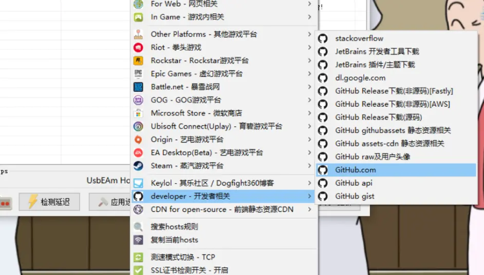
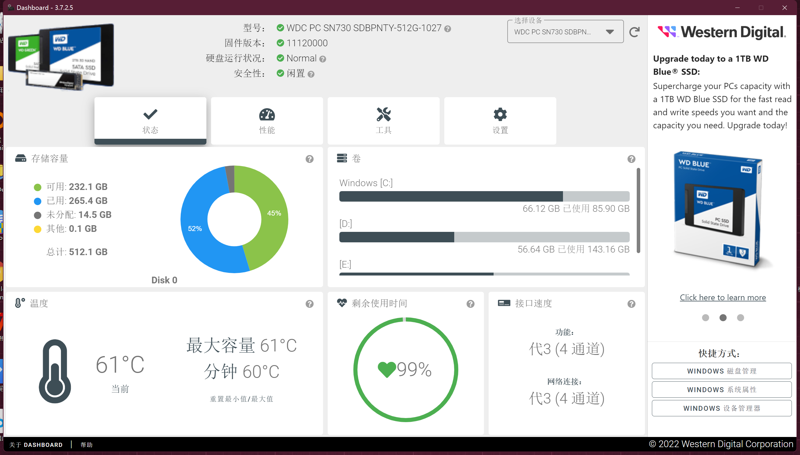
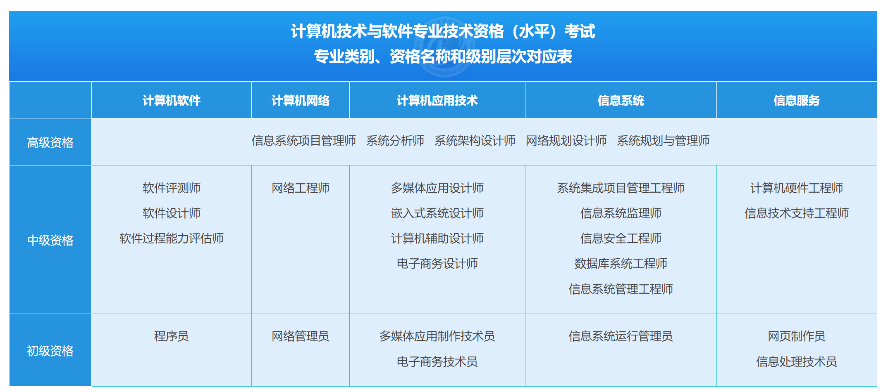

# 1.生活

## 电脑

### 虚拟机

```text
虚拟机： Oracle VM VirtualBox
  centos-node1、centos-node2、centos-node3
  网络为： 	桥接模式      固定IP
  OS：		centos 7.9 mini版
  账户： 	root  		zx
  ssh：		192.168.3.51:22、192.168.3.52:22、192.168.3.53:22
  yum源：    清华镜像源：https://mirrors.cnnic.cn/help/centos/  修改之后执行：yum clean all ， 再执行：yum makecache

目录结构
data
  |_java      # 安装Java相关软件
  |_python    # 安装python相关软件
  |_golang    # 安装golang相关软件
    |workspace    # golang源码开发工作空间
  |_soft      # 安装其他相关软件
  |_app       # 运行自己的编写的应用
  |_temp      # 临时文件
  |_docker    # docker 应用安装目录

java：   安装路径:	/data/java/jdk1.8     openJdk1.8    环境变量：全局
python： 安装路径:	/data/python/python3  python3.10.9  环境变量：全局
golang： 安装路径:	/data/golang/go1.20   go1.20        环境变量：全局

docker【开机自动自动】版本: 20.10.22
  启动：       sudo systemctl start docker
  停止：       sudo systemctl stop docker
  日志：       sudo docker logs -f 容器名字

mysql【docker部署】
docker run -p 3306:3306 --name mysql --privileged=true \
  -v /data/docker/mysql/conf:/etc/mysql/conf.d \
  -v /data/docker/mysql/logs:/var/log/mysql \
  -v /data/docker/mysql/data:/var/lib/mysql \
  -v /etc/localtime:/etc/localtime \
  -v /etc/timezone:/etc/timezone \
  -e MYSQL_ROOT_PASSWORD=root \
  mysql:5.7 --character-set-server=utf8mb4 --collation-server=utf8mb4_unicode_ci
  
  配置文件：/data/docker/mysql/conf/my.conf
  sudo docker exec -it mysql /bin/bash
  mysql -h192.168.3.51 -P3306 -uroot -proot
	
redis【docker部署】需要先下载redis把配置文件复制到目录中。
	docker run -it --name myredis -p 6379:6379 --privileged=true --restart=always \
	-v /data/docker/redis/data/:/data \
	-v /data/docker/redis/redis.conf:/etc/redis/redis.conf \
	redis:6.2 redis-server /etc/redis/redis.conf --requirepass "pwd123"
	启动：   docker start myredis
	控制台： docker exec -it myredis redis-cli

portainer【docker部署】
	docker run -p 9000:9000 --restart=always \
	-v /data/docker/portainer/docker.sock:/var/run/docker.sock \
	--name prtainer-test docker.io/portainer/portainer
	admin  123456789
	http://192.168.3.51:9000/#/home

yearning
	安装： 	/usr/local/java/yearning
	启动:	./Yearning run
	用户名: admin    密码:Yearning_admin

sysbench【命令安装】

gitlab【docker部署】
    docker run  -itd -p 9980:80  -p 9922:22 \
        -v /data/docker/gitlab/etc/gitlab:/etc/gitlab \
        -v /data/docker/gitlab/var/log/gitlab:/var/log/gitlab \
        -v /data/docker/gitlab/var/opt/gitlab:/var/opt/gitlab \
        --restart=no \
        --privileged=true \
        --name gitlab \
        gitlab/gitlab-ce
    地址：http://192.168.3.51:9980/        root/dX6hfBEAqU5eK9h
  
jenkins【docker部署】  
    docker run -uroot -p 9095:8080 -p 50000:50000 --name jenkins \
        -v /data/docker/jenkins/var/jenkins_home:/var/jenkins_home \
        -v /etc/localtime:/etc/localtime \
        -v /data/java/apache-maven-3.8.6:/usr/local/maven \
        -v /data/java/jdk1.8:/usr/local/jdk \
        -e JENKINS_UC=https://mirrors.cloud.tencent.com/jenkins \
        -e JENKINS_UC_DOWNLOAD=https://mirrors.cloud.tencent.com/jenkins \
        --restart=no \
        --privileged=true \
        jenkins/jenkins:lts
  
    地址：http://192.168.3.51:9095/   root/root
    插件： git parameter【用于操作git 分支和读取】、publish over ssh【用于执行ssh命令】

docker compose【本地安装】
  下载：curl -L https://get.daocloud.io/docker/compose/releases/download/v2.4.1/docker-compose-`uname -s`-`uname -m` > /usr/local/bin/docker-compose
  将可执行权限应用于二进制文件：sudo chmod +x /usr/local/bin/docker-compose  
  创建软链： sudo ln -s /usr/local/bin/docker-compose /usr/bin/docker-compose
  查看版本：docker-compose version
  
harbor【本地安装】
  停止harbor: docker-compose stop
  启动harbor: docker-compose up -d
  
  登录：docker login -u admin -p Harbor12345 192.168.3.51:9010
  创建镜像：docker tag 1319b1eaa0b7 192.168.3.51:9010/public/myredis:1.0
  构建镜像：
  docker build -t public/my_project:1.0 /usr/local/data
  docker rm -f my_project
  docker run -p 8080:8080 --name=my_project public/my_project:1.0

nginx【本地安装】  
  安装路径： /data/soft/nginx/    版本：1.22.1
  
apache benchmark【本地安装】 
  命令行安装：yum -y install httpd-tools
  
Lua【本地安装】  
  安装路径： /usr/local/LuaJIT    版本：2.1.   resty优化版
  依赖库安装路径： /usr/local/lua_core  

1panel【本地安装】
  安装路径：   /data/golang/1panel
  访问地址：  http://192.168.3.51:13237/59df3e9375
  访问地址：  http://192.168.3.52:20555/5f4c564f95
  访问地址：  http://192.168.3.53:38264/dd90137e3f
  账号密码：   zhangxue/zhangxue  忘记的话可以到服务器执行：1pctl user-info 查看

hertzbeat【docker】
  docker run -p 1157:1157 --name hertzbeat tancloud/hertzbeat
  http://192.168.3.51:1157  admin/hertzbeat
  
eureka
  安装路径：   /data/app/
  启动命令：nohup java -Xms128m -Xmx128m -jar eureka.jar --spring.profiles.active=s1  > eureka.log 2>&1 &
  集群：  3.51:9001,3.52:9001,3.53:9001
  
haproxy  【本地安装】单机版
  安装路径： /data/soft/haproxy     版本：2.6.25
  启动：  ./sbin/haproxy -f /data/soft/haproxy/conf/haproxy.cfg
  关闭：	killall -9 haproxy 
  平滑重启： ./sbin/haproxy -f  /data/soft/haproxy/conf/haproxy.cfg -st `cat /data/soft/haproxy/logs/haproxy.pid`
  监控地址：http://192.168.3.51:9188/haproxy-status    账号密码：admin:admin~!@
```

### 上网

#### 加速Github

- 镜像网站：也就拿来访问下，千万不要登录，密码可能被盗。
- 加速器：
  - 加速器，收费的很多。比如LetsVPN等，千万不要自己搭建代理。
  - Watt Toolkit。开源游戏的加速器，支持一些技术网站的加速。[https://steampp.net](https://steampp.net)。
  - 使用过程可能会异常：SSL certificate problem: unable to get local issuer certificate。
  - 执行命令即可。 `  git config --global http.sslVerify false `
- 修改本地hosts：

  - 本地host加速大全，对各类网站进行一键host修改加速。[https://www.dogfight360.com/blog/475/](https://www.dogfight360.com/blog/475/)
    
  - 自己修改host

  1. 访问https://www.ipaddress.com，输入www.github.com。获得ip地址，比如 140.82.112.3
  2. 修改host文件。windows 在 C:\Windows\System32\drivers\etc，Linux 在 /etc/hosts。批量修改下面的IP即可

注意： 如果还是不能ping通，或者能ping通但是网站还是超时:

1. 在cmd中输入ipconfig/flushdns刷新dns
2. 检查hosts文件中有没有有关github的注释掉。

#### v2rayN

- 开源，教程；[https://github.com/freefq/tutorials](https://github.com/freefq/tutorials)
- 官网: [https://v2rayn.org/](https://v2rayn.org/)
- 下载地址：https://github.com/2dust/v2rayN/releases/download/3.23/v2rayN-Core.zip
- 配置服务器：[https://github.com/freefq/free](https://github.com/freefq/free)

#### 其他
- VPN推荐[https://www.vpnool.com/bestvpn/free/](https://www.vpnool.com/bestvpn/free/)
- [https://github.com/githubvpn007/ClashX](https://github.com/githubvpn007/ClashX)
- [clash/ss/ssr/v2ray/trojan的区别](https://github.com/githubvpn007/proxy)
- [Green-Hub](https://github.com/ghotst0xdeadbeef/Green-Hub-Proxy)
- [阿里云公共DNS](https://www.alidns.com)

### host配置

```text
# 本地模拟eureka集群
127.0.0.1 www.eureka1.com
127.0.0.1 www.eureka2.com
127.0.0.1 www.eureka3.com 

# 本地服务
127.0.0.1 www.zhangxue.com
```

### 镜像地址

```text
1.开源软件镜像
【推荐】清华镜像：https://mirrors.cnnic.cn/
阿里开源镜像： https://developer.aliyun.com/mirror/
中国科学技术大学 http://mirrors.ustc.edu.cn/
北京理工大学  http://mirror.bit.edu.cn/
大连东软信息学院  http://mirrors.neusoft.edu.cn
```

### 华为笔记本

- 购买时间：2020-09-24
- 基本信息

```text
电脑型号: 华为 MACHC-WAX9 笔记本电脑
操作系统: Windows 10 64位

处理器: 英特尔 Core i7-10510U @ 1.80GHz 四核八线程
主板: 华为 MACHC-WAX9-PCB
内存: 16 GB ( 三星 LPDDR3 2133MHz )
主硬盘: 西数 WDC PC SN730 SDBPNTY-512G-1027 ( 512 GB / 固态硬盘 )
显卡: Nvidia GeForce MX250 ( 2 GB )
显示器: TLX1388 ( 14 英寸  )
声卡: 瑞昱 High Definition Audio @ 英特尔 英特尔智音技术音频控制器
网卡: 英特尔 Wireless-AC 9560 160MHz
```

- 硬盘寿命
  - 2022-09-24



## 导航
```shell
# 搞学习
  TED（最优质的演讲）：https://www.ted.com/
  谷粉学术：https://gfsoso.99lb.net/scholar.html
  大学资源网：http://www.dxzy163.com/
  简答题：http://www.jiandati.com/
  网易公开课：https://open.163.com/ted/
  网易云课堂：https://study.163.com/
  中国大学MOOC：www.icourse163.org
  哔哩哔哩弹幕网：www.bilibili.com
  我要自学网：www.51zxw.net
  知乎：www.zhihu.com
  学堂在线：www.xuetangx.com
  爱课程：www.icourses.cn
  猫咪论文：https://lunwen.im/
  iData（论文搜索）：www.cn-ki.net
  文泉考试：https://www.wqkaoshi.com
  CSDN：https://www.csdn.net/

# 找书籍
  熊猫搜索:https://xmsoushu.com/index.html#/
  书栈网（极力推荐）：https://www.bookstack.cn/
  码农之家（计算机电子书下载）：www.xz577.com
  鸠摩搜书：www.jiumodiary.com
  云海电子图书馆：www.pdfbook.cn
  周读（书籍搜索）：ireadweek.com
  知轩藏书：http://www.zxcs.me/
  脚本之家电子书下载：https://www.jb51.net/books/
  搜书VIP-电子书搜索：http://www.soshuvip.com/all.html
  书格（在线古籍图书馆）：https://new.shuge.org/
  caj云阅读：http://cajviewer.cnki.net/cajcloud/
  必看网（人生必看的书籍）：https://www.biikan.com/

# 冷知识 / 黑科技
  上班摸鱼必备（假装电脑系统升级）：http://fakeupdate.net/
  PIECES 拼图（30 个 CSS 碎片进行拼图，呈现 30 种濒临灭绝的动物）：http://www.species-in-pieces.com/
  图片立体像素画：https://pissang.github.io/voxelize-image/
  福利单词（一个不太正经的背单词网站）：http://dict.ftqq.com
  查无此人（刷新网站，展现一张AI 生成的人脸照片）：https://thispersondoesnotexist.com/
  在线制作地图图例：https://mapchart.net/
  创意光线绘画：http://weavesilk.com/
  星系观察：https://stellarium-web.org/
  煎蛋：http://jandan.net/
  渣男-说话的艺术：https://lovelive.tools/
  全历史：https://www.allhistory.com/
  iData：https://www.cn-ki.net/
  术语在线：http://www.termonline.cn/

# 写代码
  GitHub：https://github.com/
  码云：https://gitee.com/
  源码之家：https://www.mycodes.net/
  JSON to Dart：https://javiercbk.github.io/json_to_dart/
  Json在线解析验证：https://www.json.cn/
  在线接口测试（Getman）：https://getman.cn/

# 资源搜索
  DogeDoge搜索引擎：www.dogedoge.com
  秘迹搜索：https://mijisou.com/
  小白盘：https://www.xiaobaipan.com/
  云盘精灵（资源搜索）：www.yunpanjingling.com
  虫部落（资源搜索）：www.chongbuluo.com
  如风搜（资源搜索）：http://www.rufengso.net/
  爱扒：https://www.zyboe.com/

# 小工具
  奶牛快传（在线传输文件利器）：cowtransfer.com
  文叔叔（大文件传输，不限速）：https://www.wenshushu.cn/
  云端超级应用空间（PS，PPT，Excel，Ai）：https://uzer.me/
  香当网（年终总结，个人简历，事迹材料，租赁合同，演讲稿）：https://www.xiangdang.net/
  二维码生成：https://cli.im/
  熵数（图表制作，数据可视化）：https://dydata.io/appv2/#/pages/index/home
  拷贝兔：https://cp.anyknew.com/
  图片无限变放大：http://bigjpg.com/zh
  幕布（在线大纲笔记工具）：mubu.com
  在线转换器（在线转换器转换任何测量单位）：https://zh.justcnw.com/
  调查问卷制作：https://www.wenjuan.com/
  果核剥壳（软件下载）：https://www.ghpym.com/
  软件下载：https://www.unyoo.com/
  MSDN我告诉你（windows10系统镜像下载）：https://msdn.itellyou.cn/
  极简插件-浏览器：https://chrome.zzzmh.cn/#/index
  极简壁纸：https://bz.zzzmh.cn/index
  
# 导航页（工具集）
  世界各国网址大全：http://www.world68.com/
  小森林导航：http://www.xsldh6.com/
  简捷工具：http://www.shulijp.com/
  NiceTool.net 好工具网：http://www.nicetool.net/
  现实君工具箱（综合型在线工具集成网站）：http://tool.uixsj.cn/
  蓝调网站：http://lcoc.top/
  偷渡鱼：https://touduyu.com/
  牛导航：http://www.ziliao6.com/
  小呆导航：https://www.webjike.com/index.html
  简法主页：http://www.jianfast.com/
  KIM主页：https://kim.plopco.com/
  聚BT：https://jubt.net/cn/index.html
  精准云工具合集：https://jingzhunyun.com/
  兔2工具合集：https://www.tool2.cn/
  爱资料工具（在线实用工具集合）：www.toolnb.com
  工具导航：https://hao.logosc.cn/

# 看视频
  阿木影视：https://www.aosk.online/
  电影推荐（分类别致）：http://www.mvcat.com
  APP影院：https://app.movie
  动漫视频网：http://www.zzzfun.com/
  NO视频官网：http://www.novipnoad.com/
  大数据导航：http://hao.199it.com/
  VideoFk解析视频：http://www.videofk.com/

# 学设计
  码力全开（产品/设计师/独立开发者的资源库）：https://www.maliquankai.com/designnav/
  免费音频素材：https://icons8.cn/music
  新CG儿（视频素材模板，无水印+免费下载）：https://www.newcger.com/
  Iconfont（阿里巴巴矢量图标库）：https://www.iconfont.cn/
  小图标下载：https://www.easyicon.net/
  Flight Icon：https://www.flighticon.co/
  第一字体转换器：http://www.diyiziti.com/
  doyoudosh（平面设计）：www.doyoudo.com
  企业宣传视频在线制作：https://duomu.tv/
  MAKE海报设计官网：http://maka.im/
  一键海报神器：www.logosc.cn/photo/utm_source=hao.logosc.cn&utm_medium=referral
  字由（字体设计）：http://www.hellofont.cn/
  查字体网站：https://fonts.safe.360.cn/
  爱给网（免费素材下载的网站，包括音效、配乐，3D、视频、游戏，平面、教程）：http://www.aigei.com/
  在线视频剪辑：https://bilibili.clipchamp.com/editor

# 搞文档
  即书（在线制作PPT）：https://www.keysuper.com/
  PDF处理：https://smallpdf.com/cn
  PDF处理：https://www.ilovepdf.com/zh-cn
  PDF处理：https://www.pdfpai.com/
  PDF处理：https://www.hipdf.cn/
  图片压缩，PDF处理：https://docsmall.com/
  腾讯文档（在线协作编辑和管理文档）：docs.qq.com
  ProcessOn（在线协作制作结构图）：www.processon.com
  iLovePDF（在线转换PDF利器）：www.ilovepdf.com
  PPT在线制作：https://www.woodo.cn/
  PDF24工具（pdf处理工具）：https://tools.pdf24.org/en
  IMGBOT（在线图片处理）：www.imgbot.ai
  福昕云编辑（在线编辑PDF）：edit.foxitcloud.cn
  TinyPNG（在线压缩图片）：tinypng.com
  UZER.ME（在线使用各种大应用，在线使用CAD，MATLAB，Office三件套）：uzer.me
  优品PPT（模板下载）：http://www.ypppt.com/
  第一PPT（模板下载）：http://www.1ppt.com/xiazai/
  三顿PPT导航：sandunppt.com
  Excel函数表：https://support.office.com/zh-cn/office/excel-函数-按字母顺序-b3944572-255d-4efb-bb96-c6d90033e188

# 找图片
  https://unsplash.com/
  https://pixabay.com/
  https://www.pexels.com/
  https://visualhunt.com/
  https://www.ssyer.com/
  http://lcoc.top/bizhi/
  彼岸图网：http://pic.netbian.com/
  极像素（超高清大图）：https://www.sigoo.com/
  免费版权图片搜索：https://www.logosc.cn/so/
  
# AI
  1.clipdrop：https://clipdrop.co/
  2.fabrie：https://www.fabrie.cn/home
  3.motiongo：https://motion.yoo-ai.com/
  4.百职帮数据分析：https://np.baicizhan.com
  5.好说AI：https://www.haoshuo.com/download
  6.Englishgoai：https://englishgoai.com
  7.Claude：https://www.anthropic.com/product 
```

## 生活

### 1、落户

#### 天津落户

https://mp.weixin.qq.com/s/NEOYjoYWsrCSgAUZ27cUnQ

https://mp.weixin.qq.com/s/SIMOYdpIB6Rr_auLVhp4iw

关注微信公众号《天津公安民生服务平台》，进入服务中最大的图标就是 人才落户

目前滨海人才计划还在收纳

#### 北京落户

积分落户计算器：http://m.bj.bendibao.com/cyfw/jifenruhujisuanqi.php

大前提：在北京连续7年社保，北京有房

### 2、养老

外地户籍如何领取北京的养老金？

网上一搜一大把，都是基础条件。除此之外还有哪些硬性条件？

1. 男50，女40前必选在北京开户缴费。超过这个年龄的在北京只能使用临时基础养老保险缴费账户（非常坑）
2. 有用人单位的，退休由用人单位提交申请。 没有单位的，可以个人提交申请，但是需要通过街道办事处或者公共人力资源中心受理，但是条件非常苛刻。
   在北京没有房子的不会受理的，无法申请在北京退休。

### 3、医保

北京退休后的医保条件与养老条件不同，男性25年，女性慢20年，但是可以一次性补缴满。

### 4、保险

> 1.一个家庭中，谁最应该买保险？

家庭经济支柱 -> 配偶 -> 小孩 -> 老人

> 2.如何选择险种

为家庭成员配置的保险，大致可以分为人寿保险、健康保险、意外伤害保险三类。
- 家庭经济支柱与配偶：意外险、百万医疗险、重疾险、寿险
- 父母长辈：意外险、医疗险
- 小孩：意外险、医疗险、重疾险。但孩子的一生很长，为孩子配置保险，需要根据时间推移和收入变化做动态调整会更明智。

> 3.险种解释

- 意外险
  - 作用：在保期间，被保险人因意外伤害导致残疾或死亡，保险公司将按照合同约定给付保险金。
  - 费用：小几百元/年。有年龄限制，高年龄需要买特定的意外险。
  - 保障时间：属于定期保险，通常是一年一签，到期后续约就行。
  - 保障范围：通常包括交通事故、意外摔倒、意外触电等各种非疾病导致的突发伤害事件。
  - 坑：通常情况运动、游乐园产生的意外不保；意外发生地在地面以上不保(比如从桥上摔下)
- 百万医疗险
  - 作用：在保期间，报销被保险人因疾病或意外伤害产生医疗费用。
  - 费用：每年1000左右。年龄越大保费越高，通常高年龄不可购买或者非常贵。
  - 保障时间：属于定期保险，通常是一年一签，到期后续约就行。
  - 保障范围：根据具体的保险条例规定
  - 坑：外药通常不报销。
- 重疾险
  - 作用：在保期间，一次性赔付规定的费用。保障重疾之后，手上有额外的钱可以生活，或者应对后续持续的治疗。
  - 费用：通过分为终生和定期
    - 定期：20/30年，根据保额的大小，保费一般是1K/年(10万保额)、1.5K/年(20万保额)、2K/年(30万保额)等等。
    - 终生：交保费时间为20/30年，之后就不用交保费了。保费通常比定期高很多。
  - 保障范围：这些重大疾病通常包括癌症、心脏病、中风等
  - 坑：
- 寿险：
  - 作用：如果被保险人在保险期间内因疾病或意外导致身故。为家庭提供经济来源
  - 费用：通过分为终生、定期。保费50~几百万不等。保费是否返回等条件。最少500/年，高则上万元


> 4.购买原则

1. 趁早买：越早买，保费月便宜。
2. 重疾险和寿险买消费性，不要买返回型和捆绑型
3. 优先选择最长的缴费时间，降低缴费压力，延迟保障时间。

### 5.社保

社保非常重要，尤其在北京天津上海等地，影响个人和家庭的购房、车牌摇号、小孩上学等诸多问题。

社保分类如下：
1. 城乡居民社会保险。
   - 参保对象：面向城镇居民、农民、学生、儿童、城乡老年人等没有工作单位的人群。
   - 缴纳险种：一般是居民医疗保险和居民养老保险两险。
   - 缴费方式与频率：自愿参保，按年缴费，一年一交，一年保一年，一般有固定的缴费时间。
   - 缴费基数与比例：居民医保每年大概 300-400 元左右，居民养老一般每年大概 1000 元起，缴费档次较多，可根据自身经济状况选择，政府会根据缴费档次给予相应补贴。
   - 养老待遇:男女各满 60 周岁，以后大概率延迟5年。
   - 医疗待遇：居民医保报销比例一般为 50% 左右。通常不报销门诊，只报销住院和特殊疾病。没有终身医保报销待遇，即当年缴费当年享受，不缴费则待遇停止。
   - 生育待遇：居民社保目前很多城市将医保与生育保险合并，能报销部分生娃费用，但没有生育津贴。
2. 城镇职工社会保险。
   - 参保对象：是与公司签订正式劳动合同的在职员工
   - 缴纳险种：即 “五险一金”，包含医疗保险、生育保险、养老保险、失业保险、工伤保险和公积金。
   - 缴费方式与频率：由单位强制缴纳，每月扣缴一次，如果因为公司原因断交，公司有义务补缴。
   - 缴费基数与比例：缴费基数也是社平工资的 60%-300%，由单位和个人共同缴纳。一般来说，医疗保险个人交 2%，公司交 10%；养老保险个人交 8%，公司交 20%；
      失业保险个人交 1%，公司交 2%；生育保险个人不用出钱，公司交 0.8%；工伤保险个人不用出钱，公司交 0.2%-1.4%。
   - 养老待遇：职工社保领取养老金一般要求男职工 60 周岁，女干部 55 周岁，女职工 50 周岁。目前正在逐步延迟退休年龄，预计到 2053 年前后，男性达到 65 岁，女性达到 60 岁。
   - 医疗待遇：门诊报销比例较高，每年超过1780元的部分，报销比例70~80以上。达到法定退休年龄退休后，医保待遇可终身享受
   - 生育待遇：职工社保能报销生娃费用，还能领生育津贴
3. 灵活就业人员社会保险。
   - 参保对象：包括个体经营、非全日制以及新就业形态等的从业人员，如自由职业者、个体工商户、开店开公司的创业者等。
   - 缴纳险种：通常是医疗保险和养老保险两险
   - 缴费方式与频率：自主登记，自愿缴纳，可选择按月、季、半年、年等方式缴费，一般每月一交。
   - 缴费基数与比例：缴费基数一般是社平工资的 60%-300%，缴费比例一般为 20%，费用全部由个人承担。
   - 养老待遇:等同于城镇职工社会保险
   - 医疗待遇：灵活就业社保报销待遇等同于职工医保
   - 生育待遇：灵活就业社保一般能报销生娃费用，但生育津贴通常领不了

总结：居民社保，缴费低，待遇也低。职工社保就非常全面。
灵活就业社保，养老和医疗待遇等同职工，但是社保费用几乎全都进入统筹账户，无法退回个人部分。
且灵活就业目前只能在户籍地缴纳（以后可能会放开）。

## 软考

- 报考地址： [https://www.ruankao.org.cn/](https://www.ruankao.org.cn/)
- [软考的报名条件是什么？](https://www.zhihu.com/question/391119536/answer/3166749191)

报考职位


程序员相关的
- 中级：软件设计师
- 高级：系统架构设计师

- 上半年：报名时间3月底，考试时间5月底
- 下半年：报名时间9月初，考试时间11月初

好处
1. 积分落户，增加积分【北京待确认】
2. 直接获得中级职称
3. 入专家库、多领退休金等
4. 抵扣个税


## 收入

工资计算器： [https://www.xinrenxinshi.com/calculator](https://www.xinrenxinshi.com/calculator)


## 个体工商

非京籍自己交社保基本流程。开网店->申请工商执照->交社保->报税。

当然自己开店也可以这样。

### 工商登记

1. 北京居住证申领。微信小程序“京通”中搜索“居住证申领”，成功后，可在“京通”小程序-->亮证中查看，一般需要2-3个工作日；
    - 前提：有北京固定居住地址（买房、或者租房需要有上传合同）、有交社保的公司。
2. 网店开店证明获取。淘宝APP搜索“开店”，0元开店（无押金），店铺类型选个人，成功后有一个开店证明（注册个体工商户必须的），PDF格式；
3. 个体工商户营业执照申办。“北京E窗通”网站申请，“个人身份”登录，选“个体工商户开办”，照着指引填写信息即可（需要的材料：北京市居住证+网店开店证明）
    - 北京E窗通：https://ect.scjgj.beijing.gov.cn/
4. 社保增员。第3步完成审核后，会有电子营业执照，然后【北京市社会保险网上服务平台】用单位法人身份登录，在职职工管理中办理零星增员。
    - 默认密码123456。北京市社会保险网上服务平台：https://fuwu.rsj.beijing.gov.cn/zhrs/yltc/yltc-home
5. 税务登记。
   - 北京市电子税务局官网上完成两证合一，完成税务登记，才能交社保和报税。
   - 北京市电子税务局官网-右上角【登录】--右侧【其他功能】--两证整合个体工商户信息确认--正确填写相关信息后，点击右上角【我要开始办理】；

### 缴纳社保与缴费工资
1. 社保业务-缴费工资申报。【自交缴费用的，只申报一次就行】
   - 增员完成，次月缴费，当月10日起可向税务部门申报缴费工资。国家税务局北京电子税务局：https://etax.beijing.chinatax.gov.cn:8443/
   - 法人身份登录【国家税务局北京电子税务局】->地方特色->社保业务->年度缴费工资调整->添加个人缴费工资信息后，保存提交申报。
2. 社保费申报【月度】
   - 每月10号~25号申报缴纳上个月的社保费用，比如2月20日，缴纳1月份的社保；
   - 法人身份登录【国家税务局北京电子税务局】->地方特色->社保业务->社保费申报->日常申报
   - 第一次缴费时，有人工录入账户信息：输入用于缴费的个人银行卡信息，然后有“银行端查询缴费凭证”，把这个凭证保存下下来，银行端缴费时需提供。
3. 社保费缴纳。我用的招商银行，登录招商银行APP->搜索“缴税通”->进入完成授权，然后输入银行端查询缴费凭证中对应的三个信息，按引导付款即完成缴纳。
4. 社保费申报【年度，不重要】就是每年6~7月调整缴费基数。一年只能申报一次。[2种方式帮您完成社保费年度缴费工资申报](https://mp.weixin.qq.com/s/xtkCnEYnuYuAjcwGM6xydg)

### 报税


每季度报税。每年1、4、7、10月的1号~15号完成季度税务申报，个体户没有实际交易额，不产生税费，所以是0申报，0申报也必须申报的，不报要罚款。

1. 增值税及附加税费申报（小规模纳税人） 。在北京市电子税务局官网办理：https://etax.beijing.chinatax.gov.cn:8443/
    - 操作路径：以法人身份（用电子营业执照刷码）登录电子税务局，在“我的待办”中有“增值税及附加税费申报（小规模纳税人）”这么一条信息，
        直接点击“填写申报表”，按照指引填写必须的信息，提交0申报即可。每年1、4、7、10月的1号~15号完成申报。
    - 如果找不到我的待办，可以从菜单“我要办税”->"税费申报及缴纳"->“增值税及附加税费申报（小规模纳税人）”找到。
2. 经营所得申报。在自然人电子税务局办理：https://etax.chinatax.gov.cn/
   - 具体操作： 使用个人所得税APP扫码登录后，进入“我要办税”菜单。其中：
   - 【1】经营所得申报->经营所得（A表）：每年1、4、7、10月的1号~15号完成申报；
   - 【2】经营所得申报->经营所得（B表）：每年3月31日前申报上一年度的，A表申报完了才能申报B表，否则会出错误提示。 

年度报税。每年3月31号前完成经营所得年度申报。个体工商户即便没有交易流水，也必须完成以上申报，否则未来会被税务部门罚款。
上述：经营所得申报->经营所得（B表）就是年度报税。

工商年报。国家企业信用信息公示系统。教程：https://baijiahao.baidu.com/s?id=1802286092480350058
每年1~6年上报就行。否则被列入“经营异常”名单，超过3年，影响招投标、信贷、行业资质评定。

### 我的报税
每月10号检查。
1. 社保费申报。国家税务局北京电子税务局：https://etax.beijing.chinatax.gov.cn:8443/
法人身份登录【国家税务局北京电子税务局】->地方特色->社保业务->社保费申报->日常申报
2. 增值税及附加税费申报（小规模纳税人） 。在北京市电子税务局官网办理：https://etax.beijing.chinatax.gov.cn:8443/
   我的待办 或者 菜单“我要办税”->"税费申报及缴纳"->“增值税及附加税费申报（小规模纳税人）”找到，提交0申报即可。
3. 经营所得申报。在自然人电子税务局办理：https://etax.chinatax.gov.cn/
   使用个人所得税APP扫码登录后，进入“我要办税”菜单。经营所得申报->经营所得（A表）：每年1、4、7、10月的1号~15号完成申报；
   统一社会信用代码：	92110106MAED5W965C
4. 经营所得申报->经营所得（B表）：每年3月31日前申报上一年度的，A表申报完了才能申报B表，否则会出错误提示。 
5. 工商年报。国家企业信用信息公示系统 每年1~6年上报就行。


