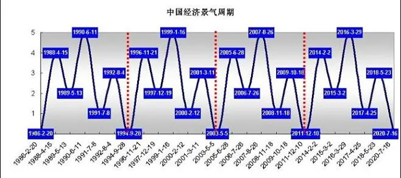

# 2.各种总结

## 告诫自己
```text
矛盾激化,矛盾转移,矛盾分摊
因人成事，因事修人
不要妥协、不要比差、不要刻意合、不要在宿舍学习、要开始做、凡事预则立，不预则废、不要啥证都考、学好英语、不要假装努力、不要怕和别人一样、不要讨好别人、照顾好身体、对抗天性、多读书、深入学习、细化目标
子贡赎人：不要用自己的私德，强行规范别人的公德。
希望来源于感觉到努力会有回报
李国庆:上辈子杀人造孽，这辈子配偶创业
如果你眼中只看一团糟，那你的世界只有一团糟
三体-叶文杰：人性看不到拯救、只能看到毁灭
一朝天子一朝臣。
不要因为过度忙碌而失去了思考和规划的时间
《黑天鹅》的作者塔勒布有一句话广为流传：“世界上有三种最有害的成瘾性物质：海洛因、碳水化合物、每月发一次的工资。”
希望工程只是极少数人的希望，剩下人只有绝望。
《富有的习惯》。阅读、有氧运动、远离负能量、支持梦想、早起、多重收入、人生态度、不盲从、反思
GM制定游戏规则，偏向富有，割向贫瘠。体验不好富有会跑，贫瘠的跑不掉。GM调整游戏规则，想是留下富有，目的是不崩盘，不忘初心。
工作不是获得回报，而是提供价值，满足他人需要，汇报是附加产物，包括金钱，影响力，信用，声誉，流量等
```

## 感悟
```text
人生最有价值的知识主次及比例
①预防人生意外事故、研究透彻各种不良习气危害并避之，学会休息，预防运动损伤，健体使身体稳固不易损伤的知识（60％）；
②上好学，培养傍身技能，记住稀缺是精髓，社会正常运行必要的职业，生活刚需手艺活，专研透了，也能养你一辈子（30％）；
③怎么教育子女，做好社会角色分工（8％）；
④艺术素养 乐器、绘画、舞蹈等（2％）。
健康活着，持续健康活着，持续幸福健康活着。起步的迟没关系，只要跑的越久，就跑的越远。
清醒的头脑，健全的四肢，充实的肠胃，是每天要核查和保持的。
保持健康，生活便进可攻，退可守。
凡事三思:思危、思退、思变。
警惕贪（对于喜好的过于偏执）、嗔（对于讨厌的反应过激）、痴（对不明事理表现贪与嗔的反应），一旦发作，让人失去驾驭人生大局的基本理智。
这个社会需要有真实能力的人去做事
这个世界健康其实才是最稀缺的东西

充分准备
①最好一辈子不沾酒，醉酒、喝酒不爬高，醉了一定要找低矮床铺侧卧休息。
②膝关节是人体最复杂的关节，一定不要损伤，因为最复杂，一旦损伤，修复也是最难的。保护膝盖知识。
③健身体成习惯，心平静，充分热身，量力而行，场地光线充足安全无障碍。
④我们成长中，各种原因原生环境，思想上行为上或多或少都背负着那么一些歪理邪说成分，长大了，要懂得筛查找出，不然它就好比一颗雷，谁知道那天触发了它就炸了。
⑤终生要思考追求的话题:这个世界的真实面貌是什么样的，事实是什么；生存能力中判断力高于一切，只有真实客观的判断才能做出正确的选择，什么是好。
⑥远离极度自私垃圾人，远离以权力背景压人的人，若不可避免，至少与他们相处时，一定要思危，嗅到不对，及时跑路，退到安全的地方，以逸待劳，思考应对。
⑦身材管理，体重/身高平方≤23kg/m²

推荐
叔本华的《人生的智慧》，梁应林《人生意外800鉴》，杨渝平《运动损伤那些事》 ，北泽杏子《讨厌!喝酒好可怕》 
预防疾病
病毒肝炎（疫苗）、艾滋病（洁身）、肺结核（健身营养）、膝关节半月板撕裂（软骨损伤不可再生）、椎间盘突出、老人股骨头骨折（老人死亡骨折）尘肺（呼衰），脊髓损伤、脑梗偏瘫（生活不能自理），狂犬病（高死亡率），乱吃药肝肾中毒。
出门看天气防雷电溺水、高空坠物、车祸、踩空、滑倒。
健康是为了生命充分绽放。
早意识到这些，生活中主动避免。
```

## 管理
```text
自己下属能力很强，但是由于公司或者团队内部没有晋升的空间了，为了稳住员工，可以设置下有名无实的tile。最好的例子就是阿里MVP，腾讯TVP。
按照彼得原理，人在晋升到一定程度时一定会遇到自己无法胜任的位置。这个时候需要我们自己能够打破职业认知。比如P6升P7，就不是单独自己一人完成某些任务，而是自己组织，推动。寻找如何实现团队价值，如何完成部门目标。

底层管理：
    对上，你需要理解领导的意图，考虑每一件事的核心目标、资源和风险；
    对下，你要拆解目标，让团队小伙伴形成一股合力，心甘情愿去朝着目标努力

评价一个管理者的好坏，从来不是看下属的评价，而是看最终实现的成绩。

管理工具：    
    OKR工作法：作用是上下级制定一致的目标。
    业务计划推进表：每件事落实到具体的人和时间。
    GRAI、ORID：复盘法，总结出有效的经验，减少犯错的可能。
    
别人家的技术leader是如何建设团队、管理人员、沟通工作的？https://mp.weixin.qq.com/s/DlsC4l6KuMXZHVp1svy-8A   
```

## 经济

```text
现金流：
现金流是指企业或个人在一定时间内所收到和支付的现金的净额。它反映了企业或个人的现金收支状况，是衡量企业或个人偿债能力和经营状况的重要指标。
1. 对一个公司。现金流状况反映了企业的经营状况和财务健康程度。如果企业的现金流量持续为负，就会导致企业无法偿还债务、支付员工工资、采购原材料等，最终可能导致企业破产。
因此，企业需要密切关注自己的现金流状况，及时采取措施来提高现金流量，如提高销售额、降低成本、改善库存管理等。
同时，企业也需要合理规划自己的现金流，确保有足够的现金储备来应对突发事件和未来的发展需求。
2. 对于国家。国家的财政状况和经济发展水平都与现金流密切相关。国家的税收、政府支出和债务等都会影响国家的现金流状况。
同时，国家也需要通过各种手段来维护和促进国内的现金流，包括鼓励投资、提高消费水平等。因此，现金流对于国家的经济稳定和发展具有重要的意义。
```


## 学习
```text
熔断读书法。就是读书时一旦看到有启发或是有疑问的地方，马上熔断掉，停下来，然后开始记录或追问。
https://m.douban.com/book/review/14812026/

费曼学习法
```

## 外快
```text
1. 猎头
```

## 商业
```text
阿里投资的公司大多倒闭、被行业边缘化，而腾讯投资的公司大多越干越强。

```

## 产品
```text
5W2H分析法又叫七问分析法，创于二战中美国陆军兵器修理部。简单、方便，易于理解，实用，富有启发意义，广泛用于企业管理和技术活动，对于决策和执行性的活动措施也非常有帮助，也有助于弥补考虑问题的疏漏。
（1）WHAT——是什么，目的是什么，做什么工作。
（2）WHY——为什么要做，可不可以不做，有没有替代方案。
（3）WHO——谁，由谁来做。
（4）WHEN——何时，什么时间做，什么时机最适宜。
（5）WHERE——何处，在哪里做。
（6）HOW ——怎么做，如何提高效率，如何实施，方法是什么。
（7）HOW MUCH——多少，做到什么程度，数量如何，质量水平如何，费用产出如何。

用户体验 = 新体验 - 旧体验 - 替代成本。 所以大家都在做复刻，不再做创新。
```

## 政治
```text
老人政治。会自发阻碍一切有利于年轻人的政策。【这是大势，非个例】
要对政策敏感才能找到机会

```

## 社会
```text
动上层人的利益如同仇敌，动底层人的思想如同掘祖坟。而底层人的思想就是上层人的利益来源。

欧美的教育是用来培养廉价的工人，使人平庸的。我国也采用这种方式

母弱出商贾，父强做侍郎。族望留原籍，家贫走四方。
```


## 精神内耗

```text
精神内耗的表现:
外在: 1.犹豫不决 2.容易被影响（别人的话）3.行动力降低（50%精力）4.注意力分散（想法一个接一个）5.累（挣扎纠结）
内在: 紧张、焦虑、自卑、情绪低落

精神内耗的底层原因:
1.偏向于用右脑思考（艺术思维、感性）
2.威胁识别引起的恐惧（没经历过、陌生、不知道如何处理的恐惧）: 过度思考——恐惧感——延伸记忆薄弱——拖延逃避——延伸记忆更少——焦虑自卑

精神内耗的四个方法:
一、聚焦注意力
1.关注自身能控制的方面，不要把精力放在不可控的方面 
2.把注意力聚焦在通过自身努力可以影响的事，找到核心要务，以此为中心，有条理地多向思考
3.可借助思维导图，列出那些可以改变，重点关注，哪些不能改变，不再纠结

二、提高行动力
1.马上行动是降低内耗的有效方法 
2.提高行动力的方法: 1.启动越简单越好，最好控制在两分钟内（看一页书、记两个单词、做五个俯卧撑）2.好好犒劳自己

三、右脑训练术
1.脑电波放松训练: 1.闭上眼睛听轻松的音乐，想象宁静的场景 2.冥想深呼吸
2.思维图像训练: 发散思维，在大脑里形成二维或三维图像的能力（几个不相关的词通过想象串一句话，形成一个故事或图像）
3.观察训练: 比如看快速行驶的汽车牌号，回想具体号码，增强右脑处理信息能力

四、消除负面情绪
转换思维，把消极负面的信念转变成积极乐观的信念，会发现不一样的景象
希望大家都能减少精神内耗
```
