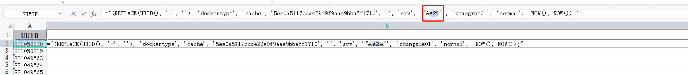

# 3.杂七杂八

## 磁盘清理

WinSxS 是一个关键的系统文件夹，位于 C:\Windows\ 目录中。这个文件夹存储了操作系统的多个版本组件，以确保向后兼容性和系统更新的稳定性。由于其包含重要的系统文件和组件，因此不能完全删除这个文件夹。

清理 WinSxS 文件夹的方法如下：

1. 使用磁盘清理工具：打开“磁盘清理”，选择系统驱动器，点击“清理系统文件”，然后选择“Windows 更新清理”。
2. 使用 DISM 命令：打开命令提示符（管理员），输入 DISM.exe /online /Cleanup-Image /StartComponentCleanup，可选使用 /ResetBase 参数移除更新的备份。
3. 启用存储感知器（适用于 Windows 10/11）：在“设置” -> “系统” -> “存储”中，启用“存储感知器”功能。

## 内网穿透
### 1.ngrok

ngrok 是一个反向代理，通过在公共端点和本地运行的 Web 服务器之间建立一个安全的通道，实现内网主机的服务可以暴露给外网。
ngrok 可捕获和分析所有通道上的流量，便于后期分析和重放，所以ngrok可以很方便地协助服务端程序测试

使用方法
- 进入ngrok官网[https://ngrok.com/](https://ngrok.com/) ，注册ngrok账号并下载ngrok；
- 根据官网给定的授权码，本地运行如下授权命令；
  - ./ngrok authtoken 1hAotxhmORtzCYvUc3BsxDBPh1H_****
  - ./ngrok http 80   即可将机器的80端口http服务暴露到公网，并且会提供一个公网域名。

注意：ngrok 官网服务在国外,访问速度慢，国内有ngrok服务： natapp、frp、nat123端口映射、内网通 等

常用命令
```shell
有授权的设置文件共享
ngrok http -auth="user:password" file:///D:\share

无授权的设置文件共享
ngrok http "file:///D:\share"  

将主机的3389的TCP端口暴露到公网
ngrok tcp 3389  
```


### 3.frp
frp 是一个专注于内网穿透的高性能的反向代理应用，支持 TCP、UDP、HTTP、HTTPS 等多种协议。可以将内网服务以安全、便捷的方式通过具有公网 IP 节点的中转暴露到公网。
需要自行提供公有云服务器。

- 开源地址： [https://github.com/fatedier/frp](https://github.com/fatedier/frp)
- 官网：[https://gofrp.org/docs/](https://gofrp.org/docs/)

### 4.nps
开原地址：[https://github.com/ehang-io/nps](https://github.com/ehang-io/nps)

NPS 是一款轻量级、高性能、功能强大的内网穿透代理服务器。需要自行提供公有云服务器。
目前支持 tcp、udp 流量转发，可支持任何 tcp、udp 上层协议（访问内网网站、本地支付接口调试、ssh 访问、远程桌面，
内网 dns 解析等等……），此外还支持内网 http 代理、内网 socks5 代理、p2p 等，并带有功能强大的 web 管理端。

### 5.花生壳
官网[https://hsk.oray.com/](https://hsk.oray.com/)

商业软件，提供限量使用的个人免费版本。

### 6.远程桌面

比如，向日葵，TeamView等

## 代码统计工具
下载得到cloc-1.64.exe，https://sourceforge.net/projects/cloc/files/

改名为cloc.exe （因为要在cmd中执行）

放到工程所在目录，E:\Workspace\app，统计app文件夹内所有代码

打开cmd窗口，cd E:\Workspace\app 到app目录下

执行命令 cloc .       注意后面有个句号，代表当前目录
或者再简单点：cloc-1.64.exe D:\workspace17\dataParse

## office技巧

1.word批量替换样式

指针停留在需要替换的文本段落上，按 ctl + f，选择替换


鼠标光标选择在查找内容上后，高级搜索-->格式-->样式


选择当前文本的样式，点确认


鼠标光标选择在《替换为》后，继续上面的操作。可以预览替换前后的样式，没有问题的话，就点全部替换即可


2.excel 动态拼接SQL

利用公式，使用="select * from a where id="&A1&";"&与代码中的+号效果等同


3.匹配多列数据

```text
=VLOOKUP(B2,O:P,2,FALSE)

B2      是需要比较的列
O:P    	是数据范围
2       是显示哪列数据
FALSE	精准匹配
```

4.excel表格下拉选项颜色如何设置

[excel表格下拉选项颜色如何设置](https://www.cnblogs.com/wangyongwei/p/16332631.html)

## Mac OS

```text
Navicat Premium：https://xclient.info/s/navicat-premium.html

与其他网络用户共享 Mac 上的互联网连接:https://support.apple.com/zh-cn/guide/mac-help/mchlp1540/mac

https://isapplesiliconready.com/zh
https://github.com/ThatGuySam/doesitarm

关闭SIP : https://www.macapp.so/tips/mac-disable-sip/
Mac电脑进入恢复模式详细教程:https://www.csdn.net/tags/NtzaAgysODc5NzMtYmxvZwO0O0OO0O0O.html
Mac上最大化窗口：https://www.jianshu.com/p/e5800e925204

虚拟机：https://mac.getutm.app/
目前 M1 芯片还不支持VirtualBox

Mac软件下载站
  Client.info： https://xclient.info/
  okaapps：https://zh.okaapps.com/#
  爱奶酪：https://www.icheese.org/
  Mac毒：https://www.macdo.cn/
  马可菠萝：https://www.macbl.com/
```

## 浏览器插件
- 插件商店： https://chrome.google.com/webstore/category/extensions?hl=zh-CN
- 极简插件： https://chrome.zzzmh.cn/#/index
- 【推荐】[https://www.chajianxw.com/](https://www.chajianxw.com/)
- [https://huajiakeji.com/](https://huajiakeji.com/)
- [https://www.crx4chrome.com/](https://www.crx4chrome.com/)
- [https://www.chromefor.com/](https://www.chromefor.com/)
- [https://www.cnplugins.com/](https://www.cnplugins.com/)

- 代码工具
    - GitCodeTree：基于 Octotree 的[码云](http://gitee.com)文件树插件
    - Octotree： GitHub 文件树插件
    - GitHub Isometric Contributions：渲染GitHub贡献图的插件
    - GitHub加速： GitHub下载加速。
    - JSON Formatter：JSON数据自动格式化插件
    - Simple Allow Copy:允许在每个网站上复制文本，针对一些网站无法右击复制设计。
- 页面优化    
    - 稀土掘金：为程序员、设计师、产品经理每日发现优质内容。
    - 页面优化。去除搜索引擎的广告。可以使用的插件：AdGuard【推荐】、Adblock Plus、AdBlocker Ultimate、uBlock Origin、广告终结者
- 其他工具
    - Tampermonkey。自定义脚本，比如刷网课，自动答题，解除VIP等。
    - AIX智能下载器插件：下载视频/图片/音频等文件
    - ChatGPT for Google: 在搜索引擎结果中同时显示ChatGPT的回答 【需要梯子】
    - WebChatGPT：可访问互联网的 ChatGPT

## 安卓手机刷Linux系统

手机上安装原生的Linux系统，目前最成熟的三个方案：一个是Ubuntu Touch，另一个是PostmarketOS，还有一个是Mobian。

[刷机教程](https://zhuanlan.zhihu.com/p/542041705?utm_id=0)

[玩转旧手机：红米刷入Linux（Ubuntu touch）系统详细教程](https://baijiahao.baidu.com/s?id=1749092503265842291&wfr=spider&for=pc)

## 历史

- [中国历史朝代顺序详表](http://114.xixik.com/chinese-dynasties/)
- [世界各国](http://114.xixik.com/country/#anchor8)
- 世界地图：
  
- [地球以及生物进化史](https://zhuanlan.zhihu.com/p/603361817)

## 公众号


