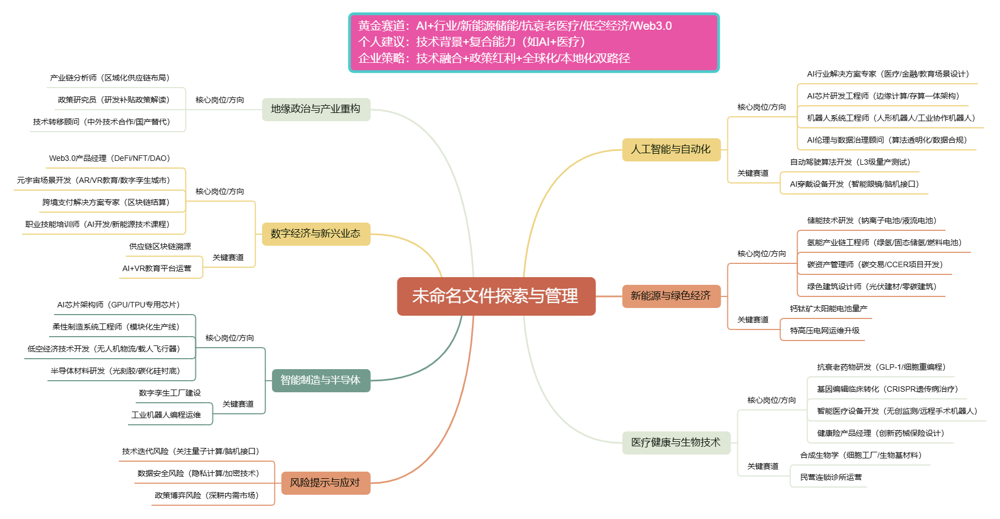

# 5.未来

未来已来，但未来未至，现在只是一个开始。

当前的AI主要以大模型为主的AIGC(人工智能生成内容)，但是当前在技术层面任然有很多问题有待解决。
有人预测10年、有人预测5年之后，真正的AIGC将会到来，但是不管多久，未来已来。

现在是2025年，我们来看看未来5年行业会发生什么变化。之所以是5年后，是假设真正的AIGC在5年后出现，再次之前有哪些变化。

## 未来最重要的行业

1. 人工智能（AI）与自动化
   - 核心地位：AI 将成为各行业的底层技术，渗透至制造、医疗、金融、教育等领域。大模型迭代与算力提升是核心引擎，预计 2025 年后进入 “AI + 行业” 深度融合阶段。
   - 应用场景：自动驾驶（L3 级 2027 年试点普及）、AI 医疗诊断、智能客服、工业机器人等将重塑产业形态。
   - 产业链机会：算法开发、AI 芯片、人形机器人量产及 AI 穿戴设备（如智能眼镜）。
2. 新能源与绿色经济
   - 能源转型：固态电池、钙钛矿薄膜、液态太阳能燃料等技术突破将推动电动车普及，纯电车型或在 2035 年占新车销量 70% 以上。车网互动（V2G）技术或实现 “开车挣钱”。
   - 可再生能源：太阳能、风能装机量持续增长，氢能产业链（制氢、储运）及储能技术（如钠离子电池）成为关键赛道。
   - 政策驱动：全球碳中和目标加速能源结构转型，碳交易市场与绿色基建（如特高压电网）需求激增。
3. 医疗健康与生物技术
   - 老龄化需求：60 岁以上人口超 4 亿（中国），推动银发经济发展，健康管理、抗衰老产品（如 GLP-1 类药物）、智能化养老设备需求爆发。
   - 技术突破：基因编辑、合成生物学、个性化医疗（如精准用药）及远程医疗成为增长热点。预计 2030 年全球创新药械市场规模达千亿美元。
   - 支付变革：商业健康险覆盖创新药械，民营医疗终端（如连锁药店、专科诊所）估值提升。
4. 智能制造与半导体
   - 高端制造升级：AI 驱动的工业自动化（如柔性制造、数字孪生）提升生产效率，低空经济（无人机物流、载人飞行器）市场规模或突破万亿。
   - 芯片国产化：美国技术封锁倒逼半导体自主创新，AI 芯片设计、光刻机技术及碳化硅等材料领域加速突破，国产化率有望从 16% 提升至 25%。
5. 数字经济与新兴业态
   - 数字货币与区块链：去中心化金融（DeFi）、跨境支付、供应链溯源等应用扩展，重塑全球金融体系。
   - 智能城市与绿色建筑：物联网（IoT）、智能交通系统及环保材料推动城市可持续发展，绿色建筑标准普及。
   - 教育科技：AI 辅导、VR 教学等技术打破传统教育模式，职业技能培训（如 AI 开发、高端制造）需求激增。
6. 地缘政治与产业重构
   - 供应链本地化：全球化分工向区域化调整，关键产业（如芯片、新能源）供应链韧性增强。
   - 政策博弈：各国通过研发补贴（如美国《未来产业法案》）、技术壁垒争夺主导权，中国依托新质生产力政策缩小与发达国家差距。

## 具体可以做的事情有哪些呢？

观点主要来自以下来源
1. 推测来源：《2025年中国十大行业展望》白皮书、前瞻研究院等权威机构预测
2. 凯文凯利的《5000天后的世界》
3. 《失去的三十年：平成日本经济史》

一、技术驱动型行业爆发式增长
1. 人工智能（AI）与机器学习。AI将深度渗透至医疗、教育、金融、制造等领域，推动自动化决策、个性化服务和效率提升。例如，AI辅助医疗诊断可提高准确率，智能工厂将实现全流程自动化管理。
   - 技术融合：AI与物联网（IoT）、5G结合，催生智能家居、智慧城市等场景，如门窗行业通过传感器实现环境自适应调节。
   - 伦理挑战：数据隐私、算法偏见等问题需法律与技术协同解决。
2. 区块链与金融科技。区块链技术将重构金融交易、供应链管理和数字身份验证体系，加密货币可能成为主流支付方式之一，但需应对监管合规性和安全风险。
3. 量子科技与6G通信。量子计算在密码学、药物研发领域的突破，以及6G网络的高速率与低延迟特性，将推动通信、国防和科研领域的革命。

二、绿色经济与可持续发展
1. 清洁能源主导能源转型。太阳能、风能等可再生能源占比大幅提升，氢能技术逐步成熟。政策驱动下（如“双碳”目标），建筑、交通等高耗能行业将加速向绿色技术转型，如高性能节能门窗的普及。
2. 循环经济与生命周期管理。企业从产品设计到回收全周期纳入环保考量，3D打印技术推动定制化生产，减少资源浪费。
3. 生物科技与绿色材料。基因编辑技术（如CRISPR）助力农业增产和疾病治疗，生物降解材料替代传统塑料，减少环境污染。

三、智能化与产业升级
1. 智能制造与柔性生产。工业物联网（IIoT）实现生产流程实时监控与优化，柔性生产线支持小批量、多品种定制需求，如汽车制造向模块化设计转型。
2. 无人驾驶与智能交通。自动驾驶技术成熟将重塑物流和出行方式，结合5G车联网技术，提升交通效率并降低事故率。
3. 医疗科技与远程健康管理。可穿戴设备实时监测健康数据，AI辅助诊断与远程手术技术普及，医疗资源分配更均衡。

四、消费与市场模式变革
1. 镜像世界与虚拟体验。增强现实（AR）、虚拟现实（VR）技术革新娱乐、教育等产业，构建沉浸式数字生活空间。最终如同《头号玩家》中的一样，
  游戏与虚拟现实、工作与游戏等结合创造新商业模式，如在线教育平台利用VR技术提升学习体验。
2. 娱乐。在影视、游戏、动画、漫画、网文等领域，AIGC已经展现出强大的赋能潜力。随着这些行业对AIGC应用的不断深入，
      人们更多地关注AIGC在具体场景下的应用效果和优化方向，而不是停留在概念层面的讨论。
3. 平台经济与共享模式深化。数字平台整合资源，共享经济从出行、住宿延伸至制造设备、知识技能等领域，降低社会资源闲置率。

## 风险与挑战
1. 技术迭代风险：企业需持续投入研发以应对快速变化的技术环境。
2. 数据安全与伦理争议：AI与物联网的普及加剧隐私泄露风险，需建立全球性数据治理框架。
3. 政策与市场博弈：新兴产业可能面临贸易壁垒或产能过剩问题，如政府对新能源产业的监测预警机制。

