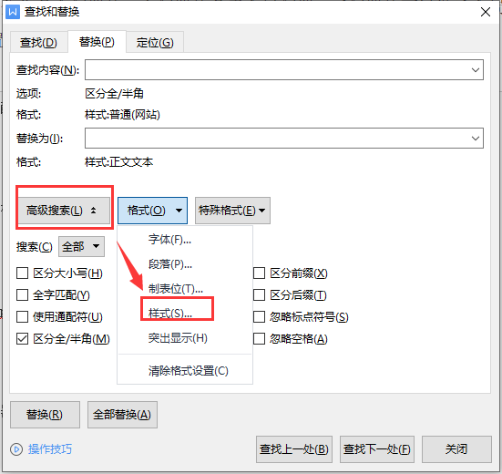
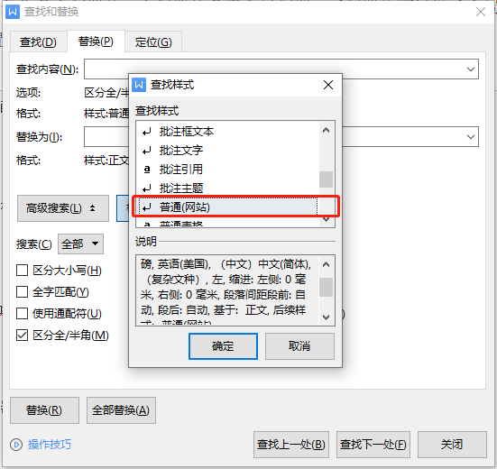

# 杂七杂八

## 内网穿透
### 1.ngrok

1.为什么要使用ngrok？

作为一个Web开发者，我们有时候会需要临时地将一个本地的Web网站部署到外网，以供他人体验评价或协助调试等等，通常我们会这么做：
找到一台运行于外网的Web服务器
服务器上有网站所需要的环境，否则自行搭建
将网站部署到服务器上
调试结束后，再将网站从服务器上删除
只不过是想向朋友展示一下网站而已，要不要这么麻烦，累感不爱╰（`□′）╯

2.有了ngrok之后，世界是如此的美好编辑

首先注册并下载ngrok，得到一串授权码
运行命令ngrok -authtoken 你的授权码 80，80是你本地Web服务的端口，而之后ngrok会记住你的授权码，直接ngrok 80就OK了
你会得到一串网址，通过这个网址就可以访问你本地的Web服务了

3.获取ngrok编辑

ngrok官网[https://ngrok.com/](https://ngrok.com/)

ngrok 是一个开源程序,官网服务在国外,国内访问国外速度慢，国内有相应的ngrok服务 natapp，frp，nat123端口映射，内网通 等

### 3.frp
- 开源地址： [https://github.com/fatedier/frp](https://github.com/fatedier/frp)
- 官网：[https://gofrp.org/docs/](https://gofrp.org/docs/)

### 4.nps
开原地址：[https://github.com/ehang-io/nps](https://github.com/ehang-io/nps)

NPS 是一款轻量级、高性能、功能强大的内网穿透代理服务器。
目前支持 tcp、udp 流量转发，可支持任何 tcp、udp 上层协议（访问内网网站、本地支付接口调试、ssh 访问、远程桌面，
内网 dns 解析等等……），此外还支持内网 http 代理、内网 socks5 代理、p2p 等，并带有功能强大的 web 管理端。

### 5.花生壳
官网[https://hsk.oray.com/](https://hsk.oray.com/)

商业软件，提供限量使用的个人免费版本。

### 6.远程桌面

比如，向日葵，TeamView等

## 代码统计工具
下载得到cloc-1.64.exe，https://sourceforge.net/projects/cloc/files/

改名为cloc.exe （因为要在cmd中执行）

放到工程所在目录，E:\Workspace\app，统计app文件夹内所有代码

打开cmd窗口，cd E:\Workspace\app 到app目录下

执行命令 cloc .       注意后面有个句号，代表当前目录
或者再简单点：cloc-1.64.exe D:\workspace17\dataParse

## office技巧

1.word批量替换样式

指针停留在需要替换的文本段落上，按 ctl + f，选择替换


鼠标光标选择在查找内容上后，高级搜索-->格式-->样式



选择当前文本的样式，点确认



鼠标光标选择在《替换为》后，继续上面的操作。可以预览替换前后的样式，没有问题的话，就点全部替换即可


2.excel 动态拼接SQL

利用公式，使用="select * from a where id="&A1&";"&与代码中的+号效果等同


3.匹配多列数据

```text
=VLOOKUP(B2,O:P,2,FALSE)

B2      是需要比较的列
O:P    	是数据范围
2       是显示哪列数据
FALSE	精准匹配
```

4.excel表格下拉选项颜色如何设置

[excel表格下拉选项颜色如何设置](https://www.cnblogs.com/wangyongwei/p/16332631.html)

## Mac OS

```text
Navicat Premium：https://xclient.info/s/navicat-premium.html

与其他网络用户共享 Mac 上的互联网连接:https://support.apple.com/zh-cn/guide/mac-help/mchlp1540/mac

https://isapplesiliconready.com/zh
https://github.com/ThatGuySam/doesitarm

关闭SIP : https://www.macapp.so/tips/mac-disable-sip/
Mac电脑进入恢复模式详细教程:https://www.csdn.net/tags/NtzaAgysODc5NzMtYmxvZwO0O0OO0O0O.html
Mac上最大化窗口：https://www.jianshu.com/p/e5800e925204

虚拟机：https://mac.getutm.app/
目前 M1 芯片还不支持VirtualBox

Mac软件下载站
  Client.info： https://xclient.info/
  okaapps：https://zh.okaapps.com/#
  爱奶酪：https://www.icheese.org/
  Mac毒：https://www.macdo.cn/
  马可菠萝：https://www.macbl.com/
```

## 浏览器插件
- 插件商店： https://chrome.google.com/webstore/category/extensions?hl=zh-CN
- 极简插件： https://chrome.zzzmh.cn/#/index
- 【推荐】[https://www.chajianxw.com/](https://www.chajianxw.com/)
- [https://huajiakeji.com/](https://huajiakeji.com/)
- [https://www.crx4chrome.com/](https://www.crx4chrome.com/)
- [https://www.chromefor.com/](https://www.chromefor.com/)
- [https://www.cnplugins.com/](https://www.cnplugins.com/)

- 代码工具
    - GitCodeTree：基于 Octotree 的[码云](http://gitee.com)文件树插件
    - Octotree： GitHub 文件树插件
    - GitHub Isometric Contributions：渲染GitHub贡献图的插件
    - GixxtHub加速： GitHub下载加速。
    - JSON Formatter：JSON数据自动格式化插件
    - Simple Allow Copy:允许在每个网站上复制文本，针对一些网站无法右击复制设计。
- 页面优化    
    - 稀土掘金：为程序员、设计师、产品经理每日发现优质内容。
    - 页面优化。去除搜索引擎的广告。可以使用的插件：AdGuard【推荐】、Adblock Plus、AdBlocker Ultimate、uBlock Origin、广告终结者
- 其他工具
    - Tampermonkey。自定义脚本，比如刷网课，自动答题，解除VIP等。
    - AIX智能下载器插件：下载视频/图片/音频等文件
    - ChatGPT for Google: 在搜索引擎结果中同时显示ChatGPT的回答 【需要梯子】
    - WebChatGPT：可访问互联网的 ChatGPT

## 安卓手机刷Linux系统

手机上安装原生的Linux系统，目前最成熟的三个方案：一个是Ubuntu Touch，另一个是PostmarketOS，还有一个是Mobian。

[刷机教程](https://zhuanlan.zhihu.com/p/542041705?utm_id=0)

[玩转旧手机：红米刷入Linux（Ubuntu touch）系统详细教程](https://baijiahao.baidu.com/s?id=1749092503265842291&wfr=spider&for=pc)


## 小说

### 忘语

凡人修仙传

### 辰东

《圣墟》，《完美世界》，《遮天》，《长生界》，《神墓》，《不死不灭》

### 我吃西红柿

《星峰传说》《寸芒》《星辰变》《盘龙》《九鼎记》《吞噬星空》《莽荒纪》《雪鹰领主》《飞剑问道》《沧元图》

### 天蚕土豆

斗破苍穹，武动乾坤，大主宰，元尊

### 耳根

仙逆，求魔，我欲封天，一念永恒，三寸人间

[仙逆编年史](https://baike.baidu.com/item/%E4%BB%99%E9%80%86%E7%BC%96%E5%B9%B4%E5%8F%B2#2)

### 梦入神机

佛本是道、黑山老妖、龙蛇演义、阳神、永生、圣王、星河大帝、龙符、点道为止

### 其他

- 大奉打更人
- 雪中悍刀行
- 庆余年
- 飞升之后
