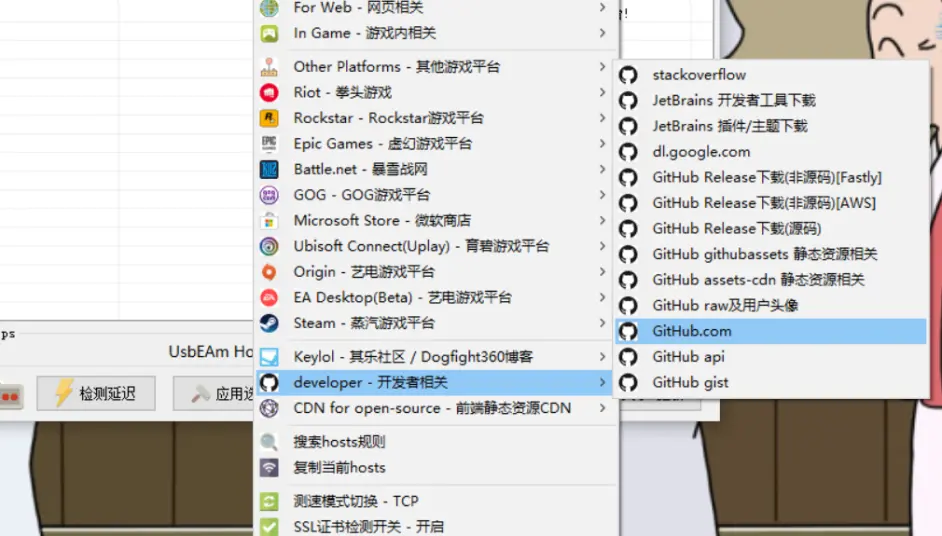
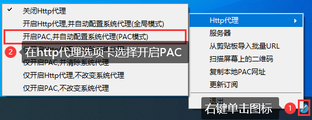
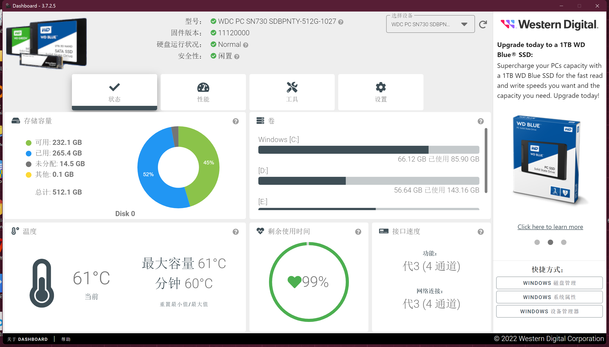

# 生活

## 1.电脑

### 1.1.虚拟机

```text
虚拟机： Oracle VM VirtualBox
  centos-node1、centos-node2、centos-node3
  网络为： 	    桥接模式      固定IP
  OS：		centos 7.9 mini版
  账户： 		root  		zx
  ssh：		192.168.3.51:22、192.168.3.52:22、192.168.3.53:22
  yum源：      清华镜像源：https://mirrors.cnnic.cn/help/centos/

目录结构
  data
    |_java      # 安装Java相关软件
    |_python    # 安装python相关软件
    |_golang    # 安装golang相关软件
      |workspace    # golang源码开发工作空间
    |_soft      # 安装其他相关软件
    |_app       # 运行自己的编写的应用
    |_temp      # 临时文件

java：   安装路径:	/data/java/jdk1.8     openJdk1.8    环境变量：全局
python： 安装路径:	/data/python/python3  python3.10.9  环境变量：全局
golang： 安装路径:	/data/golang/go1.20   go1.20        环境变量：全局

docker【开机自动自动】版本: 20.10.22
  启动：       sudo systemctl start docker
  停止：       sudo systemctl stop docker
  日志：       sudo docker logs -f 容器名字

redis【docker部署】
	docker run -d -it --name myredis -p 6379:6379 --privileged=true --restart=always -v /usr/local/docker/redis/data/:/data -v /usr/local/docker/redis/redis.conf:/etc/redis/redis.conf redis:6.0.6 redis-server /etc/redis/redis.conf --requirepass "pwd123"
	启动：   docker start myredis
	控制台： docker exec -it myredis redis-cli

portainer【docker部署】
	docker run -d -p 9000:9000 --restart=always -v /var/run/docker.sock:/var/run/docker.sock --name prtainer-test docker.io/portainer/portainer
	admin  123456789
	http://192.168.3.101:9000/#/home

yearning
	安装： 	/usr/local/java/yearning
	启动:	./Yearning run
	用户名: admin    密码:Yearning_admin

mysql【docker部署】
	docker run -p 3306:3306 --name mysql \
      -v /usr/local/docker/mysql/conf:/etc/mysql \
      -v /usr/local/docker/mysql/logs:/var/log/mysql \
      -v /usr/local/docker/mysql/data:/var/lib/mysql \
      -e MYSQL_ROOT_PASSWORD=root \
      -d mysql:5.7

	sudo docker exec -it mysql bash
	mysql -h192.168.3.101 -P3306 -uroot -proot

sysbench【命令安装】

gitlab【docker部署】
    docker run  -itd -p 9980:80  -p 9922:22 \
        -v /etc/gitlab:/etc/gitlab \
        -v /var/log/gitlab:/var/log/gitlab \
        -v /var/opt/gitlab:/var/opt/gitlab \
        --restart=no \
        --privileged=true \
        --name gitlab \
        gitlab/gitlab-ce
    地址：http://192.168.3.101:9980/        root/123456789
  
jenkins【docker部署】  
    docker run -d -uroot -p 9095:8080 -p 50000:50000 --name jenkins \
        -v /var/jenkins_home:/var/jenkins_home \
        -v /etc/localtime:/etc/localtime \
        -v /usr/local/java/apache-maven-3.8.6:/usr/local/maven \
        -v /usr/local/java/jdk1.8:/usr/local/jdk \
        -e JENKINS_UC=https://mirrors.cloud.tencent.com/jenkins \
        -e JENKINS_UC_DOWNLOAD=https://mirrors.cloud.tencent.com/jenkins \
        --restart=no \
        --privileged=true \
        jenkins/jenkins:lts
  
    地址：http://192.168.3.101:9095/   root/root
    插件： git parameter【用于操作git 分支和读取】、publish over ssh【用于执行ssh命令】

docker compose【本地安装】
  下载：curl -L https://get.daocloud.io/docker/compose/releases/download/v2.4.1/docker-compose-`uname -s`-`uname -m` > /usr/local/bin/docker-compose
  将可执行权限应用于二进制文件：sudo chmod +x /usr/local/bin/docker-compose  
  创建软链： sudo ln -s /usr/local/bin/docker-compose /usr/bin/docker-compose
  查看版本：docker-compose version
  
harbor【本地安装】
  停止harbor: docker-compose stop
  启动harbor: docker-compose up -d
  
  登录：docker login -u admin -p Harbor12345 192.168.3.101:9010
  创建镜像：docker tag 1319b1eaa0b7 192.168.3.101:9010/public/myredis:1.0
  构建镜像：
  docker build -t public/my_project:1.0 /usr/local/data
  docker rm -f my_project
  docker run -d -p 8080:8080 --name=my_project public/my_project:1.0

nginx【本地安装】  
  安装路径： /data/soft/nginx/    版本：1.22.1
  
apache benchmark【本地安装】 
  命令行安装：yum -y install httpd-tools
  
Lua【本地安装】  
  安装路径： /usr/local/LuaJIT    版本：2.1.   resty优化版
  依赖库安装路径： /usr/local/lua_core  
```

### 1.2.上网

#### 1.2.1.加速Github

- 镜像网站：也就拿来访问下，千万不要登录，密码可能被盗。
- 加速器：

  - 加速器，收费的很多。比如LetsVPN等，千万不要自己搭建代理，会蹲局子。
  - [https://steampp.net](https://steampp.net)。开源游戏的加速器，支持一些技术网站的加速。
- 修改本地hosts：

  - 本地host加速大全，对各类网站进行一键host修改加速。[https://www.dogfight360.com/blog/475/](https://www.dogfight360.com/blog/475/)
    
  - 自己修改host

  1. 访问https://www.ipaddress.com，输入www.github.com。获得ip地址，比如 140.82.112.3
  2. 修改host文件。windows 在 C:\Windows\System32\drivers\etc，Linux 在 /etc/hosts。批量修改下面的IP即可

注意： 如果还是不能ping通，或者能ping通但是网站还是超时:

1. 在cmd中输入ipconfig/flushdns刷新dns
2. 检查hosts文件中有没有有关github的注释掉。

#### 1.2.2.v2rayN

开源，教程；[https://github.com/freefq/tutorials](https://github.com/freefq/tutorials)

- 下载地址：https://github.com/2dust/v2rayN/releases/download/3.23/v2rayN-Core.zip
- 设置代理



- 配置服务器：[https://github.com/freefq/free](https://github.com/freefq/free)

#### 1.2.3.其他

[https://github.com/githubvpn007/ClashX](https://github.com/githubvpn007/ClashX)

[clash/ss/ssr/v2ray/trojan的区别](https://github.com/githubvpn007/proxy)

### 1.3.host配置

```text
# 本地模拟eureka集群
127.0.0.1 www.eureka1.com
127.0.0.1 www.eureka2.com
127.0.0.1 www.eureka3.com 

# 本地服务
127.0.0.1 www.zhangxue.com
```

### 1.4.镜像地址

```text
1.开源软件镜像
【推荐】清华镜像：https://mirrors.cnnic.cn/
阿里开源镜像： https://developer.aliyun.com/mirror/
中国科学技术大学 http://mirrors.ustc.edu.cn/
北京理工大学  http://mirror.bit.edu.cn/
大连东软信息学院  http://mirrors.neusoft.edu.cn
```

### 1.9.华为笔记本

- 购买时间：2020-09-24
- 基本信息

```text
电脑型号: 华为 MACHC-WAX9 笔记本电脑
操作系统: Windows 10 64位

处理器: 英特尔 Core i7-10510U @ 1.80GHz 四核八线程
主板: 华为 MACHC-WAX9-PCB
内存: 16 GB ( 三星 LPDDR3 2133MHz )
主硬盘: 西数 WDC PC SN730 SDBPNTY-512G-1027 ( 512 GB / 固态硬盘 )
显卡: Nvidia GeForce MX250 ( 2 GB )
显示器: TLX1388 ( 14 英寸  )
声卡: 瑞昱 High Definition Audio @ 英特尔 英特尔智音技术音频控制器
网卡: 英特尔 Wireless-AC 9560 160MHz
```

- 硬盘寿命
  - 2022-09-24



## 2.导航
```shell
# 搞学习
  TED（最优质的演讲）：https://www.ted.com/
  谷粉学术：https://gfsoso.99lb.net/scholar.html
  大学资源网：http://www.dxzy163.com/
  简答题：http://www.jiandati.com/
  网易公开课：https://open.163.com/ted/
  网易云课堂：https://study.163.com/
  中国大学MOOC：www.icourse163.org
  哔哩哔哩弹幕网：www.bilibili.com
  我要自学网：www.51zxw.net
  知乎：www.zhihu.com
  学堂在线：www.xuetangx.com
  爱课程：www.icourses.cn
  猫咪论文：https://lunwen.im/
  iData（论文搜索）：www.cn-ki.net
  文泉考试：https://www.wqkaoshi.com
  CSDN：https://www.csdn.net/

# 找书籍
  书栈网（极力推荐）：https://www.bookstack.cn/
  码农之家（计算机电子书下载）：www.xz577.com
  鸠摩搜书：www.jiumodiary.com
  云海电子图书馆：www.pdfbook.cn
  周读（书籍搜索）：ireadweek.com
  知轩藏书：http://www.zxcs.me/
  脚本之家电子书下载：https://www.jb51.net/books/
  搜书VIP-电子书搜索：http://www.soshuvip.com/all.html
  书格（在线古籍图书馆）：https://new.shuge.org/
  caj云阅读：http://cajviewer.cnki.net/cajcloud/
  必看网（人生必看的书籍）：https://www.biikan.com/

# 冷知识 / 黑科技
  上班摸鱼必备（假装电脑系统升级）：http://fakeupdate.net/
  PIECES 拼图（30 个 CSS 碎片进行拼图，呈现 30 种濒临灭绝的动物）：http://www.species-in-pieces.com/
  图片立体像素画：https://pissang.github.io/voxelize-image/
  福利单词（一个不太正经的背单词网站）：http://dict.ftqq.com
  查无此人（刷新网站，展现一张AI 生成的人脸照片）：https://thispersondoesnotexist.com/
  在线制作地图图例：https://mapchart.net/
  创意光线绘画：http://weavesilk.com/
  星系观察：https://stellarium-web.org/
  煎蛋：http://jandan.net/
  渣男-说话的艺术：https://lovelive.tools/
  全历史：https://www.allhistory.com/
  iData：https://www.cn-ki.net/
  术语在线：http://www.termonline.cn/

# 写代码
  GitHub：https://github.com/
  码云：https://gitee.com/
  源码之家：https://www.mycodes.net/
  JSON to Dart：https://javiercbk.github.io/json_to_dart/
  Json在线解析验证：https://www.json.cn/
  在线接口测试（Getman）：https://getman.cn/

# 资源搜索
  DogeDoge搜索引擎：www.dogedoge.com
  秘迹搜索：https://mijisou.com/
  小白盘：https://www.xiaobaipan.com/
  云盘精灵（资源搜索）：www.yunpanjingling.com
  虫部落（资源搜索）：www.chongbuluo.com
  如风搜（资源搜索）：http://www.rufengso.net/
  爱扒：https://www.zyboe.com/

# 小工具
  奶牛快传（在线传输文件利器）：cowtransfer.com
  文叔叔（大文件传输，不限速）：https://www.wenshushu.cn/
  云端超级应用空间（PS，PPT，Excel，Ai）：https://uzer.me/
  香当网（年终总结，个人简历，事迹材料，租赁合同，演讲稿）：https://www.xiangdang.net/
  二维码生成：https://cli.im/
  搜狗翻译：fanyi.sogou.com
  熵数（图表制作，数据可视化）：https://dydata.io/appv2/#/pages/index/home
  拷贝兔：https://cp.anyknew.com/
  图片无限变放大：http://bigjpg.com/zh
  幕布（在线大纲笔记工具）：mubu.com
  在线转换器（在线转换器转换任何测量单位）：https://zh.justcnw.com/
  调查问卷制作：https://www.wenjuan.com/
  果核剥壳（软件下载）：https://www.ghpym.com/
  软件下载：https://www.unyoo.com/
  MSDN我告诉你（windows10系统镜像下载）：https://msdn.itellyou.cn/
  
# 导航页（工具集）
  世界各国网址大全：http://www.world68.com/
  小森林导航：http://www.xsldh6.com/
  简捷工具：http://www.shulijp.com/
  NiceTool.net 好工具网：http://www.nicetool.net/
  现实君工具箱（综合型在线工具集成网站）：http://tool.uixsj.cn/
  蓝调网站：http://lcoc.top/
  偷渡鱼：https://touduyu.com/
  牛导航：http://www.ziliao6.com/
  小呆导航：https://www.webjike.com/index.html
  简法主页：http://www.jianfast.com/
  KIM主页：https://kim.plopco.com/
  聚BT：https://jubt.net/cn/index.html
  精准云工具合集：https://jingzhunyun.com/
  兔2工具合集：https://www.tool2.cn/
  爱资料工具（在线实用工具集合）：www.toolnb.com
  工具导航：https://hao.logosc.cn/

# 看视频
  阿木影视：https://www.aosk.online/
  电影推荐（分类别致）：http://www.mvcat.com
  APP影院：https://app.movie
  动漫视频网：http://www.zzzfun.com/
  NO视频官网：http://www.novipnoad.com/
  大数据导航：http://hao.199it.com/
  VideoFk解析视频：http://www.videofk.com/

# 学设计
  码力全开（产品/设计师/独立开发者的资源库）：https://www.maliquankai.com/designnav/
  免费音频素材：https://icons8.cn/music
  新CG儿（视频素材模板，无水印+免费下载）：https://www.newcger.com/
  Iconfont（阿里巴巴矢量图标库）：https://www.iconfont.cn/
  小图标下载：https://www.easyicon.net/
  Flight Icon：https://www.flighticon.co/
  第一字体转换器：http://www.diyiziti.com/
  doyoudosh（平面设计）：www.doyoudo.com
  企业宣传视频在线制作：https://duomu.tv/
  MAKE海报设计官网：http://maka.im/
  一键海报神器：www.logosc.cn/photo/utm_source=hao.logosc.cn&utm_medium=referral
  字由（字体设计）：http://www.hellofont.cn/
  查字体网站：https://fonts.safe.360.cn/
  爱给网（免费素材下载的网站，包括音效、配乐，3D、视频、游戏，平面、教程）：http://www.aigei.com/
  在线视频剪辑：https://bilibili.clipchamp.com/editor

# 搞文档
  即书（在线制作PPT）：https://www.keysuper.com/
  PDF处理：https://smallpdf.com/cn
  PDF处理：https://www.ilovepdf.com/zh-cn
  PDF处理：https://www.pdfpai.com/
  PDF处理：https://www.hipdf.cn/
  图片压缩，PDF处理：https://docsmall.com/
  腾讯文档（在线协作编辑和管理文档）：docs.qq.com
  ProcessOn（在线协作制作结构图）：www.processon.com
  iLovePDF（在线转换PDF利器）：www.ilovepdf.com
  PPT在线制作：https://www.woodo.cn/
  PDF24工具（pdf处理工具）：https://tools.pdf24.org/en
  IMGBOT（在线图片处理）：www.imgbot.ai
  福昕云编辑（在线编辑PDF）：edit.foxitcloud.cn
  TinyPNG（在线压缩图片）：tinypng.com
  UZER.ME（在线使用各种大应用，在线使用CAD，MATLAB，Office三件套）：uzer.me
  优品PPT（模板下载）：http://www.ypppt.com/
  第一PPT（模板下载）：http://www.1ppt.com/xiazai/
  三顿PPT导航：sandunppt.com
  Excel函数表：https://support.office.com/zh-cn/office/excel-函数-按字母顺序-b3944572-255d-4efb-bb96-c6d90033e188

# 找图片
  https://unsplash.com/
  https://pixabay.com/
  https://www.pexels.com/
  https://visualhunt.com/
  https://www.ssyer.com/
  http://lcoc.top/bizhi/
  彼岸图网：http://pic.netbian.com/
  极像素（超高清大图）：https://www.sigoo.com/
  免费版权图片搜索：https://www.logosc.cn/so/
```

## 3.小说

### 忘语

凡人修仙传

### 辰东

《圣墟》，《完美世界》，《遮天》，《长生界》，《神墓》，《不死不灭》

### 我吃西红柿

《星峰传说》《寸芒》《星辰变》《盘龙》《九鼎记》《吞噬星空》《莽荒纪》《雪鹰领主》《飞剑问道》《沧元图》

### 天蚕土豆

斗破苍穹，武动乾坤，大主宰，元尊

### 耳根

仙逆，求魔，我欲封天，一念永恒，三寸人间

[仙逆编年史](https://baike.baidu.com/item/%E4%BB%99%E9%80%86%E7%BC%96%E5%B9%B4%E5%8F%B2#2)

### 梦入神机

佛本是道、黑山老妖、龙蛇演义、阳神、永生、圣王、星河大帝、龙符、点道为止

### 其他

- 大奉打更人
- 雪中悍刀行
- 庆余年
- 飞升之后

## 4.生活

### 4.1.落户

#### 4.1.1.天津落户

https://mp.weixin.qq.com/s/NEOYjoYWsrCSgAUZ27cUnQ

https://mp.weixin.qq.com/s/SIMOYdpIB6Rr_auLVhp4iw

关注微信公众号《天津公安民生服务平台》，进入服务中最大的图标就是 人才落户

目前滨海人才计划还在收纳

#### 4.1.2.北京落户

积分落户计算器：http://m.bj.bendibao.com/cyfw/jifenruhujisuanqi.php

大前提：在北京连续7年社保，北京有房

### 4.2.养老

外地户籍如何领取北京的养老金？

网上一搜一大把，都是基础条件。除此之外还有哪些硬性条件？

1. 男50，女40前必选在北京开户缴费。超过这个年龄的在北京只能使用临时基础养老保险缴费账户（非常坑）
2. 有用人单位的，退休由用人单位提交申请。 没有单位的，可以个人提交申请，但是需要通过街道办事处或者公共人力资源中心受理，但是条件非常苛刻。
   在北京没有房子的不会受理的，无法申请在北京退休。

### 4.3.医保

北京退休后的医保条件与养老条件不同，男性25年，女性慢20年，但是可以一次性补缴满。

## 5.经验

### 5.1.告诫自己

```text
矛盾激化,矛盾转移,矛盾分摊

因人成事，因事修人

不要妥协、不要比差、不要刻意合、不要在宿舍学习、要开始做、凡事预则立，不预则废、不要啥证都考、学好英语、不要假装努力、不要怕和别人一样、不要讨好别人、照顾好身体、对抗天性、多读书、深入学习、细化目标

子贡赎人：不要用自己的私德，强行规范别人的公德。

希望来源于感觉到努力会有回报

李国庆:上辈子杀人造孽，这辈子配偶创业

如果你眼中只看一团糟，那你的世界只有一团糟

人性看不到拯救、只能看到毁灭

自己下属能力很强，但是由于公司或者团队内部没有晋升的空间了，为了稳住员工，可以设置下有名无实的tile。最好的例子就是阿里MVP，腾讯TVP。

按照彼得原理，人在晋升到一定程度时一定会遇到自己无法胜任的位置。这个时候需要我们自己能够打破职业认知。比如P6升P7，就不是单独自己一人完成某些任务，而是自己组织，推动。寻找如何实现团队价值，如何完成部门目标。

一朝天子一朝臣。

不要因为过度忙碌而失去了思考和规划的时间

《黑天鹅》的作者塔勒布有一句话广为流传：“世界上有三种最有害的成瘾性物质：海洛因、碳水化合物、每月发一次的工资。”

希望工程只是极少数人的希望，剩下人只有绝望。

《富有的习惯》。阅读、有氧运动、远离负能量、支持梦想、早起、多重收入、人生态度、不盲从、反思

GM制定游戏规则，偏向富有，割向贫瘠。体验不好富有会跑，贫瘠的跑不掉。GM调整游戏规则，想是留下富有，目的是不崩盘，不忘初心。
```

### 5.2.精神内耗

```text
精神内耗的表现:
外在: 1.犹豫不决 2.容易被影响（别人的话）3.行动力降低（50%精力）4.注意力分散（想法一个接一个）5.累（挣扎纠结）
内在: 紧张、焦虑、自卑、情绪低落

精神内耗的底层原因:
1.偏向于用右脑思考（艺术思维、感性）
2.威胁识别引起的恐惧（没经历过、陌生、不知道如何处理的恐惧）: 过度思考——恐惧感——延伸记忆薄弱——拖延逃避——延伸记忆更少——焦虑自卑

精神内耗的四个方法:
一、聚焦注意力
1.关注自身能控制的方面，不要把精力放在不可控的方面 
2.把注意力聚焦在通过自身努力可以影响的事，找到核心要务，以此为中心，有条理地多向思考
3.可借助思维导图，列出那些可以改变，重点关注，哪些不能改变，不再纠结

二、提高行动力
1.马上行动是降低内耗的有效方法 
2.提高行动力的方法: 1.启动越简单越好，最好控制在两分钟内（看一页书、记两个单词、做五个俯卧撑）2.好好犒劳自己

三、右脑训练术
1.脑电波放松训练: 1.闭上眼睛听轻松的音乐，想象宁静的场景 2.冥想深呼吸
2.思维图像训练: 发散思维，在大脑里形成二维或三维图像的能力（几个不相关的词通过想象串一句话，形成一个故事或图像）
3.观察训练: 比如看快速行驶的汽车牌号，回想具体号码，增强右脑处理信息能力

四、消除负面情绪
转换思维，把消极负面的信念转变成积极乐观的信念，会发现不一样的景象
希望大家都能减少精神内耗
```
